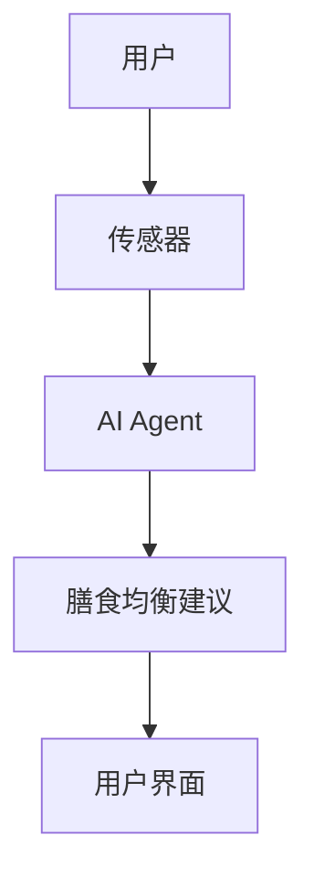
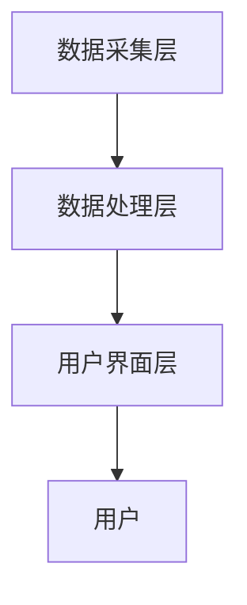
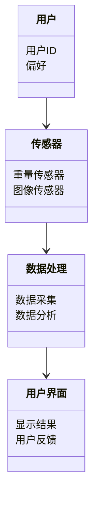

                 


# 《智能餐盘：AI Agent的膳食均衡指导系统》目录大纲

---

## 关键词：
智能餐盘, AI Agent, 膳食均衡, 人工智能, 系统设计, 技术实现

---

## 摘要：
《智能餐盘：AI Agent的膳食均衡指导系统》一书深入探讨了如何利用人工智能技术设计一个智能餐盘系统，帮助用户实现膳食均衡管理。通过结合AI Agent的感知、决策和执行能力，本书详细介绍了智能餐盘的核心原理、系统架构、算法实现以及实际应用案例。从理论到实践，系统性地展示了如何利用AI技术解决日常饮食管理中的问题，为读者提供了一个创新的技术解决方案。

---

# 第一部分：智能餐盘的背景与核心概念

---

# 第1章：背景介绍与问题背景

## 1.1 问题背景与需求分析
### 1.1.1 当前膳食管理的主要问题
- 饮食不均衡导致的健康问题日益严重。
- 用户缺乏科学的膳食指导工具。
- 现有解决方案的局限性：手动记录、计算复杂、个性化不足。

### 1.1.2 智能餐盘的提出背景
- AI技术的发展为智能设备提供了可能性。
- 健康意识的提升推动了智能饮食管理的需求。
- 智能餐盘的核心目标：帮助用户实现膳食均衡。

### 1.1.3 用户需求与痛点分析
- 用户需求：便捷、科学、个性化的膳食指导。
- 使用场景：家庭、办公室、餐厅等。
- 用户痛点：缺乏实时反馈、个性化不足、操作复杂。

## 1.2 智能餐盘的核心概念
### 1.2.1 AI Agent的基本定义
- AI Agent：具有感知、决策、执行能力的智能体。
- AI Agent的核心特征：自主性、反应性、目标导向。

### 1.2.2 膳食均衡指导系统的功能特点
- 数据采集：识别食物种类、重量、热量等。
- 数据分析：计算营养成分，评估均衡性。
- 个性化推荐：根据用户需求生成饮食计划。

### 1.2.3 智能餐盘的边界与外延
- 边界：仅关注膳食均衡指导，不涉及烹饪或储存。
- 外延：可与其他健康管理系统（如智能手环）联动。

## 1.3 核心概念与联系
### 1.3.1 AI Agent与膳食均衡的关系
- AI Agent是实现膳食均衡的核心驱动力。
- 数据流：从感知到决策再到执行。

### 1.3.2 核心要素组成与概念结构图
- 智能餐盘由传感器、AI算法、用户界面三部分组成。
- 关系图：用户与智能餐盘交互，AI Agent处理数据并提供指导。

### 1.3.3 核心概念属性特征对比表格
| **概念** | **属性** | **描述** |
|----------|----------|----------|
| AI Agent | 感知能力 | 采集数据并识别食物 |
|          | 决策能力 | 分析数据并生成建议 |
|          | 执行能力 | 提供反馈或调整计划 |
| 膳食均衡 | 营养成分 | 确保各类营养摄入均衡 |
|          | 个性化 | 根据用户需求定制计划 |

---

# 第2章：AI Agent与膳食均衡指导系统的核心原理

## 2.1 AI Agent的基本原理
### 2.1.1 AI Agent的感知机制
- 传感器：重量传感器、图像识别传感器。
- 数据采集流程：识别食物种类、重量、热量。

### 2.1.2 AI Agent的决策模型
- 数据分析：计算营养成分，评估均衡性。
- 决策逻辑：基于规则或机器学习模型生成建议。

### 2.1.3 AI Agent的执行策略
- 提供反馈：通过用户界面显示建议。
- 自动调整：根据用户反馈优化计划。

## 2.2 膳食均衡指导系统的构建原理
### 2.2.1 数据采集与处理
- 传感器数据采集：食物的重量、种类、热量。
- 数据预处理：去噪、归一化。

### 2.2.2 数据分析与个性化推荐
- 营养分析：计算蛋白质、碳水化合物、脂肪等比例。
- 个性化推荐：基于用户需求生成饮食计划。

### 2.2.3 系统反馈与优化机制
- 用户反馈：用户对建议的满意度。
- 系统优化：基于反馈调整推荐算法。

## 2.3 AI Agent在膳食均衡指导中的应用
### 2.3.1 数据流分析
- 从感知到决策的流程：数据采集 → 数据分析 → 决策生成 → 用户反馈。

### 2.3.2 AI Agent的决策流程
- 算法流程图：数据采集 → 数据预处理 → 营养分析 → 个性化推荐 → 用户反馈。

### 2.3.3 系统实体关系图（Mermaid）



---

# 第3章：智能餐盘的技术实现

## 3.1 传感器技术
### 3.1.1 重量传感器
- 工作原理：测量食物的重量。
- 应用场景：识别食物的重量和种类。

### 3.1.2 图像识别传感器
- 使用OpenCV进行图像处理。
- 算法流程：图像采集 → 图像识别 → 食物种类识别。

## 3.2 AI算法实现
### 3.2.1 营养成分分析算法
- 使用机器学习模型预测食物的营养成分。
- 算法流程：数据采集 → 数据预处理 → 模型训练 → 预测结果。

### 3.2.2 个性化推荐算法
- 使用协同过滤或遗传算法生成个性化饮食计划。
- 推荐策略：基于用户偏好和营养需求。

## 3.3 系统架构设计
### 3.3.1 分层架构
- 数据采集层：传感器和用户输入。
- 数据处理层：数据预处理和分析。
- 用户界面层：展示结果和反馈。

### 3.3.2 系统架构图（Mermaid）



---

# 第4章：智能餐盘的系统设计

## 4.1 系统功能设计
### 4.1.1 数据采集模块
- 功能：采集食物的重量、种类、热量。
- 实现：使用重量传感器和图像识别传感器。

### 4.1.2 数据分析模块
- 功能：计算营养成分，评估均衡性。
- 实现：基于机器学习模型进行预测。

### 4.1.3 用户界面模块
- 功能：展示分析结果和个性化建议。
- 实现：图形化界面，实时反馈。

## 4.2 系统架构设计
### 4.2.1 领域模型设计（Mermaid）



### 4.2.2 系统架构图（Mermaid）


---

# 第5章：智能餐盘的项目实战

## 5.1 环境搭建
### 5.1.1 硬件环境
- 传感器：重量传感器、图像识别传感器。
- 开发工具：Arduino或Raspberry Pi。

### 5.1.2 软件环境
- 开发语言：Python。
- 库：OpenCV、TensorFlow。

## 5.2 核心代码实现
### 5.2.1 数据采集模块
```python
import numpy as np
from sensor import WeightSensor, ImageSensor

class DataCollector:
    def __init__(self):
        self.weight_sensor = WeightSensor()
        self.image_sensor = ImageSensor()

    def collect_data(self):
        weight = self.weight_sensor.measure()
        image = self.image_sensor.capture()
        return weight, image
```

### 5.2.2 数据分析模块
```python
import tensorflow as tf
from nutrition_model import NutritionModel

class NutritionAnalyzer:
    def __init__(self):
        self.model = NutritionModel()

    def analyze(self, image):
        prediction = self.model.predict(image)
        return prediction
```

## 5.3 案例分析与详细解读
### 5.3.1 案例分析
- 用户A：偏好低热量、高蛋白饮食。
- 系统建议：每日摄入200克蛋白质，限制碳水化合物。

### 5.3.2 代码实现解读
- 数据采集模块：如何通过传感器获取数据。
- 数据分析模块：如何利用模型生成建议。

---

# 第6章：智能餐盘的优化与扩展

## 6.1 系统优化
### 6.1.1 算法优化
- 使用更复杂的模型（如深度学习）提高准确率。

### 6.1.2 系统性能优化
- 提高传感器的响应速度。
- 优化数据处理流程，减少延迟。

## 6.2 用户体验提升
### 6.2.1 界面优化
- 更直观的可视化反馈。
- 更人性化的交互设计。

### 6.2.2 功能扩展
- 健康数据同步：与智能手环联动。
- 饮食计划个性化定制：根据用户偏好生成更多选项。

## 6.3 商业化潜力
- 市场定位：健康意识强的用户群体。
- 商业模式：订阅服务、硬件销售。

---

# 第7章：总结与展望

## 7.1 全书总结
- 智能餐盘的核心原理。
- 系统设计与实现的关键点。

## 7.2 未来展望
- 更先进的传感器技术。
- 更智能的AI算法。
- 更广泛的应用场景。

---

通过以上目录大纲，读者可以系统地了解智能餐盘的设计与实现过程，从理论到实践，逐步掌握相关技术的核心要点。

