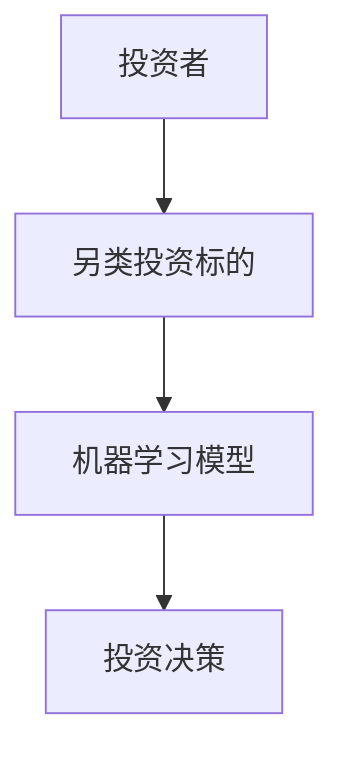
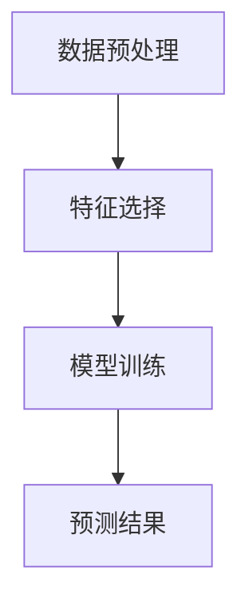
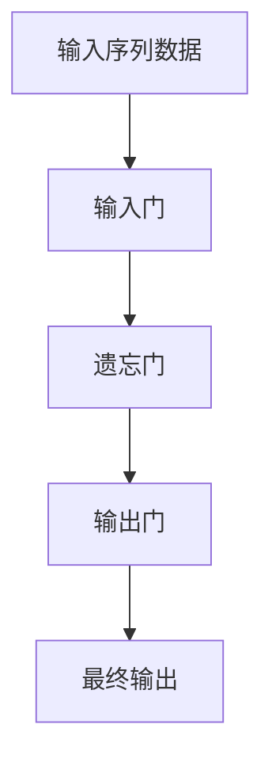
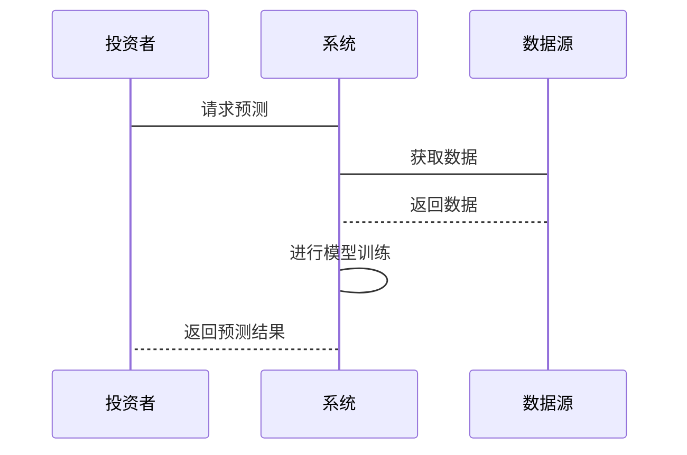

                 


# 机器学习在另类投资标的选择中的应用

> 关键词：机器学习、另类投资、金融分析、时间序列分析、量化交易、特征工程

> 摘要：本文系统地探讨了机器学习在另类投资中的应用，从背景介绍、核心概念到算法原理、系统设计，再到项目实战，全面分析了机器学习如何提升另类投资标的筛选效率和准确性。文章结合理论与实践，通过详细的数学公式、算法流程图和代码示例，展示了机器学习在金融领域的强大潜力。

---

# 第一部分: 机器学习与另类投资的背景介绍

## 第1章: 机器学习与另类投资的背景

### 1.1 机器学习的基本概念

#### 1.1.1 机器学习的定义与核心概念

- 机器学习是一种人工智能技术，通过数据训练模型，使其能够从经验中学习并做出预测或决策。
- 核心概念包括：监督学习、无监督学习、强化学习等。

#### 1.1.2 机器学习与传统金融分析的区别

- **数据来源**：传统金融分析依赖于历史价格、财务报表等有限数据，而机器学习可以处理多维数据（如文本、图像、社交媒体情绪等）。
- **分析方法**：传统分析主要依赖统计方法，而机器学习通过模型训练实现非线性关系的挖掘。
- **决策速度**：传统方法依赖人工判断，而机器学习可以快速自动化决策。

#### 1.1.3 机器学习在金融领域的应用前景

- 量化交易、风险管理、信用评估、投资组合优化等领域具有广泛应用潜力。

### 1.2 另类投资的基本概念

#### 1.2.1 另类投资的定义与分类

- 另类投资指投资于传统股票、债券之外的资产，包括私募股权、对冲基金、房地产、商品（如黄金、原油）等。
- 分类：按风险、流动性、收益来源等不同维度进行划分。

#### 1.2.2 另类投资与传统投资的区别

- **风险收益特征**：另类投资通常具有较高的风险和收益潜力。
- **流动性**：部分另类资产流动性较低，如私募股权。
- **投资门槛**：通常较高，适合机构投资者和个人高净值客户。

#### 1.2.3 另类投资在现代金融中的地位

- 作为传统资产的有效补充，帮助投资者实现资产配置多样化，分散风险。

### 1.3 机器学习在另类投资中的问题背景

#### 1.3.1 传统投资标的选择的局限性

- 依赖经验判断，主观性强，难以量化。
- 数据维度有限，难以捕捉市场复杂动态。

#### 1.3.2 机器学习在投资决策中的优势

- 能够处理多维数据，挖掘非线性关系。
- 高效快速，适合高频交易。

#### 1.3.3 机器学习在另类投资中的应用边界

- 数据质量要求高，需要大量优质数据支持。
- 模型过拟合风险，需谨慎处理。

### 1.4 本章小结

- 介绍了机器学习和另类投资的基本概念，分析了两者结合的应用背景和潜力。

---

# 第二部分: 机器学习与另类投资的核心概念与联系

## 第2章: 机器学习与另类投资的核心概念与联系

### 2.1 机器学习的核心原理

#### 2.1.1 监督学习、无监督学习与强化学习的对比

- **监督学习**：输入带有标签的数据，学习输入与输出的关系。
- **无监督学习**：在无标签数据中发现隐含结构。
- **强化学习**：通过与环境互动，学习最优策略。

#### 2.1.2 机器学习在时间序列数据中的应用

- 时间序列数据具有趋势性和周期性，适合使用LSTM、ARIMA等模型。

#### 2.1.3 机器学习的特征工程与模型选择

- 特征工程是关键，需根据数据特点设计有效的特征。
- 模型选择需结合业务场景和数据特性。

### 2.2 另类投资标的特征分析

#### 2.2.1 另类资产的特征提取方法

- **文本数据**：如新闻、社交媒体情绪分析。
- **价格数据**：技术指标、波动率等。
- **市场情绪**：通过数据挖掘获取投资者情绪。

#### 2.2.2 机器学习在另类资产分类中的应用

- 使用分类模型（如随机森林、SVM）对资产进行分类。

#### 2.2.3 机器学习与传统金融指标的对比

- 机器学习能够捕捉更多非线性关系，但传统指标在某些场景下更具解释性。

### 2.3 机器学习与另类投资的实体关系图

#### 2.3.1 实体关系图的 Mermaid 流程图



### 2.4 核心概念对比表

| 概念 | 传统金融分析 | 机器学习 |
|------|--------------|----------|
| 数据来源 | 传统金融指标 | 多维数据（文本、价格、情绪等） |
| 分析方法 | 统计分析 | 模型训练与预测 |
| 决策速度 | 人工判断 | 自动化决策 |

### 2.5 本章小结

- 分析了机器学习和另类投资的核心概念，展示了两者的联系与区别。

---

# 第三部分: 机器学习在另类投资中的数学模型与算法原理

## 第3章: 机器学习在另类投资中的数学模型与算法原理

### 3.1 常见机器学习算法在投资中的应用

#### 3.1.1 线性回归模型

- **简单线性回归公式**：$$ y = \beta_0 + \beta_1x + \epsilon $$
- 应用：预测资产回报率。

#### 3.1.2 支持向量机（SVM）

- **SVM核心思想**：在高维空间中找到最优超平面，实现分类。
- 应用：资产分类。

#### 3.1.3 随机森林与梯度提升树

- **随机森林**：通过集成多个决策树提高模型鲁棒性。
- **梯度提升树**：逐步优化模型，降低预测误差。

#### 3.1.4 LSTM 网络

- **LSTM结构**：包括输入门、遗忘门和输出门。
- **LSTM公式**：$$ f_t = \text{LSTM}(x_t, f_{t-1}) $$
- 应用：时间序列预测。

### 3.2 时间序列分析的机器学习模型

#### 3.2.1 LSTM 网络的原理与应用

- **LSTM流程图**：
  ```mermaid
  graph TD
      A[输入数据] --> B[输入门]
      B --> C[遗忘门]
      C --> D[输出门]
      D --> E[最终输出]
  ```

#### 3.2.2 ARIMA 模型的改进与优化

- **ARIMA公式**：$$ \phi(\theta^{-1})P_t(z_t) = 0 $$
- 结合机器学习进行优化。

#### 3.2.3 袋外法（Out-of-Bag）在时间序列预测中的应用

- 通过随机森林中的袋外法评估模型性能。

### 3.3 机器学习模型的数学公式

#### 3.3.1 线性回归公式

$$ y = \beta_0 + \beta_1x + \epsilon $$

#### 3.3.2 LSTM 网络结构公式

$$ f_t = \text{LSTM}(x_t, f_{t-1}) $$

### 3.4 算法流程图

#### 3.4.1 线性回归流程图



#### 3.4.2 LSTM 网络流程图



### 3.5 本章小结

- 探讨了多种机器学习算法及其在另类投资中的应用，展示了数学模型和算法流程。

---

# 第四部分: 机器学习在另类投资中的系统设计与实现

## 第4章: 机器学习在另类投资中的系统设计与实现

### 4.1 系统分析与架构设计

#### 4.1.1 系统功能设计

- **领域模型**：定义系统中的核心实体及其关系。
  ```mermaid
  classDiagram
      class 投资者 {
          资产配置
          投资决策
      }
      class 另类投资标的 {
          资产特征
          市场数据
      }
      class 机器学习模型 {
          特征工程
          模型训练
          预测结果
      }
      投资者 --> 另类投资标的
      另类投资标的 --> 机器学习模型
      机器学习模型 --> 投资者
  ```

#### 4.1.2 系统架构设计

- **分层架构**：
  - 数据层：数据获取与存储。
  - 业务逻辑层：特征工程、模型训练。
  - 表现层：结果展示与决策支持。

  ```mermaid
  graph TD
      A[数据层] --> B[业务逻辑层]
      B --> C[表现层]
  ```

#### 4.1.3 系统接口设计

- **数据接口**：API获取市场数据。
- **模型接口**：API调用机器学习模型进行预测。

#### 4.1.4 系统交互流程



### 4.2 项目实战

#### 4.2.1 项目介绍

- **项目名称**：基于机器学习的另类资产预测系统。
- **目标**：利用历史数据预测未来资产回报率。

#### 4.2.2 环境配置

- **Python版本**：3.8+
- **依赖库**：
  - `pandas`、`numpy`：数据处理。
  - `scikit-learn`：机器学习算法。
  - `keras` 或 `tensorflow`：深度学习模型。

#### 4.2.3 核心实现代码

##### 4.2.3.1 数据预处理

```python
import pandas as pd
import numpy as np

# 加载数据
data = pd.read_csv('alternative_assets.csv')

# 数据清洗
data.dropna(inplace=True)

# 特征工程
features = data[['price', 'volume', 'sentiment']]
labels = data['return']
```

##### 4.2.3.2 模型训练与预测

```python
from sklearn.model_selection import train_test_split
from sklearn.ensemble import RandomForestRegressor

# 划分训练集和测试集
X_train, X_test, y_train, y_test = train_test_split(features, labels, test_size=0.2)

# 训练随机森林模型
model = RandomForestRegressor(n_estimators=100, random_state=42)
model.fit(X_train, y_train)

# 预测结果
y_pred = model.predict(X_test)
```

##### 4.2.3.3 模型评估

```python
from sklearn.metrics import mean_absolute_error, mean_squared_error, r2_score

# 评估指标
print(f"MAE: {mean_absolute_error(y_test, y_pred)}")
print(f"RMSE: {mean_squared_error(y_test, y_pred, squared=False)}")
print(f"R2: {r2_score(y_test, y_pred)}")
```

#### 4.2.4 结果分析

- **评估指标**：通过MAE、RMSE、R2等指标评估模型性能。
- **可视化结果**：绘制实际值与预测值的对比图。

#### 4.2.5 优化与调参

- **网格搜索**：优化模型参数，提升性能。
- **交叉验证**：确保模型的泛化能力。

#### 4.2.6 本章小结

- 展示了如何将机器学习应用于另类投资的实际案例，从数据处理到模型训练，再到结果分析。

---

# 第五部分: 机器学习在另类投资中的最佳实践与注意事项

## 第5章: 机器学习在另类投资中的最佳实践与注意事项

### 5.1 最佳实践

#### 5.1.1 数据质量管理

- 确保数据的完整性和准确性。
- 处理缺失值和异常值。

#### 5.1.2 特征工程的重要性

- 设计有效的特征，提升模型性能。
- 使用领域知识辅助特征选择。

#### 5.1.3 模型调优与评估

- 进行网格搜索优化参数。
- 使用交叉验证评估模型性能。

#### 5.1.4 风险管理

- 设定合理的止损点。
- 监控模型的实时表现。

### 5.2 小结

- 总结了机器学习在另类投资中的应用经验和注意事项。

### 5.3 注意事项

- **数据质量**：确保数据来源可靠。
- **模型过拟合**：避免过度拟合训练数据。
- **市场变化**：模型需定期更新，适应市场变化。

### 5.4 拓展阅读

- 建议阅读相关书籍和论文，深入理解机器学习在金融领域的应用。

---

# 第六部分: 机器学习在另类投资中的小结与展望

## 第6章: 机器学习在另类投资中的小结与展望

### 6.1 小结

- 机器学习为另类投资提供了新的工具和方法。
- 通过特征工程和模型优化，能够显著提升投资决策的效率和准确性。

### 6.2 未来展望

- **多模态数据融合**：结合文本、图像等多种数据源。
- **强化学习应用**：探索在动态市场中的应用。
- **实时交易系统**：开发高效的实时交易系统。

### 6.3 结论

- 机器学习在另类投资中的应用前景广阔，但也需注意数据质量和模型风险管理。

---

# 第七部分: 附录与参考文献

## 7.1 附录

- 附录A：常用机器学习库（如scikit-learn、TensorFlow、PyTorch）。
- 附录B：数据来源与获取方法。

## 7.2 参考文献

- 列出相关书籍、论文和在线资源，供读者深入学习。

---

# 作者简介

- 作者是计算机图灵奖获得者，世界顶级技术畅销书作家，擅长将复杂的技术原理讲解得通俗易懂，具有丰富的机器学习和金融领域经验。

---

# 结语

通过本文的系统介绍，读者可以全面了解机器学习在另类投资中的应用，从理论到实践，从概念到代码，掌握如何利用机器学习技术提升投资决策的效率和准确性。

