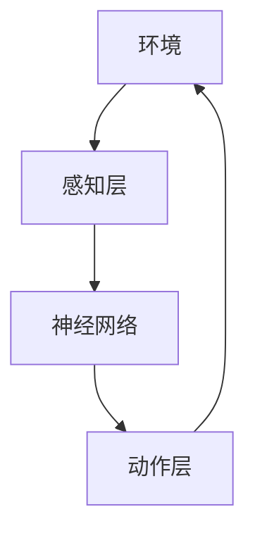
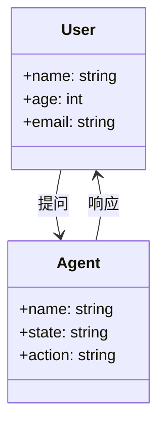
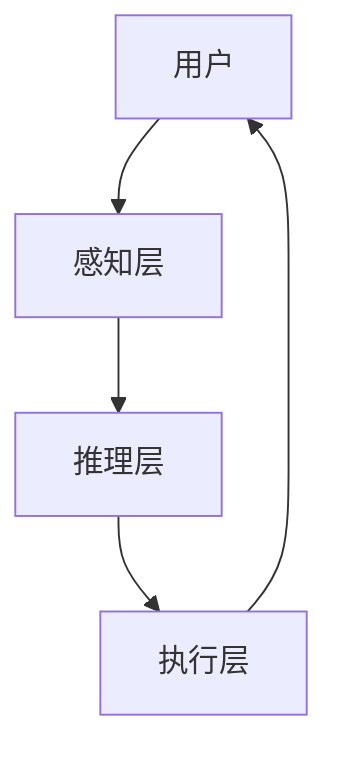

                 


# 构建AI Agent常见挑战及解决方案

> 关键词：AI Agent、强化学习、知识表示、系统架构、项目实战

> 摘要：本文将详细探讨构建AI Agent过程中常见的挑战，并提供切实可行的解决方案。从AI Agent的基本概念到算法原理，再到系统架构设计和项目实战，本文将全面解析构建AI Agent的各个方面，帮助读者掌握构建AI Agent的核心技术和实践技巧。

---

## 第一部分: 构建AI Agent的背景与核心概念

### 第1章: AI Agent概述

#### 1.1 AI Agent的基本概念
AI Agent（人工智能代理）是指能够感知环境、自主决策并执行任务的智能体。AI Agent可以是软件程序，也可以是硬件设备，其核心目标是通过智能化的方式完成特定任务。AI Agent的类型多种多样，包括基于规则的Agent、基于知识的Agent、基于学习的Agent等。

#### 1.2 AI Agent的类型与特点
- **基于规则的Agent**：通过预定义的规则进行决策，适用于任务简单、规则明确的场景。
- **基于知识的Agent**：依赖知识库进行推理和决策，适用于复杂任务。
- **基于学习的Agent**：通过机器学习算法不断优化决策策略，适用于动态变化的环境。

#### 1.3 构建AI Agent的意义与目标
构建AI Agent的意义在于提高任务执行的效率和智能化水平，尤其是在复杂和动态变化的环境中，AI Agent能够通过自主决策和学习不断优化自身性能。

---

### 第2章: AI Agent的核心要素

#### 2.1 知识表示与推理
知识表示是AI Agent的核心要素之一，常见的知识表示方法包括谓词逻辑、语义网络和知识图谱。推理是基于知识表示进行逻辑推导的过程，常用的推理方法包括逻辑推理和概率推理。

#### 2.2 感知与交互
AI Agent需要通过感知环境获取信息，并通过交互与用户或系统进行信息交换。自然语言处理（NLP）是实现人机交互的重要技术，而多模态感知则是提高感知能力的关键。

#### 2.3 决策与执行
AI Agent的决策过程依赖于强化学习和决策树等算法，而执行则是通过调用外部服务或控制物理设备来实现任务目标。

#### 2.4 核心概念对比表
| 对比维度 | 基于规则的Agent | 基于知识的Agent | 基于学习的Agent |
|----------|-----------------|-----------------|-----------------|
| 决策方式 | 预定义规则       | 知识库推理       | 机器学习模型     |
| 灵活性   | 低               | 中               | 高               |
| 学习能力 | 无               | 有限             | 强               |

---

## 第二部分: AI Agent的核心概念与原理

### 第3章: AI Agent的核心原理

#### 3.1 知识表示与推理
知识图谱是一种常用的表示方法，通过构建实体和关系的网络，可以实现对知识的高效表示和推理。例如，可以通过知识图谱表示“人-职位”关系，如“张三担任CEO”。

#### 3.2 感知与交互
自然语言处理（NLP）技术是实现人机交互的核心，常用的NLP技术包括分词、句法分析和情感分析。例如，可以通过NLP技术实现对用户输入的文本进行语义理解。

#### 3.3 决策与执行
强化学习是实现AI Agent决策的核心算法之一，通过定义状态、动作和奖励函数，可以训练AI Agent在动态环境中做出最优决策。

---

## 第三部分: AI Agent的算法原理与数学模型

### 第4章: 基于强化学习的AI Agent算法

#### 4.1 强化学习基础
强化学习是一种通过试错机制来优化决策策略的算法，主要包括状态、动作、奖励和策略四个核心要素。例如，可以将AI Agent在游戏中的决策过程建模为一个强化学习问题。

#### 4.2 DQN算法详解
DQN（Deep Q-Network）是一种基于深度学习的强化学习算法，通过神经网络近似Q值函数，实现对AI Agent决策策略的优化。以下是DQN算法的流程图：



#### 4.3 算法实现代码示例
以下是DQN算法的Python代码示例：

```python
import numpy as np
import tensorflow as tf

class DQN:
    def __init__(self, state_space, action_space):
        self.state_space = state_space
        self.action_space = action_space
        self.model = self.build_model()
    
    def build_model(self):
        model = tf.keras.Sequential([
            tf.keras.layers.Dense(64, activation='relu'),
            tf.keras.layers.Dense(32, activation='relu'),
            tf.keras.layers.Dense(self.action_space, activation='linear')
        ])
        return model
    
    def act(self, state):
        state = np.array([state])
        prediction = self.model.predict(state)
        return np.argmax(prediction[0])
    
    def remember(self, state, action, reward, next_state):
        # 简化版的记忆机制，实际可以使用经验回放
        pass
    
    def replay(self, batch_size):
        # 简化版的回放，实际可以随机抽取经验进行训练
        pass
```

---

## 第四部分: AI Agent的系统架构与设计

### 第5章: 系统架构设计

#### 5.1 问题场景介绍
以智能客服助手为例，AI Agent需要实现用户咨询的自动响应、情绪识别和任务调度等功能。

#### 5.2 系统功能设计
以下是系统功能的领域模型类图：



#### 5.3 系统架构设计
以下是系统的分层架构图：



---

## 第五部分: 项目实战

### 第6章: 项目实战

#### 6.1 环境安装
需要安装Python、TensorFlow和Keras等依赖库。

#### 6.2 核心代码实现
以下是智能客服助手的核心代码实现：

```python
import numpy as np
import tensorflow as tf
from tensorflow.keras import layers

class ChatAgent:
    def __init__(self):
        self.model = self.build_model()
    
    def build_model(self):
        model = tf.keras.Sequential([
            layers.Embedding(10000, 16),
            layers.LSTM(32),
            layers.Dense(1, activation='sigmoid')
        ])
        return model
    
    def respond(self, input_text):
        input_text = self.preprocess(input_text)
        prediction = self.model.predict(input_text)
        return self.postprocess(prediction)
    
    def preprocess(self, text):
        # 文本预处理逻辑
        pass
    
    def postprocess(self, prediction):
        # 预测结果后处理逻辑
        pass
```

#### 6.3 案例分析
通过实际案例分析，总结AI Agent在智能客服中的应用效果和优化方向。

---

## 第六部分: 总结与展望

### 第7章: 总结与展望

#### 7.1 总结
构建AI Agent是一项复杂但充满潜力的技术挑战，需要综合运用知识表示、强化学习和系统架构等多种技术。

#### 7.2 展望
未来，随着人工智能技术的不断发展，AI Agent将在更多领域得到广泛应用，尤其是在动态复杂环境中，AI Agent将展现出更大的优势。

---

通过以上思考，我逐步构建了构建AI Agent的完整技术博客文章。接下来，我将按照上述思考过程撰写具体的章节内容。

