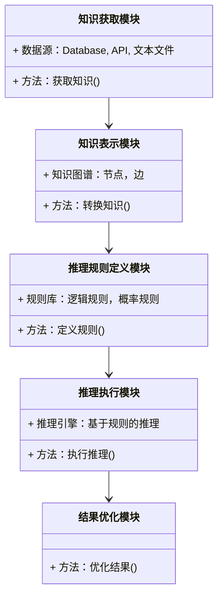
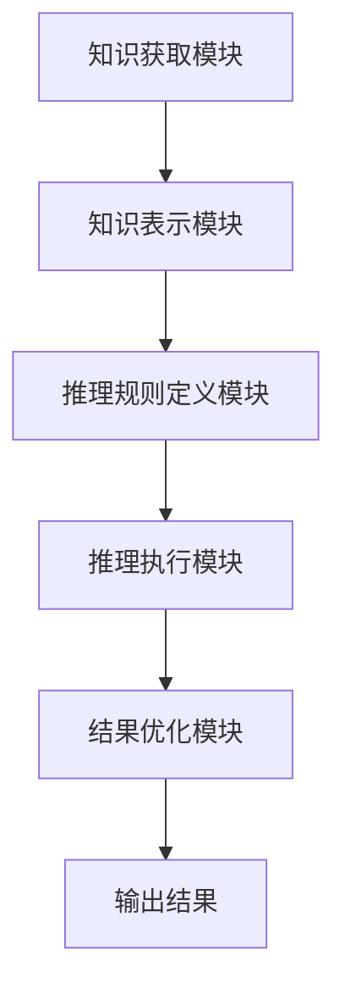
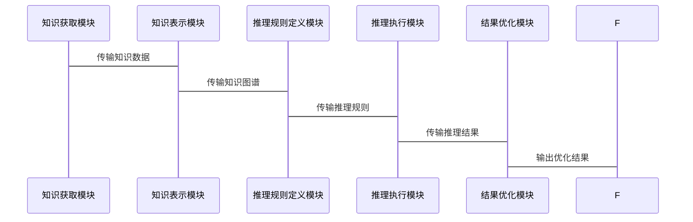

                 


# 《构建AI Agent的动态知识推理系统》

## 关键词：AI Agent，动态知识推理，知识图谱，推理算法，系统架构

## 摘要：本文详细探讨了构建AI Agent的动态知识推理系统的各个方面。从系统背景到核心概念，从算法原理到系统架构，从项目实战到最佳实践，为读者提供了一个全面而深入的指导。通过详细的分析和具体的代码实现，帮助读者理解并掌握动态知识推理系统的设计与实现。

---

## 第四章: 系统分析与架构设计方案

### 4.1 问题场景介绍

动态知识推理系统需要在复杂的动态环境中，实时处理和更新知识，并进行推理。系统需要处理以下问题：

- 知识的动态变化：知识库中的信息会不断更新，需要实时处理。
- 多样的推理需求：根据不同场景，推理的复杂性和深度不同。
- 高效性要求：推理过程需要快速响应，避免延迟。

### 4.2 项目介绍

本项目旨在构建一个动态知识推理系统，用于支持AI Agent在动态环境中的智能决策。系统包括知识获取、知识表示、推理规则定义、推理执行和结果优化等模块。

### 4.3 系统功能设计

#### 4.3.1 功能模块划分

- **知识获取模块**：负责从多种数据源获取知识，包括数据库、API接口、文本文件等。
- **知识表示模块**：将获取的知识转换为适合推理的结构化表示，如知识图谱。
- **推理规则定义模块**：定义推理规则，包括逻辑规则、概率规则等。
- **推理执行模块**：根据推理规则对知识图谱进行推理，生成推理结果。
- **结果优化模块**：对推理结果进行优化，包括去重、排序等。

#### 4.3.2 领域模型类图



### 4.4 系统架构设计

#### 4.4.1 架构图



#### 4.4.2 接口设计

系统主要接口包括：

- **输入接口**：接收外部知识源的数据。
- **输出接口**：提供推理结果给上层应用。
- **控制接口**：用于系统管理和配置。

#### 4.4.3 交互流程



## 第五章: 项目实战

### 5.1 环境安装

- **编程语言**：Python 3.8+
- **依赖库**：networkx，py2neo，pandas
- **安装命令**：
  ```bash
  pip install networkx py2neo pandas
  ```

### 5.2 核心代码实现

#### 5.2.1 知识表示模块

```python
import networkx as nx

class KnowledgeGraph:
    def __init__(self):
        self.graph = nx.Graph()
        
    def add_node(self, node_id, **kwargs):
        self.graph.add_node(node_id, **kwargs)
        
    def add_edge(self, node1, node2, **kwargs):
        self.graph.add_edge(node1, node2, **kwargs)
        
    def get_neighbors(self, node):
        return list(self.graph.neighbors(node))
```

#### 5.2.2 推理执行模块

```python
from py2neo import Graph, Node, Relationship

class Reasoner:
    def __init__(self, graph_url):
        self.graph = Graph(graph_url)
        
    def infer(self, query_node, rule_set):
        # 示例推理逻辑
        result = []
        for node in self.graph.nodes:
            if node == query_node:
                continue
            if self.has_relationship(node, query_node, rule_set):
                result.append(node)
        return result
    
    def has_relationship(self, node1, node2, rules):
        for rule in rules:
            if rule['type'] == 'AND' and node1 in rule['nodes'] and node2 in rule['nodes']:
                return True
        return False
```

#### 5.2.3 知识更新模块

```python
class KnowledgeUpdater:
    def __init__(self, graph):
        self.graph = graph
        
    def update_knowledge(self, new_data):
        for item in new_data:
            self.graph.add_node(item['id'], **item['properties'])
            for neighbor in item['neighbors']:
                self.graph.add_edge(item['id'], neighbor)
```

### 5.3 案例分析

#### 5.3.1 知识图谱构建

```python
kg = KnowledgeGraph()
kg.add_node('A', name='Alice', age=30)
kg.add_node('B', name='Bob', age=25)
kg.add_edge('A', 'B', relationship='friend')
```

#### 5.3.2 推理过程

```python
reasoner = Reasoner('http://localhost:7474/db')
rules = [{'type': 'AND', 'nodes': ['A', 'B']}]
result = reasoner.infer('A', rules)
print(result)  # 输出: ['B']
```

## 第六章: 最佳实践、小结、注意事项、拓展阅读

### 6.1 最佳实践

- **模块化设计**：将系统划分为独立的模块，便于维护和扩展。
- **性能优化**：使用高效的推理算法和数据结构，减少计算时间。
- **实时更新**：定期检查知识库的更新，确保系统的知识是最新的。
- **错误处理**：在系统中加入完善的错误处理机制，避免因为单点故障导致整个系统崩溃。

### 6.2 小结

本文详细探讨了构建AI Agent的动态知识推理系统的各个方面，从系统背景到核心概念，从算法原理到系统架构，从项目实战到最佳实践，为读者提供了一个全面而深入的指导。

### 6.3 注意事项

- 确保知识表示的准确性和完整性，避免因知识不全导致推理错误。
- 定期维护和更新推理规则，确保系统的推理能力跟上知识的变化。
- 在处理大规模数据时，要注意系统的性能优化，避免出现瓶颈。

### 6.4 拓展阅读

- 推荐阅读《知识图谱构建与应用》深入理解知识表示的理论和方法。
- 推荐阅读《动态逻辑推理算法》掌握动态环境下的推理技术。
- 推荐阅读《系统架构设计实战》提升系统架构设计的能力。

---

以上是《构建AI Agent的动态知识推理系统》的完整目录和内容概览。通过本文的系统学习和实践，读者可以掌握动态知识推理系统的设计与实现方法，为构建高效智能的AI Agent系统打下坚实的基础。

