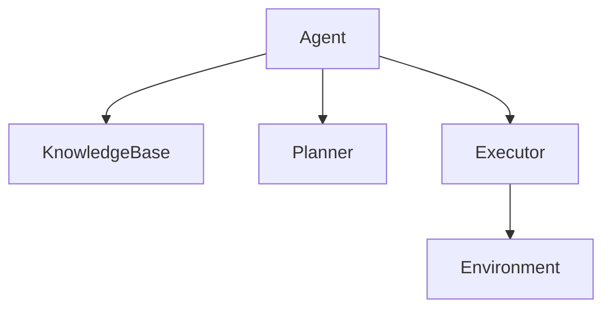
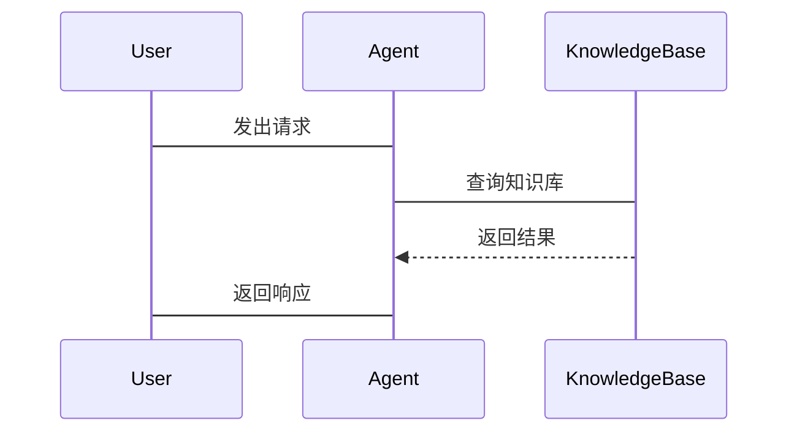
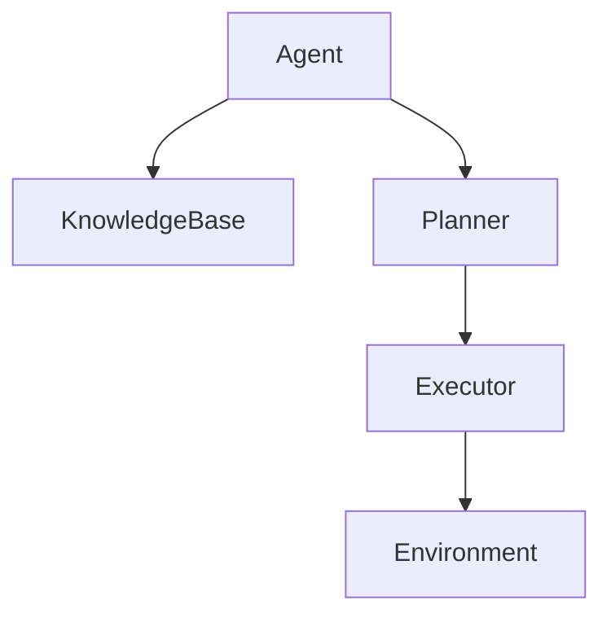

                 


# 构建AI Agent的开源工具与框架

> 关键词：AI Agent, 开源工具, 框架, 知识表示, 人机交互, 系统架构

> 摘要：本文将详细探讨构建AI Agent所需的开源工具与框架，涵盖AI Agent的基本概念、核心算法原理、系统架构设计以及实战项目实现。通过分析开源工具的功能与特点，结合实际应用场景，为读者提供一个系统化的构建AI Agent的指导。

---

## 第1章: AI Agent的基本概念与背景

### 1.1 AI Agent的定义与核心概念
AI Agent（智能体）是指在计算机系统中能够感知环境并采取行动以实现目标的实体。它能够通过与环境交互，自主决策和执行任务，从而达到预定的目标。

AI Agent的核心属性包括：
1. **自主性**：能够在没有外部干预的情况下自主决策。
2. **反应性**：能够实时感知环境并做出反应。
3. **目标导向性**：所有行动都以实现特定目标为导向。
4. **学习能力**：能够通过经验改进自身的性能。

AI Agent的应用场景广泛，包括但不限于智能助手、自动驾驶、机器人控制、推荐系统等。

### 1.2 开源工具与框架在AI Agent中的作用
开源工具与框架为AI Agent的构建提供了丰富的资源和模块化的支持。以下是一些常用的开源工具与框架：
1. **对话式AI框架**：如Rasa、Dialogflow，用于构建对话式AI Agent。
2. **NLP框架**：如spaCy、NLTK，用于自然语言处理。
3. **视觉处理框架**：如OpenCV、TensorFlow，用于图像和视频处理。
4. **机器学习框架**：如Scikit-learn、TensorFlow，用于模型训练与部署。

### 1.3 本章小结
本章介绍了AI Agent的基本概念及其核心属性，分析了开源工具与框架在AI Agent构建中的重要性，并列举了一些常用的开源工具与框架。

---

## 第2章: AI Agent的核心概念与联系

### 2.1 AI Agent的核心概念原理
AI Agent的构建涉及多个核心概念，包括知识表示、问题求解、规划与决策、以及人机交互等。

#### 知识表示
知识表示是AI Agent理解环境的基础。常用的知识表示方法包括：
- **符号表示法**：使用符号逻辑表示知识。
- **语义网络**：通过节点和边表示概念及其关系。
- **本体论**：通过形式化的方法描述领域知识。

#### 问题求解
问题求解是AI Agent的核心能力之一。常用的问题求解方法包括：
- **搜索算法**：如深度优先搜索（DFS）、广度优先搜索（BFS）。
- **启发式搜索**：如A*算法，结合启发函数优化搜索路径。

#### 规划与决策
规划与决策是AI Agent根据当前状态和目标，生成行动计划的过程。常用的方法包括：
- **无模型规划**：基于当前状态直接生成动作。
- **有模型规划**：基于环境模型生成最优行动。

#### 人机交互
人机交互是AI Agent与用户进行信息交换的接口。常用的技术包括自然语言处理（NLP）和语音识别。

### 2.2 核心概念属性特征对比表
表2.1展示了AI Agent核心概念的属性特征对比：

| 概念         | 属性               | 特征描述                                   |
|--------------|--------------------|------------------------------------------|
| 知识表示     | 表达方式           | 符号、语义网络、本体论                   |
| 问题求解     | 方法               | 搜索算法、启发式搜索                   |
| 规划与决策   | 技术               | 无模型规划、有模型规划                 |
| 人机交互     | 技术               | NLP、语音识别                           |

### 2.3 AI Agent的ER实体关系图
图2.1展示了AI Agent的实体关系：

```mermaid
erd
    Customer
    Agent
    Task
    KnowledgeBase
    Interaction
```

图中，Customer（用户）与Agent（AI Agent）之间通过Interaction（交互）进行信息交换。Agent通过KnowledgeBase（知识库）获取所需的知识，并通过Task（任务）执行具体的操作。

### 2.4 本章小结
本章详细讲解了AI Agent的核心概念，包括知识表示、问题求解、规划与决策以及人机交互，并通过表格和实体关系图展示了这些概念之间的联系。

---

## 第3章: AI Agent的算法原理与数学模型

### 3.1 AI Agent的算法原理
AI Agent的算法原理涵盖了多个方面，包括知识表示、问题求解、规划与决策以及人机交互。

#### 知识表示的数学模型
知识表示的数学模型可以通过向量空间模型来表示，例如：
$$
\text{知识表示} = \sum_{i=1}^{n} w_i x_i
$$
其中，\( w_i \) 是权重，\( x_i \) 是特征向量。

#### 决策算法的数学模型
决策算法可以通过Q-学习算法来表示，例如：
$$
\text{决策} = \argmax_{a} Q(s, a)
$$
其中，\( Q(s, a) \) 是状态-动作对的Q值，\( s \) 是当前状态，\( a \) 是动作。

#### 问题求解的算法实现
以下是一个基于广度优先搜索（BFS）的问题求解算法实现：
```python
def bfs(start, goal):
    queue = deque([start])
    visited = set([start])
    while queue:
        current = queue.popleft()
        if current == goal:
            return current
        for neighbor in graph[current]:
            if neighbor not in visited:
                visited.add(neighbor)
                queue.append(neighbor)
```

### 3.2 本章小结
本章详细讲解了AI Agent的算法原理，包括知识表示、问题求解和决策算法的数学模型，并通过代码示例展示了算法的实现过程。

---

## 第4章: AI Agent的系统架构与设计

### 4.1 系统架构设计
AI Agent的系统架构设计可以采用分层架构，如下图所示：



图中，Agent（智能体）通过KnowledgeBase（知识库）获取知识，并通过Planner（规划器）制定行动计划，最后通过Executor（执行器）与环境交互。

### 4.2 系统功能设计
系统功能设计包括以下几个方面：
1. **知识库管理**：负责知识的存储与检索。
2. **交互界面设计**：提供用户与AI Agent交互的界面。
3. **执行引擎**：负责任务的执行与反馈。

### 4.3 系统接口设计
系统接口设计包括：
1. **API接口定义**：定义RESTful API接口。
2. **接口调用流程**：用户通过API发送请求，系统处理请求并返回响应。
3. **接口安全设计**：通过身份验证和权限控制确保接口安全。

### 4.4 系统交互序列图
系统交互的序列图如下：



### 4.5 本章小结
本章详细讲解了AI Agent的系统架构设计，包括分层架构、系统功能设计、接口设计以及系统交互的序列图。

---

## 第5章: AI Agent的项目实战

### 5.1 环境安装与配置
构建AI Agent需要以下环境：
1. **Python 3.8+**
2. **pip**
3. **安装依赖库**：
   ```bash
   pip install python-mermaid==0.12.0
   pip install networkx
   ```

### 5.2 核心实现
以下是AI Agent的核心实现代码：
```python
from mermaid import Diagram

class Agent:
    def __init__(self, knowledge_base):
        self.knowledge_base = knowledge_base

    def process_request(self, request):
        # 获取上下文
        context = self.knowledge_base.retrieve(request)
        # 分析上下文
        response = self.analyze(context)
        return response

    def analyze(self, context):
        # 具体分析逻辑
        pass

# 使用示例
with Diagram("AI Agent架构") as diag:
    agent = Agent(knowledge_base)
    agent.process_request("请帮我安排一个会议。")
```

### 5.3 本章小结
本章通过实际案例展示了如何构建一个简单的AI Agent，并详细讲解了环境配置和核心实现代码。

---

## 第6章: 总结与展望

### 6.1 总结
本文详细探讨了构建AI Agent所需的开源工具与框架，包括核心概念、算法原理、系统架构设计以及实战项目实现。通过这些内容，读者可以系统地了解AI Agent的构建过程。

### 6.2 未来展望
随着人工智能技术的不断发展，AI Agent的应用场景将更加广泛。未来的研究方向包括：
1. **多模态交互**：结合视觉、听觉等多种模态信息。
2. **自适应学习**：提升AI Agent的自适应能力。
3. **边缘计算**：将AI Agent部署到边缘设备。

### 6.3 最佳实践
1. **选择合适的开源工具**：根据具体需求选择合适的开源工具与框架。
2. **注重系统架构设计**：确保系统的可扩展性和可维护性。
3. **持续优化与改进**：通过反馈机制不断优化AI Agent的性能。

---

## 附录

### 附录A: 相关数学公式
1. 知识表示：
$$
\text{知识表示} = \sum_{i=1}^{n} w_i x_i
$$

2. 决策算法：
$$
\text{决策} = \argmax_{a} Q(s, a)
$$

### 附录B: Python代码示例
```python
import networkx as nx

def create_graph():
    G = nx.DiGraph()
    G.add_nodes_from(["Agent", "KnowledgeBase", "Planner", "Executor", "Environment"])
    G.add_edges_from([
        ("Agent", "KnowledgeBase"),
        ("Agent", "Planner"),
        ("Planner", "Executor"),
        ("Executor", "Environment")
    ])
    return G

# 使用示例
graph = create_graph()
nx.draw(graph, with_labels=True)
plt.show()
```

### 附录C: Mermaid图表


---

## 参考文献

1. Russell, S., & Norvig, P. (2010). Artificial Intelligence: A Modern Approach.
2. LeCun, Y., Bengio, Y., & Hinton, G. (2015). Deep Learning.
3. 周志华. (2016). 机器学习.

---

**全文完。**

