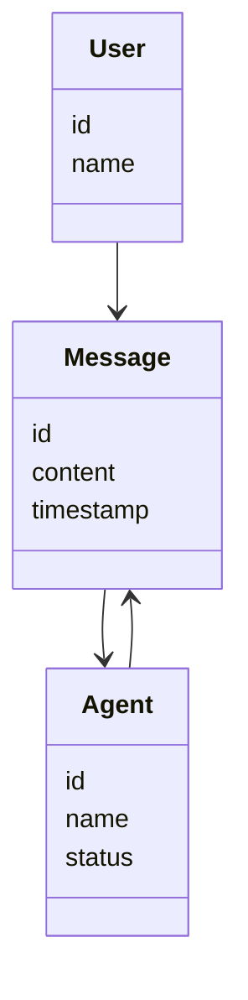
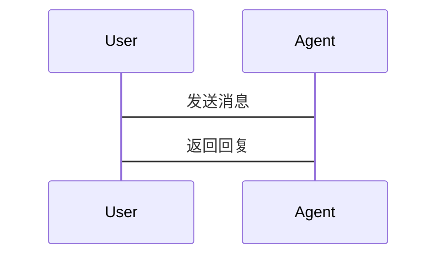

                 


# 《构建AI Agent的技术栈选择指南》

---

## 关键词：
AI Agent, 技术栈选择, 自然语言处理, 机器学习, 推理引擎, 系统架构, 开发框架

---

## 摘要：
构建AI Agent需要选择合适的技术栈，涵盖自然语言处理、机器学习、推理引擎等核心领域。本文将详细介绍AI Agent的构建流程，分析核心技术栈的选择策略，并通过实际案例展示如何实现一个完整的AI Agent系统。从算法原理到系统架构，从开发框架到项目实战，本文为技术开发者和研究人员提供全面的技术指南，帮助他们高效地构建智能AI Agent。

---

# 第一部分：AI Agent的基础概念与构建流程

## 第1章：AI Agent的基本概念与构建流程

### 1.1 AI Agent的定义与特点

#### 1.1.1 什么是AI Agent
AI Agent（人工智能代理）是指能够感知环境、自主决策并采取行动的智能系统。它通过与用户或环境交互，完成特定任务或提供服务。

#### 1.1.2 AI Agent的核心特点
- **自主性**：AI Agent能够自主决策，无需人工干预。
- **反应性**：能够实时感知环境并做出反应。
- **目标导向**：基于目标驱动行为。
- **可扩展性**：支持多种任务和复杂场景。

#### 1.1.3 AI Agent与传统程序的区别
- 传统程序基于固定的规则执行任务，AI Agent具备学习和自适应能力。
- AI Agent能够处理不确定性，传统程序通常在确定性环境中运行。

### 1.2 AI Agent的构建流程

#### 1.2.1 需求分析与目标设定
- 明确AI Agent的目标用户、应用场景和核心功能。
- 设计系统架构，包括数据流、功能模块和交互流程。

#### 1.2.2 数据采集与处理
- 采集用户输入、环境数据或其他相关信息。
- 数据清洗、特征提取和预处理，确保数据质量。

#### 1.2.3 模型训练与选择
- 根据任务需求选择合适的机器学习模型。
- 训练模型并进行调优，确保模型性能。

#### 1.2.4 系统集成与部署
- 集成各个功能模块，确保系统协同工作。
- 部署到实际环境，进行测试和优化。

### 1.3 本章小结
本章介绍了AI Agent的基本概念、特点以及构建流程，为后续章节的技术栈选择奠定了基础。

---

# 第二部分：AI Agent的核心技术栈

## 第2章：自然语言处理技术

### 2.1 NLP基础

#### 2.1.1 什么是NLP
NLP（Natural Language Processing）是研究人机交互中自然语言处理的理论和方法，旨在让计算机能够理解、生成和处理人类语言。

#### 2.1.2 NLP的核心任务
- **文本分类**：将文本归类到预定义的类别中。
- **命名实体识别**：识别文本中的实体（如人名、地名）。
- **句法分析**：分析句子的语法结构。
- **情感分析**：判断文本的情感倾向。

#### 2.1.3 NLP的常见应用场景
- 聊天机器人
- 智能客服
- 文本摘要

### 2.2 主流NLP模型

#### 2.2.1 BERT模型
BERT（Bidirectional Encoder Representations from Transformers）是一种基于Transformer的预训练语言模型，能够理解上下文语义。

#### 2.2.2 GPT模型
GPT（Generative Pre-trained Transformer）是一种生成式语言模型，能够生成连贯的文本。

#### 2.2.3 其他NLP模型
- RoBERTa
- DistilBERT

### 2.3 对话生成与理解

#### 2.3.1 对话生成的原理
基于预训练语言模型，通过解码生成自然的对话回复。

#### 2.3.2 对话理解的实现
利用NLP技术理解用户的输入，提取意图和实体。

#### 2.3.3 对话系统的优化
通过反馈机制优化对话质量，提升用户体验。

### 2.4 本章小结
本章详细讲解了自然语言处理技术的核心概念和主流模型，为构建AI Agent的对话功能提供了理论支持。

---

## 第3章：机器学习与深度学习模型

### 3.1 机器学习基础

#### 3.1.1 什么是机器学习
机器学习是通过数据训练模型，使其能够从经验中学习并做出预测或决策。

#### 3.1.2 机器学习的分类
- 监督学习
- 非监督学习
- 强化学习

#### 3.1.3 机器学习的应用场景
- 分类
- 回归
- 聚类

### 3.2 深度学习的核心模型

#### 3.2.1 神经网络
神经网络是深度学习的核心模型，由多个层次组成，能够学习复杂的特征。

#### 3.2.2 卷积神经网络
CNN（Convolutional Neural Network）主要用于图像处理，通过卷积操作提取图像特征。

#### 3.2.3 循环神经网络
RNN（Recurrent Neural Network）用于处理序列数据，如文本或时间序列。

### 3.3 模型选择与优化

#### 3.3.1 模型选择的策略
根据任务需求选择合适的模型，考虑计算资源和数据量。

#### 3.3.2 模型优化的方法
- 超参数调优
- 正则化
- 数据增强

#### 3.3.3 模型评估的指标
- 准确率
- 召回率
- F1分数

### 3.4 本章小结
本章介绍了机器学习和深度学习的核心模型，帮助读者理解如何选择和优化模型。

---

## 第4章：推理引擎与知识表示

### 4.1 推理引擎概述

#### 4.1.1 什么是推理引擎
推理引擎是用于逻辑推理的系统，能够根据知识库中的事实和规则进行推理。

#### 4.1.2 推理引擎的分类
- 前向推理
- 后向推理
- 混合推理

#### 4.1.3 推理引擎的应用场景
- 知识图谱推理
- 专家系统

### 4.2 知识表示与推理

#### 4.2.1 知识图谱的构建
知识图谱是一种结构化的知识表示方式，包含实体和关系。

#### 4.2.2 逻辑推理的实现
基于知识图谱进行推理，得出新的事实或结论。

#### 4.2.3 模糊推理的原理
处理模糊信息，如“很可能”、“可能”等。

### 4.3 知识库的管理与优化

#### 4.3.1 知识库的存储与检索
利用数据库或图数据库存储知识，并支持高效的查询。

#### 4.3.2 知识库的更新与维护
定期更新知识库，确保信息的准确性和时效性。

#### 4.3.3 知识库的扩展与集成
将外部知识源与现有知识库集成，扩展系统的知识储备。

### 4.4 本章小结
本章详细讲解了推理引擎和知识表示的核心技术，为构建智能AI Agent提供了知识处理的能力。

---

# 第三部分：AI Agent的开发框架与工具

## 第5章：开发框架的选择与使用

### 5.1 常见AI Agent开发框架

#### 5.1.1 Rasa
Rasa是一个开源的AI对话框架，支持自定义对话流程和多种NLU模型。

#### 5.1.2 Dialogflow
Dialogflow是Google提供的对话式AI平台，支持自然语言理解和对话管理。

#### 5.1.3 Microsoft Bot Framework
微软的Bot Framework支持构建和部署智能对话机器人。

### 5.2 开发框架的核心功能

#### 5.2.1 对话管理
管理对话流程，跟踪上下文和用户状态。

#### 5.2.2 自然语言理解
解析用户输入，提取意图和实体。

#### 5.2.3 引擎集成
与NLP模型、推理引擎等技术集成，提供完整的对话能力。

### 5.3 框架选择的策略

#### 5.3.1 项目需求分析
根据项目目标、团队能力和资源选择合适的框架。

#### 5.3.2 框架性能对比
对比不同框架的性能、功能和社区支持。

#### 5.3.3 开发团队的技术栈
确保框架与团队现有技术栈兼容，降低学习成本。

### 5.4 本章小结
本章介绍了常用的AI Agent开发框架，并提供了选择框架的策略和建议。

---

## 第6章：系统设计与架构方案

### 6.1 问题场景介绍
构建一个智能客服AI Agent，用于处理用户的咨询和问题。

### 6.2 系统功能设计

#### 6.2.1 领域模型（Mermaid类图）


### 6.3 系统架构设计（Mermaid架构图）
```mermaid
container 用户端 {
    User
    Message
}
container 服务端 {
    Agent
    Database
    NLP Engine
}
User --> Message
Message --> Agent
Agent --> Database
Agent --> NLP Engine
```

### 6.4 系统接口设计
- 用户发送消息到Agent
- Agent解析消息并生成回复
- 回复返回给用户

### 6.5 系统交互（Mermaid序列图）


### 6.6 本章小结
本章通过实际案例展示了系统设计与架构方案，为读者提供了具体的实现思路。

---

## 第7章：项目实战

### 7.1 环境安装

#### 7.1.1 安装Python
```bash
python --version
```

#### 7.1.2 安装依赖库
```bash
pip install numpy pandas scikit-learn
```

### 7.2 系统核心实现

#### 7.2.1 NLP模型实现
```python
from sklearn.feature_extraction.text import TfidfVectorizer
from sklearn.svm import SVC

vectorizer = TfidfVectorizer()
model = SVC()
```

#### 7.2.2 对话生成实现
```python
def generate_response(user_input):
    # 处理用户输入
    # 生成回复
    return response
```

### 7.3 代码应用解读与分析
- 代码实现了NLP模型和对话生成功能，展示了如何将理论应用于实践。

### 7.4 实际案例分析
通过一个智能客服的案例，详细讲解了如何构建和优化AI Agent系统。

### 7.5 项目小结
本章通过实际项目展示了AI Agent的构建过程，帮助读者巩固所学知识。

---

## 第8章：高级主题与未来趋势

### 8.1 高级主题

#### 8.1.1 联邦学习
通过联邦学习在保护数据隐私的前提下进行模型训练。

#### 8.1.2 连接器与适配器
实现不同平台的适配，如Slack、Telegram等。

### 8.2 未来趋势

#### 8.2.1 多模态AI Agent
结合视觉、听觉等多种模态信息，提升AI Agent的感知能力。

#### 8.2.2 自适应学习
AI Agent能够自主学习和优化，适应不断变化的环境。

### 8.3 本章小结
本章展望了AI Agent的未来发展方向，帮助读者了解行业趋势。

---

## 第9章：最佳实践与注意事项

### 9.1 最佳实践

#### 9.1.1 数据质量管理
确保数据的准确性和完整性，避免噪声干扰。

#### 9.1.2 模型调优
通过交叉验证和网格搜索优化模型性能。

#### 9.1.3 系统监控
实时监控系统运行状态，及时发现和解决问题。

### 9.2 注意事项

#### 9.2.1 数据隐私
遵守数据隐私法规，保护用户隐私。

#### 9.2.2 系统稳定性
确保系统具备高可用性，避免因故障导致服务中断。

### 9.3 本章小结
本章提供了构建AI Agent的最佳实践和注意事项，帮助读者在实际项目中避免常见问题。

---

## 第10章：小结与展望

### 10.1 小结
本文详细讲解了构建AI Agent的技术栈选择，从基础概念到实际应用，为读者提供了全面的指导。

### 10.2 展望
随着AI技术的不断发展，AI Agent将具备更强的智能和更广泛的应用场景，未来的研究方向包括多模态交互、自适应学习等。

---

## 参考文献
- 省略

---

## 致谢
感谢读者的支持和反馈，感谢技术社区的开源贡献者。

---

# 结语
构建AI Agent是一项复杂但极具挑战性的任务，通过合理选择技术栈和遵循最佳实践，我们可以开发出高效、智能的AI Agent系统。希望本文能为读者提供有价值的参考和指导。

