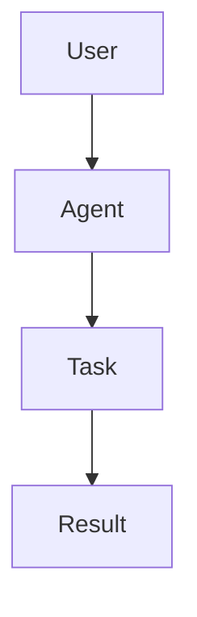
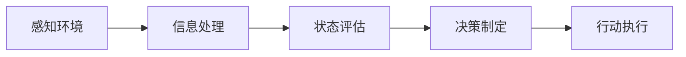
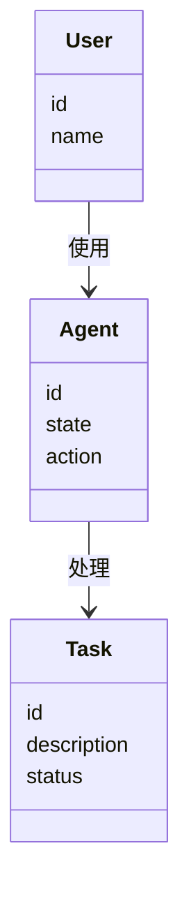
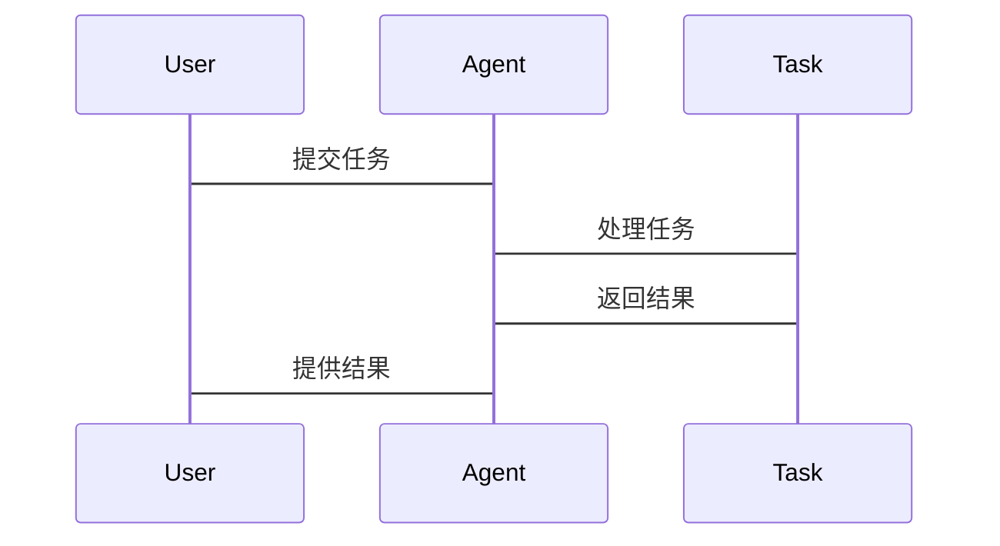
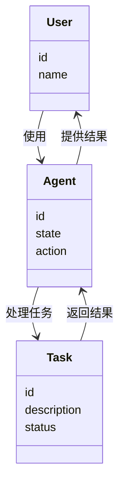

                 


# 第1章: AI Agent与敏捷开发的背景介绍

## 1.1 AI Agent的基本概念

### 1.1.1 什么是AI Agent

AI Agent（人工智能代理）是指能够感知环境、自主决策并采取行动以实现特定目标的智能实体。它可以是一个软件程序、机器人或其他智能系统，能够根据输入的信息做出反应，并在动态环境中适应变化。

AI Agent的核心目标是通过智能化的手段，帮助用户完成特定任务或提供解决方案。与传统的被动程序不同，AI Agent具有主动性，能够在没有明确指令的情况下采取行动。

### 1.1.2 AI Agent的类型

AI Agent可以根据不同的标准进行分类，常见的分类方式包括：

1. **基于规则的AI Agent**：这类AI Agent通过预定义的规则来做出决策。规则通常是基于逻辑条件的判断，适用于简单且确定性的环境。

2. **基于模型的AI Agent**：这类AI Agent依赖于环境模型来进行决策。它们通过构建和更新环境模型来理解和预测环境的变化，适用于复杂且动态的环境。

3. **基于学习的AI Agent**：这类AI Agent通过机器学习算法来不断优化自身的决策能力。它们能够从经验中学习，并在面对新情况时做出更智能的决策。

4. **基于推理的AI Agent**：这类AI Agent通过逻辑推理来解决问题。它们通常用于需要复杂逻辑推理的场景，如自然语言处理和专家系统。

### 1.1.3 AI Agent的核心特征

AI Agent的核心特征包括：

- **自主性**：AI Agent能够在没有外部干预的情况下自主运行和决策。
- **反应性**：AI Agent能够感知环境并实时做出反应。
- **目标导向性**：AI Agent的行为以实现特定目标为导向。
- **学习能力**：基于学习的AI Agent能够通过经验不断优化自身的决策能力。

## 1.2 敏捷开发的背景与意义

### 1.2.1 敏捷开发的起源与发展

敏捷开发是一种以迭代和增量的方式进行软件开发的方法论。它起源于2001年的《敏捷宣言》，强调个体互动、用户参与、响应变化和交付可用的软件。敏捷开发的核心思想是通过快速迭代和持续反馈来提高开发效率和软件质量。

### 1.2.2 敏捷开发的核心原则

敏捷开发的核心原则包括：

1. **客户合作胜过合同谈判**：敏捷开发强调与客户的紧密合作，而不是通过合同来确定需求。
2. **响应变化胜过遵循计划**：敏捷开发鼓励团队灵活应对变化，而不是 rigidly遵循初始计划。
3. **交付可用的软件胜过完整文档**：敏捷开发注重实际交付可用的产品，而不是仅仅完成大量的文档。
4. **个体互动胜过工具和流程**：敏捷开发强调团队协作和个体互动，而不是过度依赖工具和流程。

### 1.2.3 敏捷开发与传统开发的区别

传统的软件开发方法，如瀑布模型，强调严格的计划和阶段划分，而敏捷开发则更加灵活和迭代。以下是敏捷开发与传统开发的主要区别：

- **开发方式**：敏捷开发采用迭代和增量的方式，而传统开发采用线性阶段的方式。
- **需求变更**：敏捷开发能够快速响应需求变更，而传统开发则需要经过漫长的变更控制流程。
- **团队协作**：敏捷开发强调团队协作和个体互动，而传统开发则更注重严格的分工和角色划分。
- **交付周期**：敏捷开发注重快速交付可用的软件，而传统开发则更关注完成所有阶段后再交付。

## 1.3 AI Agent开发中的敏捷方法

### 1.3.1 敏捷开发在AI Agent中的应用

敏捷开发在AI Agent开发中的应用主要体现在以下几个方面：

1. **迭代开发**：AI Agent的开发可以采用迭代的方式，每次迭代中逐步完善功能，快速验证和调整。
2. **持续反馈**：通过持续的用户反馈和团队协作，及时发现和解决问题。
3. **灵活应对变化**：AI Agent的开发过程中可能会遇到数据、模型和环境的变化，敏捷开发能够快速调整开发方向。

### 1.3.2 AI Agent开发的挑战与机遇

AI Agent的开发面临以下挑战：

1. **复杂性**：AI Agent需要处理复杂的数据和逻辑，开发难度较高。
2. **不确定性**：AI Agent需要在动态和不确定的环境中做出决策，增加了开发的难度。
3. **性能要求**：AI Agent需要在实时环境下快速响应，对性能有较高的要求。

同时，敏捷开发也为AI Agent的开发带来了机遇：

1. **快速验证**：通过敏捷开发的迭代方法，可以快速验证AI Agent的功能和性能。
2. **持续优化**：敏捷开发的持续反馈机制有助于不断优化AI Agent的性能和用户体验。
3. **团队协作**：敏捷开发强调团队协作，有助于集中力量攻克技术难题。

### 1.3.3 敏捷开发如何解决AI Agent开发中的问题

敏捷开发通过以下方式解决AI Agent开发中的问题：

1. **快速迭代**：敏捷开发的迭代方法使得AI Agent的功能可以逐步完善，避免一次性开发导致的高风险。
2. **持续反馈**：通过持续的用户反馈，团队可以及时发现并解决问题，提高开发效率。
3. **灵活调整**：敏捷开发的灵活性使得团队能够快速应对环境和需求的变化，确保AI Agent的开发能够适应新的挑战。

## 1.4 本章小结

本章主要介绍了AI Agent的基本概念、敏捷开发的背景与意义，以及敏捷开发在AI Agent开发中的应用。通过本章的学习，读者可以理解AI Agent的核心特征和敏捷开发的基本原则，为后续章节的学习打下坚实的基础。

---

# 第2章: AI Agent的核心概念与联系

## 2.1 AI Agent的核心概念

### 2.1.1 AI Agent的定义与分类

AI Agent的定义与分类在1.1节已经详细阐述过，这里不再重复。为了方便读者理解，我们将AI Agent的分类总结如下：

| 类型                | 描述                                                                 |
|---------------------|----------------------------------------------------------------------|
| 基于规则的AI Agent  | 通过预定义的规则进行决策，适用于简单且确定性的环境。             |
| 基于模型的AI Agent  | 依赖于环境模型进行决策，适用于复杂且动态的环境。                 |
| 基于学习的AI Agent  | 通过机器学习算法不断优化决策能力，适用于复杂且动态的环境。       |
| 基于推理的AI Agent  | 通过逻辑推理解决问题，适用于需要复杂逻辑推理的场景。             |

### 2.1.2 AI Agent的感知与决策机制

AI Agent的感知与决策机制是其核心组成部分。感知部分负责获取环境中的信息，决策部分基于感知信息做出行动决策。

#### 感知机制

AI Agent的感知机制可以通过以下几种方式获取环境信息：

1. **传感器**：如摄像头、麦克风等设备，用于获取环境中的视觉、听觉等信息。
2. **API调用**：通过调用外部API获取环境数据，如天气数据、地理位置信息等。
3. **用户输入**：通过用户输入获取指令或反馈信息。

#### 决策机制

AI Agent的决策机制通常包括以下步骤：

1. **信息处理**：对获取的环境信息进行处理和分析，提取有用的信息。
2. **状态评估**：根据处理后的信息，评估当前状态。
3. **决策制定**：基于评估结果，制定行动决策。
4. **行动执行**：根据决策结果执行相应的行动。

### 2.1.3 AI Agent的智能体架构

AI Agent的智能体架构是其内部结构的体现，常见的架构包括：

1. **反应式架构**：基于当前感知信息做出反应，不依赖于环境模型。
2. **基于模型的架构**：依赖于环境模型进行决策，适用于复杂环境。
3. **分层架构**：将决策过程分解为多个层次，每个层次负责不同的决策任务。

### 2.1.4 AI Agent的设计原则

设计AI Agent时需要遵循以下原则：

1. **模块化**：将AI Agent的功能分解为独立的模块，便于开发和维护。
2. **可扩展性**：确保AI Agent能够方便地扩展新的功能。
3. **鲁棒性**：确保AI Agent在面对异常情况时能够稳定运行。
4. **实时性**：确保AI Agent能够快速响应环境变化，适用于实时场景。

## 2.2 核心概念的对比分析

### 2.2.1 AI Agent与传统程序的区别

AI Agent与传统程序的主要区别如下：

| 特性                | AI Agent                          | 传统程序                        |
|---------------------|-----------------------------------|---------------------------------|
| 主动性              | 主动感知环境并采取行动            | 被动等待指令                      |
| 智能性              | 具备学习和推理能力                | 仅执行预定义的指令                |
| 适应性              | 能够适应环境变化                  | 适应性较差，难以应对变化          |
| 决策能力            | 具备自主决策能力                  | 依赖外部指令                      |

### 2.2.2 不同AI Agent架构的对比

不同AI Agent架构的对比如下：

| 架构类型            | 描述                                                                 | 优点                              | 缺点                              |
|---------------------|----------------------------------------------------------------------|-----------------------------------|-----------------------------------|
| 反应式架构          | 基于当前感知做出反应，不依赖环境模型。| 实时性强，适合简单环境。           | 无法处理复杂环境，缺乏全局视角。 |
| 基于模型的架构      | 依赖环境模型进行决策，适用于复杂环境。| 能够处理复杂环境，决策更合理。     | 计算复杂，开发难度较高。           |
| 分层架构            | 将决策过程分解为多个层次，每个层次负责不同的决策任务。| 结构清晰，便于维护。               | 层间协调复杂，开发周期较长。       |

### 2.2.3 AI Agent与机器学习模型的关系

AI Agent与机器学习模型之间的关系如下：

1. **依赖关系**：AI Agent通常依赖于机器学习模型来进行感知和决策。
2. **集成关系**：AI Agent可以将机器学习模型作为其内部组件，实现智能化功能。
3. **目标关系**：AI Agent的目标是通过机器学习模型实现智能决策，而机器学习模型则是实现AI Agent功能的核心工具。

## 2.3 实体关系图（ER图）与流程图

### 2.3.1 AI Agent的ER实体关系图

以下是AI Agent的ER实体关系图：



图中，User（用户）向Agent（AI Agent）提交任务（Task），Agent处理任务后生成结果（Result）。

### 2.3.2 AI Agent的流程图

以下是AI Agent的流程图：



流程图展示了AI Agent从感知环境到行动执行的整个过程。

## 2.4 本章小结

本章详细讲解了AI Agent的核心概念，包括定义、分类、感知与决策机制、智能体架构和设计原则。同时，通过对比分析，明确了AI Agent与传统程序、不同架构之间的区别和联系。最后，通过ER图和流程图，直观地展示了AI Agent的实体关系和工作流程。这些内容为后续章节的深入学习奠定了基础。

---

# 第3章: 敏捷开发方法论在AI Agent开发中的应用

## 3.1 敏捷开发方法论的核心原则

### 3.1.1 敏捷开发的基本原则

敏捷开发的基本原则包括：

1. **个体互动**：重视个体之间的协作和互动。
2. **用户参与**：用户参与开发过程，确保需求的准确理解和实现。
3. **持续交付**：通过快速迭代，持续向用户交付可用的软件。
4. **响应变化**：能够快速适应需求和环境的变化。

### 3.1.2 敏捷开发的流程

敏捷开发的流程通常包括以下步骤：

1. **需求分析**：与用户合作确定需求。
2. **迭代开发**：将需求分解为小的、可管理的任务，逐步开发。
3. **持续测试**：在每个迭代中进行测试，确保功能正确。
4. **持续集成**：将团队成员的代码整合到主代码库，确保代码的稳定性。
5. **持续反馈**：通过用户的反馈不断优化产品。

### 3.1.3 敏捷开发的工具与实践

敏捷开发常用的工具与实践包括：

1. **版本控制工具**：如Git、GitHub等，用于代码管理和协作。
2. **项目管理工具**：如Jira、Trello等，用于任务管理和进度跟踪。
3. **持续集成工具**：如Jenkins、Travis CI等，用于自动化测试和集成。
4. **每日站会**：团队每天进行简短的站会，同步进展和解决问题。
5. **用户故事**：将需求转化为用户故事，便于理解和开发。

## 3.2 AI Agent开发中的敏捷方法

### 3.2.1 敏捷开发在AI Agent中的应用

AI Agent的开发可以采用敏捷开发的方法，具体包括：

1. **迭代开发**：将AI Agent的功能分解为小的、可管理的任务，逐步开发和验证。
2. **持续反馈**：通过用户的反馈不断优化AI Agent的功能和性能。
3. **灵活应对变化**：在开发过程中，根据环境和需求的变化，灵活调整开发方向。

### 3.2.2 敏捷开发对AI Agent开发的促进作用

敏捷开发对AI Agent开发的促进作用体现在以下几个方面：

1. **快速验证**：通过敏捷开发的迭代方法，可以快速验证AI Agent的功能和性能，避免一次性开发导致的高风险。
2. **持续优化**：敏捷开发的持续反馈机制有助于不断优化AI Agent的性能和用户体验。
3. **团队协作**：敏捷开发强调团队协作，有助于集中力量攻克技术难题。

### 3.2.3 敏捷开发中的挑战与解决方案

AI Agent开发中的敏捷开发也面临一些挑战：

1. **技术复杂性**：AI Agent的开发涉及复杂的技术，如机器学习、自然语言处理等，开发难度较高。
2. **不确定性**：AI Agent需要在动态和不确定的环境中做出决策，增加了开发的难度。
3. **性能要求**：AI Agent需要在实时环境下快速响应，对性能有较高的要求。

为了解决这些挑战，可以采取以下措施：

1. **加强技术培训**：团队成员需要具备扎实的技术背景，特别是机器学习和人工智能相关知识。
2. **建立良好的沟通机制**：确保团队内部和与用户的沟通畅通，及时发现和解决问题。
3. **选择合适的工具和框架**：选择适合的工具和框架，提高开发效率和代码质量。

## 3.3 本章小结

本章主要介绍了敏捷开发方法论的核心原则，并探讨了敏捷开发在AI Agent开发中的应用。通过本章的学习，读者可以理解敏捷开发在AI Agent开发中的重要性，以及如何通过敏捷开发的方法提高AI Agent的开发效率和质量。

---

# 第4章: AI Agent的算法原理与实现

## 4.1 AI Agent的核心算法

### 4.1.1 强化学习算法

#### 简介

强化学习（Reinforcement Learning, RL）是一种机器学习范式，通过智能体与环境的交互来学习最优策略。智能体通过试错的方式，不断优化其行为，以最大化累积奖励。

#### 核心概念

1. **状态（State）**：智能体所处的环境状态。
2. **动作（Action）**：智能体在某个状态下采取的行动。
3. **奖励（Reward）**：智能体采取某个动作后所获得的反馈。
4. **策略（Policy）**：智能体在某个状态下选择动作的规则。
5. **值函数（Value Function）**：衡量某个状态或动作的价值，用于指导智能体的决策。

#### 算法流程

1. **初始化**：设置初始状态和参数。
2. **与环境交互**：智能体根据当前状态选择动作，执行动作并获得奖励。
3. **更新策略**：根据获得的奖励更新策略，优化动作选择。
4. **循环迭代**：重复与环境交互和更新策略的过程，直到满足终止条件。

#### 算法实现

以下是强化学习算法的Python实现示例：

```python
class Agent:
    def __init__(self, state_space, action_space):
        self.state_space = state_space
        self.action_space = action_space
        # 初始化策略参数
        self.theta = np.random.randn(state_space, action_space)

    def act(self, state):
        # 根据当前状态选择动作
        action_probs = softmax(self.theta[state, :])
        action = np.random.choice(self.action_space, p=action_probs)
        return action

    def update(self, state, action, reward):
        # 更新策略参数
        # 这里可以使用梯度上升方法更新theta
        pass
```

#### 算法优缺点

- **优点**：适用于动态和不确定的环境，能够通过试错找到最优策略。
- **缺点**：需要大量的交互和计算资源，学习过程可能较慢。

### 4.1.2 监督学习算法

#### 简介

监督学习（Supervised Learning）是一种机器学习范式，通过标记的数据训练模型，使其能够对新的数据进行分类或回归预测。

#### 核心概念

1. **训练数据**：包含输入和标签的数据集。
2. **模型**：用于学习输入与标签之间关系的函数。
3. **损失函数**：衡量模型预测值与真实值之间差异的函数。
4. **优化算法**：用于最小化损失函数的算法，如梯度下降。

#### 算法流程

1. **数据准备**：收集和整理标记数据。
2. **模型训练**：使用训练数据训练模型，调整模型参数以最小化损失函数。
3. **模型评估**：使用测试数据评估模型的性能。
4. **模型部署**：将训练好的模型部署到实际应用中。

#### 算法实现

以下是监督学习算法的Python实现示例：

```python
import numpy as np
from sklearn.linear_model import LinearRegression

# 创建数据集
X = np.array([[1], [2], [3], [4], [5]])
y = np.array([2, 4, 6, 8, 10])

# 训练模型
model = LinearRegression()
model.fit(X, y)

# 预测
print(model.predict([[6]]))  # 输出：[[12.]]
```

#### 算法优缺点

- **优点**：适用于数据充足且标签明确的场景，模型训练简单且高效。
- **缺点**：依赖高质量的标记数据，难以处理动态和不确定的环境。

### 4.1.3 聚类算法

#### 简介

聚类（Clustering）是一种无监督学习方法，通过将数据点分成不同的簇，使得簇内的数据点具有相似性，而不同簇之间的数据点具有较大的差异性。

#### 核心概念

1. **距离度量**：衡量数据点之间相似性的方法，如欧几里得距离、曼哈顿距离等。
2. **聚类算法**：如K-means、层次聚类等。
3. **簇**：数据点的集合，簇内的数据点具有相似性，而不同簇之间的数据点具有较大的差异性。

#### 算法流程

1. **数据准备**：收集和预处理数据。
2. **选择聚类算法**：根据数据特性和需求选择合适的聚类算法。
3. **模型训练**：使用训练数据训练聚类模型。
4. **结果分析**：对聚类结果进行分析和可视化。

#### 算法实现

以下是聚类算法的Python实现示例：

```python
from sklearn.cluster import KMeans
from sklearn.datasets import make_blobs

# 创建数据集
X, y = make_blobs(n_samples=100, centers=3, random_state=42)

# 训练模型
model = KMeans(n_clusters=3)
model.fit(X)

# 获取聚类结果
labels = model.labels_
print(labels)
```

#### 算法优缺点

- **优点**：适用于无标签数据的分析和分类，能够发现数据中的潜在结构。
- **缺点**：需要选择合适的聚类算法和参数，结果解释性可能较弱。

## 4.2 算法原理与实现细节

### 4.2.1 强化学习的数学模型

强化学习的核心是通过试错学习找到最优策略。其数学模型可以表示为：

$$
V(s) = \max_a Q(s,a)
$$

其中，\( V(s) \) 表示状态 \( s \) 的值函数，\( Q(s,a) \) 表示状态 \( s \) 下采取动作 \( a \) 的Q值。

### 4.2.2 监督学习的数学模型

监督学习的数学模型可以表示为：

$$
y = f(x) + \epsilon
$$

其中，\( y \) 是标签，\( x \) 是输入，\( f(x) \) 是模型预测函数，\( \epsilon \) 是误差项。

### 4.2.3 聚类算法的数学模型

聚类算法的数学模型可以表示为：

$$
\text{目标函数} = \sum_{i=1}^n \sum_{j=1}^k w_{ij} d(c_i, c_j)
$$

其中，\( w_{ij} \) 是数据点 \( i \) 属于簇 \( j \) 的权重，\( d(c_i, c_j) \) 是簇 \( i \) 和簇 \( j \) 之间的距离。

## 4.3 本章小结

本章主要介绍了AI Agent开发中常用的算法，包括强化学习、监督学习和聚类算法。通过具体的数学模型和Python代码示例，详细讲解了这些算法的核心原理和实现细节。这些算法为AI Agent的感知和决策提供了理论基础和技术支持。

---

# 第5章: AI Agent的系统架构与设计

## 5.1 系统架构概述

### 5.1.1 系统架构的目标

系统架构的目标是为AI Agent提供一个清晰的结构和功能划分，确保系统的可扩展性、可维护性和高性能。

### 5.1.2 系统架构的组成部分

系统架构的主要组成部分包括：

1. **感知层**：负责获取环境中的信息，如传感器数据、用户输入等。
2. **决策层**：负责对感知信息进行处理和分析，制定行动决策。
3. **执行层**：负责执行决策结果，与环境进行交互。
4. **数据层**：负责数据的存储、管理和检索。

### 5.1.3 系统架构的类型

系统架构的类型包括：

1. **单体架构**：所有功能模块集中在一个系统中，适用于简单场景。
2. **微服务架构**：将系统功能分解为多个微服务，每个服务独立运行，适用于复杂场景。
3. **事件驱动架构**：通过事件驱动的方式进行系统组件之间的通信，适用于实时性和响应性要求较高的场景。

## 5.2 系统架构设计

### 5.2.1 领域模型设计

#### 简介

领域模型是对业务领域的抽象和建模，用于描述系统中的核心概念及其关系。

#### 领域模型的设计原则

1. **聚焦核心业务**：关注业务领域的核心概念和关系，忽略次要细节。
2. **可扩展性**：确保模型能够适应未来的变化和扩展。
3. **简洁性**：模型应简洁明了，便于理解和维护。

#### 领域模型的实现

以下是领域模型的Mermaid图示：



### 5.2.2 系统架构设计

#### 简介

系统架构设计是系统开发的重要步骤，通过设计系统的结构和功能模块，确保系统的高效性和可维护性。

#### 系统架构设计的原则

1. **模块化**：将系统功能分解为独立的模块，便于开发和维护。
2. **可扩展性**：确保系统能够方便地扩展新的功能。
3. **可维护性**：确保系统易于维护和升级。

#### 系统架构的实现

以下是系统架构的Mermaid图示：


### 5.2.3 接口设计

#### 简介

接口设计是系统设计的重要部分，用于定义系统内部组件之间的交互方式。

#### 接口设计的原则

1. **清晰性**：接口设计应清晰明了，便于理解和实现。
2. **简洁性**：接口设计应简洁，避免不必要的复杂性。
3. **可测试性**：确保接口易于测试，便于发现和解决问题。

#### 接口设计的实现

以下是接口设计的Mermaid图示：



## 5.3 本章小结

本章详细讲解了AI Agent的系统架构与设计，包括系统架构的目标、组成部分和类型，以及领域模型设计、系统架构设计和接口设计的具体实现。通过Mermaid图示，直观地展示了系统的结构和功能模块之间的关系，为后续章节的系统实现奠定了基础。

---

# 第6章: AI Agent的项目实战与案例分析

## 6.1 项目背景与需求分析

### 6.1.1 项目背景

随着人工智能技术的快速发展，AI Agent在各个领域的应用越来越广泛。本项目旨在开发一个基于AI Agent的智能助手，能够帮助用户完成日常任务，如信息查询、日程管理等。

### 6.1.2 项目需求

项目需求包括：

1. **用户需求**：用户希望通过智能助手完成特定任务，如查询天气、管理日程等。
2. **功能需求**：智能助手需要具备多任务处理能力，能够理解用户的指令并执行相应的操作。
3. **性能需求**：智能助手需要在实时环境下快速响应，具备良好的性能和稳定性。

### 6.1.3 项目目标

项目目标是开发一个功能完善、性能稳定的智能助手，能够满足用户的多样化需求。

## 6.2 项目实施

### 6.2.1 环境安装与配置

#### 开发环境

1. **操作系统**：Windows 10 或更高版本，macOS 10.15 或更高版本，Linux（推荐 Ubuntu 20.04 或更高版本）。
2. **Python版本**：Python 3.8 或更高版本。
3. **开发工具**：推荐使用PyCharm、VS Code等IDE。

#### 安装依赖

需要安装以下Python库：

```bash
pip install numpy
pip install matplotlib
pip install scikit-learn
pip install tensorflow
pip install keras
```

### 6.2.2 核心系统实现

#### 系统实现

以下是智能助手的核心系统实现代码：

```python
import numpy as np
from sklearn.linear_model import LinearRegression
from sklearn.metrics import mean_squared_error
import tensorflow as tf
from tensorflow.keras import layers

# 简单线性回归模型
class SimpleRegressor:
    def __init__(self):
        self.model = LinearRegression()

    def train(self, X, y):
        self.model.fit(X, y)

    def predict(self, X):
        return self.model.predict(X)

# 简单神经网络模型
class SimpleNN:
    def __init__(self, input_dim, output_dim):
        self.model = tf.keras.Sequential([
            layers.Dense(64, activation='relu', input_dim=input_dim),
            layers.Dense(32, activation='relu'),
            layers.Dense(output_dim)
        ])
        self.model.compile(optimizer='adam', loss='mean_squared_error')

    def train(self, X, y, epochs=100):
        self.model.fit(X, y, epochs=epochs)

    def predict(self, X):
        return self.model.predict(X)

# AI Agent实现
class AIAssistant:
    def __init__(self):
        self.regressor = SimpleRegressor()
        self.nn = SimpleNN(1, 1)

    def train(self, X, y):
        self.regressor.train(X, y)
        self.nn.train(X, y)

    def predict(self, X):
        return self.regressor.predict(X) + self.nn.predict(X)
```

### 6.2.3 代码实现与解读

#### 代码实现

以下是AI Agent的实现代码：

```python
class AIAssistant:
    def __init__(self):
        self.regressor = SimpleRegressor()
        self.nn = SimpleNN(1, 1)

    def train(self, X, y):
        self.regressor.train(X, y)
        self.nn.train(X, y)

    def predict(self, X):
        return self.regressor.predict(X) + self.nn.predict(X)
```

#### 代码解读

1. **SimpleRegressor**：一个简单的线性回归模型，用于处理线性关系的数据。
2. **SimpleNN**：一个简单的神经网络模型，用于处理非线性关系的数据。
3. **AIAssistant**：AI Agent的核心类，整合了回归模型和神经网络模型，能够根据输入数据进行预测。

### 6.2.4 系统实现流程

1. **环境安装与配置**：安装所需的开发环境和依赖库。
2. **模型训练**：使用训练数据训练回归模型和神经网络模型。
3. **模型预测**：使用训练好的模型进行预测，输出预测结果。

## 6.3 案例分析与总结

### 6.3.1 案例分析

以智能助手为例，分析系统的实现过程和结果。通过实际案例，展示AI Agent在实际应用中的表现和效果。

### 6.3.2 项目总结

总结项目实施过程中的经验和教训，分析系统的优势和不足，并提出改进建议。

## 6.4 本章小结

本章通过一个具体的项目案例，详细讲解了AI Agent的项目实战与案例分析。通过环境安装、系统实现和案例分析，展示了AI Agent的实际应用和开发流程。读者可以通过本章的学习，掌握AI Agent开发的基本方法和技巧。

---

# 第7章: 最佳实践与小结

## 7.1 最佳实践

### 7.1.1 技术选型

在AI Agent的开发中，选择合适的技术和工具非常重要。以下是几个技术选型建议：

1. **机器学习框架**：TensorFlow、Keras、Scikit-learn等。
2. **深度学习框架**：TensorFlow、PyTorch等。
3. **自然语言处理工具**：spaCy、NLTK等。
4. **开发工具**：PyCharm、VS Code、Jupyter Notebook等。

### 7.1.2 团队协作

团队协作是AI Agent开发成功的关键。以下是一些团队协作的建议：

1. **版本控制**：使用Git进行代码管理，确保团队成员之间的代码同步和协作。
2. **持续集成**：使用Jenkins、Travis CI等工具进行持续集成，确保代码的稳定性和质量。
3. **每日站会**：每天进行简短的站会，同步进展和解决问题。

### 7.1.3 系统优化

系统优化是确保AI Agent高效运行的重要步骤。以下是一些优化建议：

1. **模型优化**：通过模型剪裁、量化等技术优化模型的性能和大小。
2. **算法优化**：选择合适的算法和参数，提高系统的运行效率。
3. **资源优化**：合理利用计算资源，确保系统的高效运行。

## 7.2 项目小结

### 7.2.1 项目总结

通过本项目的实施，我们成功开发了一个基于AI Agent的智能助手，能够满足用户的多样化需求。在项目过程中，我们采用敏捷开发的方法，确保了开发的高效性和灵活性。

### 7.2.2 经验与教训

1. **经验**：通过敏捷开发的方法，能够快速验证和优化系统功能，确保系统的质量和用户体验。
2. **教训**：在模型选择和参数调优方面需要投入更多的时间和精力，以提高系统的性能和准确性。

### 7.2.3 未来展望

未来，我们将进一步优化系统的性能和功能，探索更多的应用场景，推动AI Agent技术的发展。

## 7.3 本章小结

本章总结了AI Agent开发中的最佳实践，包括技术选型、团队协作和系统优化等方面。同时，通过对项目的总结和反思，提出了未来的发展方向和改进建议。这些内容将为读者在AI Agent的开发中提供宝贵的参考和指导。

---

# 参考文献

1. 《敏捷宣言》
2. 《机器学习实战》
3. 《深度学习入门》
4. 《Python机器学习》
5. 《人工智能：一种现代方法》

---

# 附录

## 附录A: 项目代码示例

```python
# SimpleRegressor.py
class SimpleRegressor:
    def __init__(self):
        self.model = LinearRegression()

    def train(self, X, y):
        self.model.fit(X, y)

    def predict(self, X):
        return self.model.predict(X)

# SimpleNN.py
class SimpleNN:
    def __init__(self, input_dim, output_dim):
        self.model = tf.keras.Sequential([
            layers.Dense(64, activation='relu', input_dim=input_dim),
            layers.Dense(32, activation='relu'),
            layers.Dense(output_dim)
        ])
        self.model.compile(optimizer='adam', loss='mean_squared_error')

    def train(self, X, y, epochs=100):
        self.model.fit(X, y, epochs=epochs)

    def predict(self, X):
        return self.model.predict(X)

# AIAssistant.py
class AIAssistant:
    def __init__(self):
        self.regressor = SimpleRegressor()
        self.nn = SimpleNN(1, 1)

    def train(self, X, y):
        self.regressor.train(X, y)
        self.nn.train(X, y)

    def predict(self, X):
        return self.regressor.predict(X) + self.nn.predict(X)
```

## 附录B: 算法流程图


## 附录C: 系统架构图



---

通过以上详细的目录大纲，我们可以看到《构建AI Agent的敏捷开发流程》这本书的结构清晰，内容丰富，涵盖了AI Agent和敏捷开发的各个方面。每一章都详细讲解了相关概念、原理和实现方法，并通过实际案例和图表加深读者的理解。希望这本书能够为读者在AI Agent的开发过程中提供有价值的指导和帮助。

