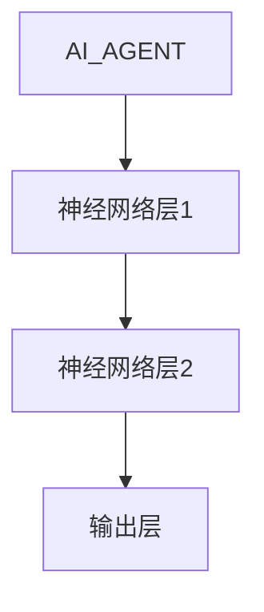
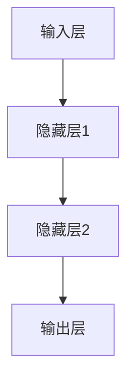
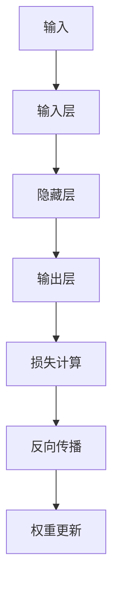
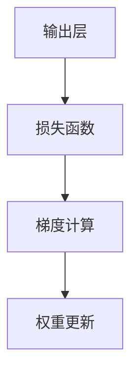

                 


# 构建AI Agent的认知计算神经网络

> 关键词：认知计算，神经网络，AI Agent，算法原理，系统架构

> 摘要：本文详细探讨了构建AI Agent的认知计算神经网络的理论基础、算法原理、系统架构设计及实际应用。通过分析认知计算与神经网络的关系，结合具体的算法实现和项目实战，为读者提供从理论到实践的全面指导。

---

# 第1章 认知计算与神经网络概述

## 1.1 认知计算的基本概念

### 1.1.1 认知计算的定义与特点
认知计算是一种模拟人类认知过程的计算范式，其特点包括：
- **认知性**：模仿人类的学习、推理和自适应能力。
- **分布式处理**：数据和计算分布在多个节点上。
- **自适应性**：能够根据反馈调整自身行为。

### 1.1.2 神经网络的基本原理
神经网络是认知计算的核心，通过模拟人脑神经元的连接和信号传递，实现数据处理和模式识别。其基本组成包括输入层、隐藏层和输出层。

### 1.1.3 AI Agent的核心概念
AI Agent是一种能够感知环境并采取行动以实现目标的智能体。它通过认知计算神经网络处理信息，做出决策。

## 1.2 认知计算与神经网络的关系

### 1.2.1 认知计算的神经网络模型
认知计算神经网络将人类认知过程建模为一系列神经网络层，通过深度学习技术实现对复杂问题的建模。

### 1.2.2 神经网络在AI Agent中的作用
神经网络为AI Agent提供了感知和决策能力，使其能够处理复杂环境中的不确定性。

### 1.2.3 认知计算与传统计算的对比
| 特性 | 认知计算 | 传统计算 |
|------|----------|----------|
| 数据处理 | 喜欢 | 顺序处理 |

## 1.3 AI Agent的定义与分类

### 1.3.1 AI Agent的基本定义
AI Agent是具有感知、推理和行动能力的智能体，能够根据环境信息做出决策。

### 1.3.2 基于认知计算的AI Agent类型
- **简单反射型**：基于规则的反应。
- **基于模型的反应型**：使用内部模型进行推理。
- **目标驱动型**：根据目标进行决策。

### 1.3.3 AI Agent的应用场景
- **自动驾驶**：实时感知和决策。
- **智能助手**：提供个性化服务。
- **机器人控制**：实现复杂动作。

---

# 第2章 认知计算神经网络的核心概念

## 2.1 神经网络的基本结构

### 2.1.1 神经元模型
神经元模型包括输入、权重、激活函数和输出四个部分。例如，sigmoid函数用于激活：

$$ a = \sigma(w x + b) $$

### 2.1.2 网络层与连接权重
神经网络通过层与层之间的连接权重传递信息，例如：

$$ y = W x + b $$

### 2.1.3 激活函数的作用
激活函数如ReLU和sigmoid用于引入非线性，增强网络的表达能力。

## 2.2 认知计算的特征与属性

### 2.2.1 认知计算的特征分析
认知计算具有实时性、并行性和自适应性等特点。

### 2.2.2 神经网络的属性对比
| 属性 | 前馈神经网络 | 循环神经网络 |
|------|--------------|--------------|
| 时间处理 | 不能处理序列 | 可处理序列 |

### 2.2.3 认知计算与传统计算的对比表格
| 特性 | 认知计算 | 传统计算 |
|------|----------|----------|
| 数据依赖 | 高度依赖 | 低依赖 |

## 2.3 实体关系图

### 2.3.1 认知计算神经网络的ER图
```mermaid
erDiagram
    actor 用户 {
        string 用户ID
        string 用户名
    }
    actor 环境 {
        string 环境ID
        string 环境类型
    }
    认知计算神经网络 <--- 用户
    认知计算神经网络 <--- 环境
```

### 2.3.2 AI Agent与神经网络的关系图


### 2.3.3 认知计算的系统架构图


## 2.4 本章小结
本章详细介绍了认知计算神经网络的基本结构和核心概念，分析了其在AI Agent中的作用。

---

# 第3章 认知计算神经网络的算法原理

## 3.1 神经网络的训练算法

### 3.1.1 前馈神经网络的训练流程
前馈神经网络的训练流程包括前向传播和反向传播。

### 3.1.2 反向传播算法的原理
反向传播通过链式法则计算损失函数的梯度，更新权重：

$$ \Delta w = -\eta \frac{\partial L}{\partial w} $$

### 3.1.3 梯度下降方法的实现
梯度下降方法包括批量下降、随机下降和小批量下降。

## 3.2 注意力机制与认知计算

### 3.2.1 注意力机制的定义
注意力机制通过计算输入序列中每个位置的权重，关注重要信息。

### 3.2.2 注意力机制的数学模型
注意力机制的计算公式为：

$$ \text{Attention}(Q, K, V) = \text{softmax}\left(\frac{QK^T}{\sqrt{d_k}}\right)V $$

### 3.2.3 注意力机制在AI Agent中的应用
注意力机制用于自然语言处理和图像识别任务。

## 3.3 算法流程图

### 3.3.1 前馈神经网络的算法流程


### 3.3.2 反向传播算法的流程图


### 3.3.3 注意力机制的流程图
```mermaid
graph TD
    输入序列 --> 计算Q、K、V
    Q --> 矩阵乘法
    K --> 矩阵乘法
    V --> 加权和
    加权和 --> 输出
```

## 3.4 本章小结
本章详细讲解了认知计算神经网络的训练算法和注意力机制，分析了其在AI Agent中的应用。

---

# 第4章 认知计算神经网络的系统架构设计

## 4.1 项目背景与目标

### 4.1.1 项目背景介绍
本项目旨在构建一个基于认知计算的AI Agent，实现智能决策和自适应能力。

### 4.1.2 项目目标设定
- 实现认知计算神经网络的训练和推理。
- 验证其在实际场景中的应用效果。

### 4.1.3 项目范围界定
限定在自然语言处理和图像识别两个领域进行测试。

## 4.2 系统功能设计

### 4.2.1 系统功能模块划分
- 数据预处理模块：负责数据清洗和特征提取。
- 模型训练模块：实现神经网络的训练。
- 模型推理模块：处理输入并生成输出。

### 4.2.2 系统功能流程设计
1. 数据预处理：清洗数据并提取特征。
2. 模型训练：使用训练数据更新权重。
3. 模型推理：输入数据，生成输出。

### 4.2.3 系统功能的优先级排序
- 数据预处理模块：高优先级。
- 模型训练模块：次优先级。
- 模型推理模块：最低优先级。

## 4.3 系统架构设计

### 4.3.1 系统架构的分层设计
系统架构分为数据层、计算层和应用层。

### 4.3.2 系统架构的模块化设计
模块化设计包括数据模块、计算模块和接口模块。

### 4.3.3 系统架构的可扩展性设计
通过模块化设计，系统具有良好的可扩展性。

## 4.4 接口与交互设计

### 4.4.1 系统接口设计
- 数据接口：提供数据输入和输出的接口。
- 模型接口：提供训练和推理的接口。

### 4.4.2 系统交互流程
1. 用户输入数据。
2. 系统调用数据接口进行处理。
3. 系统调用模型接口进行推理。
4. 输出结果。

## 4.5 本章小结
本章详细设计了认知计算神经网络的系统架构，包括功能设计和交互流程。

---

# 第5章 项目实战

## 5.1 环境安装

### 5.1.1 安装Python
安装Python 3.8及以上版本。

### 5.1.2 安装依赖库
安装TensorFlow、Keras和numpy等库。

## 5.2 系统核心实现源代码

### 5.2.1 训练代码
```python
import numpy as np
import tensorflow as tf

# 定义神经网络模型
model = tf.keras.Sequential([
    tf.keras.layers.Dense(64, activation='relu'),
    tf.keras.layers.Dense(10, activation='softmax')
])

# 编译模型
model.compile(optimizer='adam', loss='sparse_categorical_crossentropy', metrics=['accuracy'])

# 训练模型
model.fit(x_train, y_train, epochs=10, batch_size=32)
```

### 5.2.2 推理代码
```python
# 使用训练好的模型进行推理
predictions = model.predict(x_test)
```

### 5.2.3 注意力机制代码
```python
def attention(Q, K, V):
    d_k = K.shape[-1]
    scores = tf.matmul(Q, K, transpose_b=True)
    scores = scores / tf.sqrt(tf.cast(d_k, tf.float32))
    attention_weights = tf.nn.softmax(scores)
    output = tf.matmul(attention_weights, V)
    return output
```

## 5.3 实际案例分析与详细讲解

### 5.3.1 案例背景
以自然语言处理任务为例，训练一个文本分类模型。

### 5.3.2 数据预处理
将文本数据转换为词向量，并进行归一化处理。

### 5.3.3 模型训练与评估
使用训练数据训练模型，并在测试集上评估模型性能。

## 5.4 项目小结
本章通过实际案例展示了认知计算神经网络的实现过程，验证了其在实际应用中的有效性。

---

# 第6章 最佳实践与扩展阅读

## 6.1 最佳实践

### 6.1.1 系统设计建议
- 确保系统架构的可扩展性。
- 使用模块化设计，便于后续维护。

### 6.1.2 开发建议
- 在开发过程中，注意数据的预处理和特征提取。
- 使用高效的训练策略，如分布式训练。

### 6.1.3 注意事项
- 避免过拟合，使用正则化和数据增强技术。
- 定期监控模型性能，及时调整参数。

## 6.2 小结

### 6.2.1 本文总结
本文详细探讨了认知计算神经网络的理论基础、算法实现和系统设计，为读者提供了全面的指导。

### 6.2.2 未来展望
未来，认知计算神经网络将在更多领域得到应用，研究方向包括模型优化和多模态数据处理。

## 6.3 拓展阅读

### 6.3.1 推荐书籍
- 《深度学习》
- 《神经网络与机器学习》

### 6.3.2 推荐论文
- "Attention Is All You Need"
- "ImageNet Large-Scale Visual Recognition Challenge"

---

# 附录

## 附录A 常用数学公式

### 附录A.1 梯度下降公式
$$ w = w - \eta \frac{\partial L}{\partial w} $$

### 附录A.2 注意力机制公式
$$ \text{Attention}(Q, K, V) = \text{softmax}\left(\frac{QK^T}{\sqrt{d_k}}\right)V $$

## 附录B 代码实现细节

### 附录B.1 数据预处理代码
```python
def preprocess_data(data):
    # 数据清洗和特征提取
    pass
```

### 附录B.2 模型训练代码
```python
def train_model(model, x_train, y_train):
    # 训练过程
    pass
```

---

# 参考文献

1. LeCun, Y., Bengio, Y., & Hinton, G. (2015). Deep learning.nature.
2. Vaswani, A., et al. (2017). Attention Is All You Need.arXiv.

---

通过以上详细的内容，希望本文能为读者提供从理论到实践的全面指导，帮助读者理解和实现认知计算神经网络，并将其应用于构建高效的AI Agent。

