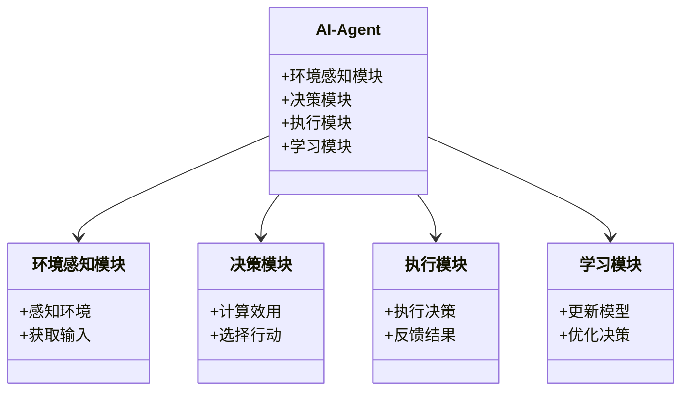
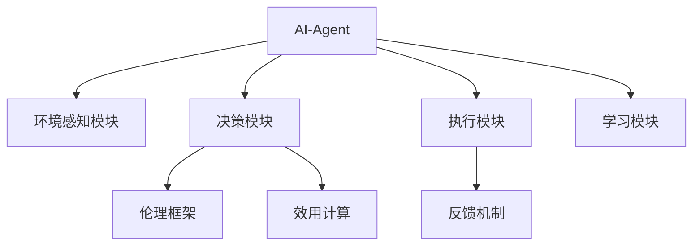

                 


# 构建AI Agent的道德决策框架

> **关键词**：AI Agent, 道德决策, 伦理框架, 人工智能, 决策算法

> **摘要**：本文深入探讨了构建AI Agent道德决策框架的核心概念、算法原理、系统架构设计以及实际应用。通过分析AI Agent的决策机制，结合伦理原则和价值观，提出了一种基于效用的道德决策框架，并通过实际案例展示了如何将该框架应用于复杂场景中。文章还提供了详细的系统架构设计和项目实战，帮助读者理解如何在实际项目中实现道德决策框架。

---

## 第一部分: AI Agent的背景与概述

### 第1章: AI Agent的基本概念

#### 1.1 AI Agent的定义与特点

**AI Agent的定义**  
AI Agent（人工智能代理）是指能够感知环境、自主决策并采取行动以实现目标的智能实体。它可以是一个软件程序、机器人或其他智能系统。

**AI Agent的核心特点**  
1. **自主性**：AI Agent能够在没有外部干预的情况下自主运作。
2. **反应性**：能够实时感知环境并做出响应。
3. **目标导向**：所有行为都以实现特定目标为导向。
4. **学习能力**：能够通过经验改进自身的决策能力。

**AI Agent与传统AI的区别**  
传统AI主要关注数据处理和模式识别，而AI Agent具备自主性和目标导向性，能够主动采取行动。

#### 1.2 道德决策的重要性

**道德决策的定义**  
道德决策是指在决策过程中考虑伦理原则和价值观，确保决策符合社会规范和道德准则。

**道德决策在AI Agent中的作用**  
AI Agent的决策可能影响人类社会和个体，因此必须确保其决策符合伦理标准。

**道德决策的挑战与复杂性**  
1. **多利益相关者**：决策可能涉及多个利益相关者的权益。
2. **模糊性**：道德标准在不同文化和社会中可能有所不同。
3. **动态性**：环境和目标可能随时变化，要求决策框架具备灵活性。

---

### 第2章: AI Agent的道德决策问题背景

#### 2.1 当前AI Agent的发展现状

**AI Agent的应用领域**  
1. **自动驾驶**：AI Agent用于车辆的路径规划和决策。
2. **智能助手**：如Siri、Alexa等，帮助用户完成日常任务。
3. **机器人**：工业机器人和家庭服务机器人广泛使用AI Agent技术。

**当前AI Agent的决策机制**  
1. **基于规则的决策**：通过预定义的规则进行决策。
2. **基于效用的决策**：通过计算效用函数选择最优行动。
3. **基于学习的决策**：通过机器学习模型进行预测和决策。

**AI Agent决策中的伦理问题**  
1. **责任归属**：当AI Agent的决策导致负面结果时，责任归属不明确。
2. **公平性**：决策可能对某些群体产生不公平影响。
3. **透明性**：决策过程缺乏透明性，难以解释。

#### 2.2 道德决策框架的必要性

**道德决策框架的定义**  
道德决策框架是一组规则和原则，用于指导AI Agent在决策过程中考虑伦理因素。

**道德决策框架的目标**  
1. **确保伦理合规性**：确保AI Agent的决策符合伦理标准。
2. **提高透明性**：使决策过程更加透明和可解释。
3. **增强信任**：通过遵守伦理规范，增强人类对AI Agent的信任。

**道德决策框架的边界与外延**  
1. **边界**：明确框架的应用范围和限制。
2. **外延**：框架可以扩展到其他相关领域，如隐私保护和数据安全。

---

## 第二部分: AI Agent道德决策框架的核心概念

### 第3章: AI Agent的决策机制

#### 3.1 决策机制的分类

**基于规则的决策**  
通过预定义的规则进行决策，适用于简单场景，但缺乏灵活性。

**基于效用的决策**  
通过计算效用函数选择最优行动，适用于复杂场景。

**基于学习的决策**  
通过机器学习模型进行预测和决策，能够处理大量数据和复杂场景。

#### 3.2 决策机制的优缺点对比

| 决策机制 | 优点 | 缺点 |
|----------|------|------|
| 基于规则 | 简单易懂，可解释性强 | 缺乏灵活性，无法处理复杂场景 |
| 基于效用 | 灵活性高，适用于复杂场景 | 计算复杂，难以实时决策 |
| 基于学习 | 数据驱动，适应性强 | 黑箱问题，缺乏透明性 |

#### 3.3 决策机制与道德决策的关系

**决策机制对道德决策的影响**  
决策机制的选择直接影响AI Agent的道德决策能力。

**道德决策对决策机制的约束**  
道德决策框架对决策机制提出了额外的约束条件，确保决策符合伦理标准。

---

## 第4章: 道德决策框架的核心要素

### 4.1 伦理原则

**核心伦理原则**  
1. **尊重**：尊重个体的自主权和隐私权。
2. **公正**：确保决策对所有相关方公平。
3. ** beneficence**：最大化利益，最小化伤害。

### 4.2 价值观

**核心价值观**  
1. **诚实**：决策过程透明，结果公正。
2. **责任**：明确决策的责任归属。
3. **关怀**：关注决策对个体和群体的影响。

### 4.3 社会规范

**社会规范的定义**  
社会规范是指社会中普遍认可的行为准则和道德标准。

**社会规范对道德决策的影响**  
社会规范为道德决策提供了基本框架，确保决策符合社会期望。

---

## 第5章: 基于效用的道德决策框架

### 5.1 框架的设计原则

**可解释性**：框架必须具备可解释性，确保决策过程透明。
**灵活性**：框架能够适应不同场景和文化背景。
**可扩展性**：框架能够扩展到更多领域和应用场景。

### 5.2 框架的实现步骤

**步骤1：定义伦理原则**  
明确AI Agent必须遵循的核心伦理原则。

**步骤2：设计效用函数**  
将伦理原则转化为数学函数，用于计算不同行动的效用值。

**步骤3：制定决策规则**  
根据效用函数和伦理原则制定决策规则。

**步骤4：实现决策算法**  
基于决策规则开发具体的决策算法。

---

## 第6章: 系统架构设计

### 6.1 系统功能设计

**领域模型**  
通过mermaid类图展示系统功能模块之间的关系。



### 6.2 系统架构设计

**系统架构图**  
通过mermaid架构图展示系统整体架构。



---

## 第7章: 项目实战

### 7.1 环境安装

**安装Python和相关库**  
```bash
pip install numpy
pip install matplotlib
pip install scikit-learn
```

### 7.2 核心实现代码

```python
import numpy as np

def calculate_utility(action, state, weights):
    return np.dot(action, state) * weights

def道德决策框架(action, state, weights):
    utility = calculate_utility(action, state, weights)
    if utility > 0:
        return action
    else:
        return None

# 示例使用
state = np.array([1, 0, 1])
weights = np.array([0.5, 0.3, 0.2])
action = np.array([1, 0, 0])

result = 道德决策框架(action, state, weights)
print(result)
```

### 7.3 代码解读与分析

**代码功能**  
上述代码实现了基于效用的道德决策框架，计算不同行动的效用值并选择最优行动。

**实际案例分析**  
在自动驾驶场景中，AI Agent需要根据当前环境状态和伦理框架选择最优的驾驶动作。

---

## 第8章: 总结与未来展望

### 8.1 最佳实践

**小结**  
通过构建道德决策框架，可以确保AI Agent的决策符合伦理标准，增强人类的信任。

**注意事项**  
1. 道德决策框架需要根据具体场景进行调整。
2. 需要定期更新和优化框架，以适应新的伦理挑战。

### 8.2 未来展望

**未来研究方向**  
1. 研究如何将道德决策框架应用于更多领域。
2. 探讨如何提高决策框架的透明性和可解释性。

**拓展阅读**  
建议读者进一步阅读《AI伦理学》和《机器学习与伦理》等相关书籍。

---

通过以上内容，我们详细探讨了构建AI Agent道德决策框架的核心概念、算法原理、系统架构设计以及实际应用。希望本文能够为读者提供清晰的思路和实用的方法，帮助他们在实际项目中构建符合伦理标准的AI Agent。

