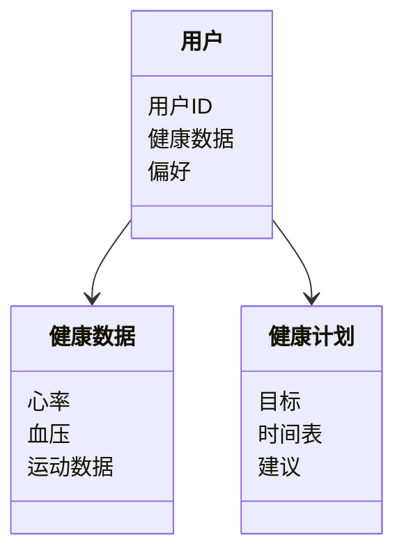

                 


# 构建AI Agent驱动的智能健康管理系统

## 关键词：AI Agent，智能健康管理系统，多智能体系统，强化学习，知识图谱，对话系统

## 摘要：  
随着人工智能技术的快速发展，AI Agent（人工智能代理）在智能健康管理系统中的应用越来越广泛。本文将详细探讨如何构建一个基于AI Agent的智能健康管理系统，涵盖系统背景、核心概念、算法原理、系统架构设计、项目实战以及最佳实践等内容。通过逐步分析，我们将揭示AI Agent在健康管理系统中的核心作用，以及如何通过技术手段实现个性化的健康管理服务。

---

# 第一部分: 背景介绍与核心概念

## 第1章: AI Agent驱动的智能健康管理系统概述

### 1.1 问题背景与描述
#### 1.1.1 当前健康管理系统的主要问题
传统的健康管理系统存在以下问题：
- 数据分散：健康数据（如心率、血压、运动数据等）分布在不同的设备和平台中，难以统一管理。
- 用户体验差：用户需要在多个应用程序之间切换，操作繁琐，难以获得个性化的健康建议。
- 缺乏智能化：系统缺乏主动学习和决策能力，无法根据用户的实时数据提供动态的健康建议。

#### 1.1.2 AI Agent在健康管理系统中的作用
AI Agent（人工智能代理）是一种能够感知环境、主动决策并执行任务的智能实体。在健康管理系统中，AI Agent可以：
- 整合多源数据，提供统一的健康视图。
- 根据用户行为和生理数据，主动提供健康建议。
- 学习用户的健康习惯，优化推荐策略。

#### 1.1.3 智能健康管理系统的目标与边界
目标：
- 提供个性化的健康管理服务。
- 实现多设备数据的无缝集成。
- 提供实时健康监测和智能建议。

边界：
- 仅关注用户的健康数据和行为，不涉及医疗诊断。
- 不处理用户的隐私数据，仅提供健康建议。

---

### 1.2 核心概念与系统组成
#### 1.2.1 AI Agent的基本概念
AI Agent是一种能够感知环境、主动决策并执行任务的智能实体。它可以分为两类：
- **反应式AI Agent**：基于当前感知做出决策，适用于实时任务（如实时健康监测）。
- **认知式AI Agent**：具有目标设定、规划和学习能力，适用于长期健康管理任务。

#### 1.2.2 智能健康管理系统的组成要素
智能健康管理系统由以下几个部分组成：
- **用户界面**：用户与系统交互的界面，包括移动应用、网页等。
- **数据采集模块**：从各种设备（如智能手表、心率监测器）获取健康数据。
- **AI Agent**：负责数据处理、健康评估和建议生成。
- **知识库**：包含健康知识、用户健康档案等。
- **执行模块**：根据AI Agent的建议，执行健康计划（如提醒用户运动）。

#### 1.2.3 系统的核心功能与应用场景
核心功能：
- 数据整合与分析。
- 个性化健康评估。
- 智能健康建议。
- 健康计划执行与反馈。

应用场景：
- 个人健康管理：帮助用户制定个性化的健康计划。
- 健康监测：实时监测用户的健康状况，及时预警异常情况。
- 健康教育：为用户提供健康知识和建议。

---

## 第2章: AI Agent与智能健康管理系统的关联

### 2.1 AI Agent的核心原理与技术
#### 2.1.1 多智能体系统
多智能体系统是指由多个智能体协作完成任务的系统。在智能健康管理系统中，多个AI Agent可以分别负责不同的任务，例如：
- 数据采集AI Agent：负责从设备获取健康数据。
- 数据分析AI Agent：负责对数据进行处理和分析。
- 健康建议AI Agent：根据分析结果生成健康建议。

#### 2.1.2 基于知识图谱的对话系统
知识图谱是一种结构化的知识表示形式，可以用于构建智能对话系统。在健康管理系统中，AI Agent可以通过知识图谱理解用户的健康问题，并提供准确的建议。

---

### 2.2 系统架构与功能模块
#### 2.2.1 系统整体架构
智能健康管理系统的整体架构可以分为以下几个部分：
- **数据采集层**：从各种设备采集健康数据。
- **数据处理层**：对数据进行清洗、分析和建模。
- **AI Agent层**：负责数据处理和健康建议生成。
- **用户界面层**：与用户交互，展示健康数据和建议。

#### 2.2.2 功能模块划分
功能模块包括：
- **健康数据管理**：负责数据的存储和管理。
- **健康评估**：根据数据生成健康报告。
- **健康建议生成**：基于健康评估结果生成个性化建议。
- **健康计划执行**：根据建议生成行动计划，并执行。

---

## 第3章: 算法原理与实现

### 3.1 强化学习算法
#### 3.1.1 强化学习的基本原理
强化学习是一种通过试错学习的方法，AI Agent通过与环境交互，学习最优策略。在健康管理系统中，强化学习可以用于个性化健康计划的生成。

#### 3.1.2 强化学习的应用场景
- 健康计划优化：AI Agent通过强化学习不断优化健康计划，以达到最佳效果。
- 行为激励：通过奖励机制激励用户完成健康目标。

#### 3.1.3 强化学习算法实现
以下是一个简单的强化学习算法实现示例：
```python
class AI-Agent:
    def __init__(self):
        self.state = 0  # 当前状态
        self.reward = 0  # 奖励

    def act(self, action):
        # 根据动作更新状态
        self.state += action
        # 返回奖励
        return self.reward
```

---

## 第4章: 系统分析与架构设计

### 4.1 系统功能设计
#### 4.1.1 领域模型设计
领域模型是系统功能的核心，以下是健康管理系统的主要领域模型：


#### 4.1.2 系统架构设计
系统架构设计可以采用分层架构：


---

## 第5章: 项目实战

### 5.1 环境安装与配置
为了运行AI Agent驱动的智能健康管理系统，需要安装以下工具：
- Python 3.8+
- TensorFlow 2.0+
- Flask 2.0+

安装命令：
```bash
pip install python tensorflow flask
```

### 5.2 核心功能实现
以下是AI Agent的核心功能实现示例：
```python
import tensorflow as tf
from tensorflow.keras import layers

class AI-Agent(tf.keras.Model):
    def __init__(self):
        super(AI-Agent, self).__init__()
        self.dense1 = layers.Dense(64, activation='relu')
        self.dense2 = layers.Dense(1, activation='sigmoid')

    def call(self, inputs):
        x = self.dense1(inputs)
        return self.dense2(x)
```

---

## 第6章: 总结与建议

### 6.1 最佳实践
- 定期更新知识库，保持系统的准确性。
- 优化AI Agent的算法，提高系统的智能化水平。
- 确保系统的安全性，保护用户的隐私数据。

### 6.2 小结
本文详细探讨了如何构建AI Agent驱动的智能健康管理系统，从系统背景到算法实现，再到项目实战，全面分析了系统的构建过程。

### 6.3 注意事项
- 在实际应用中，需要考虑数据隐私和安全问题。
- 系统的可扩展性设计需要充分考虑未来的功能扩展。

### 6.4 拓展阅读
- 《强化学习入门》
- 《知识图谱与智能对话系统》
- 《系统架构设计实战》

---

通过本文的分析和讲解，读者可以系统地了解AI Agent驱动的智能健康管理系统的构建过程，并能够实际应用相关技术进行开发。

