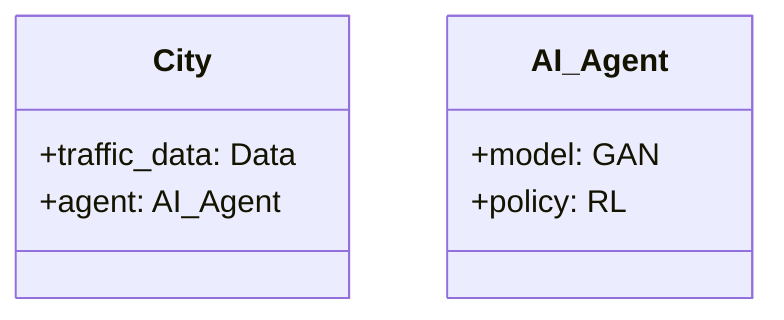
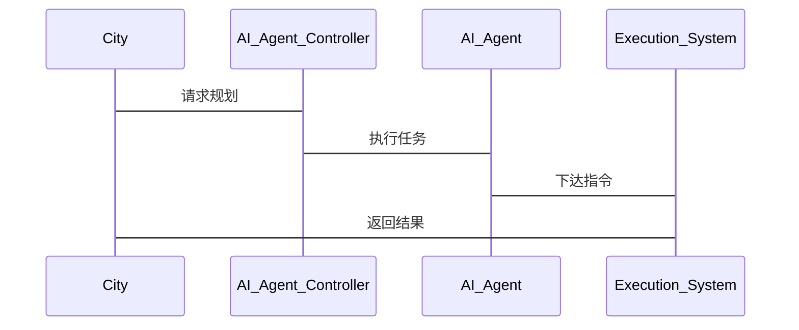

                 


# 构建AI Agent驱动的智能城市规划系统

## 关键词：AI Agent, 智能城市, 城市规划, 生成对抗网络, 强化学习, 系统架构

## 摘要：  
随着城市化进程的加快，城市规划面临着越来越复杂的挑战。AI Agent技术作为一种新兴的技术手段，为智能城市规划提供了新的思路。本文将从AI Agent的基本原理出发，探讨其在城市规划中的应用，并通过算法原理、系统架构设计和项目实战，详细分析如何构建一个高效的AI Agent驱动的智能城市规划系统。

---

## 第一部分: AI Agent驱动的智能城市规划系统背景与概念

### 第1章: 智慧城市建设与AI Agent的结合

#### 1.1 智慧城市建设的背景与目标
##### 1.1.1 智慧城市的定义与发展历程
智慧城市是通过运用先进的信息技术，将城市的各个系统和资源进行整合，以实现城市运行的智能化、高效化和可持续化。智慧城市建设经历了从简单自动化到全面数字化的演变过程，目前正向智能化方向迈进。

##### 1.1.2 智慧城市建设的核心目标
智慧城市建设的核心目标包括提高城市运行效率、优化资源配置、提升居民生活质量、降低环境污染以及增强城市抗风险能力。

##### 1.1.3 智慧城市建设的现状与挑战
目前，智慧城市建设在交通、能源、医疗等领域取得了显著进展，但仍面临数据孤岛、系统集成复杂、决策滞后等问题。AI Agent技术的引入为解决这些问题提供了新的可能性。

#### 1.2 AI Agent在智能城市规划中的作用
##### 1.2.1 AI Agent的基本概念与特点
AI Agent是一种能够感知环境、自主决策并执行任务的智能实体。它具有自主性、反应性、目标导向性和社会性等特点。

##### 1.2.2 AI Agent在城市规划中的应用场景
AI Agent可以应用于城市交通优化、土地利用规划、环境保护评估、公共设施部署等领域。

##### 1.2.3 AI Agent驱动城市规划的优势
AI Agent能够通过实时数据感知城市状态，利用强化学习等算法优化城市资源配置，实现动态调整和智能决策。

#### 1.3 本章小结
本章介绍了智慧城市建设的背景、目标及现状，并重点阐述了AI Agent在城市规划中的作用和优势。

---

## 第二部分: AI Agent驱动智能城市规划的核心概念

### 第2章: AI Agent的基本原理

#### 2.1 AI Agent的定义与分类
AI Agent可以根据智能水平分为反应式和认知式；根据应用场景分为服务式、监控式和协作式。

#### 2.2 AI Agent的核心功能模块
AI Agent的功能模块包括感知模块、决策模块、执行模块和学习模块。

#### 2.3 AI Agent的决策机制
决策机制包括基于规则的决策、基于知识的决策和基于学习的决策。

### 第3章: 智能城市规划的系统架构

#### 3.1 智能城市规划的层次结构
智能城市规划可以分为数据层、模型层、决策层和执行层。

#### 3.2 智能城市规划的核心要素
核心要素包括城市数据、规划模型、AI Agent和执行系统。

#### 3.3 AI Agent与城市规划的关系
AI Agent作为智能城市规划的核心驱动力，通过实时数据感知和智能决策优化城市规划过程。

---

## 第三部分: AI Agent驱动智能城市规划的算法原理

### 第4章: AI Agent的核心算法

#### 4.1 生成对抗网络（GAN）的原理
生成对抗网络通过生成器和判别器的对抗训练，实现数据的生成和优化。

#### 4.2 强化学习（RL）的原理
强化学习通过智能体与环境的交互，学习最优策略以最大化累积奖励。

#### 4.3 联合学习（Federated Learning）的原理
联合学习通过分布式数据源的协作，保护数据隐私的同时实现模型训练。

### 第5章: 算法的数学模型与公式

#### 5.1 GAN的数学模型
$$ G(z) = D(x) $$

#### 5.2 RL的数学模型
$$ R(s, a) $$

#### 5.3 Federated Learning的数学模型
$$ \theta_{i} \leftarrow \theta_{i} - \eta \nabla L_{i}(\theta_{i}) $$

### 第6章: 算法实现与案例分析

#### 6.1 GAN的实现代码
```python
def generator(z):
    # generator network
def discriminator(x):
    # discriminator network
```

#### 6.2 RL的实现代码
```python
def policy_network(x):
    # policy network
def value_network(x):
    # value network
```

---

## 第四部分: 系统分析与架构设计方案

### 第7章: 项目背景与系统功能设计

#### 7.1 项目背景
本项目旨在通过AI Agent技术优化城市交通系统。

#### 7.2 系统功能设计
系统功能包括交通流量预测、路径优化和资源分配。

#### 7.3 领域模型（Mermaid类图）


### 第8章: 系统架构设计

#### 8.1 系统架构图（Mermaid架构图）
```mermaid
container City_Planning_System {
    City_Data_Broker
    AI_Agent_Controller
    Execution_System
}
```

#### 8.2 系统接口设计
系统接口包括数据接口、模型接口和执行接口。

#### 8.3 系统交互流程（Mermaid序列图）


---

## 第五部分: 项目实战

### 第9章: 环境安装与系统实现

#### 9.1 环境安装
安装Python、TensorFlow、Keras等开发环境。

#### 9.2 核心代码实现
实现AI Agent的核心算法，包括GAN和RL的代码。

#### 9.3 代码应用解读
解读代码的功能和实现细节，展示AI Agent如何优化城市规划。

### 第10章: 案例分析与经验总结

#### 10.1 案例分析
以城市交通优化为例，展示AI Agent的规划效果。

#### 10.2 经验总结
总结项目实施过程中的经验和教训，提出改进建议。

---

## 第六部分: 总结与展望

### 第11章: 总结与展望

#### 11.1 本文总结
本文详细阐述了AI Agent在智能城市规划中的应用，介绍了相关算法和系统架构。

#### 11.2 当前挑战
当前主要挑战包括数据隐私、模型鲁棒性和系统集成复杂性。

#### 11.3 未来展望
未来，随着AI技术的不断发展，AI Agent在智能城市规划中的应用将更加广泛和深入。

---

## 第七部分: 最佳实践与小结

### 12.1 最佳实践
建议在实际应用中注重数据质量、模型可解释性和系统可扩展性。

### 12.2 本章小结
本章对全文进行了总结，并展望了AI Agent驱动智能城市规划的未来发展方向。

---

通过以上结构，我们可以系统地构建一个基于AI Agent的智能城市规划系统，为智慧城市建设提供有力的技术支持。

