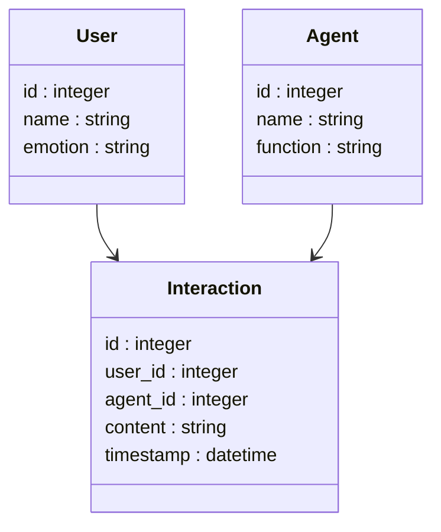
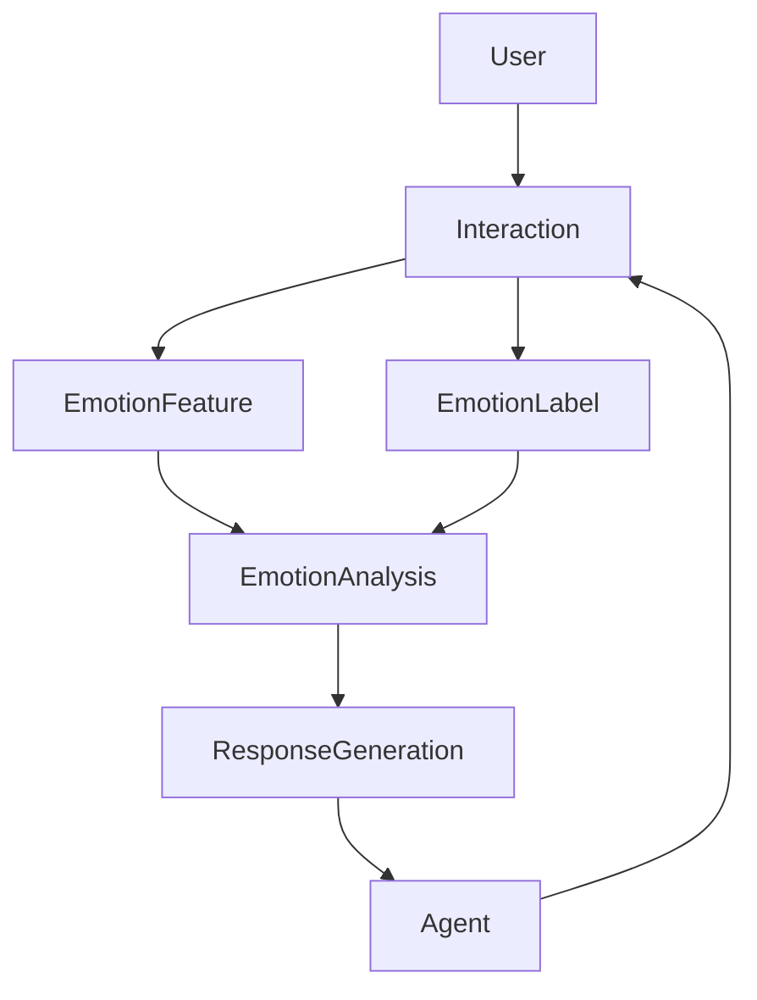
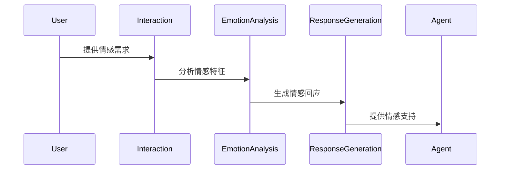

                 


# 构建AI Agent驱动的智能情感陪伴系统

> 关键词：AI Agent，情感陪伴，人机交互，自然语言处理，情感计算，系统架构

> 摘要：本文详细介绍了如何构建一个基于AI Agent的智能情感陪伴系统，从背景分析到系统设计，再到实际实现，全面阐述了该系统的构建过程。通过分析情感陪伴的需求，结合AI Agent的核心算法和系统架构设计，本文提供了从理论到实践的完整指导，帮助读者理解并实现一个能够提供情感支持的智能系统。

---

# 第1章：背景介绍

## 1.1 问题背景

### 1.1.1 当前人机交互的痛点
随着人工智能技术的快速发展，人机交互逐渐成为人们生活中不可或缺的一部分。然而，传统的交互方式往往局限于简单的命令执行或信息查询，无法满足用户的情感需求。例如，人们在孤独、焦虑或压力时，需要一个能够提供情感支持的伴侣。

### 1.1.2 情感陪伴的需求
现代人生活节奏快，压力大，情感陪伴的需求日益增长。许多人希望有一个能够理解他们情绪、提供情感支持的智能系统。这种需求不仅在家庭中存在，也在工作场所和社交场合中普遍存在。

### 1.1.3 AI Agent的潜力
AI Agent（智能体）是一种能够感知环境并自主决策的实体，具有广泛的应用潜力。通过结合自然语言处理和情感计算技术，AI Agent可以实现情感陪伴的核心功能，为用户提供个性化的情感支持。

---

## 1.2 问题描述

### 1.2.1 情感陪伴系统的定义
情感陪伴系统是一种能够理解和回应人类情感需求的智能系统，通过自然语言处理和情感计算技术，为用户提供情感支持和陪伴。

### 1.2.2 AI Agent的核心功能
AI Agent在情感陪伴系统中的核心功能包括：
1. **情感识别**：通过分析用户的语言和行为，识别用户的情感状态。
2. **情感回应**：根据识别到的情感状态，生成适当的回应，提供情感支持。
3. **学习与优化**：通过与用户的互动，不断优化情感识别和回应的能力。

### 1.2.3 系统的目标与边界
系统的目标是为用户提供个性化的情感支持，提升用户体验。系统的边界包括：
1. **用户输入**：用户通过文本或语音输入情感需求。
2. **系统输出**：系统通过文本或语音输出情感回应。
3. **数据范围**：仅处理与情感相关的信息，不涉及用户的隐私数据。

---

## 1.3 问题解决

### 1.3.1 AI Agent如何实现情感陪伴
AI Agent通过自然语言处理技术，解析用户的输入内容，识别情感特征，生成相应的回应。例如，当用户表达焦虑时，系统可以提供放松技巧或建议。

### 1.3.2 情感计算与自然语言处理的结合
情感计算通过分析文本中的情感特征，生成情感标签。自然语言处理技术则用于解析文本内容，结合情感计算的结果，生成合适的回应。

### 1.3.3 系统实现的关键技术
- **情感分析**：基于机器学习的情感分类算法。
- **自然语言理解**：基于深度学习的语义理解模型。
- **对话生成**：基于预训练语言模型的生成式对话系统。

---

## 1.4 核心要素与概念结构

### 1.4.1 情感计算的核心要素
- **情感特征提取**：从文本中提取情感相关特征。
- **情感分类**：将文本分类为不同的情感类别。
- **情感强度分析**：分析情感的强度或程度。

### 1.4.2 AI Agent的构成要素
- **感知模块**：通过传感器或输入接口感知环境。
- **决策模块**：基于感知信息做出决策。
- **执行模块**：执行决策结果，输出回应。

### 1.4.3 系统架构的核心组件
- **用户界面**：与用户进行交互的界面。
- **情感分析模块**：分析用户输入的情感特征。
- **对话生成模块**：生成情感回应。
- **学习模块**：优化系统性能。

---

## 1.5 本章小结
本章从背景分析入手，阐述了构建AI Agent驱动的智能情感陪伴系统的必要性和重要性。通过分析当前人机交互的痛点和情感陪伴的需求，提出了AI Agent在情感陪伴系统中的潜力和核心功能。

---

# 第2章：核心概念与联系

## 2.1 AI Agent的基本原理

### 2.1.1 AI Agent的定义与分类
AI Agent是一种能够感知环境并自主决策的智能实体，根据智能水平可以分为简单反射型、基于模型的反应型、目标驱动型和实用驱动型。

### 2.1.2 AI Agent的核心算法
- **基于规则的算法**：通过预定义规则进行决策。
- **基于机器学习的算法**：通过训练数据学习决策策略。
- **基于强化学习的算法**：通过奖励机制优化决策。

### 2.1.3 AI Agent的决策机制
AI Agent通过感知环境、分析信息、制定策略并执行动作来实现决策。

---

## 2.2 情感计算的核心原理

### 2.2.1 情感计算的定义与目标
情感计算是一种通过分析情感特征，理解和模拟人类情感状态的计算技术，目标是为人类提供更智能化的情感支持。

### 2.2.2 情感计算的关键技术
- **情感特征提取**：从文本中提取情感相关特征。
- **情感分类**：将文本分类为不同情感类别。
- **情感强度分析**：分析情感的强度或程度。

### 2.2.3 情感计算的应用场景
- **情感陪伴系统**：为用户提供情感支持。
- **情感健康监测**：监测用户的情感状态，提供健康建议。
- **情感化交互设计**：优化人机交互的情感体验。

---

## 2.3 核心概念对比分析

### 2.3.1 AI Agent与传统程序的对比
| 特性                | AI Agent                | 传统程序               |
|---------------------|-------------------------|------------------------|
| 智能性              | 高                     | 低                     |
| 自主性              | 高                     | 低                     |
| 适应性              | 高                     | 低                     |

### 2.3.2 情感计算与传统计算的对比
| 特性                | 情感计算                | 传统计算               |
|---------------------|-------------------------|------------------------|
| 计算目标            | 情感特征                | 信息处理               |
| 数据类型            | 文本、语音              | 结构化数据             |
| 处理方式            | 情感分析、语义理解       | 简单逻辑处理           |

### 2.3.3 情感陪伴系统的独特性
情感陪伴系统结合了AI Agent和情感计算的核心技术，能够实现情感识别、情感回应和情感学习，为用户提供个性化的情感支持。

---

## 2.4 实体关系图

```mermaid
erDiagram
    user {
        id : integer
        name : string
        emotion : string
    }
    agent {
        id : integer
        name : string
        function : string
    }
    interaction {
        id : integer
        user_id : integer
        agent_id : integer
        content : string
        timestamp : datetime
    }
    emotion_feature {
        id : integer
        feature : string
        weight : float
    }
    emotion_label {
        id : integer
        label : string
    }
    user "1..n" interaction
    agent "1..n" interaction
    interaction "1..n" emotion_feature
    interaction "1..n" emotion_label
```

---

## 2.5 本章小结
本章详细介绍了AI Agent和情感计算的核心概念，通过对比分析和实体关系图，展示了情感陪伴系统的独特性和系统架构的核心组件。

---

# 第3章：算法原理

## 3.1 情感分析算法

### 3.1.1 基于规则的算法
- **原理**：通过预定义规则，匹配文本中的情感关键词，生成情感标签。
- **优点**：简单易实现。
- **缺点**：规则难以覆盖所有情况。

### 3.1.2 基于机器学习的算法
- **原理**：通过训练数据，学习情感特征，分类器进行情感分类。
- **优点**：泛化能力强。
- **缺点**：需要大量标注数据。

### 3.1.3 基于深度学习的算法
- **原理**：使用预训练语言模型，如BERT，进行情感分类。
- **优点**：效果好，可扩展性强。
- **缺点**：计算资源消耗大。

### 3.1.4 情感分析流程图

```mermaid
graph TD
    A[开始] -> B[文本预处理]
    B -> C[特征提取]
    C -> D[情感分类]
    D -> E[结果输出]
    E -> F[结束]
```

### 3.1.5 情感分析的Python实现

```python
from sklearn.feature_extraction.text import TfidfVectorizer
from sklearn.svm import SVC

# 数据预处理
texts = ["I feel happy today", "I'm so sad"]
labels = [1, 0]

# 特征提取
vectorizer = TfidfVectorizer()
X = vectorizer.fit_transform(texts)

# 建立模型
model = SVC()
model.fit(X, labels)

# 预测
test_text = "I feel angry"
test_X = vectorizer.transform([test_text])
print(model.predict(test_X))
```

---

## 3.2 对话生成算法

### 3.2.1 基于规则的对话生成
- **原理**：通过预定义规则，生成标准化的回应。
- **优点**：简单易实现。
- **缺点**：缺乏灵活性。

### 3.2.2 基于模板的对话生成
- **原理**：通过填充模板生成对话内容。
- **优点**：灵活性高。
- **缺点**：生成内容可能不够自然。

### 3.2.3 基于预训练模型的对话生成
- **原理**：使用预训练语言模型，如GPT，生成对话内容。
- **优点**：生成内容自然，多样化。
- **缺点**：计算资源消耗大，生成内容可能偏离情感支持的核心目标。

### 3.2.4 对话生成流程图

```mermaid
graph TD
    A[开始] -> B[情感识别]
    B -> C[生成回应]
    C -> D[输出结果]
    D -> E[结束]
```

---

## 3.3 情感计算的数学模型

### 3.3.1 情感相似度计算
$$\text{相似度} = \frac{\sum_{i=1}^{n} w_i \cdot f_i}{\sqrt{\sum_{i=1}^{n} w_i^2} \cdot \sqrt{\sum_{i=1}^{n} f_i^2}}$$

其中，\( w_i \) 是情感特征的权重，\( f_i \) 是情感特征的值。

### 3.3.2 情感强度分析
$$\text{强度} = \sum_{i=1}^{n} w_i \cdot f_i$$

---

## 3.4 本章小结
本章详细介绍了情感分析和对话生成的核心算法，包括基于规则、机器学习和深度学习的实现方法，并通过流程图和Python代码示例，展示了算法的实现过程。

---

# 第4章：系统分析与架构设计

## 4.1 项目背景

### 4.1.1 项目目标
构建一个能够提供情感支持的智能系统，为用户提供个性化的陪伴服务。

### 4.1.2 项目范围
系统支持文本和语音输入，提供情感识别、情感回应和情感学习功能。

---

## 4.2 系统功能设计

### 4.2.1 领域模型



### 4.2.2 系统架构图



### 4.2.3 接口设计
- **输入接口**：文本或语音输入。
- **输出接口**：文本或语音输出。
- **数据接口**：情感特征和情感标签的存储与管理。

### 4.2.4 交互流程图



---

## 4.3 本章小结
本章通过系统分析和架构设计，展示了情感陪伴系统的实现过程，包括领域模型、系统架构图和交互流程图的设计。

---

# 第5章：项目实战

## 5.1 环境安装

### 5.1.1 安装Python
```bash
python --version
pip install --upgrade pip
```

### 5.1.2 安装依赖库
```bash
pip install numpy
pip install scikit-learn
pip install transformers
```

---

## 5.2 核心功能实现

### 5.2.1 情感分析实现
```python
from sklearn.feature_extraction.text import TfidfVectorizer
from sklearn.svm import SVC

# 数据预处理
texts = ["I feel happy today", "I'm so sad"]
labels = [1, 0]

# 特征提取
vectorizer = TfidfVectorizer()
X = vectorizer.fit_transform(texts)

# 建立模型
model = SVC()
model.fit(X, labels)

# 预测
test_text = "I feel angry"
test_X = vectorizer.transform([test_text])
print(model.predict(test_X))
```

### 5.2.2 对话生成实现
```python
from transformers import pipeline

# 初始化对话生成模型
response_generator = pipeline("text-generation", model="gpt2")

# 生成回应
test_text = "I feel lonely"
response = response_generator(test_text, max_length=50, num_return_sequences=1)
print(response[0]['generated_text'])
```

---

## 5.3 实际案例分析

### 5.3.1 案例1：孤独情绪的回应
用户输入： "I feel lonely"
系统回应： "I'm sorry to hear that you're feeling lonely. Would you like to talk about it?"

### 5.3.2 案例2：焦虑情绪的回应
用户输入： "I'm so anxious"
系统回应： "Anxiety can be overwhelming. Maybe some deep breathing exercises would help."

---

## 5.4 本章小结
本章通过项目实战，详细介绍了情感陪伴系统的实现过程，包括环境安装、核心功能实现和实际案例分析。

---

# 第6章：总结与最佳实践

## 6.1 总结

### 6.1.1 系统实现的关键点
- 情感分析的准确性
- 对话生成的自然性
- 系统的可扩展性

### 6.1.2 系统优化的方向
- 提高情感分析的准确率
- 优化对话生成的自然性
- 增强系统的可解释性

---

## 6.2 最佳实践

### 6.2.1 数据采集与处理
- 确保数据的多样性和代表性
- 处理数据中的噪声和偏差

### 6.2.2 系统设计与实现
- 模块化设计，便于维护和扩展
- 使用高效的算法和数据结构

### 6.2.3 测试与优化
- 进行充分的测试，确保系统的稳定性和可靠性
- 根据用户反馈不断优化系统性能

---

## 6.3 注意事项

### 6.3.1 数据隐私
确保用户数据的安全性和隐私性，遵守相关法律法规。

### 6.3.2 情感回应的适度性
系统的情感回应应适度，避免过度干预用户的情感状态。

### 6.3.3 模型的泛化能力
确保模型在不同场景下的泛化能力，避免因训练数据偏差导致的错误回应。

---

## 6.4 拓展阅读

### 6.4.1 推荐书籍
1. 《情感计算：理论与应用》
2. 《人工智能：一种现代的方法》

### 6.4.2 推荐论文
1. 情感计算领域的经典论文
2. 基于深度学习的情感分析研究

---

## 6.5 本章小结
本章总结了情感陪伴系统的实现过程，并提出了最佳实践建议，帮助读者在实际应用中优化系统性能，提升用户体验。

---

# 结语

通过本文的详细讲解，读者可以全面理解并掌握构建AI Agent驱动的智能情感陪伴系统的实现过程。从背景分析到系统设计，再到实际实现，本文为读者提供了从理论到实践的完整指导。希望本文能够为相关领域的研究和应用提供有价值的参考。

