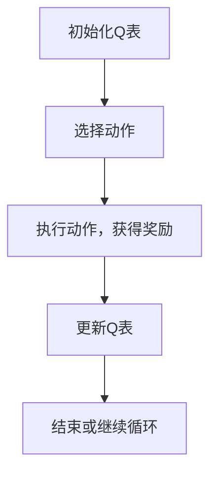
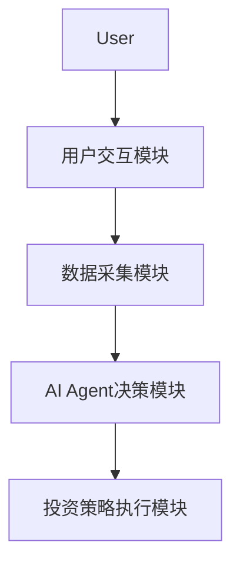
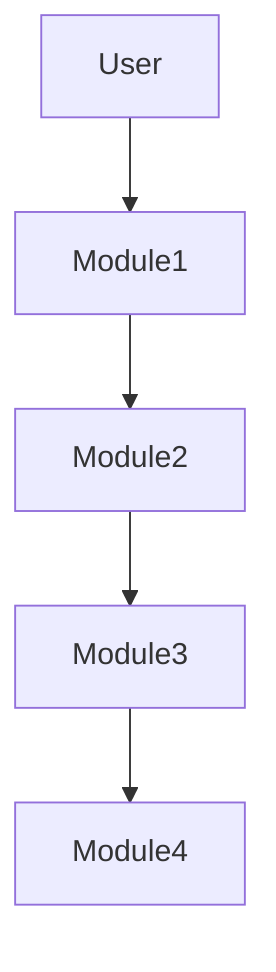

                 

# 构建AI Agent驱动的智能投资顾问

> 关键词：AI Agent, 智能投资顾问, 人工智能, 金融, 强化学习

> 摘要：本文详细探讨了构建AI Agent驱动的智能投资顾问系统的各个方面，从背景介绍、核心算法、系统架构到项目实战，结合实际案例和详细代码实现，为读者提供全面的技术指导。

---

## 第1章 AI Agent与智能投资顾问背景介绍

### 1.1 AI Agent的基本概念

AI Agent，即人工智能代理，是一种能够感知环境并采取行动以实现目标的智能实体。它具备以下核心特征：

1. **自主性**：能够在没有外部干预的情况下独立运作。
2. **反应性**：能够根据环境变化动态调整行为。
3. **目标导向**：通过目标驱动行动，追求最优解决方案。
4. **学习能力**：能够通过数据和经验不断优化自身性能。

AI Agent与传统软件的主要区别在于其智能化和自主性，能够处理复杂任务并做出决策。

### 1.2 智能投资顾问的定义与特点

智能投资顾问是利用AI技术提供个性化投资建议的金融工具，其特点包括：

1. **智能化**：通过AI算法分析市场数据和用户需求，提供个性化建议。
2. **实时性**：能够实时监控市场动态并做出快速反应。
3. **数据驱动**：依赖大数据分析和机器学习模型进行决策。

### 1.3 AI Agent在智能投资顾问中的应用背景

传统投资顾问行业存在效率低下、成本高昂等问题，而AI Agent的引入能够显著提升服务质量和降低成本。AI Agent在金融领域的应用现状包括智能投顾、风险管理等领域，其在智能投资顾问中的作用主要体现在数据处理、策略制定和实时反馈等方面。

---

## 第2章 AI Agent的核心算法

### 2.1 多智能体协作算法

多智能体协作算法通过多个智能体的协同工作来实现复杂任务。其基本实现机制包括通信、协商和协作，优缺点在于能够提高系统鲁棒性，但也面临通信开销和协调困难的问题。

### 2.2 强化学习算法

强化学习是一种通过试错机制优化决策的算法，Q-Learning和Deep Q-Networks是其典型实现。Q-Learning通过状态-动作-奖励机制更新Q值表，而Deep Q-Networks利用深度神经网络逼近最优策略。

以下为Q-Learning算法的流程图：

数学模型如下：

$$ Q(s, a) = Q(s, a) + \alpha [r + \max Q(s', a') - Q(s, a)] $$

### 2.3 知识图谱与推理算法

知识图谱通过构建结构化的知识网络，支持基于符号逻辑的推理。其在投资顾问中的应用包括风险评估和投资组合优化。

知识图谱的构建过程包括数据抽取、实体识别和关系抽取，其推理过程基于规则或学习模型。

---

## 第3章 智能投资顾问系统架构设计

### 3.1 系统模块划分

智能投资顾问系统主要包括用户交互、数据采集、AI Agent决策和投资策略执行四个模块。

### 3.2 系统功能设计

系统功能模块设计围绕用户需求展开，各模块间通过接口进行交互。功能模块包括用户身份验证、数据采集、策略生成和交易执行等。

### 3.3 系统架构图

以下是系统架构图：

### 3.4 接口设计与交互流程图

系统接口设计包括API定义和调用实现，交互流程图展示模块间的调用顺序。

交互流程图如下：

---

## 第4章 项目实战

### 4.1 项目环境安装

项目实战部分首先介绍开发工具和依赖库的安装，如Python、TensorFlow等。

### 4.2 系统核心实现

详细描述各模块的实现代码，包括用户交互、数据采集、AI Agent决策和策略执行模块。

### 4.3 代码应用解读与分析

解读代码结构，分析关键算法的实现细节，如强化学习模型的训练过程。

### 4.4 案例分析

通过具体案例分析，展示系统在实际投资中的应用效果和优化方向。

---

## 总结与展望

本文详细介绍了构建AI Agent驱动的智能投资顾问系统的各个方面，从背景到算法实现，再到系统架构和项目实战，为读者提供了全面的技术指导。未来，随着AI技术的不断发展，智能投资顾问将更加智能化和个性化，为金融行业带来更大的变革。

