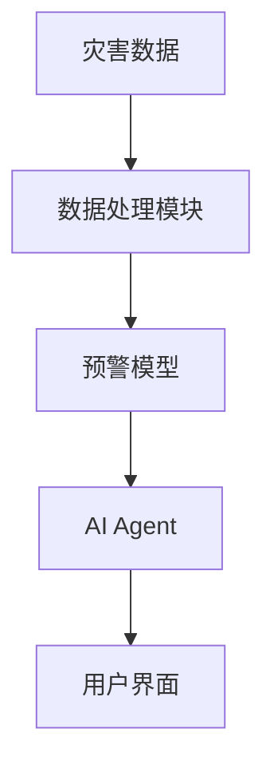
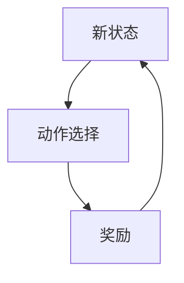
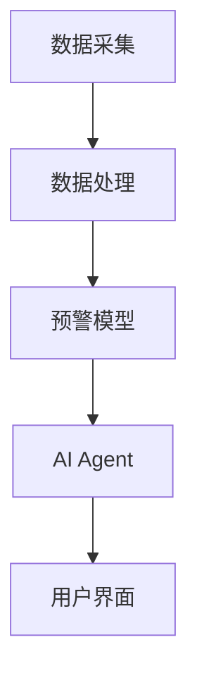

                 


# 构建AI Agent驱动的智能灾害预警系统

> 关键词：AI Agent, 灾害预警, 智能系统, 数据分析, 自然灾害

> 摘要：本文详细探讨了构建AI Agent驱动的智能灾害预警系统的各个方面，包括背景分析、核心概念、算法原理、系统架构设计以及项目实战。通过结合强化学习算法和系统架构设计，提出了一种高效的智能灾害预警解决方案，为实际应用提供了理论依据和实践指导。

---

## 第一部分: 背景与问题描述

### 第1章: 灾害预警系统的现状与挑战

#### 1.1 灾害预警的核心问题
- 灾害的突发性和不可预测性
- 数据的实时性和准确性
- 预警系统的智能化需求

#### 1.2 当前灾害预警系统的局限性
- 数据处理能力有限
- 预警模型的静态性和单一性
- 用户反馈机制的缺失

#### 1.3 AI Agent在灾害预警中的潜力
- 实时数据处理与分析
- 智能决策与自动化响应
- 用户个性化需求的满足

### 1.2 AI Agent的基本概念与特点

#### 1.2.1 AI Agent的定义
AI Agent（智能体）是指在计算机系统中，能够感知环境并采取行动以实现目标的实体。

#### 1.2.2 AI Agent的核心特征
| 特征 | 描述 |
|------|------|
| 智能性 | 能够理解、学习和推理 |
| 反应性 | 能够实时响应环境变化 |
| 自主性 | 能够独立决策和行动 |
| 社交性 | 能够与其他系统或用户交互 |

#### 1.2.3 AI Agent与传统自动化的区别
- 基于规则 vs. 基于学习
- 被动响应 vs. 主动决策
- 单一功能 vs. 多功能集成

---

## 第二部分: AI Agent驱动的灾害预警系统核心原理

### 第2章: AI Agent与灾害预警的结合

#### 2.1 灾害预警系统的需求分析
- 数据的实时采集与处理
- 预警模型的动态更新
- 用户的个性化预警需求

#### 2.2 AI Agent在灾害预警中的角色
- 数据采集与处理模块
- 预警模型构建与优化
- 自动化响应与决策制定

#### 2.3 系统核心概念与联系
- 实体关系图（ER图）


---

## 第三部分: AI Agent驱动的灾害预警系统算法原理

### 第3章: 灾害预警的核心算法

#### 3.1 基于强化学习的AI Agent
- 强化学习的基本原理
- AI Agent的决策过程
- 算法流程图


#### 3.2 算法数学模型
- 状态
$$ S = \{ s_1, s_2, \dots, s_n \} $$
- 动作
$$ A = \{ a_1, a_2, \dots, a_m \} $$
- 奖励函数
$$ R(s, a) = r $$

---

## 第四部分: AI Agent驱动的灾害预警系统架构设计

### 第4章: 系统架构设计

#### 4.1 系统功能设计
- 数据采集模块
- 数据处理模块
- 预警模型模块
- AI Agent决策模块

#### 4.2 系统架构图


---

## 第五部分: 项目实战

### 第5章: 实战项目

#### 5.1 环境搭建
- 安装Python、深度学习框架等

#### 5.2 数据处理
```python
import pandas as pd

# 加载数据
data = pd.read_csv('disaster_data.csv')

# 数据清洗
data = data.dropna()
```

#### 5.3 模型训练
```python
import numpy as np

# 定义损失函数
def loss_function(y_pred, y_true):
    return np.mean((y_pred - y_true) ** 2)
```

---

## 第六部分: 总结与展望

### 第6章: 小结

- 本文详细探讨了AI Agent在灾害预警系统中的应用
- 提出了基于强化学习的智能灾害预警解决方案
- 通过系统架构设计和项目实战，验证了方案的有效性

### 6.2 展望

- 进一步优化AI Agent的决策算法
- 增强系统的实时性和可扩展性
- 推广应用到更多类型的灾害预警中

---

## 第七部分: 最佳实践

### 7.1 小结

- 理解AI Agent的核心概念与算法原理
- 注重系统架构设计与数据处理
- 通过项目实战提升实践能力

### 7.2 注意事项

- 数据的准确性和完整性
- 算法的可解释性和可扩展性
- 系统的安全性和稳定性

### 7.3 拓展阅读

- 深度学习在灾害预警中的应用
- 强化学习的高级算法研究
- 大数据分析与实时预警系统

---

通过以上详细的内容结构，您可以逐步撰写出一篇逻辑清晰、内容丰富的技术博客文章。希望对您有所帮助！

