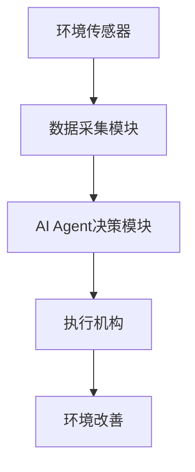

                 


# 构建AI Agent驱动的智能环境保护系统

> 关键词：AI Agent、智能环境保护系统、强化学习、多智能体协作、系统架构设计

> 摘要：本文探讨了如何利用AI Agent构建智能环境保护系统，重点分析了系统的核心概念、算法原理、架构设计和实际应用。通过结合强化学习和多智能体协作算法，本文提出了一种创新的环境保护解决方案，并通过具体案例展示了系统的实现过程和实际效果。

---

# 第一部分: 背景介绍

## 第1章: 环境保护的现状与挑战

### 1.1 当前环境问题的严重性

环境问题已成为全球关注的焦点。随着工业化进程的加快，资源过度开发、污染加剧、生态系统破坏等问题日益严重。传统的方法，如人工监测和简单的自动化系统，已经无法满足现代环境保护的需求。环境问题的复杂性和动态性要求我们采用更加智能和高效的技术手段。

### 1.2 传统环境保护方法的局限性

传统环境保护方法主要依赖人工监测和简单的自动化设备。这些方法存在以下问题：

1. **数据采集效率低**：人工监测耗时耗力，效率低下。
2. **决策滞后**：基于历史数据的决策往往无法应对实时变化的环境问题。
3. **覆盖范围有限**：传统方法难以实现全局优化和大规模环境监控。

### 1.3 AI Agent在环境保护中的潜力

AI Agent（智能体）是一种能够感知环境、自主决策、执行任务的智能系统。AI Agent在环境保护中的应用潜力巨大：

1. **实时监测与反馈**：AI Agent能够实时采集环境数据，并根据数据变化做出快速响应。
2. **智能决策支持**：通过强化学习和多智能体协作，AI Agent可以制定最优的环境保护策略。
3. **全局优化**：AI Agent能够协调多个子系统，实现资源的最优分配和环境问题的全局治理。

---

## 第2章: AI Agent驱动的智能环境保护系统的核心概念

### 2.1 AI Agent的基本定义

AI Agent是一种智能实体，能够感知环境、自主决策、执行任务并适应变化。AI Agent的核心特征包括：

- **自主性**：能够在没有外部干预的情况下独立运行。
- **反应性**：能够实时感知环境并做出反应。
- **目标导向**：具有明确的目标，并能够采取行动以实现目标。

### 2.2 AI Agent在环境保护系统中的作用

AI Agent在智能环境保护系统中扮演着关键角色。它可以用于环境监测、污染控制、资源优化配置等多个方面。例如：

- **环境监测**：AI Agent可以实时采集空气、水、土壤等环境数据，并通过数据分析识别潜在的环境问题。
- **污染控制**：AI Agent可以根据监测数据制定污染治理方案，并协调相关设备执行治理任务。
- **资源优化**：AI Agent可以通过优化算法实现资源的高效利用，减少浪费。

---

## 第3章: AI Agent驱动的智能环境保护系统的算法原理

### 3.1 强化学习算法

#### 3.1.1 强化学习的基本原理

强化学习是一种通过试错方式来优化决策的算法。AI Agent通过与环境交互，学习最优策略以最大化奖励。强化学习的核心要素包括：

- **状态（State）**：环境的当前情况。
- **动作（Action）**：AI Agent的决策。
- **奖励（Reward）**：环境对AI Agent决策的反馈。

#### 3.1.2 环境保护中的强化学习应用

在环境保护中，强化学习可以用于优化资源分配、污染治理策略等。例如，AI Agent可以通过强化学习算法，找到最优的废水处理方案，以最小化处理成本并达到最佳的净化效果。

#### 3.1.3 算法实现的数学模型

强化学习的核心是Q-learning算法，其数学模型如下：

$$ Q(s, a) \leftarrow Q(s, a) + \alpha \left[r + \gamma \max_{a'} Q(s', a') - Q(s, a)\right] $$

其中：
- \( Q(s, a) \)：状态 \( s \) 下采取动作 \( a \) 的价值。
- \( \alpha \)：学习率。
- \( r \)：奖励。
- \( \gamma \)：折扣因子。
- \( s' \)：下一个状态。

### 3.2 多智能体协作算法

#### 3.2.1 多智能体协作的基本概念

多智能体协作是指多个AI Agent协同工作，共同完成复杂任务。在环境保护中，多智能体协作可以用于协调不同区域的污染治理、资源分配等。

#### 3.2.2 环境保护中的多智能体协作场景

例如，在空气质量监测中，多个AI Agent可以分别负责不同的监测点，协同工作以实现全局空气质量优化。

#### 3.2.3 算法实现的数学模型

多智能体协作算法可以通过分布式强化学习实现。其核心思想是每个AI Agent独立学习，同时通过共享信息或协调机制实现协作。数学模型如下：

$$ Q_i(s_i, a_i) \leftarrow Q_i(s_i, a_i) + \alpha \left[r_i + \gamma \max_{a'_i} Q_i(s'_i, a'_i) - Q_i(s_i, a_i)\right] $$

其中：
- \( Q_i \)：第 \( i \) 个AI Agent的价值函数。
- \( s_i \)：第 \( i \) 个AI Agent的状态。
- \( a_i \)：第 \( i \) 个AI Agent的动作。

---

## 第4章: 系统架构与设计

### 4.1 系统功能设计

#### 4.1.1 数据采集模块

数据采集模块负责从环境传感器中获取数据，并将数据传输到AI Agent。例如，空气中的PM2.5、温度、湿度等数据。

#### 4.1.2 AI Agent决策模块

AI Agent根据接收到的数据，结合强化学习和多智能体协作算法，制定最优的环境保护策略。

#### 4.1.3 系统执行模块

系统执行模块根据AI Agent的决策，协调相关设备执行具体的环境保护任务，如启动净化设备、调整资源分配等。

### 4.2 系统架构设计

#### 4.2.1 系统架构的分层设计

AI Agent驱动的智能环境保护系统的架构可以分为以下几个层次：

1. **感知层**：负责环境数据的采集。
2. **决策层**：AI Agent负责数据处理和决策。
3. **执行层**：负责执行决策任务。

#### 4.2.2 模块之间的交互关系

模块之间的交互关系可以通过以下mermaid图表示：



#### 4.2.3 系统的可扩展性设计

系统设计时需要考虑可扩展性。例如，可以根据需要增加更多的AI Agent或传感器，以适应环境变化的需求。

---

## 第5章: 项目实战

### 5.1 环境搭建与工具安装

#### 5.1.1 开发环境的选择

推荐使用Python编程语言和深度学习框架（如TensorFlow或PyTorch）。

#### 5.1.2 必要工具的安装与配置

安装必要的库，如numpy、pandas、scikit-learn、tensorflow等。

### 5.2 系统核心代码实现

#### 5.2.1 数据采集模块的实现

```python
import numpy as np

class EnvironmentSensor:
    def __init__(self):
        self.sensors = []
    
    def add_sensor(self, sensor):
        self.sensors.append(sensor)
    
    def get_data(self):
        data = []
        for sensor in self.sensors:
            data.append(sensor.read())
        return data

class Sensor:
    def read(self):
        return np.random.random()
```

#### 5.2.2 AI Agent决策模块的实现

```python
class AI-Agent:
    def __init__(self, state_space, action_space):
        self.state_space = state_space
        self.action_space = action_space
        self.Q = np.zeros((state_space, action_space))
    
    def act(self, state):
        return np.argmax(self.Q[state, :])
    
    def learn(self, state, action, reward, next_state):
        self.Q[state, action] += 0.1 * (reward + 0.9 * np.max(self.Q[next_state, :]) - self.Q[state, action])
```

#### 5.2.3 系统执行模块的实现

```python
class Executor:
    def __init__(self):
        self.devices = []
    
    def add_device(self, device):
        self.devices.append(device)
    
    def execute(self, action):
        for device in self.devices:
            device.act(action)
```

### 5.3 案例分析

假设我们有一个空气质量监测系统，包含多个环境传感器和一个AI Agent。AI Agent可以根据传感器数据，通过强化学习算法优化空气净化策略。

---

## 第6章: 最佳实践与小结

### 6.1 最佳实践

1. **数据质量**：确保环境数据的准确性和实时性。
2. **算法优化**：根据具体场景调整算法参数，以提高系统性能。
3. **系统维护**：定期更新系统，以应对环境变化和新的挑战。

### 6.2 小结

本文详细介绍了如何构建AI Agent驱动的智能环境保护系统，包括系统的核心概念、算法原理、架构设计和实际应用。通过强化学习和多智能体协作算法，AI Agent能够有效解决复杂的环境问题，为智能环境保护提供了新的思路。

---

## 第7章: 注意事项与拓展阅读

### 7.1 注意事项

1. **数据隐私**：确保环境数据的隐私和安全。
2. **系统稳定性**：确保系统的稳定运行，避免因故障导致环境问题加剧。
3. **法律法规**：遵守相关法律法规，确保系统的合法性和合规性。

### 7.2 拓展阅读

1. **强化学习经典论文**：如《Playing atari with deep reinforcement learning》。
2. **多智能体协作研究**：如《Multi-agent reinforcement learning: A survey》。
3. **环境保护技术**：如《Environmental monitoring using artificial intelligence》。

---

通过本文的介绍，读者可以全面了解AI Agent驱动的智能环境保护系统的构建方法，并能够实际操作构建类似的系统。希望本文能够为环境保护技术的发展提供新的思路和方向。

