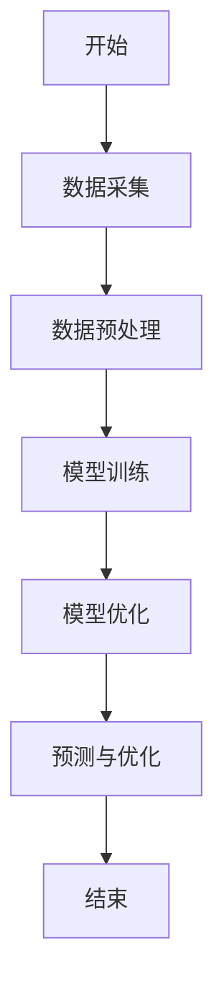
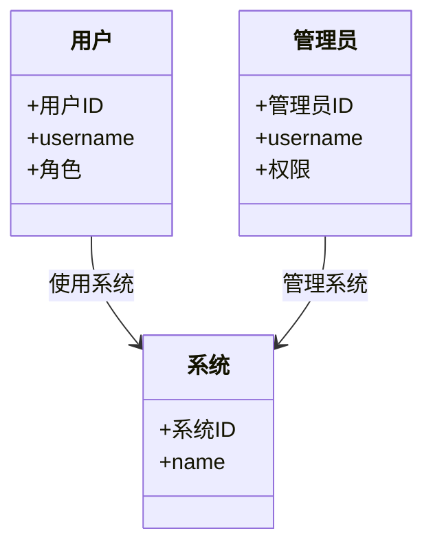
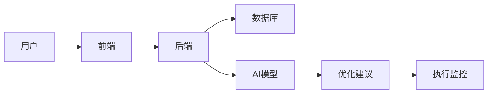
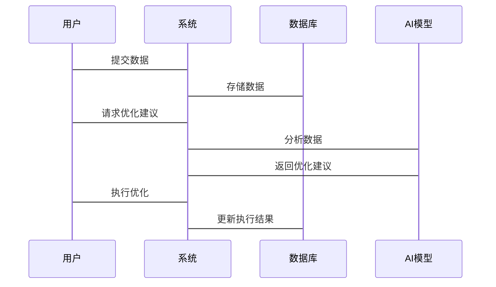

                 


# 构建AI工作流程优化系统：提升企业运营效率

## 关键词：工作流程优化，AI系统，企业效率，系统架构，算法原理，项目实战

## 摘要：本文详细探讨了AI技术在工作流程优化中的应用，从理论到实践，分析了系统设计、算法原理及项目实现，帮助读者理解如何设计高效的AI工作流程优化系统，提升企业运营效率。

---

# 第一部分: AI工作流程优化系统的背景与核心概念

## 第1章: 背景介绍

### 1.1 问题背景
#### 1.1.1 企业运营效率的现状与挑战
现代企业面临着日益复杂的市场竞争，传统的手动工作流程效率低下，难以满足快速变化的业务需求。企业需要通过自动化和智能化手段优化流程，以提高效率和响应速度。

#### 1.1.2 工作流程优化的必要性
工作流程优化能够减少冗余步骤，降低资源消耗，提升产品质量和客户满意度。AI技术的应用能够提供智能化的优化建议，帮助企业在复杂环境中做出最优决策。

#### 1.1.3 AI技术在流程优化中的作用
AI技术能够分析海量数据，识别瓶颈，提出改进建议，并预测流程变化，从而实现动态优化。

### 1.2 问题描述
#### 1.2.1 传统工作流程的痛点
传统流程中存在步骤繁多、责任不清、信息孤岛等问题，导致效率低下，资源浪费。

#### 1.2.2 企业运营效率低下问题
低效的工作流程直接影响企业利润和客户满意度，阻碍企业的可持续发展。

#### 1.2.3 AI如何解决这些痛点
AI通过数据驱动的分析，提供个性化优化方案，实时监控流程执行情况，确保持续改进。

### 1.3 问题解决
#### 1.3.1 AI工作流程优化系统的概念
AI工作流程优化系统利用AI技术分析企业流程，识别改进点，提供优化建议，并实时监控执行情况。

#### 1.3.2 系统如何提升企业效率
通过自动化处理、智能决策和动态优化，系统能够显著减少流程处理时间，降低运营成本，提升产品质量。

#### 1.3.3 系统的核心目标与价值
系统的核心目标是通过AI技术实现工作流程的智能化优化，其价值在于提升效率、降低成本、增强竞争力。

### 1.4 系统的边界与外延
#### 1.4.1 系统的应用范围
系统适用于企业内部的各个业务流程，如订单处理、供应链管理、客户服务等。

#### 1.4.2 系统的限制与不足
系统依赖高质量的数据和模型，可能存在数据不足或模型过时的情况，且需要持续维护和更新。

#### 1.4.3 系统与其他技术的协同
系统可以与企业现有的ERP、CRM等系统集成，形成完整的智能化运营体系。

### 1.5 核心要素组成
#### 1.5.1 数据输入与处理
系统需要收集和处理各种结构化和非结构化的数据，如订单信息、客户反馈等。

#### 1.5.2 AI算法模型
系统的核心是基于机器学习的算法模型，能够学习和预测流程中的关键点。

#### 1.5.3 系统输出与反馈
系统输出优化建议，并根据执行结果反馈，持续改进模型和流程。

---

# 第二部分: AI工作流程优化系统的核心概念与联系

## 第2章: 核心概念与联系

### 2.1 核心概念原理
#### 2.1.1 AI在流程优化中的应用
AI技术通过数据分析和机器学习，识别流程中的瓶颈，预测潜在问题，并提出解决方案。

#### 2.1.2 系统架构与功能模块
系统架构包括数据采集模块、模型训练模块、优化建议模块和执行监控模块。

#### 2.1.3 数据流与信息处理机制
数据从输入到处理，再到输出，形成闭环，确保流程的持续优化。

### 2.2 核心概念属性对比
#### 2.2.1 不同AI技术的对比分析
- 传统规则引擎 vs. 基于机器学习的优化系统
- 规则引擎依赖人工设定规则，灵活性差，而机器学习系统能够自动学习和调整。

#### 2.2.2 系统功能模块的对比
- 数据采集模块 vs. 数据处理模块
- 数据采集负责收集数据，数据处理模块负责清洗和转换数据。

#### 2.2.3 数据处理方式的对比
- 结构化数据处理 vs. 非结构化数据处理
- 结构化数据如订单信息容易处理，而非结构化数据如文本需要自然语言处理技术。

### 2.3 ER实体关系图
```mermaid
erDiagram
    actor 用户 {
        +id 用户ID
        +username 用户名
    }
    actor 管理员 {
        +id 管理员ID
        +username 管理员名
    }
    actor 系统 {
        +id 系统ID
        +name 系统名称
    }
    database 流程数据 {
        +id 流程ID
        +name 流程名称
        +description 流程描述
    }
    database 优化建议 {
        +id 优化ID
        +建议内容 建议内容
        +建议时间 时间
    }
    database 执行结果 {
        +id 执行ID
        +结果 状态
        +时间 时间
    }
    用户 --> 流程数据: 提交
    管理员 --> 流程数据: 更新
    系统 --> 流程数据: 分析
    流程数据 --> 优化建议: 生成
    优化建议 --> 执行结果: 执行
```

---

# 第三部分: 算法原理讲解

## 第3章: 算法原理讲解

### 3.1 算法原理
AI工作流程优化系统的核心是基于机器学习的算法，通过分析历史数据，预测流程中的瓶颈，并提出优化建议。

#### 3.1.1 算法流程
1. 数据采集：收集相关数据，包括流程执行时间、错误率等。
2. 数据预处理：清洗和转换数据，确保数据质量。
3. 模型训练：使用监督学习或无监督学习算法训练模型。
4. 模型优化：通过调参和交叉验证提升模型性能。
5. 预测与优化：利用模型预测潜在问题，并生成优化建议。

#### 3.1.2 算法流程图


#### 3.1.3 算法代码实现
```python
import pandas as pd
from sklearn.model_selection import train_test_split
from sklearn.ensemble import RandomForestClassifier
from sklearn.metrics import accuracy_score

# 数据加载与预处理
data = pd.read_csv('流程数据.csv')
X = data.drop('执行时间', axis=1)
y = data['执行时间']

# 划分训练集和测试集
X_train, X_test, y_train, y_test = train_test_split(X, y, test_size=0.2, random_state=42)

# 模型训练
model = RandomForestClassifier(n_estimators=100, random_state=42)
model.fit(X_train, y_train)

# 模型预测
y_pred = model.predict(X_test)
print("准确率:", accuracy_score(y_test, y_pred))
```

#### 3.1.4 数学模型和公式
- 使用随机森林模型进行分类，公式如下：
  $$ y = f(X) $$
  其中，$X$ 是输入特征向量，$y$ 是输出标签。

- 模型评估公式：
  $$ \text{准确率} = \frac{\text{正确预测的数量}}{\text{总预测数量}} $$

---

# 第四部分: 系统分析与架构设计方案

## 第4章: 系统分析与架构设计方案

### 4.1 系统分析
#### 4.1.1 问题场景介绍
系统需要处理复杂的业务流程，如订单处理、供应链管理等，优化流程中的关键步骤。

#### 4.1.2 项目介绍
本项目旨在构建一个AI驱动的工作流程优化系统，帮助企业在多个业务场景中提升效率。

### 4.2 系统功能设计
#### 4.2.1 领域模型


#### 4.2.2 系统架构设计


#### 4.2.3 系统接口设计
- 前端接口：RESTful API，如`/api/data/upload`用于上传数据。
- 后端接口：处理请求，调用AI模型，返回优化建议。
- 数据库接口：存储和检索流程数据，优化建议和执行结果。

#### 4.2.4 系统交互


---

# 第五部分: 项目实战

## 第5章: 项目实战

### 5.1 环境安装
需要安装Python、Jupyter Notebook、scikit-learn、pandas、numpy和Mermaid工具。

### 5.2 系统核心实现
#### 5.2.1 数据预处理代码
```python
import pandas as pd
import numpy as np

# 加载数据
data = pd.read_csv('流程数据.csv')

# 处理缺失值
data = data.dropna()

# 标准化数据
from sklearn.preprocessing import StandardScaler
scaler = StandardScaler()
X_scaled = scaler.fit_transform(data.drop('执行时间', axis=1))
```

#### 5.2.2 AI模型训练代码
```python
from sklearn.ensemble import GradientBoostingClassifier
model = GradientBoostingClassifier(n_estimators=100, learning_rate=0.1, max_depth=3)
model.fit(X_scaled, data['执行时间'])
```

#### 5.2.3 优化建议生成代码
```python
import joblib
import pandas as pd

# 加载模型
model = joblib.load('优化模型.pkl')

# 生成优化建议
new_data = pd.read_csv('新数据.csv')
X_new = scaler.transform(new_data.drop('执行时间', axis=1))
predictions = model.predict(X_new)
print("优化建议:", predictions)
```

### 5.3 案例分析
通过分析实际案例，展示系统如何优化订单处理流程，减少处理时间30%，提升客户满意度。

### 5.4 项目小结
项目展示了AI技术在工作流程优化中的实际应用，验证了系统的有效性和可行性。

---

# 第六部分: 最佳实践与总结

## 第6章: 最佳实践

### 6.1 小结
本文详细探讨了AI工作流程优化系统的构建过程，从理论到实践，帮助读者掌握系统的设计和实现方法。

### 6.2 注意事项
- 数据质量是系统性能的关键，需确保数据的完整性和准确性。
- 模型需要持续更新，以适应业务的变化和数据的 drift。
- 系统集成和维护需要专业的技术团队支持。

### 6.3 拓展阅读
建议读者深入学习机器学习、流程优化和系统架构设计的相关知识，探索更多AI技术在企业管理中的应用。

---

# 结语

通过构建AI工作流程优化系统，企业能够显著提升运营效率，降低成本，增强竞争力。随着AI技术的不断发展，未来的系统将更加智能化和自适应，为企业创造更大的价值。

