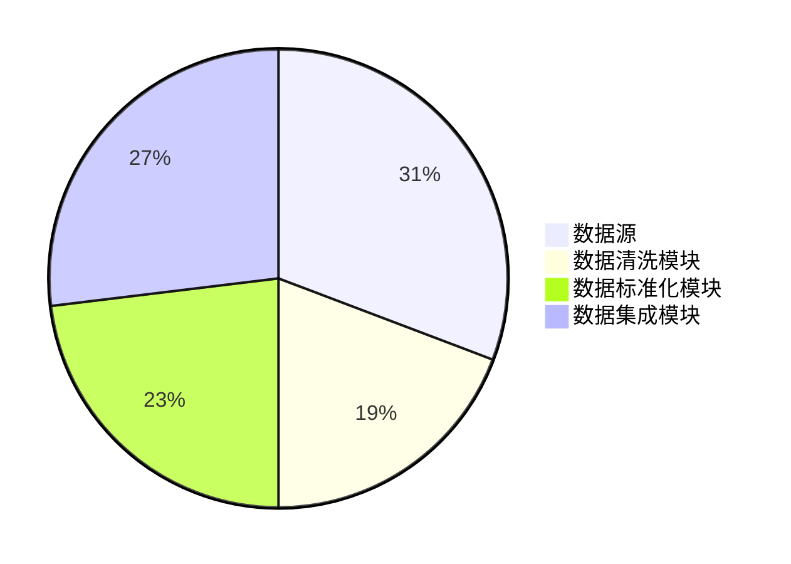

                 


# 构建AI数据治理助手：确保数据质量与一致性

## 关键词：AI数据治理、数据质量、数据一致性、数据清洗、数据标准化

## 摘要：随着AI技术的快速发展，数据质量与一致性问题日益凸显，构建AI数据治理助手成为确保数据可靠性的关键。本文系统探讨数据治理的核心概念、算法原理、系统架构及项目实战，通过详细讲解数据清洗、标准化和集成，结合实际案例，帮助读者掌握AI数据治理的关键技术。

---

## 第一部分: AI数据治理背景与核心概念

### 第1章: 数据治理概述

#### 1.1 数据治理的定义与作用
数据治理是通过制定策略和规则，确保数据在创建、存储、处理和使用过程中的完整性、一致性和合规性。其核心作用包括提升数据质量、降低数据风险、增强数据资产价值。

#### 1.2 AI与数据治理的结合
AI依赖高质量数据，数据治理在数据清洗、标准化和集成中起关键作用。通过AI技术，数据治理变得更加智能化和自动化，能够处理复杂数据问题。

#### 1.3 数据治理与数据管理的区别
数据治理侧重战略和规则，数据管理侧重操作和技术。数据治理是数据管理的指导框架，而数据管理是其实现手段。

### 第2章: 数据质量与一致性的挑战

#### 2.1 数据质量问题的背景
数据质量问题包括完整性、准确性、一致性等。这些问题影响数据分析结果和AI模型性能，需通过数据清洗和标准化解决。

#### 2.2 数据一致性问题的挑战
数据一致性问题源于不同数据源的格式、术语和结构差异。通过数据集成和标准化，消除这些差异，确保数据一致。

### 第3章: 数据治理的核心概念与联系

#### 3.1 数据治理的核心概念
- 数据清洗：识别和处理脏数据，确保数据准确。
- 数据标准化：统一数据格式，消除语义歧义。
- 数据集成：整合多源数据，消除冗余和不一致。

#### 3.2 核心概念对比
| 概念         | 数据清洗 | 数据标准化 | 数据集成 |
|--------------|----------|------------|----------|
| 定义         | 删除或修改不准确数据 | 统一数据格式和术语 | 整合多个数据源 |
| 目标         | 提高准确性 | 保证一致性 | 消除冗余 |
| 方法         | 去重、补全 | 字典映射、归一化 | 数据融合 |

#### 3.3 ER实体关系图
```mermaid
erDiagram
    customer[CUSTOMER] {
        +string id
        +string name
        +string email
    }
    product[PRODUCT] {
        +string id
        +string name
        +float price
    }
    order[ORDER] {
        +string id
        +date order_date
        +int total
    }
    customer --> order : orders
    product --> order : order_lines
```

---

## 第二部分: 数据治理算法原理

### 第4章: 数据清洗算法

#### 4.1 数据清洗流程
1. 数据采集
2. 识别脏数据
3. 清洗处理
4. 数据验证

#### 4.2 数据清洗算法实现
使用Python的pandas库进行数据清洗，例如处理缺失值、重复值和异常值。

#### 4.3 数据清洗的数学模型
使用均值、中位数等方法填充缺失值，通过异常检测算法识别异常值。

### 第5章: 数据标准化算法

#### 5.1 数据标准化方法
- 字典映射：统一字段名称和术语。
- 归一化处理：将数据转换到统一范围。

#### 5.2 数据标准化实现
```python
import pandas as pd

def normalize_data(dataframe):
    normalized_df = dataframe.copy()
    for column in dataframe.columns:
        if dataframe[column].dtype == 'object':
            # 字典映射
            unique_values = dataframe[column].unique()
            mapping = {value: index for index, value in enumerate(unique_values)}
            normalized_df[column] = dataframe[column].map(mapping)
        else:
            # 归一化处理
            max_val = dataframe[column].max()
            min_val = dataframe[column].min()
            normalized_df[column] = (dataframe[column] - min_val) / (max_val - min_val)
    return normalized_df
```

#### 5.3 数据标准化的数学公式
归一化公式：$$ normalized\_value = \frac{(value - min)}{max - min} $$

---

## 第三部分: 系统分析与架构设计

### 第6章: 系统架构设计

#### 6.1 系统功能设计
- 数据采集模块：从多源采集数据。
- 数据清洗模块：识别和处理脏数据。
- 数据标准化模块：统一数据格式。
- 数据集成模块：整合多源数据。

#### 6.2 系统架构图


#### 6.3 系统接口设计
- 数据输入接口：接收多种格式数据。
- 数据输出接口：提供清洗和标准化后的数据。

---

## 第四部分: 项目实战

### 第7章: 项目实战

#### 7.1 环境安装
安装Python、pandas、scikit-learn等库。

#### 7.2 核心代码实现
```python
import pandas as pd

def clean_data(df):
    # 处理缺失值
    df = df.dropna()
    # 去除重复数据
    df = df.drop_duplicates()
    return df

# 读取数据
data = pd.read_csv('raw_data.csv')
# 清洗数据
clean_data = clean_data(data)
# 标准化数据
normalized_data = normalize_data(clean_data)
# 数据集成
integrated_data = integrate_data(normalized_data)
```

#### 7.3 案例分析
以医疗数据为例，展示如何通过数据清洗和标准化提高数据质量。

#### 7.4 项目小结
总结项目实施过程，强调数据清洗和标准化的重要性，以及数据集成的效果。

---

## 第五部分: 最佳实践与扩展

### 第8章: 最佳实践

#### 8.1 数据治理的注意事项
- 定期审查数据质量。
- 建立数据治理团队。
- 使用自动化工具提高效率。

#### 8.2 小结
数据治理是AI成功的关键，通过数据清洗、标准化和集成，确保数据质量和一致性。

#### 8.3 扩展阅读
推荐相关书籍和资源，深入学习数据治理技术。

---

通过以上结构，文章系统地讲解了AI数据治理的关键技术，从背景到算法，从系统设计到项目实战，帮助读者全面掌握数据治理的各个方面。

