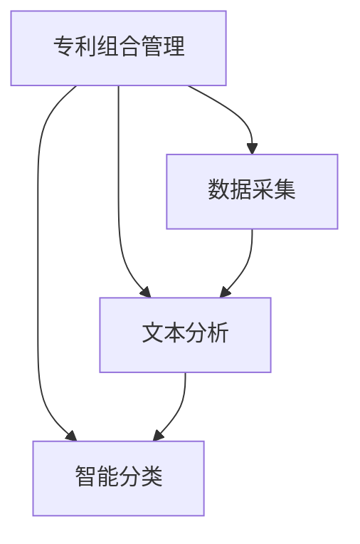
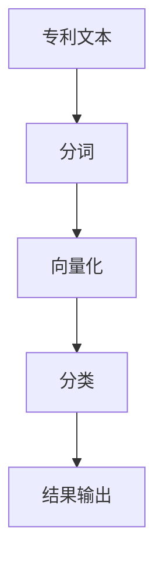
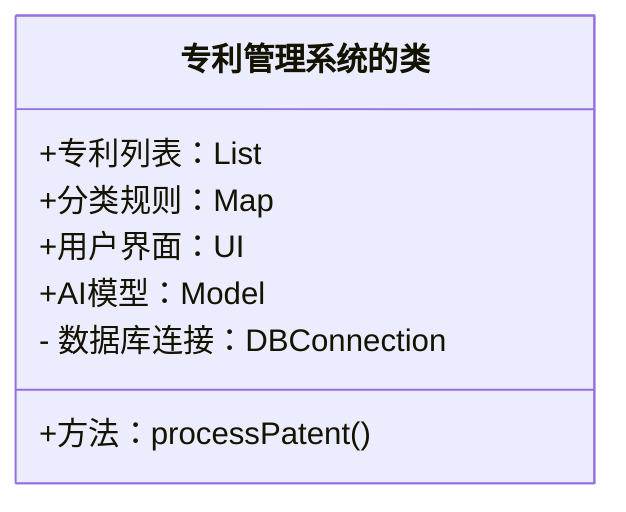

                 


# 构建AI驱动的企业专利组合管理系统

## 关键词：人工智能，专利管理，企业系统，自然语言处理，机器学习，系统架构

## 摘要：本文探讨了如何利用人工智能技术构建企业专利组合管理系统，涵盖背景分析、核心概念、算法原理、系统架构及项目实战，提供详细的实现步骤和案例分析。

---

# 第一部分：背景介绍

## 第1章：问题背景与描述

### 1.1 问题背景

#### 1.1.1 传统专利管理的挑战
传统专利管理依赖人工处理，存在数据量大、信息复杂、检索困难等问题，导致效率低下。

#### 1.1.2 AI技术的应用潜力
AI技术如自然语言处理和机器学习可提高专利分析和分类的效率。

#### 1.1.3 企业专利组合管理的重要性
企业需有效管理专利组合以保护知识产权，提升竞争力。

### 1.2 问题描述

#### 1.2.1 专利数据复杂性
专利文本多样，分类复杂，人工处理耗时。

#### 1.2.2 分析难点
准确分类和检索困难，影响管理效果。

#### 1.2.3 管理目标
优化专利组合，提升企业竞争力。

### 1.3 问题解决方法

#### 1.3.1 引入AI技术的必要性
AI可提高处理效率和准确性。

#### 1.3.2 AI的优势
自动化处理、高效检索、智能分析。

#### 1.3.3 实现路径
数据收集、模型训练、系统开发、测试优化。

### 1.4 边界与外延

#### 1.4.1 系统边界
仅处理专利数据，不涉及法律咨询。

#### 1.4.2 外延领域
不包括专利申请流程，仅管理已申请专利。

#### 1.4.3 与其他系统的区别
专注于AI驱动，区别于传统管理系统。

### 1.5 核心概念与组成

#### 1.5.1 核心概念
专利文本分析、智能分类、动态调整。

#### 1.5.2 核心要素
数据采集模块、分析模块、管理模块。

#### 1.5.3 概念结构图


---

# 第二部分：核心概念与联系

## 第2章：核心概念原理

### 2.1 AI在专利管理中的应用

#### 2.1.1 自然语言处理
用于文本分析和关键词提取。

#### 2.1.2 机器学习
用于分类和预测，如专利分类。

#### 2.1.3 深度学习
用于复杂模式识别，如图像识别。

### 2.2 核心概念属性对比

| 对比维度 | 传统方法 | AI驱动方法 |
|----------|-----------|------------|
| 效率     | 低        | 高          |
| 准确性   | 中        | 高          |
| 可扩展性 | 有限      | 强          |

### 2.3 ER实体关系图

```mermaid
er
    entity 专利 (Patent) {
        id: int
        title: string
        abstract: string
        filing_date: date
        inventor: string
        assignee: string
        classification: string
    }
    entity 申请人 (Applicant) {
        id: int
        name: string
        country: string
    }
    entity 分类号 (Classification) {
        id: int
        name: string
        description: string
    }
    Patent --> Applicant
    Patent --> Classification
```

---

# 第三部分：算法原理讲解

## 第3章：算法原理

### 3.1 机器学习模型

#### 3.1.1 数据预处理
去除停用词、分词、向量化。

#### 3.1.2 模型训练
使用TF-IDF或Word2Vec提取特征。

#### 3.1.3 分类算法
应用朴素贝叶斯或支持向量机。

### 3.2 自然语言处理流程



### 3.3 数学模型

分类器损失函数：
$$ L = -\sum_{i=1}^{n} [y_i \ln p(y_i|x_i) + (1-y_i)\ln(1-p(y_i|x_i))] $$

---

# 第四部分：系统分析与架构设计

## 第4章：系统架构

### 4.1 问题场景

企业需高效管理专利组合，实时监控和分析。

### 4.2 系统功能设计

#### 4.2.1 领域模型



### 4.3 系统架构设计


### 4.4 接口设计

RESTful API：

- GET /patents：获取专利列表。
- POST /analyze：提交分析请求。

### 4.5 交互流程

```mermaid
sequenceDiagram
    用户 -> 前端：提交专利文本
    前端 -> 服务层：调用分析接口
    服务层 -> AI模型：处理请求
    AI模型 -> 服务层：返回结果
    服务层 -> 用户：展示结果
```

---

# 第五部分：项目实战

## 第5章：项目实战

### 5.1 环境安装

安装Python、Scikit-learn、NLTK。

### 5.2 核心代码实现

```python
from sklearn.feature_extraction.text import TfidfVectorizer
from sklearn.naive_bayes import MultinomialNB
import nltk

nltk.download('punkt')

# 数据预处理
def preprocess(text):
    words = nltk.word_tokenize(text)
    return ' '.join(words)

# 模型训练
vectorizer = TfidfVectorizer()
X = vectorizer.fit_transform(preprocess(train_texts))
model = MultinomialNB().fit(X, train_labels)
```

### 5.3 代码解读

展示如何处理文本数据、训练模型和预测分类。

### 5.4 实际案例分析

分析实际专利文本，展示分类结果。

---

# 第六部分：最佳实践

## 第6章：最佳实践

### 6.1 小结

AI驱动的专利管理系统优势明显，但需注意数据隐私和模型优化。

### 6.2 注意事项

确保数据安全，定期更新模型。

### 6.3 拓展阅读

探索更复杂的模型和扩展功能。

---

# 结论

通过AI技术，企业专利组合管理更加高效和智能，帮助企业更好地保护和利用知识产权。

