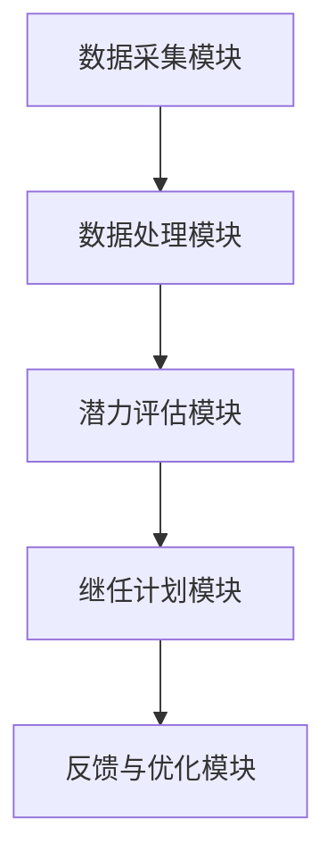

                 


# 构建AI驱动的企业人才发展与继任计划系统

> **关键词**：AI驱动，企业人才发展，继任计划，机器学习，潜力评估，人才管理系统

> **摘要**：  
> 本文详细探讨了如何利用人工智能技术构建企业人才发展与继任计划系统。文章从背景、系统架构、算法原理到实际应用案例进行了全面分析，提出了基于机器学习的潜力评估模型和继任计划生成算法，并通过实际案例展示了系统的实现与优化过程。文章最后总结了系统的设计要点和未来的发展方向。

---

# 第1章: AI驱动的企业人才发展与继任计划系统概述

## 1.1 企业人才发展与继任计划的背景与挑战

### 1.1.1 传统企业人才发展与继任计划的痛点

- **痛点1：人才评估主观性**  
  传统的人才评估主要依赖于主观的绩效考核和领导的直觉判断，容易受到个人偏见和经验的限制。

- **痛点2：继任计划的不确定性**  
  在快速变化的市场环境中，传统继任计划往往无法及时响应人才需求的变化，导致计划的滞后性和低效性。

- **痛点3：数据孤岛问题**  
  企业内部的人才数据分散在不同部门和系统中，难以进行统一管理和分析。

### 1.1.2 AI技术如何解决这些痛点

- **数据驱动的客观性**  
  AI通过分析大量结构化和非结构化数据，提供客观的人才评估依据，减少主观判断的影响。

- **动态优化能力**  
  基于AI的继任计划系统能够实时分析人才数据，动态调整计划，提高灵活性和适应性。

- **自动化与智能化**  
  AI技术可以自动处理和分析数据，减少人工干预，提高效率。

### 1.1.3 企业人才发展的数字化转型趋势

- **数据驱动的决策**  
  通过AI技术，企业可以利用数据进行更科学的人才管理决策。

- **个性化发展路径**  
  AI能够根据员工的特点和潜力，制定个性化的 career development plan。

- **持续优化与反馈**  
  基于AI的系统可以不断收集反馈，优化人才发展策略，形成闭环。

---

## 1.2 AI驱动的人才发展与继任计划的核心概念

### 1.2.1 人才发展的定义与目标

- **定义**：人才发展是指通过系统化的培养和管理，提升员工的能力和绩效，使其更好地适应岗位需求和企业战略目标。

- **目标**：  
  - 提高员工能力与绩效  
  - 优化员工职业发展路径  
  - 降低人才流失率  
  - 提升企业整体竞争力

### 1.2.2 继任计划的定义与关键要素

- **定义**：继任计划是指通过系统化的方法，识别和培养潜在的接班人，确保关键岗位的顺利交接。

- **关键要素**：  
  - 人才储备池  
  - 员工潜力评估  
  - 发展路径规划  
  - 绩效监控与反馈

### 1.2.3 AI在人才发展中的应用场景

- **人才评估**：通过AI分析员工的历史绩效、能力、潜力等数据，提供客观的评估结果。  
- **个性化发展建议**：基于员工的特点和企业需求，制定个性化的学习和培养计划。  
- **继任计划优化**：利用AI算法动态调整继任计划，确保关键岗位的顺利衔接。

---

## 1.3 本书的核心目标与架构

### 1.3.1 本书的核心目标

- 提供一套基于AI的人才发展与继任计划系统的设计与实现方法。  
- 通过实际案例分析，展示AI技术在人才管理中的应用价值。

### 1.3.2 本书的结构与内容概览

- **第1章**：概述AI驱动的企业人才发展与继任计划系统。  
- **第2章**：详细讲解系统的核心算法与流程。  
- **第3章**：介绍企业人才数据的采集与处理。  
- **第4章**：基于机器学习的潜力评估模型。  
- **第5章**：继任计划的生成与优化。  
- **第6章**：系统架构与实现方案。  
- **第7章**：项目实战与案例分析。  
- **第8章**：总结与展望。

### 1.3.3 如何阅读本书

- 从背景和概念入手，理解AI在人才管理中的作用。  
- 学习核心算法和系统架构，掌握技术实现的细节。  
- 通过实际案例，理解如何将AI技术应用到实际业务中。

---

# 第2章: 企业人才发展与继任计划的系统框架

## 2.1 人才发展与继任计划的系统架构

### 2.1.1 系统的基本组成模块

- **数据采集模块**：负责收集企业内部和外部的人才数据。  
- **数据处理模块**：对数据进行清洗、预处理和特征提取。  
- **潜力评估模块**：基于机器学习算法，评估员工的潜力和能力。  
- **继任计划模块**：根据评估结果，生成和优化继任计划。  
- **反馈与优化模块**：根据实际效果，调整和优化系统。

### 2.1.2 各模块之间的关系与数据流



### 2.1.3 系统的整体功能描述

- 数据采集模块：从企业内部系统（如HR系统、绩效管理系统）和外部数据源（如市场招聘信息、行业报告）获取人才数据。  
- 数据处理模块：对数据进行清洗、标准化和特征提取，为后续分析提供高质量的数据支持。  
- 潜力评估模块：基于机器学习算法，评估员工的潜力、能力和适合度。  
- 继任计划模块：根据潜力评估结果，生成和优化继任计划，确保关键岗位的顺利衔接。  
- 反馈与优化模块：根据实际效果，调整系统参数和算法，持续优化系统性能。

---

## 2.2 AI驱动的系统核心算法与流程

### 2.2.1 人才数据的采集与预处理

- **数据来源**：企业内部数据（如绩效数据、培训数据）、外部数据（如市场招聘信息、行业趋势）。  
- **数据清洗**：去除重复数据、处理缺失值、消除噪声数据。  
- **数据标准化**：对数据进行归一化处理，确保不同数据源的数据具有可比性。  
- **特征提取**：从原始数据中提取有助于模型训练的特征，如绩效指标、能力评分、项目经验等。

---

## 2.3 系统的关键性能指标与评估方法

### 2.3.1 系统的主要性能指标

- **准确率**：模型预测的准确率，即预测结果与实际结果的匹配程度。  
- **召回率**：模型预测为正类的样本中，实际为正类的比例。  
- **F1值**：综合准确率和召回率的指标，衡量模型的整体性能。  
- **处理时间**：系统处理单个请求的平均时间，反映系统的实时性。

### 2.3.2 评估方法与标准

- **交叉验证**：通过交叉验证评估模型的泛化能力。  
- **AUC曲线**：评估模型的分类性能，AUC值越接近1，模型性能越好。  
- **业务指标**：如人才流失率、岗位匹配度等，衡量系统在实际业务中的效果。

### 2.3.3 优化方向与改进策略

- **算法优化**：尝试不同的算法，如支持向量机（SVM）、随机森林（Random Forest）、神经网络等，选择性能最优的模型。  
- **特征工程**：通过特征选择和特征构建，提高模型的性能。  
- **数据增强**：通过数据增强技术，增加数据多样性，提高模型的鲁棒性。  
- **模型调优**：通过网格搜索（Grid Search）等方法，优化模型的超参数，提高模型性能。

---

## 2.4 系统的实现与优化

### 2.4.1 系统实现的核心技术

- **机器学习**：用于潜力评估和人才匹配。  
- **自然语言处理**：用于分析员工的简历、绩效报告等文本数据。  
- **数据挖掘**：用于从海量数据中提取有用的信息和模式。

### 2.4.2 系统优化的关键点

- **数据质量**：确保数据的准确性和完整性。  
- **算法选择**：选择适合业务需求的算法，并进行充分的调优。  
- **系统性能**：优化系统的响应时间，确保实时性。  
- **可解释性**：提高模型的可解释性，便于业务人员理解和使用。

---

## 2.5 系统的部署与维护

### 2.5.1 系统的部署流程

- **环境搭建**：安装必要的软件和依赖库，如Python、TensorFlow、Scikit-learn等。  
- **数据准备**：将数据加载到系统中，并进行必要的预处理。  
- **模型训练**：基于训练数据，训练潜力评估模型和继任计划生成模型。  
- **系统上线**：将系统部署到生产环境，提供给用户使用。

### 2.5.2 系统的维护与更新

- **数据更新**：定期更新人才数据，确保模型的输入数据是最新的。  
- **模型更新**：根据新的数据和业务需求，重新训练模型，优化系统性能。  
- **系统监控**：监控系统的运行状态，及时发现和解决故障。  
- **用户反馈**：收集用户的反馈，不断优化系统的功能和性能。

---

# 第3章: 企业人才数据的采集与处理

## 3.1 人才数据的来源与类型

### 3.1.1 企业内部数据的来源

- **绩效数据**：员工的绩效考核结果，如KPI完成情况、评分等。  
- **培训数据**：员工参加的培训项目、培训效果评估等。  
- **考勤数据**：员工的出勤记录、加班情况等。  
- **岗位数据**：员工的岗位信息、职责描述、晋升记录等。

### 3.1.2 外部数据的获取与整合

- **市场招聘信息**：从招聘网站获取行业内的招聘信息，分析人才需求趋势。  
- **行业报告**：从行业报告中获取人才市场动态、薪酬水平等信息。  
- **社交媒体数据**：从LinkedIn等社交平台获取员工的职业经历、技能标签等信息。

---

## 3.2 数据预处理与清洗

### 3.2.1 数据清洗的基本方法

- **去除重复数据**：删除重复的记录，确保数据的唯一性。  
- **处理缺失值**：根据业务需求，选择填补、删除或标记缺失值。  
- **去除噪声数据**：通过数据清洗技术，去除错误或异常数据。

---

## 3.3 数据存储与管理

### 3.3.1 数据库设计与管理

- **关系型数据库**：如MySQL、PostgreSQL，适合结构化数据的存储。  
- **非关系型数据库**：如MongoDB，适合存储结构化的数据。

### 3.3.2 数据存储的优化策略

- **分库分表**：通过分库分表技术，提高数据库的扩展性和性能。  
- **索引优化**：为常用查询字段创建索引，提高查询效率。  
- **数据归档**：将历史数据归档存储，减少主数据库的负载。

---

## 3.4 数据的特征提取与标签化处理

### 3.4.1 特征提取的基本方法

- **基于统计的方法**：如均值、方差、频数等。  
- **基于机器学习的方法**：如主成分分析（PCA）、线性判别分析（LDA）等。  
- **基于规则的方法**：根据业务规则提取特征，如职位、部门、绩效评分等。

### 3.4.2 标签化处理的策略

- **标签化的目标**：将数据转化为可用于模型训练的标签，如潜力标签（高潜力、中潜力、低潜力）。  
- **标签化的实现**：根据业务需求，设计合理的标签体系，如基于绩效、能力、经验等多维度进行标签化处理。

---

## 3.5 数据安全与隐私保护

### 3.5.1 数据安全的实现策略

- **数据加密**：对敏感数据进行加密存储，确保数据的安全性。  
- **访问控制**：通过权限管理，限制数据的访问范围，确保只有授权人员可以访问敏感数据。  
- **审计与监控**：对数据访问进行审计，及时发现和防止数据泄露。

### 3.5.2 数据隐私保护的实现方法

- **数据脱敏**：对敏感数据进行脱敏处理，如替换、加密等，确保数据在处理过程中不会泄露个人隐私。  
- **数据匿名化**：通过匿名化处理，确保数据无法被追溯到个人。

---

# 第4章: 基于机器学习的潜力评估模型

## 4.1 潜力评估模型的构建与训练

### 4.1.1 模型选择与训练数据准备

- **模型选择**：根据业务需求和数据特点，选择适合的机器学习模型，如逻辑回归、支持向量机（SVM）、随机森林、神经网络等。  
- **训练数据准备**：将数据集划分为训练集、验证集和测试集，确保模型的泛化能力。

---

## 4.2 潜力评估模型的训练与优化

### 4.2.1 模型训练

- **训练流程**：  
  1. 数据预处理：清洗、特征提取、标签化。  
  2. 模型训练：使用训练数据训练模型，调整模型参数。  
  3. 模型评估：使用验证集评估模型的性能，调整模型参数。  
  4. 模型优化：通过网格搜索等方法，优化模型的超参数，提高模型性能。

---

## 4.3 潜力评估模型的评估与验证

### 4.3.1 评估指标

- **准确率**：模型预测的准确率。  
- **召回率**：模型预测为正类的样本中，实际为正类的比例。  
- **F1值**：综合准确率和召回率的指标，反映模型的性能。

---

## 4.4 潜力评估模型的实际应用

### 4.4.1 应用场景

- **人才筛选**：在招聘过程中，基于模型评估候选人的潜力，优化招聘策略。  
- **内部晋升**：根据员工的潜力评估结果，制定内部晋升计划，确保关键岗位的顺利交接。  
- **个性化发展**：根据员工的潜力和能力，制定个性化的学习和发展计划。

---

## 4.5 潜力评估模型的优化与改进

### 4.5.1 算法优化

- **尝试不同的算法**：如随机森林、梯度提升树（XGBoost）、神经网络等，选择性能最优的模型。  
- **模型调优**：通过网格搜索等方法，优化模型的超参数，提高模型性能。

### 4.5.2 数据增强

- **数据增强**：通过增加数据的多样性，提高模型的鲁棒性。  
- **特征工程**：通过特征选择和特征构建，提高模型的性能。

---

# 第5章: 继任计划的生成与优化

## 5.1 继任计划的生成逻辑

### 5.1.1 继任计划的基本原理

- **潜力评估**：基于潜力评估模型，评估员工的潜力和能力。  
- **岗位需求分析**：分析关键岗位的技能要求和职责，确定继任计划的需求。  
- **匹配与推荐**：根据员工的潜力和岗位需求，推荐合适的候选人，生成继任计划。

---

## 5.2 继任计划的优化策略

### 5.2.1 基于优化算法的继任计划调整

- **遗传算法**：通过遗传算法，优化继任计划的安排，提高计划的合理性。  
- **模拟退火算法**：通过模拟退火算法，跳出局部最优，找到全局最优的继任计划。

---

## 5.3 继任计划的实际应用与案例分析

### 5.3.1 案例背景

- 某高科技公司希望优化其继任计划，确保关键岗位的顺利交接。

### 5.3.2 数据准备

- **数据来源**：企业内部的绩效数据、培训数据、岗位数据等。  
- **数据预处理**：清洗、特征提取、标签化处理。

### 5.3.3 模型训练

- **算法选择**：选择随机森林模型，基于员工的绩效、能力、经验等特征，训练潜力评估模型。  
- **模型调优**：通过网格搜索优化模型的超参数，提高模型性能。

### 5.3.4 继任计划生成

- **潜力评估**：基于模型评估员工的潜力，确定高潜力员工。  
- **岗位需求分析**：分析关键岗位的技能要求，确定继任计划的需求。  
- **匹配与推荐**：根据员工的潜力和岗位需求，推荐合适的候选人，生成继任计划。

### 5.3.5 计划优化

- **算法优化**：通过遗传算法优化继任计划的安排，确保计划的合理性和高效性。

---

## 5.4 继任计划的反馈与优化

### 5.4.1 反馈机制

- **效果评估**：根据实际效果，评估继任计划的执行情况，发现问题和不足。  
- **数据更新**：根据反馈结果，更新人才数据和模型，优化系统性能。

### 5.4.2 持续优化

- **模型优化**：根据反馈结果，优化模型的参数和算法，提高模型性能。  
- **系统优化**：根据反馈结果，优化系统的功能和性能，提高用户体验。

---

# 第6章: 系统架构与实现方案

## 6.1 系统架构设计

### 6.1.1 系统架构的组成部分

- **数据采集模块**：负责收集企业内部和外部的人才数据。  
- **数据处理模块**：对数据进行清洗、预处理和特征提取。  
- **潜力评估模块**：基于机器学习算法，评估员工的潜力和能力。  
- **继任计划模块**：根据潜力评估结果，生成和优化继任计划。  
- **反馈与优化模块**：根据实际效果，调整和优化系统。

---

## 6.2 系统实现的核心技术

### 6.2.1 系统实现的技术选型

- **前端技术**：React、Vue等前端框架，用于构建用户界面。  
- **后端技术**：Python（Django、Flask）、Java（Spring）等，用于构建后端服务。  
- **数据库技术**：MySQL、PostgreSQL等关系型数据库，用于存储结构化数据。  
- **机器学习框架**：TensorFlow、Scikit-learn等，用于实现潜力评估和继任计划生成算法。

---

## 6.3 系统接口设计

### 6.3.1 API接口设计

- **数据接口**：提供数据采集和处理的API接口，方便与其他系统对接。  
- **模型接口**：提供潜力评估和继任计划生成的API接口，方便前端调用。  
- **反馈接口**：提供用户反馈的接口，用于优化系统性能。

---

## 6.4 系统交互设计

### 6.4.1 系统交互流程

- **用户登录**：用户登录系统，进入主界面。  
- **数据上传**：用户上传人才数据，进行数据处理。  
- **模型训练**：用户启动模型训练，生成潜力评估结果。  
- **继任计划生成**：用户输入岗位需求，生成继任计划。  
- **反馈与优化**：用户根据实际效果，进行反馈和优化。

---

## 6.5 系统实现的代码示例

### 6.5.1 环境安装

```bash
pip install numpy pandas scikit-learn tensorflow
```

### 6.5.2 核心代码实现

```python
import numpy as np
import pandas as pd
from sklearn.model_selection import train_test_split
from sklearn.ensemble import RandomForestClassifier
from sklearn.metrics import accuracy_score, recall_score, f1_score

# 数据加载与预处理
data = pd.read_csv('employee_data.csv')
X = data.drop('potential', axis=1)
y = data['potential']

# 数据划分
X_train, X_test, y_train, y_test = train_test_split(X, y, test_size=0.2, random_state=42)

# 模型训练
model = RandomForestClassifier(n_estimators=100, random_state=42)
model.fit(X_train, y_train)

# 模型预测
y_pred = model.predict(X_test)

# 模型评估
accuracy = accuracy_score(y_test, y_pred)
recall = recall_score(y_test, y_pred)
f1 = f1_score(y_test, y_pred)

print(f'Accuracy: {accuracy:.3f}')
print(f'Recall: {recall:.3f}')
print(f'F1 Score: {f1:.3f}')
```

---

# 第7章: 项目实战与案例分析

## 7.1 项目实战

### 7.1.1 环境搭建

```bash
pip install numpy pandas scikit-learn tensorflow
```

### 7.1.2 数据准备

```python
import pandas as pd

data = pd.read_csv('employee_data.csv')
```

### 7.1.3 模型训练与优化

```python
from sklearn.ensemble import RandomForestClassifier
from sklearn.metrics import accuracy_score, recall_score, f1_score

X = data.drop('potential', axis=1)
y = data['potential']

X_train, X_test, y_train, y_test = train_test_split(X, y, test_size=0.2, random_state=42)

model = RandomForestClassifier(n_estimators=100, random_state=42)
model.fit(X_train, y_train)

y_pred = model.predict(X_test)

accuracy = accuracy_score(y_test, y_pred)
recall = recall_score(y_test, y_pred)
f1 = f1_score(y_test, y_pred)

print(f'Accuracy: {accuracy:.3f}')
print(f'Recall: {recall:.3f}')
print(f'F1 Score: {f1:.3f}')
```

---

## 7.2 案例分析

### 7.2.1 案例背景

- 某高科技公司希望优化其继任计划，确保关键岗位的顺利交接。

### 7.2.2 数据分析

- 数据来源：企业内部的绩效数据、培训数据、岗位数据等。  
- 数据预处理：清洗、特征提取、标签化处理。

### 7.2.3 模型训练

- 算法选择：随机森林模型，基于员工的绩效、能力、经验等特征，训练潜力评估模型。  
- 模型调优：通过网格搜索优化模型的超参数，提高模型性能。

### 7.2.4 继任计划生成

- **潜力评估**：基于模型评估员工的潜力，确定高潜力员工。  
- **岗位需求分析**：分析关键岗位的技能要求，确定继任计划的需求。  
- **匹配与推荐**：根据员工的潜力和岗位需求，推荐合适的候选人，生成继任计划。

### 7.2.5 计划优化

- **算法优化**：通过遗传算法优化继任计划的安排，确保计划的合理性和高效性。

---

## 7.3 项目总结与经验分享

### 7.3.1 项目总结

- **项目目标**：构建AI驱动的企业人才发展与继任计划系统，优化企业人才管理流程。  
- **项目成果**：  
  - 成功实现了潜力评估模型和继任计划生成系统。  
  - 提高了人才管理的科学性和效率。  
  - 降低了人才流失率，提升了企业的整体竞争力。

### 7.3.2 经验分享

- **数据质量的重要性**：数据的质量直接影响模型的性能，需要重视数据的清洗和特征提取。  
- **算法选择与优化**：选择适合业务需求的算法，并进行充分的调优，提高模型性能。  
- **系统的可扩展性**：设计时要考虑系统的扩展性，方便后续功能的添加和优化。

---

# 第8章: 总结与展望

## 8.1 总结

- **核心总结**：本文详细探讨了如何利用人工智能技术构建企业人才发展与继任计划系统，提出了基于机器学习的潜力评估模型和继任计划生成算法，并通过实际案例展示了系统的实现与优化过程。  
- **主要收获**：  
  - 提高了人才管理的科学性和效率。  
  - 优化了企业的组织结构和人才配置。  
  - 提升了企业的整体竞争力。

---

## 8.2 展望

- **未来发展方向**：  
  - **更智能的算法**：探索更先进的机器学习算法，如深度学习、强化学习等，进一步提高系统的智能化水平。  
  - **更广泛的应用场景**：将AI技术应用到更多领域，如人才招聘、员工培训、绩效管理等，形成全面的人才管理体系。  
  - **更个性化的服务**：根据员工的个性化需求，提供更加精准的 career development plan。

- **技术趋势**：  
  - **多模态数据处理**：结合文本、图像、语音等多种数据类型，提高系统的感知能力。  
  - **自动化与智能化**：通过自动化技术，进一步减少人工干预，提高系统的效率和准确性。  
  - **实时性与响应速度**：优化系统的响应速度，确保实时性，满足业务需求。

---

## 8.3 最佳实践 Tips

- **数据驱动的决策**：通过数据分析和机器学习算法，提高人才管理的科学性和准确性。  
- **持续优化与反馈**：根据实际效果，不断优化系统和模型，确保系统的持续改进。  
- **跨部门协作**：人才管理需要企业内部多个部门的协作，如HR、培训部门、管理层等，确保系统的顺利实施。

---

## 8.4 小结

- **系统的核心价值**：通过AI技术，优化企业的人才发展与继任计划，提高企业的整体竞争力。  
- **系统的未来发展方向**：探索更先进的算法和技术，进一步提高系统的智能化和个性化水平。

---

## 8.5 注意事项

- **数据隐私与安全**：在处理人才数据时，需要严格遵守数据隐私保护法规，确保数据的安全性和合规性。  
- **系统的可解释性**：提高系统的可解释性，便于业务人员理解和使用，避免“黑箱”问题。  
- **系统的可扩展性**：设计时要考虑系统的扩展性，方便后续功能的添加和优化。

---

## 8.6 拓展阅读

- **推荐书籍**：  
  - 《机器学习实战》  
  - 《深度学习》  
  - 《企业人才管理》  
- **推荐博客与文章**：  
  - AI in Talent Management  
  - Machine Learning for HR Analytics  
- **推荐课程与视频**：  
  - AI for Business  
  - Data Science for HR

---

**全文完。**

