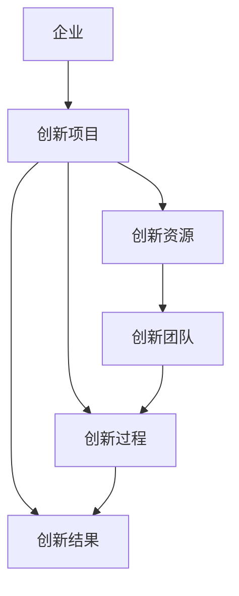
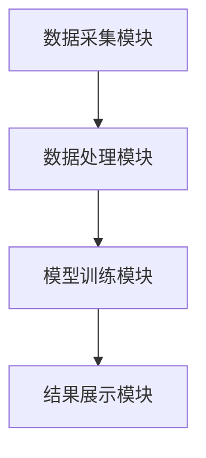
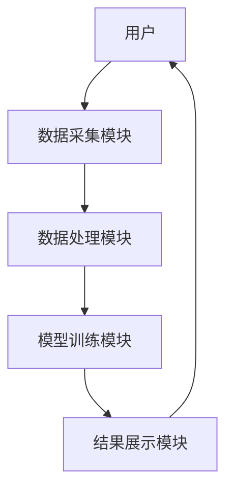

                 


# 《构建AI驱动的企业创新生态系统分析平台》

---

## 关键词：
- AI驱动
- 企业创新生态系统
- 分析平台
- 系统架构
- 机器学习
- 自然语言处理
- 创新管理

---

## 摘要：
随着人工智能技术的快速发展，企业创新管理的模式正在发生深刻的变化。传统的创新管理依赖于人工分析和经验判断，而AI驱动的企业创新生态系统分析平台通过整合大数据分析、自然语言处理和机器学习等技术，为企业提供了一个智能化、系统化的创新管理工具。本文将从企业创新生态系统的基本概念出发，详细探讨AI驱动的分析平台的核心概念、算法原理、系统架构、项目实战以及最佳实践，为企业构建智能化的创新生态系统提供理论和实践指导。

---

## 第1章: AI驱动的企业创新生态系统概述

### 1.1 企业创新生态系统的核心概念
企业创新生态系统是指由企业内部的创新项目、创新资源、创新过程和创新文化等核心要素构成的一个动态的、相互关联的系统。AI驱动的创新生态系统分析平台通过收集、分析和处理海量数据，帮助企业识别创新机会、优化资源配置、提升创新效率。

#### 1.1.1 创新生态系统的基本特征
创新生态系统具有动态性、复杂性和系统性三大特征。动态性体现在创新过程的不断迭代和优化中；复杂性体现在创新资源的多样性和创新过程的多阶段性中；系统性体现在创新生态系统中各要素的相互关联和协同作用中。

#### 1.1.2 AI在企业创新生态系统中的作用
AI技术的应用使得企业创新管理从传统的经验驱动向数据驱动转变。通过自然语言处理技术，AI能够从海量文本数据中提取关键信息；通过机器学习算法，AI能够预测创新趋势和潜在风险；通过大数据分析技术，AI能够优化资源配置和创新过程。

### 1.2 企业创新生态系统分析平台的必要性
传统的企业创新管理依赖于人工分析和经验判断，存在效率低、成本高、主观性强等问题。AI驱动的创新生态系统分析平台通过自动化数据处理和智能化分析，能够显著提升创新管理的效率和准确性。

#### 1.2.1 传统企业创新管理的局限性
- 数据处理能力有限，难以应对海量数据的分析需求。
- 创新项目的评估和筛选依赖于主观判断，缺乏客观依据。
- 创新资源的分配缺乏系统性，难以实现最优配置。

#### 1.2.2 AI驱动的创新生态系统分析平台的优势
- 自动化数据处理能力，能够高效处理海量数据。
- 基于机器学习的智能分析能力，能够提供客观的评估和预测。
- 系统化的资源配置能力，能够实现创新资源的最优配置。

#### 1.2.3 平台对企业创新管理的价值
- 提高创新项目的筛选和评估效率。
- 优化创新资源的分配和利用。
- 提升创新过程的透明度和可追溯性。

### 1.3 AI驱动的创新生态系统分析平台的技术基础
AI驱动的创新生态系统分析平台的技术基础主要包括大数据分析、自然语言处理和机器学习等技术。

#### 1.3.1 大数据分析技术
大数据分析技术能够从海量数据中提取有价值的信息，为创新项目的评估和筛选提供数据支持。

#### 1.3.2 自然语言处理技术
自然语言处理技术能够从文本数据中提取关键词、主题和情感倾向，帮助识别创新趋势和潜在机会。

#### 1.3.3 机器学习算法
机器学习算法能够通过历史数据训练模型，预测创新项目的成功率和潜在风险。

### 1.4 企业创新生态系统分析平台的应用场景
AI驱动的创新生态系统分析平台可以在多个场景中应用，包括企业内部创新项目管理、创新资源优化配置和创新过程监控等。

#### 1.4.1 企业内部创新项目管理
通过平台，企业可以对创新项目进行实时监控和评估，及时发现和解决问题。

#### 1.4.2 创新资源优化配置
通过平台，企业可以优化创新资源的分配，提高创新项目的成功率。

#### 1.4.3 创新过程监控与反馈
通过平台，企业可以对创新过程进行实时监控，并根据反馈结果不断优化创新策略。

### 1.5 本章小结
本章从企业创新生态系统的基本概念出发，介绍了AI驱动的创新生态系统分析平台的必要性和技术基础，以及平台在企业创新管理中的应用场景。

---

## 第2章: 核心概念与联系

### 2.1 企业创新生态系统分析平台的核心概念
企业创新生态系统分析平台的核心概念包括数据源、分析模型、平台功能和用户角色等。

#### 2.1.1 数据源与数据类型
数据源包括企业内部数据、外部市场数据和创新项目数据等。数据类型包括文本数据、结构化数据和非结构化数据等。

#### 2.1.2 分析模型与算法
分析模型包括文本挖掘模型、预测模型和分类模型等。算法包括自然语言处理算法、机器学习算法和深度学习算法等。

#### 2.1.3 平台功能与用户角色
平台功能包括数据采集、数据处理、模型训练和结果展示等。用户角色包括企业管理员、创新项目负责人和数据分析师等。

#### 2.1.4 实体关系图（ER图）架构
通过ER图，我们可以清晰地看到平台中各实体之间的关系。



---

## 第3章: 自然语言处理算法原理

### 3.1 自然语言处理的基本概念
自然语言处理（NLP）是人工智能领域的重要分支，旨在让计算机能够理解、分析和生成人类语言。

#### 3.1.1 NLP的核心任务
NLP的核心任务包括文本分类、信息提取、文本生成和机器翻译等。

#### 3.1.2 NLP的应用场景
NLP的应用场景包括文本摘要、情感分析、关键词提取和实体识别等。

### 3.2 自然语言处理算法的实现步骤
自然语言处理算法的实现步骤包括数据预处理、特征提取、模型训练和结果输出。

#### 3.2.1 数据预处理
数据预处理包括文本清洗、分词和停用词去除等。

#### 3.2.2 特征提取
特征提取包括TF-IDF和词嵌入等方法。

#### 3.2.3 模型训练
模型训练包括基于机器学习的文本分类和基于深度学习的文本生成等。

#### 3.2.4 结果输出
结果输出包括分类结果、摘要文本和实体识别结果等。

### 3.3 自然语言处理算法的数学模型
自然语言处理算法的数学模型包括概率模型、统计模型和深度学习模型等。

#### 3.3.1 概率模型
概率模型包括贝叶斯分类器和马尔可夫链等。

#### 3.3.2 统计模型
统计模型包括线性回归和逻辑回归等。

#### 3.3.3 深度学习模型
深度学习模型包括卷积神经网络（CNN）、循环神经网络（RNN）和Transformer模型等。

### 3.4 自然语言处理算法的Python实现
以下是自然语言处理算法的Python实现示例：

```python
import numpy as np
from sklearn.feature_extraction.text import TfidfVectorizer
from sklearn.naive_bayes import MultinomialNB

# 数据预处理
corpus = ["This is a sample text.", "This is another sample text.", "This is the third text."]

# 特征提取
vectorizer = TfidfVectorizer()
X = vectorizer.fit_transform(corpus)

# 模型训练
model = MultinomialNB()
model.fit(X, [0, 1, 2])

# 模型预测
new_doc = ["This is a new text."]
X_new = vectorizer.transform(new_doc)
print(model.predict(X_new))
```

### 3.5 自然语言处理算法的应用案例
以下是一个自然语言处理算法的应用案例：

#### 3.5.1 案例背景
某企业希望通过分析客户反馈文本，识别客户的主要投诉点。

#### 3.5.2 数据预处理
客户反馈文本经过清洗和分词处理。

#### 3.5.3 特征提取
使用TF-IDF方法提取关键词。

#### 3.5.4 模型训练
使用朴素贝叶斯分类器进行文本分类，识别主要投诉类别。

#### 3.5.5 结果输出
模型预测结果显示，客户的主要投诉点是产品质量和服务态度。

---

## 第4章: 机器学习算法原理

### 4.1 机器学习的基本概念
机器学习是人工智能领域的重要分支，旨在通过数据训练模型，实现对新数据的预测和分类。

#### 4.1.1 机器学习的核心任务
机器学习的核心任务包括分类、回归、聚类和降维等。

#### 4.1.2 机器学习的应用场景
机器学习的应用场景包括图像识别、语音识别、推荐系统和异常检测等。

### 4.2 机器学习算法的实现步骤
机器学习算法的实现步骤包括数据预处理、特征提取、模型训练和结果输出。

#### 4.2.1 数据预处理
数据预处理包括数据清洗、特征选择和数据标准化等。

#### 4.2.2 特征提取
特征提取包括主成分分析（PCA）和线性判别分析（LDA）等。

#### 4.2.3 模型训练
模型训练包括支持向量机（SVM）、随机森林和神经网络等。

#### 4.2.4 结果输出
结果输出包括分类结果、回归结果和聚类结果等。

### 4.3 机器学习算法的数学模型
机器学习算法的数学模型包括线性模型、树模型和神经网络模型等。

#### 4.3.1 线性模型
线性模型包括线性回归和逻辑回归等。

#### 4.3.2 树模型
树模型包括决策树、随机森林和梯度提升树（GBDT）等。

#### 4.3.3 神经网络模型
神经网络模型包括多层感知机（MLP）、卷积神经网络（CNN）和循环神经网络（RNN）等。

### 4.4 机器学习算法的Python实现
以下是机器学习算法的Python实现示例：

```python
import numpy as np
from sklearn import datasets
from sklearn.linear_model import LinearRegression

# 数据预处理
X, y = datasets.load_boston(return_X_y=True)

# 模型训练
model = LinearRegression()
model.fit(X, y)

# 模型预测
new_data = np.array([[2.5, 5.5, 1.0, 0.0, 0.4, 2.2, 3.2, 2.0, 4.0, 2.0, 45, 17, 3, 2, 40]])
print(model.predict(new_data))
```

### 4.5 机器学习算法的应用案例
以下是一个机器学习算法的应用案例：

#### 4.5.1 案例背景
某企业希望通过预测销售数据，优化销售策略。

#### 4.5.2 数据预处理
销售数据经过清洗和标准化处理。

#### 4.5.3 特征提取
使用PCA方法进行特征降维。

#### 4.5.4 模型训练
使用线性回归模型进行销售预测。

#### 4.5.5 结果输出
模型预测结果显示，未来三个月的销售预测值为X。

---

## 第5章: 系统分析与架构设计方案

### 5.1 系统架构设计
系统架构设计包括功能模块划分、数据流设计和组件交互设计。

#### 5.1.1 功能模块划分
功能模块包括数据采集模块、数据处理模块、模型训练模块和结果展示模块。

#### 5.1.2 数据流设计
数据流包括数据采集、数据处理、模型训练和结果展示。

#### 5.1.3 组件交互设计
组件交互包括数据采集模块与数据处理模块的交互、数据处理模块与模型训练模块的交互等。

### 5.2 系统架构图
以下是系统架构图：



### 5.3 系统接口设计
系统接口设计包括API接口设计和数据接口设计。

#### 5.3.1 API接口设计
API接口包括数据采集接口、模型训练接口和结果查询接口。

#### 5.3.2 数据接口设计
数据接口包括数据库接口和文件接口。

### 5.4 系统交互图
以下是系统交互图：



---

## 第6章: 项目实战

### 6.1 环境安装
项目实战需要安装Python、Jupyter Notebook和相关机器学习库。

#### 6.1.1 安装Python
```bash
python --version
pip install --upgrade pip
```

#### 6.1.2 安装Jupyter Notebook
```bash
pip install jupyter
jupyter notebook
```

#### 6.1.3 安装机器学习库
```bash
pip install scikit-learn numpy pandas
```

### 6.2 系统核心实现
系统核心实现包括数据采集、数据处理、模型训练和结果展示。

#### 6.2.1 数据采集
```python
import requests
import json

url = "https://example.com/api/data"
response = requests.get(url)
data = json.loads(response.text)
print(data)
```

#### 6.2.2 数据处理
```python
import pandas as pd

df = pd.DataFrame(data)
df.head()
```

#### 6.2.3 模型训练
```python
from sklearn.model_selection import train_test_split
from sklearn.

