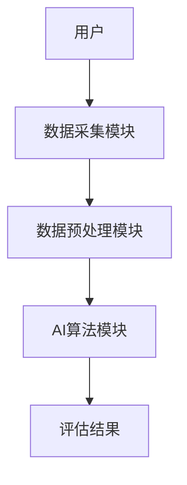
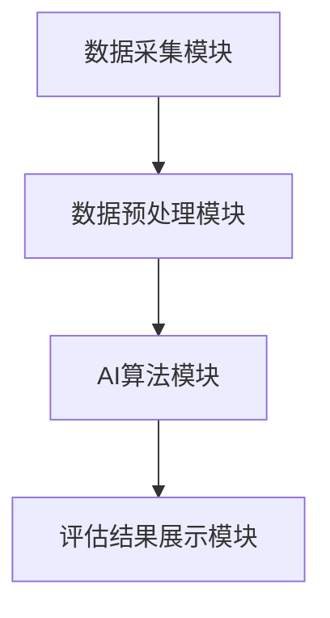
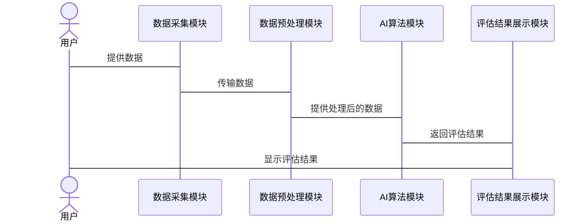

                 


# 《构建AI驱动的企业创新绩效评估系统》

---

## 关键词：
- AI驱动
- 企业创新
- 绩效评估
- 系统架构
- 机器学习
- 数据分析

---

## 摘要：
本文详细探讨了如何利用人工智能技术构建企业创新绩效评估系统。通过分析传统评估方法的局限性，介绍了AI驱动的创新绩效评估系统的核心概念、算法原理、系统架构，并通过实际案例展示了系统的实现过程。文章最后总结了最佳实践和注意事项，为读者提供了全面的指导。

---

## 正文：

### 第一部分: 背景介绍

#### 第1章: AI驱动的企业创新绩效评估系统概述

##### 1.1 问题背景与挑战

企业在创新过程中面临诸多挑战，传统的绩效评估方法往往依赖主观判断，难以量化和实时反馈。AI技术的应用为企业提供了更精准、高效的评估手段。

**1.1.1 传统企业绩效评估的局限性**

- 主观性强，缺乏客观数据支持。
- 评估周期长，难以实时反馈。
- 难以捕捉创新过程中的动态变化。

**1.1.2 创新绩效评估的重要性**

- 量化创新成果，为决策提供数据支持。
- 识别优秀团队和项目，激励创新行为。
- 提高企业竞争力，推动持续创新。

**1.1.3 AI技术在绩效评估中的应用潜力**

- 利用机器学习模型分析大量数据，提取关键指标。
- 实现实时监控和预测，提供动态反馈。
- 自动化评估流程，提高效率和准确性。

##### 1.2 创新绩效评估系统的核心概念

**1.2.1 创新绩效的定义与维度**

创新绩效包括创新成果的数量、质量和影响力。常用指标包括专利数量、新产品推出速度、市场占有率等。

**1.2.2 AI驱动的评估机制**

AI通过自然语言处理、机器学习等技术，自动分析企业文档、市场反馈等数据，生成评估结果。

**1.2.3 系统的目标与边界**

系统目标：提供实时、精准的创新绩效评估，支持企业决策。

系统边界：仅限于企业内部数据，不涉及外部合作数据。

##### 1.3 本章小结

本章介绍了AI驱动的创新绩效评估系统的背景和重要性，明确了系统的核心概念和目标。

---

### 第二部分: 核心概念与联系

#### 第2章: 核心概念与系统架构

##### 2.1 核心概念的原理与特征

**2.1.1 数据驱动的评估模型**

评估模型基于企业数据，通过机器学习算法生成评估结果。

**2.1.2 AI算法的核心特征**

- 数据驱动：依赖大量数据进行训练。
- 自适应性：能够根据数据变化自动调整模型。
- 实时性：支持实时数据处理和反馈。

**2.1.3 系统的可扩展性与实时性**

系统设计需考虑数据量的扩展，支持实时数据处理。

##### 2.2 实体关系图与系统架构

**2.2.1 ER实体关系图**

```mermaid
er
  actor: 评估系统用户
  entity: 企业创新数据
  entity: 评估指标
  entity: AI算法模型
  relation: 用户-数据
  relation: 数据-指标
  relation: 指标-算法
```

**2.2.2 系统架构图**



##### 2.3 本章小结

本章通过ER图和架构图展示了系统的组成部分及其关系，明确了系统的核心概念和架构设计。

---

### 第三部分: 算法原理

#### 第3章: 算法原理与实现

##### 3.1 算法原理

**3.1.1 机器学习模型**

选择线性回归模型作为基础算法，用于评估企业创新绩效。

**3.1.2 算法步骤**

1. 数据预处理：清洗和标准化数据。
2. 模型训练：使用训练数据训练模型。
3. 模型预测：对测试数据进行预测。
4. 模型评估：计算评估指标，如均方误差（MSE）。

##### 3.2 算法实现

**3.2.1 Python代码实现**

```python
import numpy as np
from sklearn.linear_model import LinearRegression
from sklearn.metrics import mean_squared_error

# 示例数据
X = np.array([[1], [2], [3], [4], [5]])
y = np.array([2, 4, 5, 4, 6])

# 模型训练
model = LinearRegression()
model.fit(X, y)

# 预测
y_pred = model.predict(X)

# 评估
mse = mean_squared_error(y, y_pred)
print(f"均方误差: {mse}")
```

**3.2.2 数学模型**

线性回归模型的数学表达式为：

$$ y = \beta_0 + \beta_1 x + \epsilon $$

其中，$\beta_0$是截距，$\beta_1$是斜率，$\epsilon$是误差项。

##### 3.3 本章小结

本章详细讲解了机器学习算法在创新绩效评估中的应用，通过代码示例和数学模型展示了算法的实现过程。

---

### 第四部分: 系统分析与架构设计

#### 第4章: 系统分析与架构设计

##### 4.1 系统功能设计

**4.1.1 功能模块**

- 数据采集模块：收集企业创新数据。
- 数据预处理模块：清洗和标准化数据。
- AI算法模块：训练和预测模型。
- 评估结果展示模块：可视化评估结果。

##### 4.2 系统架构图



##### 4.3 接口设计与交互

**4.3.1 接口设计**

- 数据接口：提供数据输入和输出接口。
- 模型接口：定义模型训练和预测的API。

**4.3.2 交互设计**



##### 4.4 本章小结

本章详细描述了系统的功能设计、架构设计和接口设计，确保系统的高效运行和良好交互。

---

### 第五部分: 项目实战

#### 第5章: 项目实战与案例分析

##### 5.1 项目环境安装

**5.1.1 安装Python和相关库**

```bash
pip install numpy scikit-learn matplotlib
```

##### 5.2 核心代码实现

**5.2.1 数据处理代码**

```python
import pandas as pd
import numpy as np
from sklearn.model_selection import train_test_split
from sklearn.linear_model import LinearRegression
from sklearn.metrics import r2_score

# 加载数据
data = pd.read_csv('innovation_data.csv')

# 数据预处理
X = data[['R&D投资', '创新团队规模']]
y = data['创新绩效']

# 划分训练集和测试集
X_train, X_test, y_train, y_test = train_test_split(X, y, test_size=0.2, random_state=42)

# 模型训练
model = LinearRegression()
model.fit(X_train, y_train)

# 预测
y_pred = model.predict(X_test)

# 评估
print(f"R²得分: {r2_score(y_test, y_pred)}")
```

**5.2.2 可视化代码**

```python
import matplotlib.pyplot as plt

plt.scatter(X_test['R&D投资'], y_test, color='b', label='实际值')
plt.scatter(X_test['R&D投资'], y_pred, color='r', label='预测值')
plt.xlabel('R&D投资')
plt.ylabel('创新绩效')
plt.legend()
plt.show()
```

##### 5.3 案例分析

**案例背景：**

某科技公司希望评估其创新绩效，选择了过去三年的研发投资和团队规模作为评估指标。

**数据分析：**

通过模型预测，公司的创新绩效与R&D投资呈正相关，但团队规模的影响较小。

**结论：**

公司应增加R&D投资，优化资源配置，以提升创新绩效。

##### 5.4 本章小结

本章通过实际案例展示了系统的实现过程，从数据处理到模型训练，再到结果可视化，帮助读者掌握系统的实际应用。

---

### 第六部分: 最佳实践与总结

#### 第6章: 最佳实践与总结

##### 6.1 最佳实践

- 数据预处理：确保数据质量，减少偏差。
- 模型选择：根据业务需求选择合适算法。
- 系统优化：定期更新模型，适应业务变化。

##### 6.2 小结与展望

本文详细探讨了AI驱动的企业创新绩效评估系统的构建过程，从理论到实践，为读者提供了全面的指导。未来，随着AI技术的发展，系统将更加智能化和精准化。

##### 6.3 注意事项

- 数据隐私：确保数据安全和合规。
- 模型解释性：选择易于解释的模型，便于业务人员理解。
- 系统维护：定期检查和更新系统，确保稳定运行。

##### 6.4 拓展阅读

建议读者进一步学习以下内容：

- 先进的机器学习算法，如随机森林、神经网络。
- 数据可视化工具，如Tableau、Power BI。
- 项目管理方法，如敏捷开发。

##### 6.5 本章小结

本章总结了系统的最佳实践，提供了小结和展望，帮助读者更好地理解和应用系统。

---

### 附录

#### 附录A: 参考资料

- 《机器学习实战》
- 《Python数据处理与分析》
- 《企业绩效评估指标体系》

#### 附录B: 工具推荐

- Python编程语言
- Scikit-learn机器学习库
- Pandas数据处理库
- Matplotlib数据可视化库

---

## 结语

构建AI驱动的企业创新绩效评估系统是一项复杂但极具价值的工程。通过本文的指导，读者可以掌握系统的构建方法，并在实际工作中应用这些技术，推动企业的持续创新。

