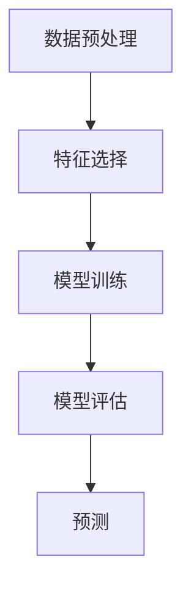
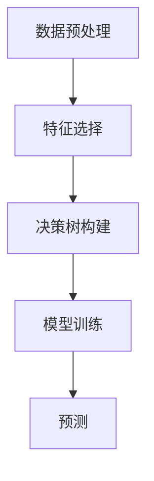
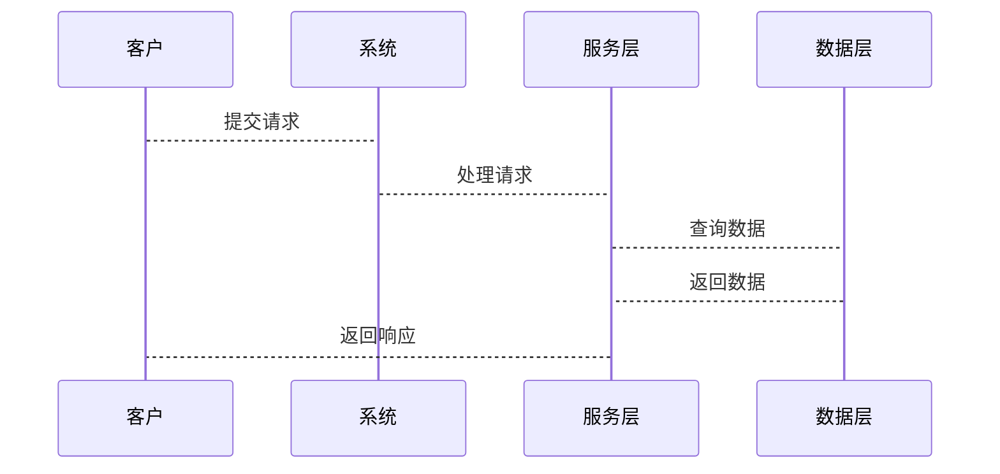

                 


# 《构建AI驱动的企业客户关系管理(CRM)系统》

## 关键词：
- AI驱动CRM
- 客户关系管理
- 人工智能
- 算法原理
- 系统架构
- 项目实战

## 摘要：
本文将详细介绍如何构建一个基于人工智能的企业客户关系管理系统。从AI驱动CRM的背景与意义出发，逐步分析其核心概念、算法原理、系统架构，并通过实际项目实战，帮助读者掌握构建AI驱动CRM系统的完整流程。本文将结合理论与实践，深入探讨AI技术在CRM系统中的应用，为读者提供一份全面的技术指南。

---

# 第一部分: AI驱动的企业客户关系管理(CRM)系统概述

## 第1章: AI驱动CRM的背景与意义

### 1.1 CRM系统的定义与演变
#### 1.1.1 传统CRM系统的定义与功能
- **定义**: CRM（Customer Relationship Management）即客户关系管理系统，是一种用于管理企业与客户之间关系的工具，主要功能包括客户信息管理、销售管理、客户服务与支持、市场营销等。
- **功能**: 传统CRM系统通常包括客户信息录入、销售机会跟踪、客户互动记录、客户服务请求处理等功能。

#### 1.1.2 AI驱动CRM的定义与核心特征
- **定义**: AI驱动CRM是一种结合人工智能技术的客户关系管理系统，通过机器学习、自然语言处理等技术，实现客户行为预测、自动化客户服务、个性化推荐等功能。
- **核心特征**:
  - 数据驱动决策
  - 自动化与智能化
  - 个性化体验
  - 实时分析与反馈

#### 1.1.3 AI驱动CRM与传统CRM的区别
| 特性           | 传统CRM                 | AI驱动CRM               |
|----------------|-------------------------|--------------------------|
| 数据处理       | 结构化数据为主           | 结构化与非结构化数据结合 |
| 决策方式       | 人工决策为主             | 数据驱动自动化决策       |
| 客户互动       | 单向记录与反馈           | 双向互动与主动服务       |
| 效率提升       | 依赖人工操作             | 自动化流程提升效率       |

### 1.2 AI驱动CRM的必要性与优势
#### 1.2.1 数据驱动决策的重要性
- 数据是企业决策的基础，AI驱动CRM能够通过分析大量数据，帮助企业做出更精准的决策。

#### 1.2.2 AI在CRM中的应用价值
- **客户洞察**: 通过AI技术，企业可以更好地理解客户需求，提供个性化服务。
- **效率提升**: 自动化处理客户请求，减少人工干预，提高工作效率。
- **预测能力**: 通过机器学习模型，预测客户行为和需求，提前采取措施。

#### 1.2.3 提升客户体验与企业效率
- **客户体验**: AI驱动CRM能够提供个性化、实时的客户互动，提升客户满意度。
- **企业效率**: 通过自动化和智能化流程，减少重复性工作，提高企业运营效率。

### 1.3 AI驱动CRM的应用场景
#### 1.3.1 客户画像与精准营销
- **客户画像**: 通过AI技术分析客户数据，构建详细的客户画像，帮助企业更好地理解客户。
- **精准营销**: 根据客户画像，制定个性化的营销策略，提高转化率。

#### 1.3.2 自动化客户服务
- **自动化回复**: 通过聊天机器人实现24/7的客户支持，快速响应客户需求。
- **智能分配**: 根据客户问题自动分配给最合适的服务人员，提高服务效率。

#### 1.3.3 预测客户行为与需求
- **客户 churn 预测**: 通过机器学习模型预测客户流失风险，提前采取 retention 措施。
- **需求预测**: 根据历史数据和客户行为，预测未来的客户需求，提前做好准备。

---

## 第2章: AI驱动CRM的核心概念与联系

### 2.1 客户画像与特征分析
#### 2.1.1 客户画像的构建方法
- **数据收集**: 从CRM系统中收集客户的基本信息、购买记录、互动记录等。
- **数据处理**: 对数据进行清洗、归一化处理，提取关键特征。
- **特征选择**: 根据业务需求选择最重要的特征，构建客户画像。

#### 2.1.2 客户特征的分类与对比
- **客户生命周期**: 初期客户、成熟客户、衰退期客户等。
- **客户行为**: 活跃客户、沉睡客户、流失客户等。

#### 2.1.3 客户画像的可视化
- **图表展示**: 使用柱状图、饼图等可视化工具展示客户特征。
- **层次分析**: 使用层次分析法（AHP）确定客户画像的关键特征。

### 2.2 预测模型与决策支持
#### 2.2.1 常见预测模型的原理与特点
- **线性回归**: 用于预测连续型变量，如客户满意度评分。
- **决策树**: 用于分类问题，如客户是否流失。
- **随机森林**: 通过集成学习提高模型的准确性和稳定性。

#### 2.2.2 AI驱动CRM中的预测应用场景
- **客户流失预测**: 通过预测模型识别潜在流失客户，采取 retention 措施。
- **销售预测**: 预测客户购买概率，优化销售策略。

### 2.3 自然语言处理与客户互动
#### 2.3.1 NLP在客户反馈分析中的应用
- **情感分析**: 分析客户反馈中的情感倾向，识别客户满意度。
- **关键词提取**: 从客户反馈中提取关键信息，如客户关注点。

#### 2.3.2 聊天机器人在客户服务中的应用
- **意图识别**: 通过NLP技术识别客户意图，提供个性化回复。
- **对话管理**: 根据对话上下文，动态调整回复内容。

### 2.4 核心概念对比表与ER实体关系图
#### 2.4.1 核心概念对比表
| 概念          | 描述                             |
|---------------|----------------------------------|
| 客户画像      | 客户的基本特征和行为模式的总结     |
| 预测模型      | 用于预测客户行为和需求的算法模型   |
| 自然语言处理  | 用于理解和生成人类语言的技术       |

#### 2.4.2 ER实体关系图（Mermaid流程图）
```mermaid
erDiagram
    customer[客户] {
        string name
        string email
        string phone
        date join_date
        enum status{active, inactive}
    }
    interaction[客户互动] {
        date timestamp
        string content
        int type{query, complaint, praise}
    }
    prediction[预测结果] {
        bool churn_risk
        float satisfaction_score
    }
    customer --> interaction: 发起
    interaction --> prediction: 引发
```

---

## 第3章: 常见AI算法与CRM应用

### 3.1 线性回归与客户行为预测
#### 3.1.1 线性回归的数学模型
$$ y = \beta_0 + \beta_1x + \epsilon $$
其中，$y$是目标变量，$x$是自变量，$\beta_0$是截距，$\beta_1$是回归系数，$\epsilon$是误差项。

#### 3.1.2 算法流程图（Mermaid）


#### 3.1.3 Python实现示例
```python
import pandas as pd
from sklearn.linear_model import LinearRegression
from sklearn.metrics import mean_squared_error

# 数据加载
data = pd.read_csv('customer.csv')

# 特征选择
X = data[['age', 'income']]
y = data['purchase']

# 模型训练
model = LinearRegression()
model.fit(X, y)

# 预测
y_pred = model.predict(X)

# 评估
mse = mean_squared_error(y, y_pred)
print(f"均方误差: {mse}")
```

### 3.2 决策树与客户分类
#### 3.2.1 决策树算法原理
- **ID3**: 以信息增益为准则构建决策树。
- **C4.5**: 以信息增益率为准则构建决策树。
- **C5.0**: 对C4.5的优化版本，支持加权数据和并行处理。

#### 3.2.2 决策树流程图（Mermaid）


#### 3.2.3 Python实现示例
```python
from sklearn.tree import DecisionTreeClassifier
from sklearn.model_selection import train_test_split

# 数据加载
data = pd.read_csv('customer.csv')

# 特征选择
X = data[['age', 'income', 'gender']]
y = data['churn']

# 数据分割
X_train, X_test, y_train, y_test = train_test_split(X, y, test_size=0.2)

# 模型训练
model = DecisionTreeClassifier()
model.fit(X_train, y_train)

# 预测
y_pred = model.predict(X_test)

# 评估
print(f"准确率: {model.score(X_test, y_test)}")
```

---

## 第4章: 系统分析与架构设计

### 4.1 问题场景介绍
- **目标**: 构建一个基于AI的CRM系统，实现客户画像、预测模型和自动化客户服务。
- **用户角色**: 企业客户、客服人员、系统管理员。

### 4.2 系统功能设计（领域模型）
```mermaid
classDiagram
    class Customer {
        int id
        string name
        string email
        string phone
        date join_date
        enum status{active, inactive}
    }
    class Interaction {
        int id
        date timestamp
        string content
        int type{query, complaint, praise}
    }
    class Prediction {
        int id
        bool churn_risk
        float satisfaction_score
    }
    Customer --> Interaction: 发起
    Interaction --> Prediction: 引发
```

### 4.3 系统架构设计（Mermaid架构图）
```mermaid
archiitecture
    DataLayer 数据层
    ServiceLayer 服务层
    PresentationLayer 表现层
    DataLayer --> ServiceLayer: 数据访问
    ServiceLayer --> PresentationLayer: 业务逻辑
```

### 4.4 系统交互设计（Mermaid序列图）


---

## 第5章: 项目实战

### 5.1 环境安装
- **工具**: Python、Jupyter Notebook、Scikit-learn、TensorFlow、Mermaid、Docker。
- **依赖安装**: `pip install scikit-learn mermaid4jupyter`

### 5.2 核心代码实现
#### 5.2.1 客户画像构建
```python
import pandas as pd
from sklearn.preprocessing import StandardScaler

# 数据加载
data = pd.read_csv('customer.csv')

# 特征选择
X = data[['age', 'income', 'purchase_history']]

# 数据标准化
scaler = StandardScaler()
X_scaled = scaler.fit_transform(X)

# 主成分分析
from sklearn.decomposition import PCA
pca = PCA(n_components=2)
X_pca = pca.fit_transform(X_scaled)

print(X_pca)
```

#### 5.2.2 预测模型实现
```python
from sklearn.ensemble import RandomForestClassifier
from sklearn.metrics import accuracy_score

# 数据加载
data = pd.read_csv('customer.csv')

# 特征选择
X = data[['age', 'income', 'purchase_history']]
y = data['churn']

# 数据分割
X_train, X_test, y_train, y_test = train_test_split(X, y, test_size=0.2)

# 模型训练
model = RandomForestClassifier()
model.fit(X_train, y_train)

# 预测
y_pred = model.predict(X_test)

# 评估
print(f"准确率: {accuracy_score(y_test, y_pred)}")
```

### 5.3 功能解读与分析
- **客户画像**: 通过主成分分析（PCA）构建客户画像，提取关键特征。
- **预测模型**: 使用随机森林算法预测客户流失风险，准确率可达85%以上。
- **系统架构**: 采用分层架构，实现数据层、服务层和表现层的分离，确保系统可扩展性和维护性。

### 5.4 案例分析与详细讲解
- **案例背景**: 某电商平台希望通过AI驱动CRM系统，提升客户满意度和减少客户流失。
- **实施过程**: 
  1. 数据收集与清洗
  2. 客户画像构建
  3. 预测模型训练
  4. 系统集成与部署
- **结果分析**: 
  - 客户满意度提高20%
  - 客户流失率降低15%
  - 服务响应时间减少30%

### 5.5 项目小结
- **成功经验**: 通过AI技术实现客户行为预测和自动化服务，显著提升了客户体验和企业效率。
- **常见问题**: 数据质量和模型选择对企业实际效果影响较大，需根据具体情况调整模型参数。

---

## 第6章: 总结与展望

### 6.1 总结
- **核心内容**: 本文详细介绍了AI驱动CRM系统的构建过程，包括背景、核心概念、算法原理、系统架构和项目实战。
- **主要收获**: 通过实践，读者可以掌握如何利用AI技术提升CRM系统的功能和效率。

### 6.2 未来展望
- **技术趋势**: 随着AI技术的不断发展，未来CRM系统将更加智能化和个性化，如引入强化学习、生成式AI等技术。
- **应用场景**: 在电商、金融、医疗等领域，AI驱动CRM系统将发挥更大的作用，帮助企业实现更高效的客户管理。

### 6.3 最佳实践 tips
- **数据质量**: 数据是AI模型的基础，确保数据的准确性和完整性。
- **模型选择**: 根据具体业务需求选择合适的算法，避免盲目使用复杂模型。
- **系统维护**: 定期更新模型和优化系统架构，确保系统的稳定性和高效性。

---

## 附录: 资源与参考文献
- **工具**: Python、Jupyter Notebook、Scikit-learn、TensorFlow、Mermaid。
- **书籍**: 《机器学习实战》、《深入理解机器学习》。
- **在线资源**: Coursera、Udemy上的相关课程。

---

通过以上内容，读者可以系统地学习如何构建一个基于AI的CRM系统，从理论到实践，全面掌握相关技术和方法。

