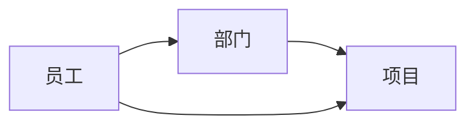
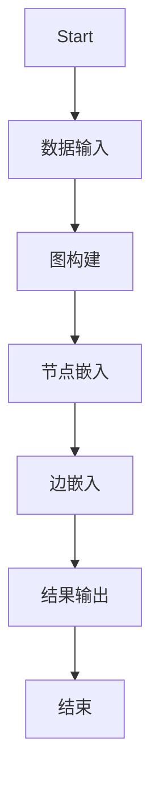
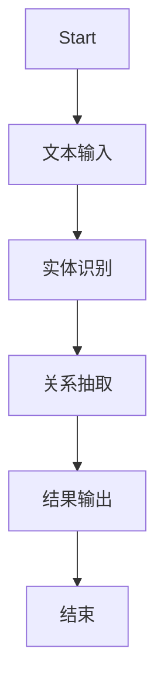
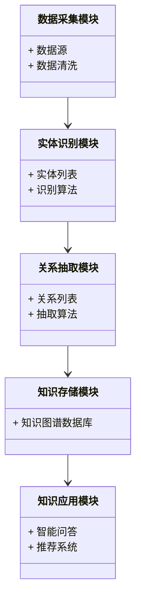
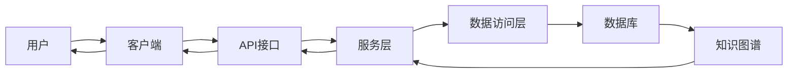

                 


# 构建AI驱动的企业知识图谱：深化领域理解

**关键词：** 知识图谱、AI驱动、企业应用、深度学习、自然语言处理

**摘要：** 本文详细探讨了如何利用人工智能技术构建企业知识图谱，通过分析知识图谱的核心概念、构建算法、系统架构以及实际应用案例，深入理解领域知识，并为企业智能化转型提供解决方案。

---

# 第一部分: 背景介绍

# 第1章: 知识图谱与AI驱动的背景

## 1.1 知识图谱的基本概念

### 1.1.1 什么是知识图谱

知识图谱是一种结构化的数据模型，用于表示实体及其关系。它通过将分散的数据连接起来，形成一个全局的知识网络，帮助机器理解和推理。

**示例：** 在企业中，知识图谱可以将“员工”、“部门”、“职责”等实体连接起来，形成一个完整的企业结构图。

### 1.1.2 知识图谱的特征与优势

- **结构化：** 数据以图结构形式表示，便于计算机处理。
- **可扩展性：** 支持大规模数据的扩展。
- **语义丰富：** 包含实体间的复杂关系，语义信息丰富。

### 1.1.3 知识图谱的构建目标

构建知识图谱的目的是将企业中的隐性知识显式化，便于后续的智能应用，如问答系统、推荐系统等。

---

## 1.2 AI驱动的知识图谱构建背景

### 1.2.1 人工智能技术的发展

人工智能技术的进步，特别是自然语言处理（NLP）和深度学习的发展，为知识图谱的自动构建提供了技术支持。

### 1.2.2 知识图谱与AI的结合

AI技术（如BERT、GPT）被广泛应用于知识图谱的构建，尤其是在实体识别、关系抽取等环节。

### 1.2.3 企业知识管理的现状与挑战

企业面临数据孤岛、知识分散等问题，亟需一种统一的知识管理方式，而知识图谱正是解决方案之一。

---

## 1.3 企业知识图谱的意义

### 1.3.1 知识图谱在企业中的应用价值

- **知识管理：** 将分散的知识整合，便于管理和复用。
- **智能应用：** 支持企业级的智能应用，如智能问答、推荐系统等。

### 1.3.2 AI驱动知识图谱的优势

- **自动化构建：** 利用AI技术实现知识图谱的自动化构建，减少人工成本。
- **动态更新：** 基于实时数据，动态更新知识图谱，保持知识的准确性。

### 1.3.3 知识图谱对企业业务的推动作用

- **提升效率：** 通过知识图谱实现快速知识检索和推理，提升企业效率。
- **数据驱动决策：** 基于知识图谱的分析结果，辅助企业决策。

---

## 1.4 本章小结

本章介绍了知识图谱的基本概念、构建背景及其在企业中的应用价值，为后续内容奠定了基础。

---

# 第二部分: 核心概念与联系

# 第2章: 知识图谱的核心概念与联系

## 2.1 知识图谱的核心要素

### 2.1.1 实体

**实体**是知识图谱的基本单位，代表现实世界中的具体事物或概念。

**示例：** 在企业中，实体可以是“员工”、“部门”、“项目”等。

### 2.1.2 属性

**属性**描述实体的特征或性质。

**示例：** 员工的“姓名”、“职位”、“部门”等都是员工实体的属性。

### 2.1.3 关系

**关系**描述实体之间的关联。

**示例：** 员工A属于部门B，部门B负责项目C，这种关系可以用“属于”和“负责”来描述。

---

## 2.2 知识图谱的构建流程

### 2.2.1 数据采集与预处理

- **数据来源：** 结构化数据（如数据库）、非结构化数据（如文本、图像）。
- **数据清洗：** 去除噪声数据，确保数据质量。

### 2.2.2 实体识别与链接

- **实体识别：** 通过NLP技术从文本中提取实体。
- **实体链接：** 将识别出的实体映射到知识图谱中的唯一标识符。

### 2.2.3 关系抽取与构建

- **关系抽取：** 从文本中识别实体之间的关系。
- **关系构建：** 将关系添加到知识图谱中，形成完整的图结构。

---

## 2.3 知识图谱的表示方法

### 2.3.1 图结构表示

知识图谱可以用图结构表示，节点代表实体，边代表关系。

**示例：** 使用图数据库（如Neo4j）存储知识图谱。

### 2.3.2 本体论表示

本体论是一种形式化知识表示方法，常用于知识图谱的构建。

**示例：** 使用OWL（Web Ontology Language）描述知识图谱的语义。

### 2.3.3 其他表示方法

- ** RDF（资源描述框架）：** 用于描述资源及其属性。
- ** JSON-LD：** 基于JSON的轻量级知识表示方法。

---

## 2.4 知识图谱的扩展与关联

### 2.4.1 实体扩展

- **同义词扩展：** 将同义词映射到同一实体。
- **上下文扩展：** 根据上下文扩展实体的语义。

### 2.4.2 关系扩展

- **反向关系：** 生成关系的逆向关系。
- **传递关系：** 允许关系在图中传递。

### 2.4.3 属性扩展

- **属性层次化：** 将属性组织成层次结构。
- **属性关联：** 描述属性之间的关联关系。

---

## 2.5 核心概念对比表

以下表格对比了实体、属性和关系的核心特征：

| 特征     | 实体         | 属性         | 关系         |
|----------|--------------|--------------|--------------|
| 定义     | 独立存在的事物 | 实体的特征    | 实体间的联系 |
| 示例     | 员工         | 姓名、职位    | 员工属于部门 |

---

## 2.6 ER实体关系图

以下是一个简单的ER图，展示了员工、部门和项目之间的关系：



---

## 2.7 本章小结

本章详细介绍了知识图谱的核心概念及其之间的联系，为后续的构建算法和系统设计奠定了基础。

---

# 第三部分: 算法原理

# 第3章: 知识图谱的构建算法

## 3.1 算法选择与原理

### 3.1.1 图嵌入算法

**图嵌入**是一种将图结构数据转换为低维向量的技术，常用于知识图谱的表示学习。

### 3.1.2 关系抽取算法

**关系抽取**通过自然语言处理技术，从文本中识别实体之间的关系。

---

## 3.2 图嵌入算法实现

### 3.2.1 算法流程

以下是一个图嵌入算法的流程图：



### 3.2.2 算法代码实现

以下是一个简单的图嵌入算法实现代码：

```python
import numpy as np
from sklearn.manifold import TSNE

def graph_embedding(graph):
    # 将图转换为节点和边的列表
    nodes = list(graph.nodes())
    edges = [(u, v) for u, v in graph.edges()]
    
    # 使用t-SNE进行嵌入
    node_embeddings = TSNE(n_components=2).fit_transform(graph.nodes())
    
    return node_embeddings
```

### 3.2.3 数学公式

图嵌入算法的数学公式如下：

$$
X_{emb} = f(X_{\text{input}})
$$

其中，$X_{\text{input}}$ 是输入的图数据，$f$ 是嵌入函数。

---

## 3.3 关系抽取算法实现

### 3.3.1 算法流程

以下是一个关系抽取算法的流程图：



### 3.3.2 算法代码实现

以下是一个关系抽取算法的实现代码：

```python
from spacy import load

nlp = load("en_core_web_sm")

def extract_relations(text):
    doc = nlp(text)
    relations = []
    for ent1 in doc.ents:
        for ent2 in doc.ents:
            if ent1.start < ent2.start and ent1.end < ent2.end:
                relations.append((ent1.text, "属于", ent2.text))
    return relations
```

### 3.3.3 数学公式

关系抽取算法的数学公式如下：

$$
R = \text{argmax}_{r \in R_{\text{候选关系}}} P(r | t_1, t_2)
$$

其中，$t_1$ 和 $t_2$ 是文本中的两个实体，$R$ 是抽取的关系。

---

## 3.4 本章小结

本章详细介绍了知识图谱构建中的两种核心算法：图嵌入算法和关系抽取算法，并通过代码示例和数学公式进行了详细讲解。

---

# 第四部分: 系统分析与架构设计

# 第4章: 知识图谱构建系统的架构设计

## 4.1 系统分析

### 4.1.1 系统目标

构建一个基于AI的知识图谱系统，支持企业知识的自动化构建、存储和应用。

### 4.1.2 系统范围

系统涵盖数据采集、实体识别、关系抽取、知识存储和知识应用等功能。

---

## 4.2 系统功能设计

### 4.2.1 功能模块

- **数据采集模块：** 采集企业数据，包括结构化和非结构化数据。
- **实体识别模块：** 使用NLP技术识别实体。
- **关系抽取模块：** 识别实体之间的关系。
- **知识存储模块：** 存储知识图谱数据。
- **知识应用模块：** 提供智能问答、推荐等应用。

### 4.2.2 领域模型

以下是一个知识图谱系统的类图：



---

## 4.3 系统架构设计

### 4.3.1 架构图

以下是一个知识图谱系统的架构图：


---

## 4.4 系统接口设计

### 4.4.1 接口描述

- **实体识别接口：** 输入文本，输出实体列表。
- **关系抽取接口：** 输入实体对，输出关系。
- **知识查询接口：** 输入查询条件，输出知识图谱数据。

---

## 4.5 系统交互设计

### 4.5.1 交互流程

以下是一个知识图谱系统的交互流程图：



---

## 4.6 本章小结

本章详细介绍了知识图谱构建系统的架构设计，包括功能模块、系统架构、接口设计和交互设计。

---

# 第五部分: 项目实战

# 第5章: 知识图谱构建的项目实战

## 5.1 环境安装

### 5.1.1 安装Python环境

```bash
python --version
pip install --upgrade pip
```

### 5.1.2 安装依赖库

```bash
pip install numpy spacy neo4j
```

---

## 5.2 核心代码实现

### 5.2.1 数据采集模块

```python
import requests

def fetch_data(url):
    response = requests.get(url)
    return response.text
```

### 5.2.2 实体识别模块

```python
import spacy

nlp = spacy.load("en_core_web_sm")

def extract_entities(text):
    doc = nlp(text)
    entities = [ent.text for ent in doc.ents]
    return entities
```

### 5.2.3 关系抽取模块

```python
from spacy import displacy

def extract_relations(doc):
    relations = []
    for token in doc:
        if token.head == token and token.dep_ == "ROOT":
            relations.append((token.text, "ROOT"))
    return relations
```

### 5.2.4 知识存储模块

```python
from neo4j import GraphDatabase

def store_knowledge_graph(graph, driver):
    # 实现知识图谱存储逻辑
    pass
```

### 5.2.5 知识应用模块

```python
def ask_question(kg, question):
    # 实现智能问答逻辑
    pass
```

---

## 5.3 代码应用解读与分析

### 5.3.1 数据采集模块解读

- **功能：** 从指定URL获取数据。
- **实现：** 使用`requests`库发送HTTP请求，返回响应文本。

### 5.3.2 实体识别模块解读

- **功能：** 使用spaCy模型识别文本中的实体。
- **实现：** 将文本输入模型，提取实体列表。

### 5.3.3 关系抽取模块解读

- **功能：** 识别实体之间的关系。
- **实现：** 基于依存句法分析，识别根节点，建立实体关系。

---

## 5.4 实际案例分析

### 5.4.1 案例背景

假设我们有一个企业文档，需要构建一个员工-部门-项目的知识图谱。

### 5.4.2 数据采集

从企业文档中获取员工信息、部门信息和项目信息。

### 5.4.3 实体识别

识别出员工、部门和项目等实体。

### 5.4.4 关系抽取

抽取员工属于部门、部门负责项目等关系。

### 5.4.5 知识存储

将知识图谱存储到图数据库中，便于后续查询和应用。

---

## 5.5 项目小结

本章通过一个实际案例，详细讲解了知识图谱构建的整个过程，包括环境安装、核心代码实现、案例分析等。

---

# 第六部分: 最佳实践与总结

# 第6章: 最佳实践与总结

## 6.1 最佳实践

### 6.1.1 数据质量

- 确保数据的准确性、完整性和一致性。

### 6.1.2 模型选择

- 根据具体场景选择合适的NLP模型和算法。

### 6.1.3 系统优化

- 优化系统性能，提升知识图谱的构建和查询效率。

---

## 6.2 小结

本文详细探讨了如何构建AI驱动的企业知识图谱，从背景介绍、核心概念、算法原理、系统架构到项目实战，全面解析了知识图谱的构建过程。

---

## 6.3 注意事项

- 知识图谱的构建需要结合企业的实际需求，避免盲目追求技术复杂度。
- 数据隐私和安全问题需要高度重视，确保数据的安全性和合规性。

---

## 6.4 拓展阅读

- 《Knowledge Graph Construction: A Comprehensive Survey》
- 《Deep Learning for Natural Language Processing》

---

**结束语：** 通过本文的讲解，读者可以系统地了解如何构建AI驱动的企业知识图谱，并将其应用于企业智能化转型中。希望本文能为相关领域的研究和实践提供有价值的参考。

---

**全文完**

