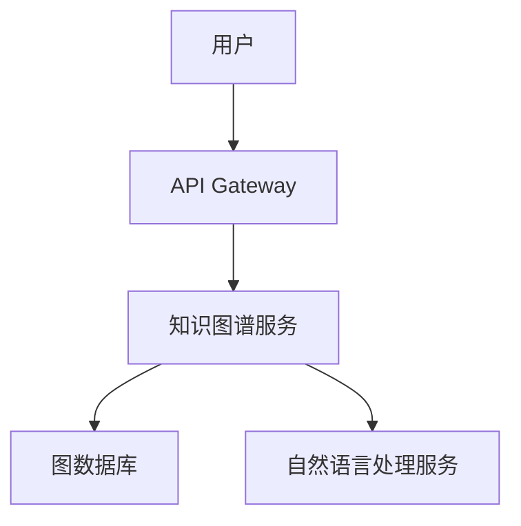

                 


# 构建AI驱动的企业知识管理系统：智能知识图谱

## 关键词
- 企业知识管理, 智能知识图谱, AI技术, 知识图谱构建, 企业信息化

## 摘要
随着企业信息化的不断推进，传统的企业知识管理方式逐渐显露出其局限性。为了更高效地管理和利用企业知识，人工智能（AI）技术被引入，构建智能知识图谱成为一种趋势。本文将详细探讨如何利用AI技术构建企业知识图谱，分析其核心概念、算法原理、系统架构，并通过实际案例展示其应用价值，最后总结最佳实践和未来发展方向。

---

## 第一部分: 企业知识管理与智能知识图谱背景

### 第1章: 企业知识管理的演变

#### 1.1 传统企业知识管理概述
- **1.1.1 传统知识管理的定义与特点**
  - 传统知识管理（KM）是通过系统化的方法对企业内外部知识进行采集、存储、整理和应用的过程。
  - 其特点包括：结构化存储、被动查询、缺乏智能化。
  
- **1.1.2 传统知识管理的局限性**
  - 数据孤岛问题：知识分散在不同的系统中，难以形成统一的语义网络。
  - 知识 silo：部门间知识共享不足，导致重复劳动和效率低下。
  - 搜索效率低：基于关键词的搜索方式难以准确理解用户需求，返回大量无关信息。

- **1.1.3 企业知识管理的重要性**
  - 企业知识是核心资产，直接影响企业的决策能力和竞争力。
  - 知识管理能够提升员工效率、优化流程、降低运营成本。

#### 1.2 知识图谱的基本概念
- **1.2.1 知识图谱的定义**
  - 知识图谱是一种以图结构形式表示知识的语义网络，节点表示实体或概念，边表示实体之间的关系。
  - 典型的例子有Google的Knowledge Graph和Wikidata。

- **1.2.2 知识图谱的核心要素**
  - **实体（Entity）**：现实世界中的具体事物，如“公司”、“人”、“产品”等。
  - **关系（Relation）**：实体之间的关联，如“属于”、“创建”、“拥有”等。
  - **属性（Property）**：描述实体的特征，如“公司名称”、“成立时间”等。

- **1.2.3 知识图谱与传统数据库的区别**
  - **数据结构**：传统数据库以行和列为基础，知识图谱以图结构为基础。
  - **语义表示**：传统数据库缺乏语义信息，知识图谱通过关系和属性提供丰富的语义信息。
  - **查询效率**：传统数据库基于结构化查询，知识图谱支持语义查询。

#### 1.3 AI驱动的知识图谱
- **1.3.1 AI在知识图谱中的作用**
  - 自动提取和关联实体：通过自然语言处理（NLP）技术从文本中提取实体及其关系。
  - 知识融合：整合多源异构数据，消除冗余和矛盾。
  - 动态更新：通过持续学习不断补充和更新知识图谱。

- **1.3.2 智能知识图谱的优势**
  - 高效检索：基于语义理解的智能搜索，提升知识检索效率。
  - 深度关联：发现隐性关系，支持复杂查询。
  - 自适应学习：通过机器学习不断优化知识图谱的质量和准确性。

- **1.3.3 企业知识管理升级的必要性**
  - 应对海量数据：企业数据呈指数级增长，传统方法难以处理。
  - 提升决策能力：通过知识图谱支持数据驱动的决策。
  - 支持智能化应用：如智能客服、智能推荐等。

### 第2章: 知识图谱的核心概念与联系

#### 2.1 知识图谱的结构
- **2.1.1 实体与关系**
  - 实体是知识图谱的基本单元，表示具体事物。
  - 关系描述实体之间的联系，如“人属于公司”。
  - 实体和关系共同构成知识图谱的骨架。

- **2.1.2 属性与类型**
  - 属性用于描述实体的特征，如“公司名称”、“成立时间”。
  - 类型是对实体的分类，如“公司类型”、“行业类型”。

- **2.1.3 知识图谱的层次结构**
  - 基于层次结构的分类，如上位概念和下位概念。

#### 2.2 知识图谱的核心概念对比
- **2.2.1 数据库与知识库的对比**
  | 特性      | 数据库       | 知识库       |
  |-----------|--------------|--------------|
  | 数据结构  | 行和列       | 图结构       |
  | 查询方式  | SQL           | SPARQL        |
  | 语义支持  | 弱            | 强            |

- **2.2.2 图结构与树结构的对比**
  - **图结构**：支持复杂的关联关系，节点之间可以有多对多关系。
  - **树结构**：严格的层次关系，每个节点只有一个父节点。

- **2.2.3 知识图谱与语义网络的对比**
  - 知识图谱更注重结构化和可计算性，语义网络更注重语义表示。

#### 2.3 知识图谱的ER实体关系图
```mermaid
er
    entity(Entity) {
        id: string
        name: string
        description: string
    }
    relation(Relation) {
        id: string
        name: string
        description: string
    }
    attribute(Attribute) {
        id: string
        name: string
        description: string
    }
    entity --N relation
    relation --1 attribute
```

---

## 第二部分: 知识图谱的构建与AI技术

### 第3章: 知识图谱的构建算法

#### 3.1 知识图谱构建的关键算法
- **实体识别（NER）**：从文本中提取实体。
- **关系抽取（RE）**：识别实体之间的关系。
- **属性抽取（PE）**：提取实体的属性信息。

#### 3.2 基于Word2Vec的关系抽取
- **Word2Vec模型**：通过词向量表示词语之间的关系。
- **关系抽取流程**：
  ```mermaid
  graph TD
      A[文本输入] --> B[分词]
      B --> C[词向量生成]
      C --> D[关系建模]
      D --> E[关系预测]
  ```

- **代码示例**：
  ```python
  import gensim
  model = gensim.models.Word2Vec(sentences, vector_size=100, window=5, min_count=1, workers=4)
  ```

#### 3.3 基于BERT的关系抽取
- **BERT模型**：通过预训练的上下文理解进行关系抽取。
- **流程图**：
  ```mermaid
  graph TD
      A[文本输入] --> B[输入嵌入]
      B --> C[编码器]
      C --> D[关系预测]
  ```

- **数学模型**：
  $$ \text{Output} = \text{BERT}(\text{Input}) $$

---

## 第三部分: 企业知识图谱系统设计

### 第4章: 系统分析与架构设计

#### 4.1 企业知识管理场景
- **数据来源**：企业文档、邮件、会议记录等。
- **用户角色**：员工、管理者、客户。

#### 4.2 系统功能设计
- **数据采集**：支持多种数据源的接入。
- **数据存储**：使用图数据库存储知识图谱。
- **数据分析**：基于图的查询和分析。
- **数据可视化**：展示知识图谱的结构。

#### 4.3 系统架构设计


---

## 第四部分: 项目实战与应用

### 第5章: 项目实战

#### 5.1 环境搭建
- **工具安装**：安装Python、TensorFlow、Keras等。

#### 5.2 核心实现
- **数据预处理**：清洗和标注数据。
- **模型训练**：训练实体识别和关系抽取模型。

#### 5.3 实际案例分析
- **案例背景**：某企业知识管理系统的构建。
- **实施效果**：提升知识检索效率，降低运营成本。

---

## 第五部分: 最佳实践与总结

### 第6章: 最佳实践

#### 6.1 设计与实施注意事项
- 数据质量：确保数据的准确性和完整性。
- 模型调优：根据业务需求调整模型参数。
- 安全性：保护企业敏感信息。

#### 6.2 小结
- AI驱动的知识图谱为企业的知识管理带来了新的可能性。
- 通过构建智能知识图谱，企业能够更高效地利用知识资源。

---

通过以上内容，您可以系统地构建一个AI驱动的企业知识管理系统，实现高效的知识管理和应用。

