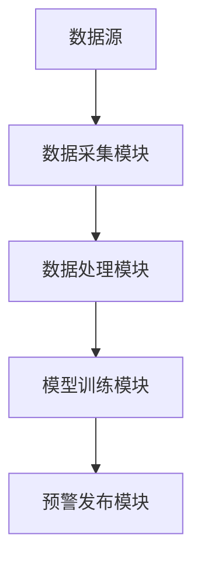
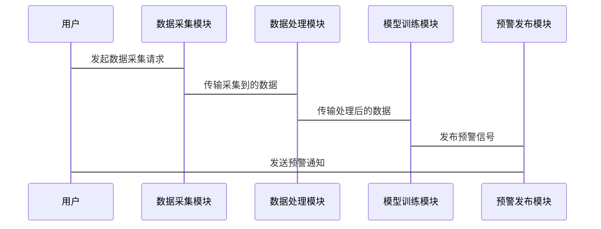
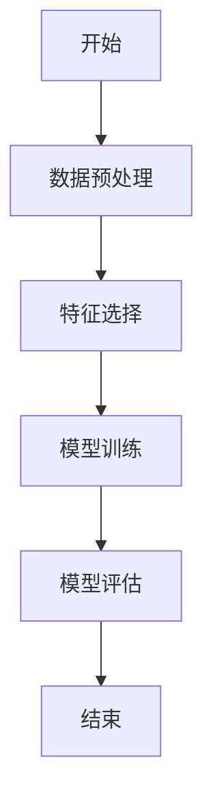

                 


# 构建AI驱动的企业风险预警系统

> 关键词：企业风险、AI驱动、预警系统、机器学习、大数据、实时监控

> 摘要：本文详细讲解了如何利用人工智能技术构建企业风险预警系统。从系统架构设计到算法实现，从数据采集到模型部署，全面分析了企业风险预警系统的构建过程。通过实际案例分析，展示了如何利用机器学习模型实现对企业风险的实时监控和预测，为企业风险管理提供数据驱动的决策支持。

---

# 第一部分: 企业风险预警系统概述

## 第1章: 企业风险预警系统背景与目标

### 1.1 企业风险预警的定义与重要性

#### 1.1.1 企业风险的定义与分类
企业风险是指企业在经营过程中可能面临的各种不确定性因素，这些因素可能对企业的财务状况、市场地位、运营能力等产生负面影响。企业风险可以分为以下几类：
- **财务风险**：与企业的财务状况直接相关的风险，例如现金流断裂、债务违约等。
- **市场风险**：与市场环境变化相关的风险，例如市场需求波动、竞争加剧等。
- **运营风险**：与企业日常运营相关的风险，例如供应链中断、生产事故等。
- **法律风险**：与企业法律合规性相关的风险，例如合同纠纷、政策变化等。

#### 1.1.2 风险预警的核心作用
风险预警系统通过实时监控企业内外部数据，利用人工智能技术预测潜在风险，并及时发出预警信号，帮助企业采取应对措施，降低风险带来的损失。其核心作用包括：
- **提前预警**：通过数据分析，提前发现潜在风险，避免风险的突发性。
- **精准识别**：利用机器学习算法，精准识别风险的类型和程度。
- **数据驱动决策**：基于数据的分析结果，为企业制定风险应对策略提供支持。

#### 1.1.3 AI驱动的风险预警优势
相比传统风险预警方法，AI驱动的风险预警系统具有以下优势：
- **实时性**：通过实时数据分析，快速发现潜在风险。
- **准确性**：利用机器学习算法，提高风险预测的准确性。
- **自动化**：系统自动采集数据、分析数据并发出预警，减少人工干预。

### 1.2 企业风险预警系统的目标

#### 1.2.1 风险识别与预测目标
- 实时监测企业的各项指标，识别潜在风险。
- 预测未来可能出现的风险，并评估其影响程度。

#### 1.2.2 系统化管理与实时监控
- 建立统一的风险预警平台，实现对企业内外部数据的整合和分析。
- 实时监控企业运营中的各项指标，确保风险的及时发现和处理。

#### 1.2.3 数据驱动的决策支持
- 通过数据分析，为企业提供数据驱动的决策支持。
- 帮助企业在风险发生前采取预防措施，降低风险损失。

### 1.3 企业风险预警系统的边界与外延

#### 1.3.1 系统边界与功能范围
- **数据采集**：从企业内部系统和外部数据源获取相关数据。
- **数据处理**：对采集到的数据进行清洗、转换和存储。
- **风险评估**：利用机器学习算法对数据进行分析，识别潜在风险。
- **预警发布**：根据分析结果，向相关人员发出预警信号。

#### 1.3.2 外部数据源的整合
- **市场数据**：行业趋势、竞争对手信息、市场波动等。
- **宏观经济数据**：GDP增长率、通货膨胀率、政策变化等。
- **社交媒体数据**：企业声誉、客户反馈、舆情分析等。

#### 1.3.3 与企业现有系统的衔接
- **ERP系统**：整合企业的财务、供应链、销售等数据。
- **CRM系统**：整合客户信息、销售数据等。
- **其他系统**：与企业内部的其他管理系统进行数据对接。

### 1.4 本章小结
本章从企业风险的定义和分类出发，介绍了风险预警系统的核心作用和目标。同时，还讨论了AI驱动的风险预警系统的边界和外延，为后续章节的系统设计和算法实现奠定了基础。

---

## 第2章: AI驱动的风险预警系统核心要素

### 2.1 数据采集与处理

#### 2.1.1 数据来源与特征
- **内部数据**：企业内部的财务数据、销售数据、供应链数据等。
- **外部数据**：市场数据、宏观经济数据、社交媒体数据等。
- **数据特征**：时间性、相关性、可量性、可预测性。

#### 2.1.2 数据清洗与预处理
- 数据清洗：去除噪声数据、处理缺失值、消除重复数据。
- 数据转换：对数据进行标准化、归一化处理，使其适合模型输入。
- 数据存储：将清洗和转换后的数据存储在数据库中，便于后续分析。

#### 2.1.3 数据存储与管理
- 数据库设计：根据需求设计数据库结构，确保数据存储的高效性和可扩展性。
- 数据管理：制定数据管理策略，确保数据的安全性、完整性和一致性。

### 2.2 风险评估模型

#### 2.2.1 基于机器学习的风险评估
- **监督学习**：利用历史数据训练分类模型，预测未来风险。
- **无监督学习**：通过聚类分析发现潜在的异常数据，识别潜在风险。
- **集成学习**：结合多种算法的优势，提高模型的准确性和稳定性。

#### 2.2.2 模型选择与优化
- **模型选择**：根据数据特征和业务需求选择合适的算法。
- **模型优化**：通过调整超参数、特征选择等方法提高模型性能。
- **模型验证**：利用验证数据集评估模型的准确性和稳定性。

#### 2.2.3 模型评估与验证
- **评估指标**：准确率、召回率、F1分数、AUC值等。
- **交叉验证**：通过交叉验证评估模型的泛化能力。
- **模型部署**：将训练好的模型部署到生产环境，进行实时预测。

### 2.3 系统反馈与优化

#### 2.3.1 预警结果的反馈机制
- **实时反馈**：系统根据模型预测结果，实时向相关人员发出预警信号。
- **历史反馈**：记录历史预警结果，便于后续分析和优化。

#### 2.3.2 模型迭代与优化策略
- **在线学习**：根据实时数据不断更新模型，提高预测准确性。
- **离线优化**：定期对模型进行离线优化，解决数据漂移问题。
- **反馈闭环**：根据用户反馈不断优化模型和系统。

#### 2.3.3 用户反馈与系统改进
- **用户反馈收集**：通过用户反馈了解系统使用情况和改进需求。
- **系统改进**：根据用户反馈不断优化系统功能和用户体验。

### 2.4 本章小结
本章详细讨论了AI驱动的风险预警系统的核心要素，包括数据采集与处理、风险评估模型以及系统反馈与优化。通过这些核心要素的协同作用，系统能够实现对企业风险的实时监控和预测，为企业风险管理提供有力支持。

---

## 第3章: 系统架构设计

### 3.1 系统模块划分

#### 3.1.1 数据采集模块
- 负责从企业内部系统和外部数据源采集数据。
- 支持多种数据格式和接口，确保数据的多样性和完整性。

#### 3.1.2 数据处理模块
- 对采集到的数据进行清洗、转换和存储。
- 提供数据预处理功能，确保数据适合模型输入。

#### 3.1.3 模型训练模块
- 负责训练和优化风险评估模型。
- 提供模型选择、参数调优和性能评估功能。

#### 3.1.4 预警发布模块
- 根据模型预测结果，向相关人员发出预警信号。
- 提供预警结果的可视化展示和历史记录功能。

### 3.2 系统数据流设计

#### 3.2.1 数据输入与输出流程
- **数据输入**：从多种数据源采集数据。
- **数据处理**：清洗、转换、存储。
- **模型训练**：训练风险评估模型。
- **预警发布**：根据模型预测结果发布预警信号。

#### 3.2.2 数据处理与存储
- 数据清洗：去除噪声数据、处理缺失值。
- 数据转换：标准化、归一化处理。
- 数据存储：存储清洗和转换后的数据，便于后续分析。

#### 3.2.3 模型训练与部署
- 模型训练：利用训练数据训练风险评估模型。
- 模型部署：将训练好的模型部署到生产环境，进行实时预测。

### 3.3 系统架构图


### 3.4 系统接口设计

#### 3.4.1 数据接口规范
- **数据输入接口**：定义数据输入格式和接口协议。
- **数据输出接口**：定义数据输出格式和接口协议。
- **数据存储接口**：定义数据存储接口和数据库连接方式。

#### 3.4.2 模型接口规范
- **模型输入接口**：定义模型输入数据的格式和接口协议。
- **模型输出接口**：定义模型输出结果的格式和接口协议。
- **模型管理接口**：定义模型管理功能的接口和协议。

#### 3.4.3 预警结果接口规范
- **预警信号接口**：定义预警信号的格式和接口协议。
- **预警历史记录接口**：定义预警历史记录的格式和接口协议。
- **预警通知接口**：定义预警通知的格式和接口协议。

### 3.5 系统交互流程

#### 3.5.1 用户与系统交互流程


### 3.6 本章小结
本章从系统架构设计的角度，详细讨论了AI驱动的风险预警系统的模块划分、数据流设计、系统架构图和接口设计。通过这些设计，确保系统的高效性和可扩展性，为后续的算法实现和项目实战奠定了基础。

---

## 第4章: 算法原理

### 4.1 基于XGBoost的风险评估模型

#### 4.1.1 XGBoost算法简介
XGBoost是一种强大的集成学习算法，基于决策树的Boosting方法，通过串行树的组合提高模型的准确性和稳定性。

#### 4.1.2 算法实现步骤


#### 4.1.3 算法数学模型
- **损失函数**：定义模型的损失函数，通常使用二分类的对数损失函数。
  $$ L(y, \hat{y}) = -\frac{1}{n} \sum_{i=1}^{n} [y_i \log(\hat{y}_i) + (1 - y_i) \log(1 - \hat{y}_i)] $$
- **Boosting过程**：通过不断优化模型，逐步减少损失函数的值。
  $$ \hat{y}_t = \hat{y}_{t-1} + \alpha \cdot f_t(x) $$
  其中，$\alpha$ 是学习率，$f_t(x)$ 是第 $t$ 个弱分类器的输出。

#### 4.1.4 实际案例分析
假设我们有一个企业信用风险评估的案例，企业财务数据包括收入、利润、负债等。我们可以使用XGBoost算法训练一个二分类模型，预测企业是否存在信用风险。

---

## 第5章: 项目实战

### 5.1 环境配置

#### 5.1.1 安装必要的Python库
```python
import numpy as np
import pandas as pd
import xgboost as xgb
from sklearn.metrics import accuracy_score, recall_score, f1_score
from sklearn.model_selection import train_test_split
```

#### 5.1.2 数据集准备
```python
# 加载数据集
data = pd.read_csv('enterprise_risk.csv')
```

### 5.2 数据预处理

#### 5.2.1 数据清洗
```python
# 处理缺失值
data = data.dropna()
# 处理异常值
data = data[~(data['收入'] < 0)]
```

#### 5.2.2 特征选择
```python
# 选择特征
features = ['收入', '利润', '负债']
target = '风险等级'

X = data[features]
y = data[target]
```

### 5.3 模型训练

#### 5.3.1 模型训练
```python
# 划分训练集和测试集
X_train, X_test, y_train, y_test = train_test_split(X, y, test_size=0.2, random_state=42)

# 训练XGBoost模型
model = xgb.XGBClassifier()
model.fit(X_train, y_train)
```

#### 5.3.2 模型调优
```python
# 调整超参数
model = xgb.XGBClassifier(learning_rate=0.1, n_estimators=100, max_depth=3)
model.fit(X_train, y_train)
```

### 5.4 模型部署

#### 5.4.1 模型预测
```python
# 进行预测
y_pred = model.predict(X_test)
```

#### 5.4.2 模型评估
```python
# 计算准确率、召回率和F1分数
print('准确率:', accuracy_score(y_test, y_pred))
print('召回率:', recall_score(y_test, y_pred))
print('F1分数:', f1_score(y_test, y_pred))
```

### 5.5 本章小结
本章通过一个实际案例，详细展示了如何利用Python和XGBoost算法构建企业风险预警系统。从数据预处理到模型训练，再到模型部署，完整地呈现了系统构建的全过程。

---

## 第6章: 总结与展望

### 6.1 系统构建总结
- **核心概念**：企业风险预警系统通过AI技术实现对企业风险的实时监控和预测。
- **系统架构**：模块化设计、数据流设计、接口设计和交互流程设计。
- **算法实现**：基于XGBoost的机器学习模型，实现风险评估和预警。

### 6.2 系统优化与未来展望
- **优化方向**：引入时间序列分析、图神经网络等技术，进一步提高模型的准确性和实时性。
- **未来展望**：随着AI技术的不断发展，企业风险预警系统将更加智能化和自动化。

### 6.3 最佳实践Tips
- **数据质量管理**：确保数据的准确性和完整性，是系统运行的基础。
- **模型持续优化**：定期对模型进行调优和更新，确保模型的泛化能力。
- **系统安全性**：加强系统安全防护，确保数据和模型的安全性。

### 6.4 本章小结
本章对AI驱动的企业风险预警系统的构建过程进行了总结，并展望了未来的发展方向。通过不断的优化和创新，企业风险预警系统将为企业风险管理提供更加强有力的支持。

---

# 附录: 参考文献

- [1] 周志华. 《机器学习实战》. 清华大学出版社, 2017.
- [2] 李航. 《统计学习题》. 清华大学出版社, 2018.
- [3] 周扬. 《Python机器学习实战》. 人民邮电出版社, 2020.

---

# 结语

通过本文的详细讲解，我们了解了如何利用人工智能技术构建企业风险预警系统。从系统架构设计到算法实现，从数据采集到模型部署，全面分析了企业风险预警系统的构建过程。希望本文能够为读者提供有价值的参考和启发，帮助企业更好地进行风险管理，实现可持续发展。

