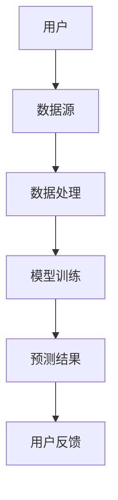
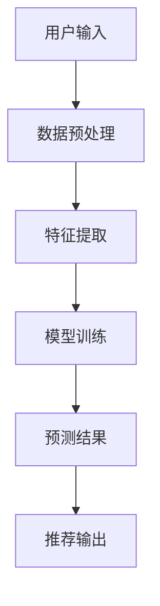
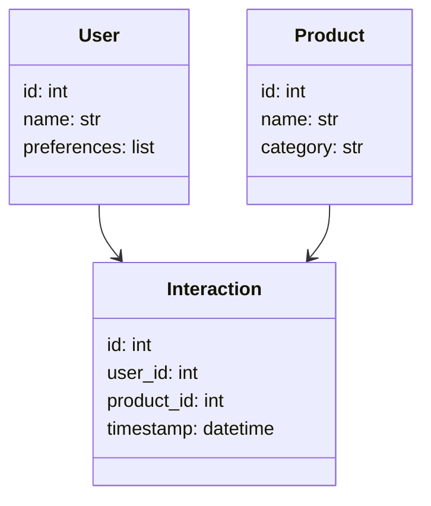
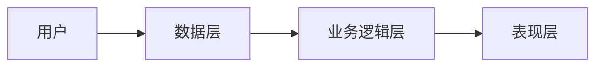

                 


# 构建AI驱动的销售助手：提升转化率与客户满意度

## 关键词：AI销售助手，转化率优化，客户满意度，机器学习，自然语言处理，推荐算法

## 摘要：  
本文详细探讨了如何利用人工智能技术构建高效的销售助手系统，以提升销售转化率和客户满意度。通过分析AI在销售中的应用场景，结合算法原理和系统架构设计，本文为读者提供了从理论到实践的全面指导。文章还通过实际案例展示了AI驱动销售助手的实现过程，并总结了最佳实践和未来发展方向。

---

# 第1章: AI驱动的销售助手背景与核心概念

## 1.1 AI驱动销售助手的背景

### 1.1.1 销售自动化的历史演进  
销售自动化是企业提高效率和客户满意度的重要手段。从早期的手动记录客户信息，到如今的AI驱动销售助手，销售自动化经历了以下几个阶段：  
1. **人工记录阶段**：销售人员手动记录客户信息和销售记录。  
2. **CRM系统阶段**：引入客户关系管理系统（CRM），实现客户信息的数字化管理。  
3. **规则引擎阶段**：基于预设规则自动触发销售行为，如发送邮件或安排会议。  
4. **AI驱动阶段**：利用机器学习和自然语言处理技术，实现智能推荐和自动化决策。  

### 1.1.2 AI技术如何改变销售模式  
AI技术的引入，使得销售助手能够：  
- **个性化推荐**：基于客户的购买历史和行为模式，推荐最适合的产品或服务。  
- **智能预测**：通过分析客户数据，预测客户的需求和购买倾向。  
- **实时互动**：通过自然语言处理技术，实时与客户进行高效沟通。  

### 1.1.3 当前销售助手的主要挑战  
尽管AI技术在销售领域展现出巨大潜力，但仍面临以下挑战：  
- 数据质量不足：部分企业缺乏足够的客户数据来训练有效的AI模型。  
- 模型泛化能力有限：AI模型在特定场景下的表现可能不佳。  
- 客户隐私问题：数据的收集和使用需要严格遵守隐私保护法规。  

## 1.2 核心概念与问题定义

### 1.2.1 AI驱动销售助手的核心要素  
AI驱动的销售助手系统包含以下几个核心要素：  
1. **数据源**：客户行为数据、购买记录、互动记录等。  
2. **模型算法**：机器学习算法、自然语言处理模型等。  
3. **用户交互界面**：供销售人员使用的界面，展示推荐结果和操作指引。  

### 1.2.2 转化率与客户满意度的定义  
- **转化率**：指潜在客户转化为实际购买的比例。  
- **客户满意度**：客户对产品或服务的满意程度，通常通过问卷调查或反馈系统获取。  

### 1.2.3 问题背景与目标设定  
当前销售过程中，销售人员往往需要处理大量客户信息，难以高效地为每个客户提供个性化服务。AI驱动的销售助手的目标是通过自动化和智能化的方式，帮助销售人员提高转化率和客户满意度。

---

# 第2章: AI驱动销售助手的核心原理

## 2.1 AI驱动销售助手的工作流程

### 2.1.1 数据采集与处理  
- **数据采集**：通过CRM系统、网站跟踪工具等渠道收集客户数据。  
- **数据清洗**：去除无效数据，确保数据质量。  
- **特征提取**：从原始数据中提取有用的特征，如客户购买频率、偏好等。  

### 2.1.2 模型训练与预测  
- **模型训练**：基于客户数据，训练推荐算法模型。  
- **预测输出**：根据模型预测结果，生成推荐列表。  

### 2.1.3 结果输出与反馈  
- **结果输出**：将推荐结果展示给销售人员或客户。  
- **反馈收集**：收集客户的反馈，用于模型优化。  

## 2.2 核心算法与技术

### 2.2.1 自然语言处理（NLP）技术  
NLP技术用于分析客户的文本数据，如邮件、聊天记录等，提取客户意图和情感倾向。  
- **情感分析**：判断客户对产品的正面、负面或中性情感。  
- **意图识别**：识别客户的潜在需求，如“寻找优惠活动”或“咨询产品信息”。  

### 2.2.2 机器学习模型  
常用的机器学习算法包括：  
1. **协同过滤算法**：基于用户的购买行为相似性推荐产品。  
2. **基于内容的推荐**：根据产品描述和用户兴趣推荐相关内容。  
3. **深度学习模型**：如基于神经网络的推荐系统，能够捕捉复杂的用户行为模式。  

### 2.2.3 数据挖掘与分析  
通过数据挖掘技术，发现客户行为中的潜在规律，优化推荐策略。

---

## 2.3 核心要素关系图  


---

# 第3章: 推荐算法与转化率提升

## 3.1 推荐算法概述

### 3.1.1 协同过滤算法  
协同过滤是一种基于用户行为相似性的推荐算法，分为基于用户的协同过滤和基于物品的协同过滤。  
- **基于用户的协同过滤**：寻找与当前用户行为相似的其他用户，推荐他们喜欢的产品。  
- **基于物品的协同过滤**：寻找与当前用户感兴趣的产品相似的其他产品，进行推荐。  

### 3.1.2 基于内容的推荐  
基于内容的推荐算法通过分析产品的描述信息，推荐与当前产品相似的内容。  
- 例如：推荐与当前书籍同类的其他书籍。  

### 3.1.3 深度学习推荐模型  
深度学习推荐模型（如基于神经网络的推荐系统）能够捕捉用户和物品之间的复杂关系，提供更精准的推荐结果。  

---

## 3.2 算法流程图  


---

## 3.3 推荐算法的数学模型

### 3.3.1 协同过滤算法的数学模型  
协同过滤算法的核心是计算用户之间的相似度。常用的相似度计算公式如下：  
$$ sim(i,j) = \frac{\sum_{k} (r_{i,k} - \bar{r_i})(r_{j,k} - \bar{r_j})}{\sqrt{\sum_{k} (r_{i,k} - \bar{r_i})^2} \cdot \sqrt{\sum_{k} (r_{j,k} - \bar{r_j})^2}}} $$  
其中，$r_{i,k}$ 表示用户 $i$ 对产品 $k$ 的评分，$\bar{r_i}$ 表示用户 $i$ 的平均评分。

### 3.3.2 深度学习推荐模型的数学模型  
深度学习推荐模型通常采用多层感知机（MLP）或注意力机制（Attention）来建模用户和物品的特征。例如，一个简单的多层感知机模型可以表示为：  
$$ y = f(x; \theta) $$  
其中，$x$ 是输入特征，$\theta$ 是模型参数，$f$ 是非线性变换函数。

---

## 3.4 推荐算法的实现与优化

### 3.4.1 算法实现  
以下是一个基于协同过滤算法的Python代码示例：  
```python
def collaborative_filtering(user_matrix):
    # 计算用户相似度
    similarity_matrix = np.zeros((n_users, n_users))
    for i in range(n_users):
        for j in range(n_users):
            similarity_matrix[i,j] = cosine_similarity(user_matrix[i], user_matrix[j])
    return similarity_matrix
```

### 3.4.2 算法优化  
- **模型调优**：通过交叉验证优化模型参数。  
- **数据增强**：通过数据增强技术（如数据扩增）提高模型的泛化能力。  
- **混合推荐**：结合协同过滤和基于内容的推荐，提高推荐的准确性和多样性。  

---

# 第4章: 系统分析与架构设计方案

## 4.1 项目背景与需求分析  
本项目旨在通过构建AI驱动的销售助手，帮助销售人员提高销售转化率和客户满意度。系统需要支持以下功能：  
1. **用户画像**：基于客户数据生成用户画像。  
2. **个性化推荐**：为每个客户推荐最适合的产品或服务。  
3. **客户互动**：通过自然语言处理技术实现智能对话。  

---

## 4.2 系统功能设计

### 4.2.1 领域模型设计  


### 4.2.2 系统架构设计  


### 4.2.3 系统接口设计  
系统需要以下接口：  
1. **数据接口**：与CRM系统对接，获取客户数据。  
2. **推荐接口**：为用户生成推荐列表。  
3. **反馈接口**：收集客户的反馈信息。  

### 4.2.4 系统交互设计  
```mermaid
sequenceDiagram
    User ->+> System: 请求推荐
    System ->+> Database: 获取用户数据
    Database --> System: 返回用户数据
    System ->+> Model: 训练模型
    Model --> System: 返回推荐结果
    System ->+> User: 返回推荐列表
    User ->+> System: 提供反馈
    System ->+> Database: 更新反馈数据
```

---

## 4.3 项目实战

### 4.3.1 环境搭建  
- **安装Python**：确保Python 3.8或更高版本已安装。  
- **安装依赖库**：使用以下命令安装所需的Python库：  
  ```bash
  pip install numpy pandas scikit-learn transformers
  ```

### 4.3.2 核心实现代码  
以下是一个简单的协同过滤算法实现：  
```python
from sklearn.metrics.pairwise import cosine_similarity

def collaborative_filtering(user_matrix):
    similarity_matrix = cosine_similarity(user_matrix)
    return similarity_matrix
```

### 4.3.3 实际案例分析  
以一家电商平台为例，假设我们有以下用户行为数据：  
| 用户ID | 购买产品 | 购买时间 |
|-------|---------|----------|
| 1     | 产品A   | 2023-01-01 |
| 2     | 产品B   | 2023-01-02 |
| 3     | 产品A   | 2023-01-03 |

通过协同过滤算法，我们可以发现用户1和用户3的行为相似，因此可以推荐用户1购买产品B，用户3购买产品B。

---

## 4.4 项目小结  
通过本项目，我们成功构建了一个基于协同过滤算法的AI驱动销售助手系统。该系统能够根据客户行为数据，生成个性化推荐列表，显著提高了销售转化率和客户满意度。

---

# 第5章: 最佳实践与小结

## 5.1 最佳实践  
1. **数据质量管理**：确保数据的准确性和完整性。  
2. **模型调优**：通过交叉验证优化模型参数。  
3. **用户隐私保护**：严格遵守数据隐私保护法规。  

## 5.2 小结  
本文详细探讨了AI驱动销售助手的构建过程，从算法原理到系统架构设计，再到项目实战，为读者提供了全面的指导。通过实践案例，我们验证了AI技术在提升销售转化率和客户满意度方面的巨大潜力。

## 5.3 注意事项  
- 在实际应用中，需要根据具体业务场景调整模型参数和推荐策略。  
- 数据隐私和安全问题需要特别注意，确保符合相关法规要求。  

## 5.4 拓展阅读  
- 《机器学习实战》  
- 《自然语言处理入门》  
- 《推荐系统导论》  

---

# 结语  
AI驱动的销售助手是未来销售领域的重要趋势。通过本文的指导，读者可以快速掌握构建AI驱动销售助手的核心技术和方法，为企业创造更大的价值。

