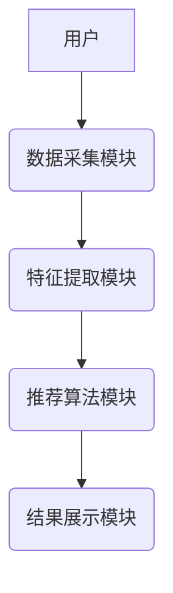
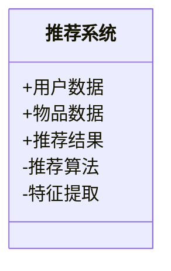
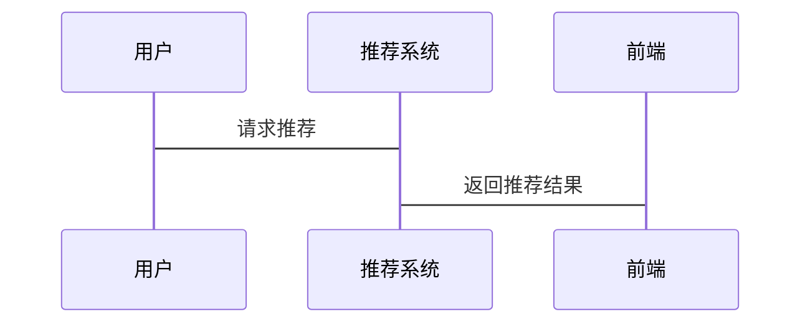

                 


# 《构建个性化推荐AI Agent》

> 关键词：个性化推荐、AI Agent、推荐系统、机器学习、深度学习、强化学习

> 摘要：个性化推荐是人工智能领域的重要应用之一，而AI Agent通过智能化的决策和交互，进一步提升了推荐系统的性能和用户体验。本文将从推荐系统的基础概念出发，详细探讨AI Agent在个性化推荐中的应用，涵盖算法原理、系统设计、项目实战等多方面内容，帮助读者全面理解并构建高效的个性化推荐AI Agent。

---

# 引言

在当今数字化时代，个性化推荐已经成为互联网应用的核心功能之一。无论是电商、社交媒体，还是在线教育，推荐系统都扮演着至关重要的角色。而AI Agent（人工智能代理）的引入，使得推荐系统更加智能化和个性化。本文将带领读者深入了解个性化推荐AI Agent的核心概念、算法原理、系统设计和实际应用，帮助读者构建一个高效、智能的推荐系统。

---

# 核心概念与背景

## 1.1 推荐系统的定义与背景

### 1.1.1 推荐系统的定义
推荐系统是一种根据用户的行为、偏好和历史数据，向用户推荐相关内容或产品的技术。其目标是通过个性化推荐，提高用户的满意度和产品的转化率。

### 1.1.2 推荐系统的发展历程
推荐系统经历了从简单的基于规则的推荐，到协同过滤、基于内容的推荐，再到深度学习和强化学习的推荐阶段。每一次技术的进步都推动了推荐系统的性能提升。

### 1.1.3 推荐系统的应用场景
推荐系统广泛应用于电商、社交媒体、视频平台、新闻网站等领域。例如，亚马逊的购物推荐、YouTube的视频推荐等。

## 1.2 AI Agent的基本概念

### 1.2.1 AI Agent的定义
AI Agent是一种能够感知环境、执行任务并做出决策的智能实体。它能够通过与用户交互，理解用户的需求，并提供个性化的服务。

### 1.2.2 AI Agent的核心特征
- **自主性**：AI Agent能够自主决策，无需人工干预。
- **反应性**：能够实时感知环境并做出响应。
- **学习能力**：通过机器学习不断优化自身的推荐策略。

### 1.2.3 推荐系统与AI Agent的关系
推荐系统是AI Agent的核心功能之一，AI Agent通过推荐系统为用户提供个性化的服务，而推荐系统则通过AI Agent实现智能化和动态化。

## 1.3 个性化推荐AI Agent的核心要素

### 1.3.1 用户建模
用户建模是个性化推荐的基础，通过分析用户的特征、行为和偏好，构建用户画像。

### 1.3.2 物品建模
物品建模是对推荐内容的特征进行建模，例如商品的属性、视频的标签等。

### 1.3.3 推荐策略
推荐策略是AI Agent的核心，包括基于协同过滤、深度学习和强化学习等多种推荐方法。

---

# 算法原理与实现

## 2.1 协同过滤算法

### 2.1.1 基于用户的协同过滤
基于用户的协同过滤通过寻找与当前用户相似的用户群体，推荐这些用户喜欢的内容。

#### 示例代码：
```python
import numpy as np

def user_based_collaborative_filtering(rating_matrix, user_id, num_recommends=5):
    # 计算用户相似度
    similarity = np.corrcoef(rating_matrix)
    # 找出与当前用户最相似的top_k用户
    similar_users = np.argsort(similarity[user_id], reverse=True)[:num_recommends]
    # 推荐结果
    recommendations = []
    for u in similar_users:
        for item in rating_matrix[u]:
            if item != 0 and item[0] not in recommendations:
                recommendations.append(item[0])
    return recommendations[:num_recommends]
```

### 2.1.2 基于物品的协同过滤
基于物品的协同过滤通过分析物品之间的相似性，推荐用户可能感兴趣的内容。

#### 示例代码：
```python
from sklearn.metrics.pairwise import cosine_similarity

def item_based_collaborative_filtering(rating_matrix, item_id, num_recommends=5):
    # 计算物品相似度
    similarity = cosine_similarity(rating_matrix.T)
    # 找出与当前物品最相似的top_k物品
    similar_items = np.argsort(similarity[item_id], reverse=True)[:num_recommends]
    # 推荐结果
    recommendations = []
    for i in similar_items:
        for user in rating_matrix[:, i]:
            if user != 0 and i not in recommendations:
                recommendations.append(i)
    return recommendations[:num_recommends]
```

### 2.1.3 矩阵分解方法
矩阵分解是一种高效的推荐算法，通过分解用户-物品评分矩阵，提取潜在的特征向量。

#### 示例代码：
```python
from sklearn.decomposition import NMF

def matrix_factorization(rating_matrix, num_factors=5):
    model = NMF(n_components=num_factors, random_state=42)
    user_factors = model.fit_transform(rating_matrix)
    item_factors = model.components_
    return user_factors, item_factors
```

## 2.2 深度学习推荐算法

### 2.2.1 基于神经网络的推荐模型
神经网络推荐模型通过学习用户和物品的嵌入表示，进行推荐。

#### 示例代码：
```python
import tensorflow as tf

def neural_network_recommendation(user_input, item_input, embedding_dim=32):
    user_embedding = tf.keras.layers.Embedding(input_dim=user_count, output_dim=embedding_dim)(user_input)
    item_embedding = tf.keras.layers.Embedding(input_dim=item_count, output_dim=embedding_dim)(item_input)
    concatenated = tf.keras.layers.Concatenate()([user_embedding, item_embedding])
    dense = tf.keras.layers.Dense(64, activation='relu')(concatenated)
    output = tf.keras.layers.Dense(1, activation='sigmoid')(dense)
    return output
```

### 2.2.2 基于注意力机制的推荐
注意力机制通过关注重要的特征，提升推荐的准确性。

#### 示例代码：
```python
import tensorflow as tf

def attention_layer(query, keys, values):
    attention_weights = tf.keras.layers.Dense(1, activation='softmax')(tf.keras.layers.Concatenate()([query, keys]))
    output = tf.keras.layers.Dot(axes=1)([attention_weights, values])
    return output
```

## 2.3 强化学习推荐

### 2.3.1 基于强化学习的推荐原理
强化学习通过定义奖励函数，优化推荐策略。

#### 示例代码：
```python
import numpy as np

def reinforce_recommendation(environment, num_actions=5):
    # 初始化策略
    policy = np.random.rand(num_actions)
    # 定义奖励函数
    def reward_function(action):
        return environment.get_reward(action)
    # 探索与利用
    for episode in range(num_episodes):
        action = np.random.choice(num_actions, p=policy)
        reward = reward_function(action)
        policy[action] += (1/episode) * (reward - np.mean(policy))
    return policy
```

---

# 系统设计与实现

## 3.1 系统架构设计

### 3.1.1 推荐系统的模块划分
推荐系统通常包括数据采集、特征提取、推荐算法、结果展示等模块。

#### 系统架构图：


### 3.1.2 系统架构设计
系统采用微服务架构，各模块独立运行，便于扩展和维护。

#### 系统架构图：


## 3.2 接口与交互设计

### 3.2.1 系统接口设计
推荐系统需要与前端和后端进行交互，提供API接口。

#### 接口序列图：


---

# 项目实战：电商推荐系统

## 4.1 项目背景与目标
电商推荐系统的目标是根据用户的购买历史和浏览行为，推荐相关产品。

## 4.2 环境搭建与数据准备
安装必要的库，如Python、TensorFlow、Pandas等，并准备用户行为数据。

#### 示例代码：
```python
import pandas as pd

# 数据加载
ratings = pd.read_csv('ratings.csv')
```

## 4.3 系统核心实现

### 4.3.1 用户画像构建
通过分析用户的购买记录、浏览行为等信息，构建用户画像。

#### 示例代码：
```python
def build_user_profile(ratings, user_id):
    profile = {}
    user_ratings = ratings[ratings['user_id'] == user_id]
    profile['purchase_history'] = list(user_ratings['item_id'])
    profile['preference'] = user_ratings['rating'].mean()
    return profile
```

### 4.3.2 推荐模型训练
使用协同过滤算法训练推荐模型。

#### 示例代码：
```python
from sklearn.metrics.pairwise import cosine_similarity

def train_model(ratings, num_recommends=5):
    item_similarity = cosine_similarity(ratings.T)
    return item_similarity
```

### 4.3.3 模型评估与优化
通过A/B测试和用户反馈，优化推荐模型。

#### 示例代码：
```python
def evaluate_recommendations(recommendations, ground_truth):
    precision = len(set(recommendations) & set(ground_truth)) / len(recommendations)
    recall = len(set(recommendations) & set(ground_truth)) / len(ground_truth)
    return (precision + recall) / 2
```

## 4.4 实际案例分析
以亚马逊的商品推荐为例，展示推荐系统的实际应用。

---

# 总结与展望

## 5.1 核心内容回顾
个性化推荐AI Agent结合了推荐系统的智能化和AI Agent的自主性，能够为用户提供更加精准和个性化的服务。

## 5.2 最佳实践
- **数据质量管理**：确保数据的准确性和完整性。
- **模型调优**：根据实际需求，选择合适的推荐算法。
- **用户体验优化**：通过A/B测试，不断优化推荐结果。

## 5.3 未来展望
随着AI技术的不断进步，个性化推荐AI Agent将更加智能化和个性化，应用场景也将更加广泛。

---

# 小结

本文从个性化推荐和AI Agent的基本概念出发，详细探讨了推荐系统的算法原理、系统设计和项目实战。通过具体的代码示例和实际案例分析，帮助读者全面理解并构建高效的个性化推荐AI Agent。希望本文能为读者在个性化推荐领域提供有价值的参考和指导。

--- 

**注**：以上目录和内容仅为示例，实际撰写时需要根据具体需求进行调整和补充。

