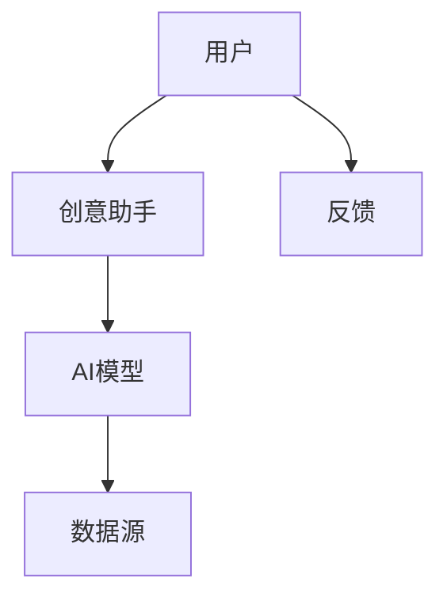
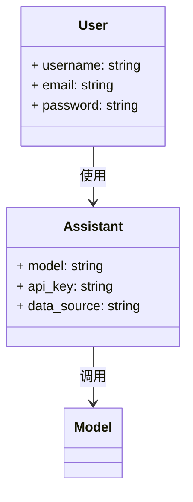

                 


# 构建企业AI创意助手：促进创新与产品开发

## 关键词：人工智能，创意助手，企业创新，产品开发，算法原理，系统架构，项目实战

## 摘要：本文详细探讨了构建企业AI创意助手的技术与方法，分析了其在促进企业创新与产品开发中的作用，涵盖了从核心概念到算法实现，再到系统架构和项目实战的全过程，旨在为企业提供一套高效的技术解决方案。

---

## 第一部分: 背景介绍与核心概念

### 第1章: AI创意助手的背景与目标

#### 1.1 问题背景

- **企业创新与产品开发的挑战**  
  - 当今市场竞争激烈，企业需要快速响应市场需求，推动创新。然而，传统的产品开发流程耗时长、成本高，难以适应快速变化的市场环境。
  - 创意生成和优化是创新的核心，但依赖人工经验，效率低下，且难以量化和评估。

- **AI技术在企业创新中的作用**  
  - AI技术能够通过数据分析、模式识别和自然语言处理，辅助创意生成、评估和优化。
  - 通过自动化和智能化，AI创意助手可以显著提升企业的创新效率和产品质量。

- **创意助手的核心价值**  
  - 提供高效的创意生成工具，帮助企业在产品开发初期快速探索可行方案。
  - 通过数据驱动的方法，优化创意，降低试错成本。

#### 1.2 问题描述

- **传统创新与开发的痛点**  
  - 创意生成缺乏系统性，依赖个人经验，难以量化和优化。
  - 创意评估主观性强，难以客观衡量创意的潜力和可行性。
  - 创意优化过程复杂，需要多次迭代，耗时耗力。

- **创意助手的定义与目标**  
  - 创意助手是一种基于AI技术的工具，旨在辅助用户快速生成、评估和优化创意。
  - 其目标是通过智能化手段，提升创新效率，降低开发成本，加速产品上市。

- **创意助手的应用场景**  
  - 适用于企业的产品开发、市场调研、品牌设计等多个领域。
  - 帮助企业在短时间内生成大量创意，并筛选出最优方案。

#### 1.3 问题解决

- **AI技术如何助力创意与开发**  
  - 利用自然语言处理（NLP）技术，分析用户需求，生成相关创意。
  - 通过机器学习模型，评估创意的潜力和可行性，优化创意质量。
  - 提供实时反馈和建议，帮助用户快速迭代和优化创意。

- **创意助手的功能与优势**  
  - 功能：创意生成、创意评估、创意优化。
  - 优势：高效、智能、数据驱动。

- **创意助手的边界与外延**  
  - 边界：专注于创意生成和优化，不涉及具体的产品实现。
  - 外延：可以与其他企业系统集成，如项目管理工具、设计工具等。

#### 1.4 核心概念结构

- **创意助手的组成要素**  
  - 数据源：用户需求、市场数据、历史项目数据。
  - AI模型：自然语言处理模型、推荐算法、评估模型。
  - 用户界面：输入界面、输出界面、反馈界面。

- **核心概念的属性特征对比**

| 特性 | 创意助手 | 传统工具 |
|------|----------|----------|
| 功能 | 自动生成创意 | 依赖人工 |
| 效率 | 高效 | 低效 |
| 智能性 | 智能优化 | 无智能优化 |

- **ER实体关系图**



---

## 第2章: AI创意助手的核心概念与联系

#### 2.1 核心概念原理

- **创意生成的算法原理**  
  - 数据预处理：清洗和标注用户需求数据。
  - 模型训练：使用预训练语言模型（如GPT）微调生成创意文本。
  - 创意生成：通过输入用户需求，生成多个创意方案。

- **创意评估的逻辑框架**  
  - 创意评估指标：可行性、创新性、市场潜力。
  - 评估方法：基于规则的评估、基于模型的评估。

- **创意优化的策略**  
  - 根据评估结果，优化创意的细节，提升创意质量。

#### 2.2 核心概念属性对比

- **创意助手与传统工具的对比**

| 特性 | 创意助手 | 传统工具 |
|------|----------|----------|
| 创意生成 | 自动生成 | 人工生成 |
| 创意评估 | AI自动评估 | 人工评估 |
| 创意优化 | AI优化 | 人工优化 |

- **不同AI模型的性能对比**

| 模型类型 | GPT-3 | GPT-4 | 调优模型 |
|----------|-------|-------|----------|
| 性能 | 高 | 高 | 更高 |
| 适应性 | 通用 | 通用 | 领域特定 |

- **不同应用场景的需求对比**

| 场景 | 创意需求 | 数据需求 | 模型需求 |
|------|----------|----------|----------|
| 产品开发 | 功能创意 | 用户需求 | 生成模型 |
| 市场调研 | 营销创意 | 市场数据 | 推荐模型 |

#### 2.3 实体关系图


---

## 第三部分: 算法原理与数学模型

### 第3章: 创意生成的算法原理

#### 3.1 算法流程

- **数据预处理**

  ```python
  # 数据清洗和标注
  def preprocess_data(data):
      # 数据清洗逻辑
      cleaned_data = data.dropna()
      # 数据标注
      labeled_data = cleaned_data[['text', 'label']]
      return labeled_data
  ```

- **模型训练**

  ```python
  # 使用预训练模型微调
  def train_model(labeled_data):
      # 加载预训练模型
      model = AutoModelForMaskedLM.from_pretrained('bert-base-uncased')
      # 定义训练参数
      training_args = TrainingArguments(...)
      # 定义训练器
      trainer = Trainer(model=model, args=training_args, ...)
      # 开始训练
      trainer.train()
      return model
  ```

- **创意生成**

  ```python
  # 生成创意
  def generate_creative(model, input_text):
      # 输入处理
      inputs = tokenizer(input_text, return_tensors='np')
      # 生成输出
      outputs = model.generate(**inputs)
      # 解码输出
      generated_text = tokenizer.decode(outputs[0], skip_special_tokens=True)
      return generated_text
  ```

#### 3.2 数学模型

- **自然语言处理模型的数学基础**

  $$ P(\text{创意}| \text{需求}) = \frac{P(\text{需求}|\text{创意}) \cdot P(\text{创意})}{P(\text{需求})} $$

- **推荐算法的数学模型**

  $$ \text{推荐概率} = \sum_{i=1}^{n} \alpha_i \cdot \text{创意特征}_i $$

  其中，$$ \alpha_i $$ 是特征的权重，$$ \text{创意特征}_i $$ 是创意的第i个特征。

---

## 第四部分: 系统分析与架构设计

### 第4章: 系统功能设计

#### 4.1 领域模型



---

## 第5章: 系统架构设计

#### 5.1 系统架构图


---

## 第六部分: 项目实战

### 第6章: 项目实战

#### 6.1 环境安装

- 安装Python和必要的库：

  ```bash
  pip install transformers torch datasets
  ```

#### 6.2 核心代码实现

- 创意生成代码：

  ```python
  from transformers import GPT2LMHeadModel, GPT2Tokenizer

  def generate_creative(input_text):
      tokenizer = GPT2Tokenizer.from_pretrained('gpt2')
      model = GPT2LMHeadModel.from_pretrained('gpt2')
      inputs = tokenizer(input_text, return_tensors='pt')
      outputs = model.generate(**inputs, max_length=50)
      generated_text = tokenizer.decode(outputs[0], skip_special_tokens=True)
      return generated_text
  ```

#### 6.3 案例分析

- **案例：生成产品功能创意**

  - 输入需求：智能手表的功能创意。
  - 生成创意：健康监测、智能提醒、运动追踪。

---

## 第七部分: 最佳实践与小结

### 第7章: 最佳实践

#### 7.1 小结

- 本文详细介绍了企业AI创意助手的构建过程，从核心概念到算法实现，再到系统架构和项目实战，为企业提供了完整的解决方案。

#### 7.2 注意事项

- 数据隐私和安全问题需要高度重视。
- 模型的可解释性和透明性是实际应用中的关键问题。

#### 7.3 拓展阅读

- 推荐阅读《深度学习入门》和《自然语言处理实战》。

---

通过以上内容，您可以深入了解如何构建企业AI创意助手，并将其应用于实际的产品开发和创新过程中。

