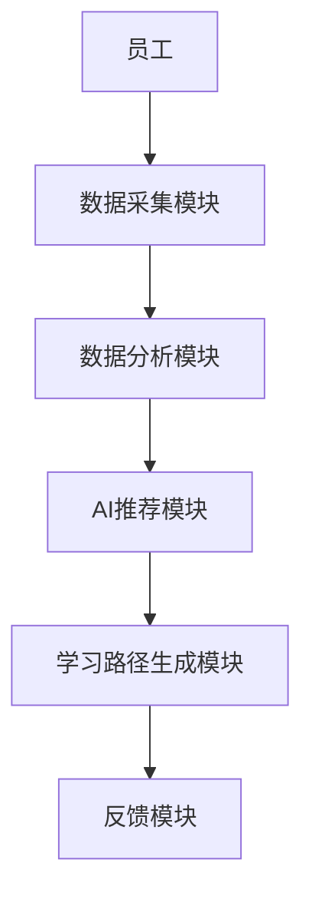

                 


# 构建企业专属AI培训师：员工技能提升助手

---

## 关键词：
企业专属AI培训师，员工技能提升，AI技术，机器学习，自然语言处理，个性化推荐，数据驱动

---

## 摘要：
随着企业对员工技能提升的需求日益增长，传统的培训方式逐渐暴露出效率低下、个性化不足等问题。通过构建企业专属的AI培训师，可以利用人工智能技术实现个性化培训方案推荐、实时反馈与效果评估，从而大幅提升员工技能提升的效率和效果。本文将从背景、核心概念、算法原理、系统架构到项目实战，全面解析如何构建企业专属AI培训师，为企业提供高效、智能化的员工技能提升解决方案。

---

## 第一部分：企业专属AI培训师的背景与核心概念

### 第1章：企业专属AI培训师的背景与需求

#### 1.1 传统企业培训的痛点
- 传统培训方式的效率低下：培训资源浪费、员工参与度低。
- 培训内容与员工需求脱节：千篇一律的培训方案难以满足个性化需求。
- 培训效果难以量化：缺乏科学的评估体系，难以衡量培训的实际效果。

#### 1.2 数字化培训的兴起
- 数据驱动的培训分析：通过数据分析，精准识别员工技能差距。
- 个性化学习路径：基于员工特点推荐定制化的培训方案。
- 实时反馈与互动：通过AI技术实现即时反馈，提升学习效果。

#### 1.3 AI技术在企业培训中的应用潜力
- 自然语言处理（NLP）：用于分析员工的技能需求和培训反馈。
- 机器学习：用于预测员工的学习效果并优化培训方案。
- 个性化推荐算法：为员工推荐最适合的学习资源。

#### 1.4 专属AI培训师的核心价值
- 提升培训效率：通过AI算法快速匹配员工需求与培训资源。
- 个性化学习体验：为每个员工量身定制学习计划。
- 数据驱动的决策：通过实时数据分析优化培训策略。

---

### 第2章：AI培训师的核心概念与原理

#### 2.1 核心概念
- 数据驱动的培训分析：通过员工的行为数据、技能数据和反馈数据，构建全面的培训画像。
- 自然语言处理（NLP）：用于解析员工的技能需求和培训反馈，生成个性化的学习内容。
- 个性化推荐算法：基于员工的特点和需求，推荐最合适的培训资源和学习路径。

#### 2.2 核心原理
- 数据采集：通过员工的行为数据（如学习进度、测试成绩）和反馈数据（如满意度调查），构建员工的技能画像。
- 数据分析：利用机器学习算法对员工数据进行分析，识别技能差距和学习偏好。
- 个性化推荐：基于分析结果，为员工推荐最优的学习资源和培训方案。

#### 2.3 专属AI培训师的实现框架
- 数据采集模块：负责收集员工的技能数据和行为数据。
- 数据分析模块：对数据进行清洗、特征提取和建模分析。
- AI推荐模块：基于分析结果，生成个性化的培训方案。
- 学习路径生成模块：为员工设计最优的学习路径。

---

### 第3章：专属AI培训师的系统架构与设计

#### 3.1 系统架构概述
- 分层架构设计：包括数据层、算法层和应用层。
- 模块化设计：将系统划分为数据采集、数据分析、AI推荐和学习路径生成等模块。
- 可扩展性设计：确保系统能够灵活应对未来的需求变化。

#### 3.2 核心模块设计
- 数据采集模块：负责收集员工的技能数据、行为数据和反馈数据。
- 数据分析模块：对数据进行清洗、特征提取和建模分析。
- AI推荐模块：基于机器学习算法，推荐最优的培训资源和学习路径。
- 学习路径生成模块：为员工设计个性化的学习计划。

#### 3.3 系统交互流程
1. 员工输入学习需求：通过问卷或测试，系统收集员工的学习目标和技能偏好。
2. 数据分析：系统对员工数据进行分析，识别技能差距和学习偏好。
3. AI推荐：基于分析结果，系统推荐最优的培训资源和学习路径。
4. 学习反馈：员工完成学习后，系统收集反馈数据，优化推荐算法。

---

## 第二部分：AI培训师的算法原理与实现

### 第4章：AI培训师的算法原理

#### 4.1 数据预处理与特征提取
- 数据清洗：去除冗余数据和异常值。
- 特征提取：从员工数据中提取关键特征，如技能水平、学习偏好和学习风格。
- 数据增强：通过数据增强技术，提升数据的多样性和代表性。

#### 4.2 个性化推荐算法
- 基于协同过滤的推荐算法：通过员工的行为数据，找到相似的学习需求，推荐相似的培训资源。
- 基于内容的推荐算法：通过分析培训内容的特征，推荐与员工需求匹配的培训资源。
- 混合推荐算法：结合协同过滤和内容推荐的优势，提升推荐的准确性和多样性。

#### 4.3 个性化推荐的数学模型
- 协同过滤模型：
  $$ \text{相似度} = \frac{\sum_{i=1}^{n} (x_i - \mu_x)(y_i - \mu_y)}{\sqrt{\sum_{i=1}^{n} (x_i - \mu_x)^2} \cdot \sqrt{\sum_{i=1}^{n} (y_i - \mu_y)^2}} $$
- 基于内容的推荐模型：
  $$ \text{相似度} = \frac{\sum_{i=1}^{n} w_i \cdot x_i}{\sqrt{\sum_{i=1}^{n} w_i^2 \cdot x_i^2} \cdot \sqrt{\sum_{i=1}^{n} w_i^2 \cdot y_i^2}} $$

---

### 第5章：AI培训师的系统实现

#### 5.1 系统实现框架
- 前端：负责用户界面的设计和交互，如员工的学习需求输入和学习效果反馈。
- 后端：负责数据的处理和算法的实现，如数据清洗、特征提取和模型训练。
- 数据库：负责存储员工数据、培训资源和推荐结果。

#### 5.2 核心算法实现
- 数据清洗与特征提取：
  ```python
  def data_cleaning(data):
      # 去除冗余数据
      data = data.drop_duplicates()
      # 去除异常值
      data = data[(data['score'] >= 0) & (data['score'] <= 100)]
      return data
  ```

- 模型训练与推荐：
  ```python
  from sklearn.model_selection import train_test_split
  from sklearn.linear_model import LinearRegression

  X_train, X_test, y_train, y_test = train_test_split(X, y, test_size=0.2)
  model = LinearRegression()
  model.fit(X_train, y_train)
  ```

#### 5.3 接口设计与实现
- 数据接口：负责与数据库的交互，如数据的读取和写入。
- 推荐接口：负责接收员工的需求，调用推荐算法，返回推荐结果。
- 反馈接口：负责收集员工的学习反馈，优化推荐算法。

---

## 第三部分：专属AI培训师的系统架构与设计

### 第6章：系统架构与设计

#### 6.1 系统功能设计
- 用户管理：包括员工信息管理、权限管理等。
- 数据采集：包括技能数据采集、行为数据采集和反馈数据采集。
- AI推荐：包括个性化推荐、学习路径生成和效果评估。
- 系统管理：包括系统监控、日志管理和性能优化。

#### 6.2 系统架构图


#### 6.3 系统交互流程
1. 员工输入学习需求：通过问卷或测试，系统收集员工的学习目标和技能偏好。
2. 数据分析：系统对员工数据进行分析，识别技能差距和学习偏好。
3. AI推荐：基于分析结果，系统推荐最优的培训资源和学习路径。
4. 学习反馈：员工完成学习后，系统收集反馈数据，优化推荐算法。

---

## 第四部分：项目实战与总结

### 第7章：项目实战

#### 7.1 项目环境配置
- 安装Python和必要的库：
  ```bash
  pip install numpy pandas scikit-learn
  ```

#### 7.2 核心代码实现
- 数据清洗与特征提取：
  ```python
  import pandas as pd
  import numpy as np

  def data_cleaning(data):
      # 去除冗余数据
      data = data.drop_duplicates()
      # 去除异常值
      data = data[(data['score'] >= 0) & (data['score'] <= 100)]
      return data

  # 加载数据
  data = pd.read_csv('employee_data.csv')
  # 数据清洗
  cleaned_data = data_cleaning(data)
  ```

- 模型训练与推荐：
  ```python
  from sklearn.model_selection import train_test_split
  from sklearn.linear_model import LinearRegression

  X = cleaned_data[['age', 'experience']]
  y = cleaned_data['score']

  X_train, X_test, y_train, y_test = train_test_split(X, y, test_size=0.2)
  model = LinearRegression()
  model.fit(X_train, y_train)
  ```

#### 7.3 项目总结
- 项目实现的核心价值：通过AI技术实现个性化培训推荐，提升员工技能提升效率。
- 项目实施的关键点：数据采集与处理、算法选择与优化、系统架构设计。
- 项目扩展方向：引入更复杂的机器学习算法（如深度学习），优化推荐效果。

---

## 第五部分：总结与展望

### 第8章：总结与展望

#### 8.1 本项目的核心总结
- 通过构建企业专属AI培训师，企业可以实现个性化培训推荐、实时反馈与效果评估，大幅提升员工技能提升的效率和效果。

#### 8.2 未来展望
- 引入更先进的机器学习算法（如深度学习和强化学习），进一步优化推荐效果。
- 结合区块链技术，提升培训数据的安全性和可信度。
- 推动AI培训师的智能化升级，实现自主学习和自我优化。

---

## 参考文献
（此处可以列出相关的技术文档、书籍和论文）

---

通过构建企业专属AI培训师，企业可以实现高效、个性化的员工技能提升，同时通过数据驱动的方式优化培训策略，提升企业的整体竞争力。

