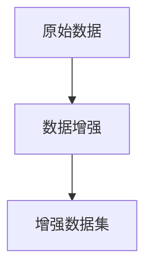
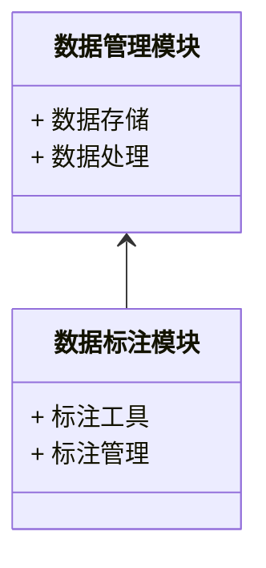
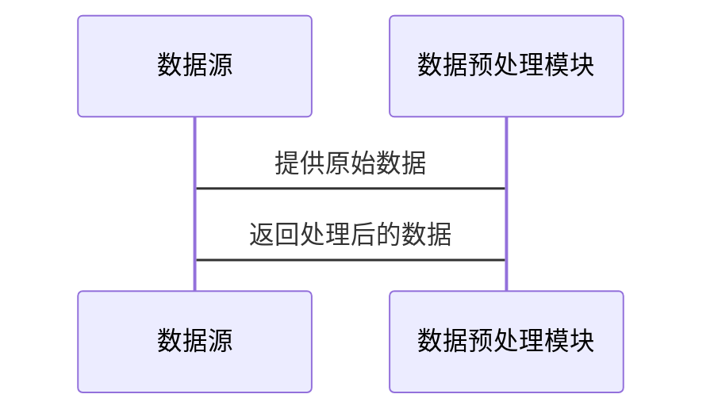

                 


# 构建企业专属训练数据集：确保AI Agent的领域适应性

> **关键词**：企业数据集、AI Agent、领域适应性、数据增强、系统架构  
> **摘要**：本文详细探讨了构建企业专属训练数据集的重要性，分析了数据集对AI Agent领域适应性的影响，并提供了从数据收集到系统架构设计的完整方法论。通过实际案例和系统架构设计，展示了如何确保AI Agent在特定领域的高效性能。

---

## 第一部分：引言

### 1.1 问题背景与重要性

#### 1.1.1 人工智能与AI Agent的现状
人工智能（AI）技术的快速发展推动了AI Agent的应用，从智能助手到企业自动化服务，AI Agent在各个领域的价值日益凸显。然而，AI Agent的性能高度依赖于训练数据的质量和领域适应性。企业专属数据集的构建是确保AI Agent在特定领域高效运作的关键。

#### 1.1.2 数据集在AI Agent中的核心作用
AI Agent的训练数据集是其“知识库”，决定了其理解和处理问题的能力。企业专属数据集能够反映企业的独特业务流程、行业术语和特定需求，确保AI Agent在实际应用场景中的准确性。

#### 1.1.3 企业专属数据集的必要性
通用数据集难以满足企业的个性化需求，企业专属数据集能够针对性地优化AI Agent的性能，提升用户体验和业务效率。

#### 1.1.4 领域适应性的定义与目标
领域适应性是指AI Agent能够有效理解和处理特定领域问题的能力。构建企业专属数据集是实现这一目标的核心步骤。

---

## 第二部分：数据集构建的基础知识

### 2.1 数据收集与获取

#### 2.1.1 数据来源与获取方式
数据来源包括企业内部数据、公开数据集、网络爬取等。选择合适的来源是数据收集的第一步。

#### 2.1.2 数据收集的挑战与解决方案
数据清洗与预处理是数据收集中的关键步骤，需解决数据缺失、噪声等问题。

#### 2.1.3 数据质量评估标准
数据质量需从完整性、一致性、准确性等方面进行评估。

#### 2.1.4 数据清洗与预处理方法
常用方法包括数据填充、去重、标准化等。

### 2.2 数据标注与标注规范

#### 2.2.1 数据标注的定义与流程
数据标注是为数据打上标签的过程，确保AI Agent能够理解数据内容。

#### 2.2.2 标注规范的制定与实施
制定统一的标注规范，确保数据一致性。

#### 2.2.3 标注工具的选择与使用
常用工具包括Label Studio、VGG Image Annotator等。

#### 2.2.4 数据标注的质量控制
通过复核和验证确保标注准确性。

### 2.3 数据增强与数据扩展

#### 2.3.1 数据增强技术的原理与应用
数据增强通过变换数据提升模型泛化能力。

#### 2.3.2 数据扩展的方法与策略
常用方法包括旋转、翻转、裁剪等。

#### 2.3.3 数据增强对模型性能的影响
数据增强可有效防止过拟合，提升模型鲁棒性。

#### 2.3.4 数据增强的实现案例
使用Python库如Keras图像预处理库实现数据增强。

---

## 第三部分：数据集对AI Agent的影响

### 3.1 数据集构建的核心概念与联系

#### 3.1.1 核心概念原理
数据集构建涉及数据收集、清洗、标注等多个环节。

#### 3.1.2 核心要素对比表格
| 要素 | 描述 |
|------|------|
| 数据来源 | 内部数据、公开数据集等 |
| 数据类型 | 文本、图像、结构化数据等 |

#### 3.1.3 实体关系图（ER图）


---

## 第四部分：算法原理与数据增强

### 4.1 数据增强算法原理

#### 4.1.1 算法流程图


#### 4.1.2 数学模型
$$
y = f(x) + \epsilon
$$
其中，\( x \)为原始数据，\( f \)为增强函数，\( \epsilon \)为噪声。

#### 4.1.3 实现代码
```python
import tensorflow as tf

def data_augmenter():
    datagen = tf.keras.preprocessing.image.ImageDataGenerator(
        rotation_range=20,
        horizontal_flip=True,
        shear_range=0.2
    )
    return datagen
```

---

## 第五部分：系统架构设计

### 5.1 数据管理系统架构

#### 5.1.1 系统功能设计


#### 5.1.2 系统架构图


#### 5.1.3 接口与交互设计


---

## 第六部分：项目实战

### 6.1 环境安装与核心实现

#### 6.1.1 环境安装
```bash
pip install numpy pandas scikit-learn
```

#### 6.1.2 核心代码实现
```python
import pandas as pd

def preprocess_data(data):
    # 数据清洗
    data.dropna(inplace=True)
    return data

# 数据加载与预处理
data = pd.read_csv('dataset.csv')
data = preprocess_data(data)
```

---

## 第七部分：最佳实践与总结

### 7.1 最佳实践

#### 7.1.1 数据隐私保护
确保数据处理符合隐私保护法规。

#### 7.1.2 数据多样性维护
保持数据多样性，提升模型泛化能力。

#### 7.1.3 数据更新机制
建立数据更新机制，保持数据集的时效性。

### 7.2 未来趋势

随着AI技术的发展，自动化数据标注工具和智能数据增强算法将更加普及。

---

## 附录

### 附录A：常用工具与库

- 数据处理：Pandas、NumPy
- 数据标注：Label Studio
- 数据增强：Keras Preprocessing

### 附录B：参考文献

- 《深度学习》——Ian Goodfellow
- 《机器学习实战》——周志华

---

通过以上步骤，您可以系统地构建企业专属训练数据集，确保AI Agent在特定领域的高效适应性。

