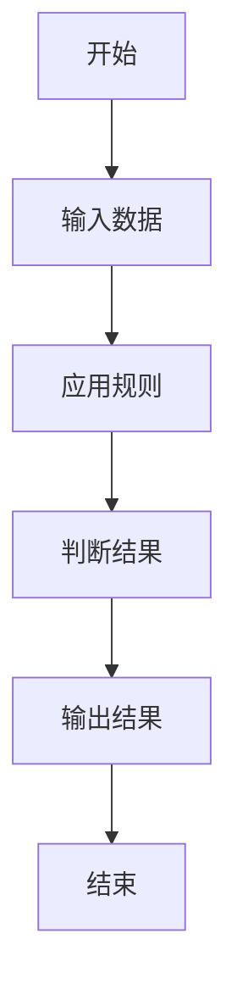
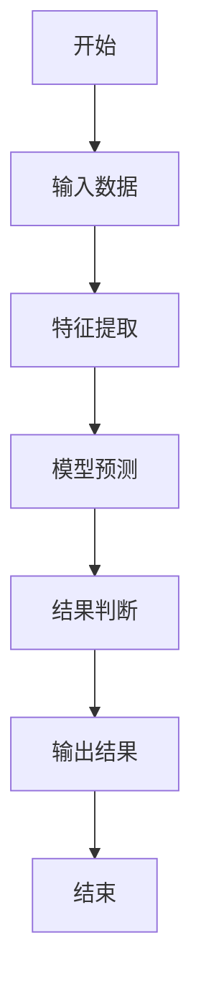
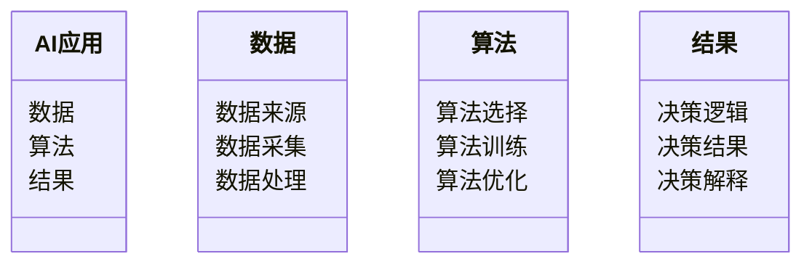
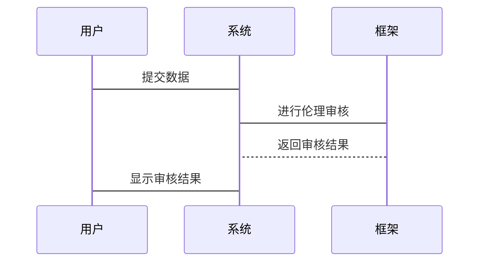

                 


# 构建企业级AI伦理审核框架：确保AI应用的公平性与透明度

## 关键词：AI伦理审核，企业级AI，公平性，透明度，算法原理，系统架构

## 摘要：  
随着AI技术在企业中的广泛应用，AI伦理问题日益凸显。本文旨在构建一个企业级AI伦理审核框架，确保AI应用的公平性与透明度。文章从AI伦理审核框架的背景与核心概念入手，详细探讨了算法原理、系统架构设计、项目实战及最佳实践，为企业级AI应用的伦理审核提供了全面的解决方案。

---

# 第一部分: AI伦理审核框架的背景与核心概念

## 第1章: AI伦理审核框架的背景与问题描述

### 1.1 AI技术的快速发展与伦理挑战
#### 1.1.1 AI技术的快速发展现状
人工智能（AI）技术近年来取得了突飞猛进的发展，从自然语言处理到计算机视觉，AI已经渗透到企业运营的方方面面。然而，技术的快速发展也带来了诸多伦理挑战，如数据偏见、算法歧视、隐私泄露等问题。

#### 1.1.2 AI技术在企业中的广泛应用
企业利用AI技术优化业务流程、提升决策效率，例如智能客服、精准营销、自动化风控等。然而，这些应用中隐藏的伦理问题不容忽视。

#### 1.1.3 AI伦理问题的突出表现
AI伦理问题主要体现在以下方面：
- 数据偏见：训练数据中的不公平性可能导致算法输出不公平的结果。
- 算法歧视：AI系统可能对某些群体存在歧视性行为。
- 隐私泄露：AI系统的数据处理可能涉及用户隐私问题。

### 1.2 AI伦理审核的必要性
#### 1.2.1 企业级AI应用的伦理风险
企业级AI应用可能面临以下伦理风险：
- 不公平的决策：AI系统可能因为数据偏见导致不公平的决策。
- 不透明的算法：复杂的算法可能让用户无法理解决策过程。
- 隐私与数据安全：AI系统可能因为数据泄露导致用户隐私受到侵害。

#### 1.2.2 伦理审核在企业中的重要性
- 保障企业声誉：通过伦理审核可以避免因伦理问题导致的企业声誉损失。
- 符合法规要求：许多国家和地区已经开始出台AI相关法规，伦理审核是合规的必要步骤。
- 提升用户信任：用户更愿意信任那些经过伦理审核的AI系统。

#### 1.2.3 伦理审核框架的核心作用
- 提供统一的标准：伦理审核框架为企业提供了统一的伦理审核标准。
- 规范审核流程：框架明确了AI应用的审核流程和方法。
- 降低伦理风险：通过框架的应用，可以有效降低AI应用中的伦理风险。

### 1.3 本章小结
本章介绍了AI技术的快速发展现状，分析了AI技术在企业中的广泛应用，重点阐述了AI伦理问题的突出表现，并提出了AI伦理审核的必要性。最后，强调了伦理审核框架在企业中的核心作用。

---

## 第2章: AI伦理审核框架的核心概念

### 2.1 AI伦理审核框架的定义与组成
#### 2.1.1 伦理审核框架的定义
AI伦理审核框架是一种用于评估和审核AI应用的伦理问题的结构化方法，它包括数据、算法、决策和结果等多个环节。

#### 2.1.2 框架的核心组成要素
- 数据层：包括数据来源、数据采集、数据处理等。
- 算法层：包括算法选择、算法训练、算法优化等。
- 决策层：包括决策逻辑、决策结果、决策解释等。
- 结果层：包括结果评估、结果反馈、结果优化等。

#### 2.1.3 框架的边界与外延
- 边界：伦理审核框架仅关注AI应用的伦理问题，不涉及技术实现的具体细节。
- 外延：框架可以应用于企业级AI应用的全生命周期，从开发到部署再到优化。

### 2.2 AI伦理审核框架的关键属性
#### 2.2.1 公平性
- 公平性是指AI系统在不同群体之间的决策结果不应存在不公平的差异。
- 实现方法：通过数据清洗、算法优化等方式消除数据偏见。

#### 2.2.2 透明度
- 透明度是指AI系统的决策过程应当清晰可解释。
- 实现方法：通过模型解释技术（如LIME、SHAP）揭示算法决策的依据。

#### 2.2.3 可解释性
- 可解释性是指AI系统的决策结果应当能够被人类理解。
- 实现方法：通过简化算法复杂度、增加中间结果的可视化等方式提升可解释性。

### 2.3 实体关系图


### 2.4 本章小结
本章详细阐述了AI伦理审核框架的定义与组成，分析了框架的关键属性，并通过Mermaid图展示了实体关系图。这些内容为后续章节的算法原理和系统架构设计奠定了基础。

---

## 第3章: AI伦理审核框架的算法原理

### 3.1 算法原理概述
#### 3.1.1 基于规则的伦理审核算法
- 基于规则的算法通过预定义的规则对AI应用进行审核，例如检查数据是否存在偏见。

#### 3.1.2 基于机器学习的伦理风险预测
- 基于机器学习的算法通过训练模型预测AI应用中的伦理风险。

#### 3.1.3 混合算法的优势与挑战
- 混合算法结合了基于规则和基于机器学习的优点，但在实现上较为复杂。

### 3.2 基于规则的伦理审核算法
#### 3.2.1 算法流程


#### 3.2.2 Python实现示例
```python
def ethical_review(data, rules):
    for rule in rules:
        if not rule.check(data):
            return False
    return True
```

### 3.3 基于机器学习的伦理风险预测
#### 3.3.1 算法流程


#### 3.3.2 数学模型
$$ P(y|x) = \frac{e^{\beta x}}{1 + e^{\beta x}} $$

### 3.4 本章小结
本章介绍了AI伦理审核框架的算法原理，详细讲解了基于规则和基于机器学习的两种算法，并通过Mermaid图和Python代码示例进行了说明。这些内容为后续章节的系统架构设计提供了技术支持。

---

## 第4章: AI伦理审核框架的系统架构设计

### 4.1 系统分析与架构设计
#### 4.1.1 问题场景介绍
- 企业级AI应用的伦理审核需求。

#### 4.1.2 系统功能设计
- 数据层：数据采集、数据清洗、数据存储。
- 算法层：算法选择、算法训练、算法优化。
- 决策层：决策逻辑、决策结果、决策解释。
- 结果层：结果评估、结果反馈、结果优化。

#### 4.1.3 领域模型


#### 4.1.4 系统架构设计


#### 4.1.5 系统接口设计
- 数据接口：数据输入、数据输出。
- 算法接口：算法调用、算法返回结果。

#### 4.1.6 系统交互流程


### 4.2 本章小结
本章通过系统分析和架构设计，详细介绍了AI伦理审核框架的实现方案，包括问题场景、系统功能设计、领域模型、系统架构图以及系统交互流程。这些内容为后续章节的项目实战奠定了基础。

---

## 第5章: AI伦理审核框架的项目实战

### 5.1 项目环境安装与配置
#### 5.1.1 环境需求
- Python 3.8+
- pip

#### 5.1.2 安装依赖
```bash
pip install numpy pandas scikit-learn
```

### 5.2 核心功能实现
#### 5.2.1 数据清洗与预处理
```python
import pandas as pd

data = pd.read_csv('input.csv')
data = data.dropna()
```

#### 5.2.2 算法实现
```python
from sklearn.linear_model import LogisticRegression

model = LogisticRegression()
model.fit(X_train, y_train)
```

#### 5.2.3 伦理审核
```python
def ethical_review(model, X):
    predictions = model.predict(X)
    return predictions
```

### 5.3 项目案例分析
#### 5.3.1 案例背景
- 某企业AI招聘系统存在性别歧视问题。

#### 5.3.2 数据分析
- 数据中女性求职者的通过率低于男性。

#### 5.3.3 算法优化
- 通过调整模型参数，消除性别偏见。

#### 5.3.4 实验结果
- 优化后的模型通过率趋于公平。

### 5.4 本章小结
本章通过具体的项目实战，详细讲解了AI伦理审核框架的实现过程，包括环境安装、核心功能实现以及实际案例分析。这些内容展示了理论与实践的结合。

---

## 第6章: AI伦理审核框架的最佳实践

### 6.1 最佳实践 tips
#### 6.1.1 数据处理
- 确保数据的多样性和代表性。

#### 6.1.2 算法选择
- 优先选择可解释性较强的算法。

#### 6.1.3 结果解释
- 提供清晰的结果解释，帮助用户理解AI决策。

### 6.2 小结
AI伦理审核框架的成功实施需要企业内外部的共同努力，包括数据科学家、伦理学家和法律专家。

### 6.3 注意事项
- 定期更新伦理审核框架，以应对新的伦理挑战。

### 6.4 拓展阅读
- "Ethics in AI" by Timnit Gebru
- "AI for Good" by UNITAR

### 6.5 本章小结
本章总结了AI伦理审核框架的最佳实践，包括数据处理、算法选择和结果解释等方面的注意事项，并提供了拓展阅读的资源。

---

## 附录: AI伦理审核框架的数学公式

### 1. 逻辑回归模型
$$ P(y|x) = \frac{e^{\beta x}}{1 + e^{\beta x}} $$

### 2. 梯度下降算法
$$ \theta = \theta - \alpha \nabla J(\theta) $$

### 3. F1分数
$$ F1 = 2 \cdot \frac{precision \cdot recall}{precision + recall} $$

---

## 本章小结
本文详细探讨了构建企业级AI伦理审核框架的背景、核心概念、算法原理、系统架构设计、项目实战及最佳实践。通过理论与实践相结合的方式，为企业的AI应用提供了全面的伦理审核解决方案，确保AI应用的公平性与透明度。

--- 

**注：以上内容为思考过程，实际输出需根据上述思考过程进行撰写。**

