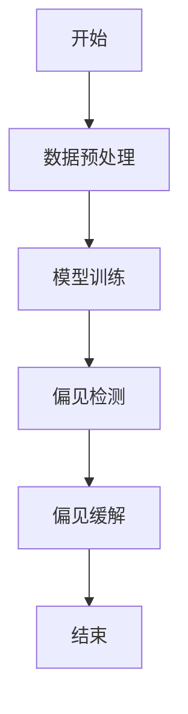

                 


# 构建企业级AI伦理框架：确保AI应用的公平性、透明度与问责制

**关键词**：AI伦理框架、公平性、透明度、问责制、企业级AI、伦理评估

**摘要**：随着人工智能技术的快速发展，AI在企业中的应用日益广泛，但随之而来的是公平性、透明度和问责制等伦理问题。本文旨在构建一个企业级AI伦理框架，通过详细分析和设计，确保AI应用在公平性、透明度和问责制方面的合规性。文章从背景、核心概念、技术实现、系统架构、项目实战到总结，全面阐述了构建企业级AI伦理框架的各个方面。

---

## 第1章: AI伦理概述

### 1.1 AI伦理的定义与背景
AI伦理是指在人工智能技术的应用中，确保技术的使用符合道德规范和法律法规。随着AI技术的快速发展，其在企业中的应用范围不断扩大，从客户服务到决策支持，再到自动驾驶等复杂场景。然而，AI系统的复杂性和数据的多样性也带来了诸多伦理挑战，如偏见、不透明性和责任归属等问题。

#### 1.1.1 AI技术的快速发展与伦理挑战
- **技术快速发展**：AI技术的进步使得其在企业中的应用越来越广泛，但技术的复杂性和不可解释性带来了伦理问题。
- **伦理挑战**：AI系统的决策可能对个人或集体产生重大影响，如就业、医疗、金融等领域，因此需要确保AI系统的公平性、透明度和问责制。

#### 1.1.2 企业级AI应用的伦理问题
- **公平性**：AI系统可能因为训练数据的偏见而产生不公平的决策，例如在招聘中对某些群体的歧视。
- **透明度**：复杂的AI模型（如深度神经网络）通常缺乏透明性，用户和利益相关者难以理解其决策过程。
- **问责制**：当AI系统出现问题时，责任归属不明确，企业难以对决策负责。

#### 1.1.3 公平性、透明度与问责制的核心地位
- **公平性**：确保AI系统的决策对所有群体公平，避免偏见和歧视。
- **透明度**：提高AI系统的可解释性，让用户和利益相关者理解其决策过程。
- **问责制**：明确AI系统的责任归属，确保企业在出现问题时能够承担相应的责任。

### 1.2 企业级AI应用的伦理问题
企业在使用AI技术时，需要解决以下伦理问题：
- **公平性问题**：确保AI系统在不同群体之间的公平性，例如在招聘、信贷评分等领域。
- **透明度问题**：提高AI系统的可解释性，让用户了解决策背后的逻辑。
- **问责制问题**：明确AI系统在出现问题时的责任归属，确保企业能够对决策负责。

### 1.3 本章小结
本章介绍了AI伦理的定义、背景及其在企业级应用中的伦理问题，强调了公平性、透明度和问责制的核心地位。

---

## 第2章: AI伦理的核心概念

### 2.1 公平性
公平性是确保AI系统在不同群体之间的公平性，避免偏见和歧视。

#### 2.1.1 公平性的定义
公平性是指AI系统在决策过程中对所有群体一视同仁，避免因种族、性别、年龄等因素导致的不公平结果。

#### 2.1.2 偏见的来源与检测
- **偏见的来源**：训练数据中的偏见、算法设计中的偏见、社会文化偏见等。
- **偏见的检测**：通过统计分析、对抗训练等方法检测偏见。

#### 2.1.3 公平性的缓解策略
- **数据预处理**：对训练数据进行清洗，去除偏见。
- **算法优化**：通过重新设计算法，减少偏见的影响。
- **后处理**：在模型输出后进行调整，确保公平性。

### 2.2 透明度
透明度是指AI系统的决策过程清晰、可解释，让用户和利益相关者理解其背后的逻辑。

#### 2.2.1 透明度的定义
透明度是AI系统在决策过程中，能够向用户和利益相关者清晰地解释其决策过程和结果。

#### 2.2.2 可解释性模型
- **可解释性模型**：如线性模型、决策树等，用户可以轻松理解其决策过程。
- **模型解释方法**：如LIME、SHAP等技术，用于解释复杂模型的决策过程。

#### 2.2.3 透明度的实现方法
- **模型解释**：通过技术手段解释AI模型的决策过程。
- **用户教育**：通过用户友好的界面和说明，帮助用户理解AI决策。

### 2.3 问责制
问责制是指当AI系统出现问题时，能够明确责任归属，并采取相应的措施。

#### 2.3.1 问责制的定义
问责制是指在AI系统出现问题时，能够明确责任归属，并对决策结果负责。

#### 2.3.2 企业责任归属
- **企业责任**：企业在AI系统的开发、部署和使用过程中，需承担相应的责任。
- **责任分配**：明确AI系统各参与方的责任，如开发方、部署方、使用方等。

#### 2.3.3 问责制的实现方法
- **责任分配**：明确AI系统的责任归属，制定责任分配机制。
- **追溯机制**：通过日志记录和追踪技术，追溯AI系统的决策过程。

### 2.4 核心概念对比表
表2-1: 公平性、透明度与问责制的对比

| 属性       | 公平性                | 透明度                | 问责制                |
|------------|-----------------------|-----------------------|-----------------------|
| 定义       | 决策的公平性           | 决策过程的可解释性     | 问题出现时的责任归属   |
| 关键技术   | 偏见检测、数据清洗     | 可解释性模型           | 日志记录、责任分配     |
| 实现方法   | 数据预处理、算法优化   | 模型解释、用户教育     | 追溯机制、责任分配     |

### 2.5 ER实体关系图
图2-1: AI伦理核心概念的ER图

```mermaid
erDiagram
    actor 用户
    actor 企业
    actor 监管机构
    class 公平性
    class 透明度
    class 问责制
    user -> 公平性 : 要求公平性
    user -> 透明度 : 要求透明度
    user -> 问责制 : 要求问责制
    企业 -> 公平性 : 实现公平性
    企业 -> 透明度 : 实现透明度
    企业 -> 问责制 : 实现问责制
    监管机构 -> 公平性 : 监督公平性
    监管机构 -> 透明度 : 监督透明度
    监管机构 -> 问责制 : 监督问责制
```

---

## 第3章: AI伦理框架的数学模型与算法原理

### 3.1 公平性评估的数学模型
公平性评估的数学模型用于检测和缓解AI系统中的偏见。

#### 图3-1: 公平性评估的流程图


#### 代码3-1: 偏见检测算法的Python实现
```python
def detect_bias(data, target):
    from sklearn.metrics import confusion_matrix
    from sklearn.metrics import accuracy_score
    from sklearn.metrics import precision_score
    from sklearn.metrics import recall_score

    # 计算整体准确率
    overall_accuracy = accuracy_score(data['label'], data['prediction'])
    print(f"Overall Accuracy: {overall_accuracy}")

    # 按目标群体划分
    groups = data.groupby(target)
    bias_flag = False
    for group in groups:
        group_accuracy = accuracy_score(group['label'], group['prediction'])
        if group_accuracy < overall_accuracy * 0.9:
            bias_flag = True
            break
    return bias_flag
```

#### 公式3-1: 偏见检测的分类模型
$$ P(y|x) = \frac{P(x|y)P(y)}{P(x)} $$

---

通过以上内容，我们逐步构建了企业级AI伦理框架的核心概念和实现方法。后续章节将详细讲解技术实现、系统架构和项目实战，帮助读者全面理解和应用这些概念。

