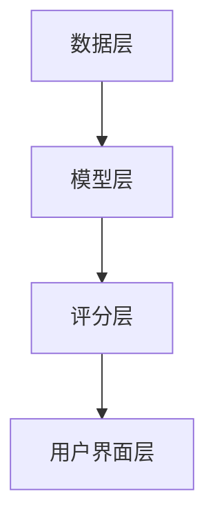
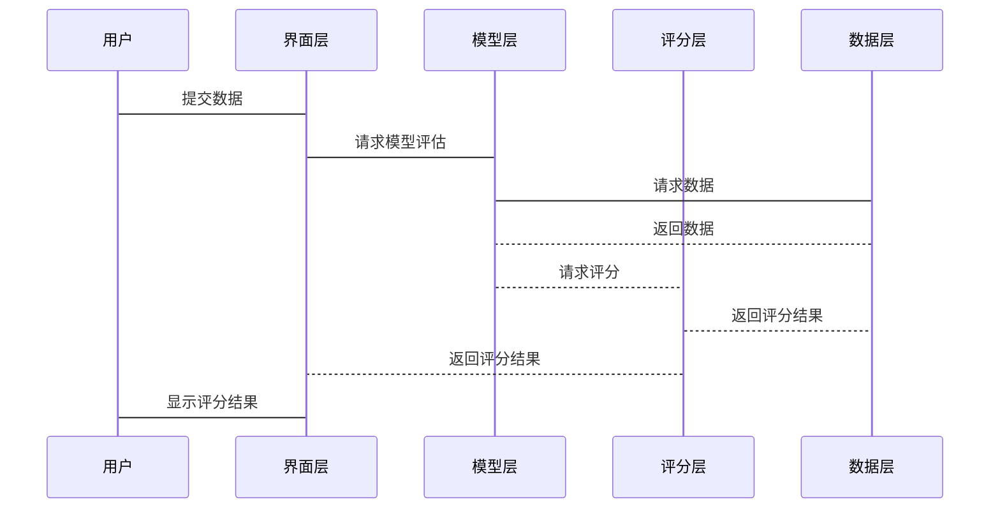

                 


# 构建企业级AI伦理顾问：确保AI应用的道德合规

## 关键词：
- AI伦理
- 企业合规
- 伦理评估
- 人工智能
- 数据隐私

## 摘要：
随着人工智能技术的快速发展，企业越来越多地应用AI技术来优化业务流程、提升决策效率和客户体验。然而，AI技术的应用也带来了诸多伦理和法律上的挑战，如数据隐私、算法偏见、透明度等问题。本文旨在探讨如何构建一个企业级AI伦理顾问系统，确保AI应用的道德合规。通过系统性地分析AI伦理的核心概念、技术基础、算法原理、系统架构以及实际案例，本文将为企业提供一套完整的解决方案，帮助企业在享受AI技术红利的同时，规避伦理风险，实现可持续发展。

## 第1章: AI伦理的背景与问题背景

### 1.1 AI伦理的核心概念
#### 1.1.1 AI伦理的定义
AI伦理是指在人工智能系统的开发和应用过程中，确保系统的行为符合人类社会的道德规范和法律法规。它关注AI系统对人类社会、环境和个体权益的影响，旨在通过伦理框架和技术手段来解决AI带来的潜在风险。

#### 1.1.2 AI伦理的核心原则
AI伦理的核心原则包括：
1. **公平性**：确保AI系统不会对特定群体产生不公平的影响。
2. **透明性**：用户应能够理解AI系统的决策过程。
3. **隐私保护**：保护用户的个人数据不被滥用。
4. **责任性**：明确AI系统在出现问题时的责任归属。
5. **可控性**：确保人类能够控制和监督AI系统的运行。

#### 1.1.3 AI伦理与企业责任的关系
企业在AI应用中负有重要的伦理责任。企业需要确保其AI系统的开发和使用符合伦理规范，避免因算法偏见、数据滥用等问题导致的法律风险和社会责任问题。

### 1.2 问题背景与问题描述
#### 1.2.1 AI技术的快速发展与伦理挑战
AI技术的快速发展为企业带来了巨大的机遇，但也带来了诸多伦理挑战。例如，AI算法可能因为训练数据中的偏见而产生不公平的决策。

#### 1.2.2 企业AI应用中的道德风险
企业在AI应用中可能面临以下道德风险：
1. **数据隐私**：未经用户同意收集和使用数据。
2. **算法偏见**：算法在决策过程中产生不公平的结果。
3. **透明度不足**：用户无法理解AI系统的决策过程。
4. **责任归属**：当AI系统出现问题时，责任归属不明确。

#### 1.2.3 伦理合规的重要性与紧迫性
伦理合规是企业在AI应用中必须遵守的基本原则。只有确保AI应用的伦理合规，企业才能在合法合规的前提下享受技术红利，避免因伦理问题导致的法律风险和声誉损失。

## 第2章: AI伦理的核心概念与联系

### 2.1 核心概念的原理与属性
#### 2.1.1 AI伦理的核心概念
AI伦理的核心概念包括：
1. **数据隐私**：保护用户数据不被滥用。
2. **算法偏见**：确保算法在决策过程中不产生不公平的结果。
3. **透明性**：用户能够理解AI系统的决策过程。
4. **公平性**：确保AI系统对所有群体公平。

#### 2.1.2 每个概念的属性特征
- **数据隐私**：涉及数据的收集、存储和使用，强调用户同意和数据安全。
- **算法偏见**：涉及算法的训练数据和目标函数，强调多样性和代表性。
- **透明性**：涉及决策过程的可解释性，强调用户理解和信任。
- **公平性**：涉及不同群体的权益，强调平等和无歧视。

#### 2.1.3 核心概念之间的关系
AI伦理的核心概念之间存在相互关联和制约。例如，数据隐私和透明性之间可能存在冲突，如何在保护隐私的同时保证透明性是一个需要权衡的问题。

### 2.2 核心概念的对比分析
#### 2.2.1 AI伦理与数据隐私的对比
- **数据隐私**：关注数据的收集、存储和使用，强调用户同意和数据安全。
- **AI伦理**：关注AI系统的决策过程和对用户权益的影响，强调公平性和透明性。

#### 2.2.2 AI伦理与算法偏见的对比
- **算法偏见**：关注算法在决策过程中产生的不公平结果，强调算法的多样性和代表性。
- **AI伦理**：关注AI系统整体的道德合规性，强调公平性、透明性和责任性。

#### 2.2.3 AI伦理与透明度的对比
- **透明度**：关注决策过程的可解释性，强调用户理解和信任。
- **AI伦理**：关注决策过程的道德合规性，强调公平性和隐私保护。

### 2.3 ER实体关系图
```mermaid
er
  actor: 企业
  model: AI模型
  data: 数据
  rule: 伦理规则
  advisor: AI伦理顾问
  actor --> model: 使用
  model --> data: 加工
  model --> rule: 遵循
  advisor --> model: 监督
  advisor --> data: 分析
  advisor --> rule: 设定
```

## 第3章: AI伦理的技术基础

### 3.1 机器学习基础
#### 3.1.1 机器学习的基本原理
机器学习是一种人工智能技术，通过数据训练模型，使其能够从经验中学习并做出预测或决策。机器学习的核心在于算法对数据的学习和模式识别。

#### 3.1.2 监督学习与无监督学习
- **监督学习**：基于标注数据进行训练，预测新数据的标签。
- **无监督学习**：基于未标注数据进行训练，发现数据中的模式和结构。

#### 3.1.3 深度学习的简介
深度学习是一种机器学习技术，通过多层神经网络来学习数据的高层次特征。深度学习在图像识别、自然语言处理等领域表现出色。

### 3.2 自然语言处理基础
#### 3.2.1 NLP的基本概念
自然语言处理（NLP）是人工智能的一个分支，研究如何让计算机理解和处理人类语言。NLP技术广泛应用于文本分类、情感分析、机器翻译等领域。

#### 3.2.2 NLP的核心任务
- **文本分类**：将文本划分为不同的类别。
- **情感分析**：分析文本中表达的情感倾向。
- **实体识别**：识别文本中的实体及其类型。

#### 3.2.3 NLP的应用场景
- **客户服务**：通过聊天机器人提供智能客服。
- **内容分析**：对大量文本数据进行分析和挖掘。
- **信息提取**：从文本中提取有用的信息。

## 第4章: AI系统的伦理评估

### 4.1 伦理评估的必要性
#### 4.1.1 数据隐私的评估
数据隐私是AI伦理的核心问题之一。企业需要确保在数据采集、存储和使用过程中，用户的隐私权得到保护。

#### 4.1.2 算法偏见的评估
算法偏见是指AI系统在决策过程中对某些群体产生不公平的结果。企业需要通过评估算法的训练数据和目标函数，确保算法的公平性和代表性。

#### 4.1.3 透明性的评估
透明性是指用户能够理解AI系统的决策过程。企业需要通过设计可解释的模型和提供清晰的解释，增强用户的信任。

### 4.2 伦理评估的框架
#### 4.2.1 伦理评估的原则
- **公平性**：确保AI系统对所有群体公平。
- **透明性**：用户能够理解AI系统的决策过程。
- **隐私保护**：保护用户的个人数据不被滥用。
- **责任性**：明确AI系统在出现问题时的责任归属。

#### 4.2.2 伦理评估的步骤
1. **数据收集**：收集与AI系统相关的数据，包括训练数据和使用数据。
2. **模型评估**：评估AI模型的公平性、透明性和隐私保护。
3. **风险分析**：识别和分析AI系统可能带来的伦理风险。
4. **改进建议**：根据评估结果提出改进建议，确保AI系统的道德合规。

### 4.3 伦理评估的实现
#### 4.3.1 数据隐私的实现
企业可以通过数据脱敏、匿名化处理和加密技术来保护用户隐私。

#### 4.3.2 算法偏见的实现
企业可以通过多样化的训练数据、调整算法目标函数和引入对抗训练来减少算法偏见。

#### 4.3.3 透明性的实现
企业可以通过提供模型解释、使用可解释的算法和公开AI系统的决策过程来增强透明性。

## 第5章: AI伦理评分算法

### 5.1 算法原理
AI伦理评分算法通过对AI系统的公平性、透明性和隐私保护进行评估，给出一个综合评分。评分越高，表示AI系统的道德合规性越强。

#### 5.1.1 评分指标
1. **公平性评分**：评估AI系统对不同群体的公平性。
2. **透明性评分**：评估AI系统的决策过程是否透明。
3. **隐私保护评分**：评估AI系统的隐私保护措施。

### 5.2 算法实现
#### 5.2.1 算法流程
1. **数据准备**：收集与AI系统相关的数据。
2. **模型训练**：训练AI模型，确保模型的公平性和透明性。
3. **评分计算**：根据评分指标计算AI系统的综合评分。
4. **结果分析**：分析评分结果，提出改进建议。

#### 5.2.2 算法的数学模型
评分公式如下：
$$
\text{总评分} = \frac{\text{公平性评分} + \text{透明性评分} + \text{隐私保护评分}}{3}
$$

### 5.3 算法的优化
#### 5.3.1 参数调整
根据评分结果，调整算法的参数，优化模型的公平性、透明性和隐私保护能力。

#### 5.3.2 模型迭代
定期更新模型，确保AI系统的道德合规性与时俱进。

## 第6章: AI伦理顾问的系统架构

### 6.1 系统功能设计
#### 6.1.1 功能模块划分
1. **数据采集模块**：采集与AI系统相关的数据。
2. **模型评估模块**：评估AI模型的公平性、透明性和隐私保护。
3. **评分计算模块**：根据评分指标计算AI系统的综合评分。
4. **结果分析模块**：分析评分结果，提出改进建议。
5. **用户界面模块**：提供友好的用户界面，方便用户查看和操作。

#### 6.1.2 功能模块的交互设计
用户可以通过界面对AI系统的各个模块进行操作和管理。

### 6.2 系统架构设计
#### 6.2.1 分层架构设计
系统采用分层架构，包括数据层、模型层、评分层和用户界面层。

#### 6.2.2 系统架构图


### 6.3 系统接口设计
#### 6.3.1 API接口
系统提供RESTful API接口，方便其他系统调用AI伦理顾问的服务。

#### 6.3.2 接口文档
详细的接口文档可以帮助开发者快速集成AI伦理顾问服务。

### 6.4 系统交互设计
#### 6.4.1 交互流程
用户通过界面对AI系统的各个模块进行操作，系统根据用户的操作返回相应的结果。

#### 6.4.2 交互序列图


## 第7章: 项目实战

### 7.1 项目环境安装
#### 7.1.1 系统需求
- 操作系统：Linux/Windows/MacOS
- Python版本：3.6+
- 其他依赖：numpy, scikit-learn, flask

#### 7.1.2 环境安装
```bash
pip install numpy scikit-learn flask
```

### 7.2 核心算法实现
#### 7.2.1 伦理评分算法
```python
import numpy as np

def calculate_fairness_score(data):
    # 计算公平性评分
    # 这里可以使用现有的公平性评估指标，如 demographic parity
    # 示例代码，具体实现根据实际情况调整
    return np.mean(data['fairness'])

def calculate_transparency_score(data):
    # 计算透明性评分
    # 这里可以使用可解释性评估指标，如 SHAP 值
    return np.mean(data['transparency'])

def calculate_privacy_score(data):
    # 计算隐私保护评分
    # 这里可以使用隐私保护评估指标，如 k-anonymity
    return np.mean(data['privacy'])

def calculate_total_score(fairness, transparency, privacy):
    # 计算总评分
    return (fairness + transparency + privacy) / 3
```

#### 7.2.2 算法流程实现
```python
import numpy as np

def calculate_fairness_score(data):
    return np.mean(data['fairness'])

def calculate_transparency_score(data):
    return np.mean(data['transparency'])

def calculate_privacy_score(data):
    return np.mean(data['privacy'])

def calculate_total_score(fairness, transparency, privacy):
    return (fairness + transparency + privacy) / 3

# 示例数据
data = {
    'fairness': [0.8, 0.7, 0.9],
    'transparency': [0.6, 0.8, 0.7],
    'privacy': [0.9, 0.8, 0.8]
}

fairness_score = calculate_fairness_score(data)
transparency_score = calculate_transparency_score(data)
privacy_score = calculate_privacy_score(data)

total_score = calculate_total_score(fairness_score, transparency_score, privacy_score)
print(f"公平性评分：{fairness_score}")
print(f"透明性评分：{transparency_score}")
print(f"隐私保护评分：{privacy_score}")
print(f"总评分：{total_score}")
```

### 7.3 项目应用与案例分析
#### 7.3.1 项目应用
AI伦理顾问系统可以应用于企业内部的AI系统评估、数据隐私保护、算法偏见检测等方面。

#### 7.3.2 案例分析
以一个在线零售企业的AI推荐系统为例，企业可以通过AI伦理顾问系统对推荐算法进行伦理评估，确保算法的公平性、透明性和隐私保护。

## 第8章: 最佳实践与注意事项

### 8.1 最佳实践
#### 8.1.1 定期评估
企业应定期对AI系统进行伦理评估，确保系统的道德合规性。

#### 8.1.2 建立伦理委员会
企业应建立AI伦理委员会，负责制定和监督AI伦理政策。

#### 8.1.3 透明化沟通
企业应与利益相关者保持透明化沟通，增强信任。

### 8.2 注意事项
#### 8.2.1 数据隐私保护
企业应严格遵守数据隐私保护法律法规，确保用户数据不被滥用。

#### 8.2.2 算法公平性
企业应确保AI算法的公平性，避免算法偏见。

#### 8.2.3 透明性
企业应通过可解释的模型和清晰的解释，增强AI系统的透明性。

### 8.3 拓展阅读
- 《人工智能：伦理与社会》
- 《数据隐私与保护》
- 《算法公平性与偏见》

## 第9章: 小结与展望

### 9.1 小结
本文详细探讨了构建企业级AI伦理顾问的必要性、核心概念、技术基础、算法原理、系统架构以及实际应用。通过系统性地分析和实践，企业可以确保AI应用的道德合规，避免伦理风险。

### 9.2 未来展望
随着AI技术的不断发展，AI伦理顾问的需求将更加迫切。未来，AI伦理顾问将更加智能化、自动化，为企业提供更加全面和精准的伦理评估和建议。同时，AI伦理顾问也将与更多的技术手段相结合，如区块链、联邦学习等，进一步提升数据隐私保护和模型公平性。

## 结语
构建企业级AI伦理顾问是一项复杂而重要的任务。它不仅需要技术专家的参与，还需要企业的管理层和利益相关者的共同努力。通过本文的探讨，我们相信企业可以更好地理解和应对AI伦理挑战，确保AI技术的健康发展。

---

* 此外，我还可以根据你的需要扩展各个章节的内容，添加更多的细节和示例，以满足你的具体需求。

