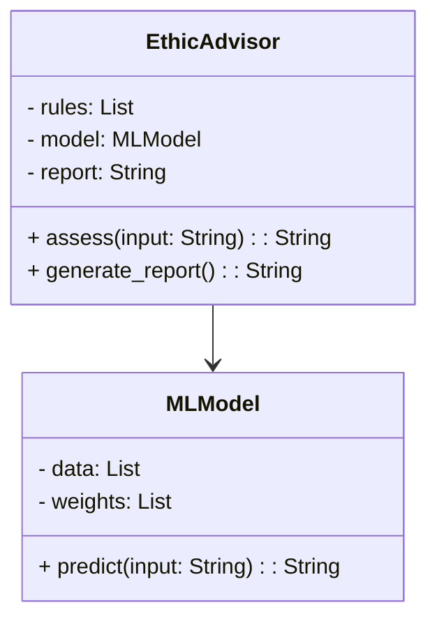
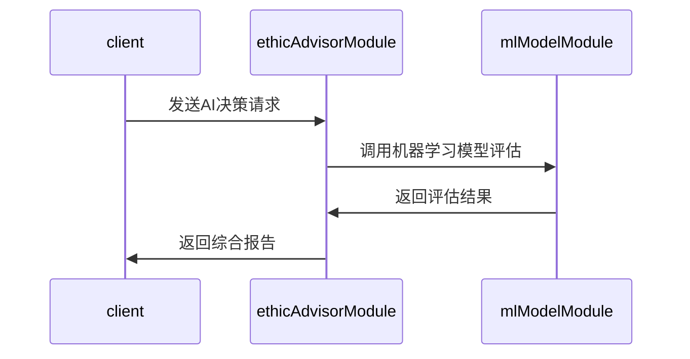

                 


# 构建企业级AI伦理顾问：确保AI应用的道德合规

## 关键词：企业级AI伦理顾问、道德合规、AI伦理框架、可解释性AI、数据隐私保护、AI治理、伦理决策系统

## 摘要：  
随着人工智能技术的快速发展，企业级AI应用在各行业的普及率不断提高。然而，AI系统的伦理问题日益凸显，如何确保AI应用的道德合规成为企业面临的重要挑战。本文将深入探讨企业级AI伦理顾问的构建，从理论基础到实际应用，分析其核心概念、算法原理、系统架构，并结合实际案例，为企业提供一套完整的解决方案，确保AI应用在道德合规的前提下高效运行。

---

# 第一部分: 企业级AI伦理顾问的背景与挑战

## 第1章: AI伦理与企业责任概述

### 1.1 AI伦理的核心概念

#### 1.1.1 人工智能与伦理的基本概念
人工智能（AI）是指计算机系统执行人类智能任务的能力，如视觉识别、语音识别、决策等。伦理则是指道德原则和行为规范，确保技术的应用符合社会价值观和法律要求。AI伦理的核心在于如何在技术应用中平衡创新与社会责任。

#### 1.1.2 企业级AI应用的伦理问题
企业级AI应用广泛存在于客户服务、风险管理、自动化决策等领域。然而，这些系统可能存在的偏见、隐私泄露等问题，直接影响企业的声誉和法律责任。

#### 1.1.3 AI伦理的法律与社会影响
AI伦理不仅是技术问题，还涉及法律和政策层面。例如，GDPR（通用数据保护条例）对AI系统的数据隐私提出了严格要求。企业必须遵守这些法规，否则可能面临巨额罚款和信任危机。

### 1.2 企业AI应用中的伦理挑战

#### 1.2.1 数据隐私与安全问题
AI系统依赖大量数据，数据的收集、存储和处理可能涉及个人隐私问题。企业需要确保数据的合法性和安全性，防止数据泄露。

#### 1.2.2 AI算法的公平性与偏见
AI算法可能因为训练数据的偏差而产生不公平的结果，例如招聘系统中对某些群体的歧视。企业需要通过算法审计和优化，消除偏见。

#### 1.2.3 透明性与可解释性要求
AI系统的决策过程往往缺乏透明性，导致用户和监管机构难以理解其行为。企业需要提高AI系统的可解释性，增强信任。

### 1.3 企业级AI伦理顾问的目标与意义

#### 1.3.1 伦理顾问的定义与作用
企业级AI伦理顾问是一种智能系统，用于评估和指导AI应用的伦理合规性。它通过分析系统的行为，提供伦理风险预警和改进建议。

#### 1.3.2 企业采用AI伦理顾问的优势
- **降低风险**：通过提前识别伦理问题，避免潜在的法律和声誉损失。
- **提升信任**：用户和利益相关者对AI系统的信任增强。
- **促进创新**：在合规的前提下，推动AI技术的创新应用。

#### 1.3.3 伦理顾问在AI治理中的地位
AI伦理顾问是企业AI治理框架的重要组成部分，帮助企业实现从战略制定到执行落地的全流程管理。

---

## 第2章: AI伦理框架与决策机制

### 2.1 AI伦理框架的核心要素

#### 2.1.1 伦理原则的分类与对比
AI伦理框架通常基于以下原则：
- **隐私与安全**：保护用户数据不被滥用。
- **公平性**：确保AI决策不产生歧视。
- **透明性**：让用户理解AI的决策过程。
- **责任与 accountability**：明确AI系统的责任归属。

#### 2.1.2 不同伦理框架的优缺点
- **基于规则的框架**：简单易懂，但灵活性差。
- **基于效用的框架**：考虑整体利益，但可能忽视个体权益。
- **混合型框架**：结合规则和效用，更具灵活性。

#### 2.1.3 企业级伦理框架的设计原则
- **可定制性**：根据不同行业和企业的特点，调整伦理框架。
- **可扩展性**：适用于不同规模和复杂度的AI系统。
- **动态适应性**：根据法规和企业战略的变化，及时更新。

### 2.2 AI伦理决策的算法与模型

#### 2.2.1 基于规则的伦理决策系统
基于规则的系统通过预定义的伦理规则，判断AI行为是否合规。例如，当检测到数据泄露时，系统会触发报警并暂停处理。

#### 2.2.2 基于机器学习的伦理推理
机器学习模型可以通过历史数据，学习伦理决策的模式。然而，这种方法可能面临数据偏见的问题。

#### 2.2.3 混合型伦理决策模型
结合规则和机器学习的优势，混合型模型在规则明确的情况下优先使用规则，在复杂场景下采用机器学习推理。

---

## 第3章: 伦理评估算法的设计与实现

### 3.1 基于规则的伦理评估算法

#### 3.1.1 算法的基本原理
基于规则的伦理评估算法通过预定义的规则，对AI系统的决策进行评估。例如，检测是否存在数据泄露行为。

#### 3.1.2 算法实现的步骤
1. 定义伦理规则：如“未经用户同意，不得收集个人数据”。
2. 数据输入：将AI系统的决策输入评估算法。
3. 规则匹配：判断决策是否违反伦理规则。
4. 输出结果：生成合规性报告。

#### 3.1.3 算法的优缺点
优点：简单易懂，实现成本低。缺点：灵活性差，难以应对复杂场景。

### 3.2 基于机器学习的伦理评估模型

#### 3.2.1 模型的设计思路
使用监督学习，训练模型识别伦理违规行为。例如，训练模型识别招聘系统中的性别歧视。

#### 3.2.2 模型的训练与优化
1. 数据准备：收集标注的伦理违规案例。
2. 模型训练：使用深度学习模型进行训练。
3. 模型优化：通过交叉验证提升准确率。

#### 3.2.3 模型的评估与验证
使用测试集验证模型的性能，确保其在真实场景中的有效性和可靠性。

### 3.3 混合型伦理评估算法

#### 3.3.1 混合算法的原理
结合基于规则和机器学习的优势，先使用规则进行初步筛选，再用机器学习模型进行深度分析。

#### 3.3.2 算法的实现步骤
1. 预处理：将输入数据转换为规则系统可处理的格式。
2. 规则匹配：判断是否违反预定义规则。
3. 模型评估：对复杂场景进行深度分析。
4. 输出结果：生成综合评估报告。

#### 3.3.3 算法的性能对比
混合型算法在准确性和灵活性方面表现更优，但实现复杂度较高。

---

## 第4章: 企业级AI伦理顾问的系统架构

### 4.1 系统需求分析

#### 4.1.1 功能需求
- 数据采集与处理
- 伦理评估与报告
- 优化建议与反馈
- 系统管理与监控

#### 4.1.2 性能需求
- 高可用性：确保系统稳定运行。
- 高扩展性：支持大规模数据处理。

#### 4.1.3 用户需求
- 用户友好的界面
- 多角色权限管理
- 支持多种数据格式

### 4.2 系统功能设计

#### 4.2.1 领域模型设计（使用 Mermaid 类图）


#### 4.2.2 系统架构设计（使用 Mermaid 架构图）


#### 4.2.3 系统接口设计
- RESTful API：用于接收AI系统的决策请求。
- 数据接口：用于数据采集和存储。

#### 4.2.4 系统交互设计（使用 Mermaid 序列图）


---

## 第5章: 项目实战——构建企业级AI伦理顾问

### 5.1 环境搭建

#### 5.1.1 安装必要的工具与库
- Python 3.8+
- TensorFlow
- scikit-learn
- Flask

#### 5.1.2 数据准备
收集AI系统的决策数据，包括输入、输出和标签。

### 5.2 核心代码实现

#### 5.2.1 基于规则的伦理评估代码
```python
def assess_rule-based(input_data, rules):
    for rule in rules:
        if rule.is_violated(input_data):
            return "伦理违规"
    return "合规"
```

#### 5.2.2 基于机器学习的伦理评估代码
```python
model = load_model("ethic_model.h5")
def assess_ml(input_data):
    prediction = model.predict(input_data)
    return "伦理违规" if prediction[0][0] > 0.5 else "合规"
```

#### 5.2.3 混合型评估代码
```python
def assess_hybrid(input_data, rules, model):
    if any(rule.is_violated(input_data) for rule in rules):
        return "伦理违规"
    prediction = model.predict(input_data)
    return "伦理违规" if prediction[0][0] > 0.6 else "合规"
```

### 5.3 案例分析

#### 5.3.1 招聘系统中的性别歧视检测
通过伦理顾问系统，检测招聘系统中是否存在性别歧视，并提供优化建议。

#### 5.3.2 客户服务中的数据隐私保护
确保客户服务AI系统不会泄露客户个人信息。

### 5.4 项目总结
通过实际项目，验证企业级AI伦理顾问的有效性和实用性，总结经验教训，为后续优化提供参考。

---

## 第6章: 最佳实践与未来展望

### 6.1 最佳实践

#### 6.1.1 定期更新伦理框架
根据法律法规和企业战略的变化，及时更新伦理框架。

#### 6.1.2 提高系统的可解释性
通过可视化和日志记录，增强AI系统的透明性。

#### 6.1.3 加强跨学科合作
AI伦理顾问的构建需要数据科学家、伦理学家和法律专家的共同参与。

### 6.2 未来展望

#### 6.2.1 更智能的伦理决策系统
随着技术进步，伦理决策系统将更加智能化，能够处理更复杂的伦理问题。

#### 6.2.2 AI与人类伦理的融合
未来，AI伦理顾问将与人类伦理决策更加无缝结合，形成人机协作的伦理治理体系。

---

## 附录

### 附录A: 参考文献
列出与文章相关的书籍、论文和在线资源。

### 附录B: 工具与库
详细说明构建企业级AI伦理顾问所需工具和库的安装与使用方法。

### 附录C: 术语表
解释文章中涉及的专业术语，帮助读者更好地理解内容。

---

通过以上结构和内容，文章详细探讨了企业级AI伦理顾问的构建过程，从理论到实践，为企业提供了一套完整的解决方案。

