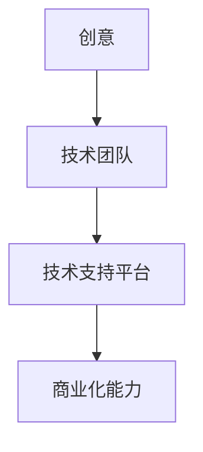
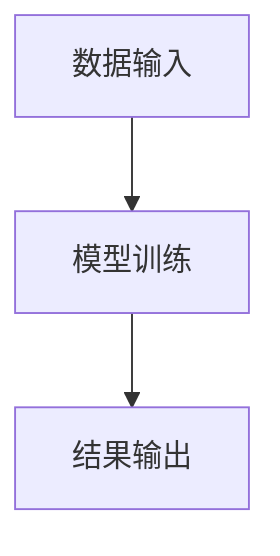
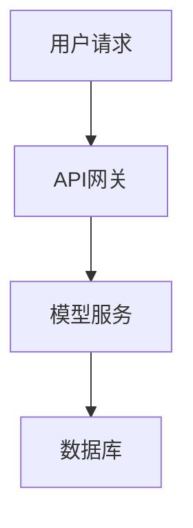

                 


# 构建企业级AI创新孵化器：从创意到商业化

> 关键词：企业级AI创新孵化器、创意商业化、AI技术创新、系统架构设计、AI项目管理

> 摘要：本文详细探讨了构建企业级AI创新孵化器的过程，从创意的产生到商业化落地，涵盖了技术、管理和商业策略等多个方面。通过系统化的分析和设计，提出了从背景分析到实际操作的完整方案，为读者提供了清晰的指导。

---

## 第一部分: 企业级AI创新孵化器的背景与概念

### 第1章: AI创新的现状与挑战

#### 1.1 当前AI技术的发展趋势
AI技术正在快速发展，从学术研究走向实际应用。深度学习、自然语言处理（NLP）和计算机视觉等领域的突破为企业创新提供了新的机会。

#### 1.2 企业级AI创新的核心问题
企业在AI创新中面临的主要问题包括技术资源不足、创新成果转化难以及商业化路径不清晰。

#### 1.3 AI创新面临的挑战与痛点
- **技术门槛高**：AI技术需要大量专业人才和资源支持。
- **转化效率低**：从创意到商业化的过程复杂且耗时。
- **市场不确定性**：AI产品在市场上的接受度存在不确定性。

---

### 第2章: 企业级AI创新孵化器的概念

#### 2.1 企业级AI创新孵化器的定义
企业级AI创新孵化器是一个整合资源、技术支持和商业化能力的平台，旨在加速AI创意的落地和商业化。

#### 2.2 企业级AI创新孵化器的核心要素
- **创新资源**：整合企业内外部资源，包括数据、技术、资金等。
- **技术支持**：提供AI开发的基础设施和工具。
- **商业化能力**：帮助创新成果进入市场，实现盈利。

---

### 第3章: 从创意到商业化的过程

#### 3.1 创意的产生与筛选
- **创意来源**：市场需求、技术突破、用户反馈等。
- **筛选标准**：技术可行性、市场潜力、资源支持等。

#### 3.2 创意的验证与开发
- **MVP开发**：快速验证创意的技术可行性和市场价值。
- **用户反馈**：通过小范围测试获取用户反馈，优化产品。

#### 3.3 商业化的过程
- **商业模式设计**：确定盈利模式，例如订阅制、按需付费等。
- **市场推广**：制定营销策略，扩大用户基础。
- **持续优化**：根据市场反馈不断迭代产品。

---

## 第二部分: 企业级AI创新孵化器的核心概念与联系

### 第4章: 核心概念的原理与特征

#### 4.1 创新孵化器的核心原理
- **资源整合**：通过整合企业内外部资源，降低创新成本。
- **技术支持**：提供技术平台和工具，加速开发过程。
- **商业化能力**：从技术到市场的桥梁，确保创新成果的商业化。

#### 4.2 核心概念的特征对比
| 特征 | 创意 | 技术 | 商业 |
|------|------|------|------|
| 核心 | 用户需求 | 技术实现 | 市场推广 |
| 关键 | 创意点 | 技术方案 | 商业模式 |

#### 4.3 实体关系与架构设计


---

## 第三部分: 企业级AI创新孵化器的算法与技术实现

### 第5章: AI创新的核心算法

#### 5.1 算法原理
- **深度学习模型**：如BERT、GPT等，用于NLP任务。
- **训练过程**：数据预处理、模型训练、超参数调优。

#### 5.2 技术实现


#### 5.3 数学模型
- **损失函数**：$L = \frac{1}{n}\sum_{i=1}^{n}(y_i - \hat{y_i})^2$
- **优化算法**：随机梯度下降（SGD）。

---

### 第6章: 系统架构与设计

#### 6.1 系统功能设计
- **数据管理模块**：数据存储、处理和分析。
- **模型训练模块**：模型训练、调优和部署。

#### 6.2 系统架构设计


---

## 第四部分: 企业级AI创新孵化器的项目实战

### 第7章: 项目实战

#### 7.1 环境安装
- **工具安装**：安装Python、TensorFlow、Kubernetes等。

#### 7.2 核心实现
```python
import tensorflow as tf
model = tf.keras.Sequential([
    tf.keras.layers.Dense(64, activation='relu'),
    tf.keras.layers.Dense(10, activation='softmax')
])
model.compile(optimizer='adam', loss='sparse_categorical_crossentropy', metrics=['accuracy'])
model.fit(x_train, y_train, epochs=10, batch_size=32)
```

#### 7.3 案例分析
通过具体案例展示如何从创意到商业化，例如一个AI客服系统。

---

## 第五部分: 企业级AI创新孵化器的商业化策略

### 第8章: 商业化策略

#### 8.1 市场分析
- **目标市场**：确定目标用户群体。
- **竞争分析**：分析竞争对手的优势和劣势。

#### 8.2 商业模式设计
- **订阅模式**：按月收费。
- **按需付费**：根据使用量收费。

#### 8.3 风险管理
- **技术风险**：确保技术稳定性。
- **市场风险**：通过小范围测试降低风险。

---

## 第六部分: 总结与展望

### 第9章: 总结

#### 9.1 核心总结
企业级AI创新孵化器是一个系统化的平台，从创意到商业化需要整合资源、技术支持和商业化能力。

#### 9.2 未来展望
随着AI技术的不断发展，企业级AI创新孵化器将更加智能化和高效化，推动更多创新成果的商业化。

---

### 最佳实践 Tips

- **小结**：企业级AI创新孵化器是一个复杂但可行的系统，需要技术、管理和商业的结合。
- **注意事项**：在实际操作中，需注重数据安全和隐私保护。
- **拓展阅读**：推荐阅读《深度学习入门》和《商业模式创新》。

---

通过以上步骤，我们可以系统地构建一个企业级AI创新孵化器，从创意到商业化，实现技术与商业的无缝对接。

