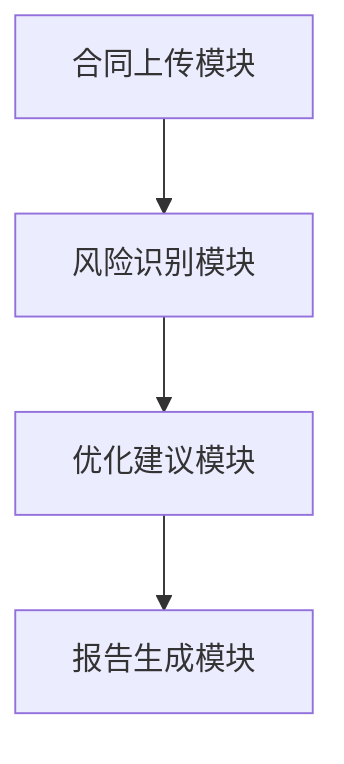
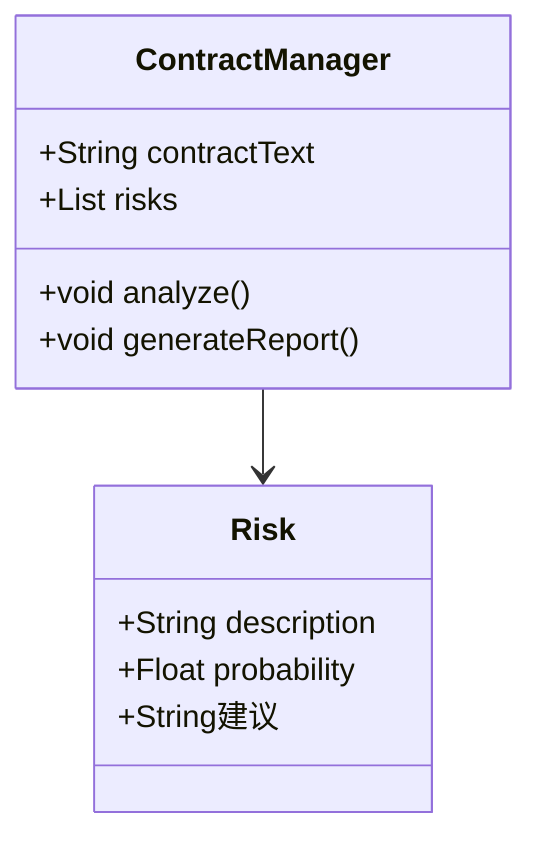
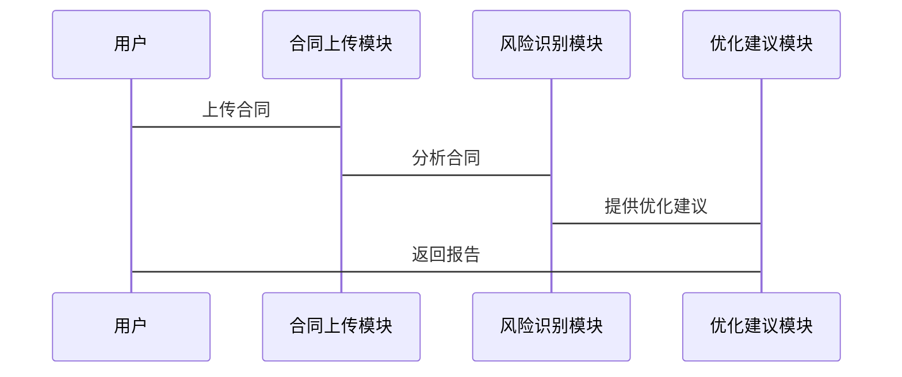

                 


# 《构建企业级AI合同管理助手：风险识别与优化》

---

## 关键词：企业级AI、合同管理、风险识别、NLP、机器学习、系统架构

---

## 摘要

在企业运营中，合同管理是核心业务流程之一，涉及法律、财务和商业等多个方面。然而，传统合同管理方式存在效率低、风险高、成本高等问题。随着人工智能技术的快速发展，构建企业级AI合同管理助手成为解决这些问题的关键。本文从背景、核心概念、算法原理、系统架构、项目实战等多方面详细阐述了构建AI合同管理助手的全过程，包括风险识别的NLP算法、系统设计与实现、项目实战及优化建议。通过本文的分析，读者可以深入了解如何利用AI技术优化企业合同管理流程，降低风险，提高效率。

---

## 第1章：企业级AI合同管理助手的背景与问题

### 1.1 合同管理的现状与挑战

#### 1.1.1 传统合同管理的痛点

传统合同管理主要依赖人工操作，存在以下问题：
- **效率低**：合同审查、分类和归档耗时长，容易出错。
- **风险高**：人工审查难以发现隐藏的法律风险，可能导致重大损失。
- **成本高**：需要大量专业人员参与，增加了企业运营成本。
- **不一致**：不同部门或项目中，合同格式和条款可能存在不一致，导致合规问题。

#### 1.1.2 企业合同管理的复杂性

企业合同管理涉及多个环节，包括合同生成、审批、执行和归档。每个环节都需要高度的准确性和合规性，而人工操作容易出现疏漏。

#### 1.1.3 数字化与智能化转型的需求

随着数字化转型的推进，企业需要更高效、智能的合同管理方式。AI技术的引入可以显著提升合同管理的效率和准确性，降低运营成本。

### 1.2 AI在合同管理中的应用潜力

#### 1.2.1 AI技术在合同管理中的优势

AI技术可以通过自然语言处理（NLP）和机器学习（ML）自动分析合同文本，识别关键条款和潜在风险，从而提高合同审查的效率和准确性。

#### 1.2.2 合同风险识别的AI解决方案

AI可以通过分析合同中的关键词和上下文，识别隐藏的法律风险，如违约条款、赔偿责任等。此外，AI还可以自动生成合同模板，减少人为错误。

#### 1.2.3 企业级AI合同管理助手的目标与价值

目标：构建一个能够自动识别合同风险、优化合同流程的企业级AI助手。

价值：提高合同管理效率，降低法律风险，优化企业资源分配。

---

## 第2章：核心概念与系统架构

### 2.1 AI与合同管理的结合

#### 2.1.1 AI在合同文本分析中的作用

AI可以通过NLP技术对合同文本进行分词、实体识别和情感分析，提取关键信息。

#### 2.1.2 NLP技术在合同理解中的应用

NLP技术可以帮助识别合同中的关键条款，如支付条款、违约责任等。

#### 2.1.3 机器学习在合同风险预测中的应用

通过机器学习模型，可以预测合同履行中的潜在风险，如违约概率。

### 2.2 系统架构与模块划分

#### 2.2.1 系统功能模块划分

- 合同上传模块
- 风险识别模块
- 优化建议模块
- 报告生成模块

#### 2.2.2 模块间的关系与数据流

数据从合同上传模块进入系统，经过风险识别模块分析后，生成优化建议和报告。

#### 2.2.3 系统整体架构图（Mermaid）



---

## 第3章：合同风险识别的算法原理

### 3.1 基于NLP的风险识别模型

#### 3.1.1 文本预处理与特征提取

文本预处理包括分词、去停用词、实体识别等。特征提取可以使用词袋模型或TF-IDF。

#### 3.1.2 模型训练与微调

使用预训练的BERT模型进行微调，训练合同风险识别模型。

#### 3.1.3 风险识别的数学模型（公式示例）

风险概率计算公式：
$$ P(风险) = \frac{\text{风险关键词出现的次数}}{\text{总关键词出现的次数}} $$

### 3.2 算法实现流程

#### 3.2.1 数据清洗与标注

清洗数据，去除噪声，标注合同文本中的风险关键词。

#### 3.2.2 模型训练与评估

使用训练数据训练模型，评估模型性能，调整参数。

#### 3.2.3 模型优化与调参

通过交叉验证优化模型参数，提升准确率和召回率。

### 3.3 算法实现代码示例

```python
import torch
from torch import nn

# 定义模型
class RiskClassifier(nn.Module):
    def __init__(self, input_size, hidden_size, output_size):
        super(RiskClassifier, self).__init__()
        self.fc1 = nn.Linear(input_size, hidden_size)
        self.fc2 = nn.Linear(hidden_size, output_size)
        self.dropout = nn.Dropout(0.5)
    
    def forward(self, x):
        x = torch.relu(self.fc1(x))
        x = self.dropout(x)
        x = torch.sigmoid(self.fc2(x))
        return x

# 训练函数
def train_model(model, criterion, optimizer, train_loader, epochs=10):
    for epoch in range(epochs):
        for inputs, labels in train_loader:
            outputs = model(inputs)
            loss = criterion(outputs, labels)
            loss.backward()
            optimizer.step()
            optimizer.zero_grad()
    return model

# 示例使用
input_size = 100
hidden_size = 50
output_size = 2
model = RiskClassifier(input_size, hidden_size, output_size)
criterion = nn.BCELoss()
optimizer = torch.optim.Adam(model.parameters(), lr=0.001)
model = train_model(model, criterion, optimizer, train_loader)
```

---

## 第4章：系统设计与实现

### 4.1 系统功能设计

#### 4.1.1 领域模型（Mermaid类图）



#### 4.1.2 系统架构设计（Mermaid架构图）


### 4.2 系统接口设计

#### 4.2.1 API接口定义

- POST /upload 合同上传接口
- GET /risk 获取风险报告

#### 4.2.2 系统交互流程（Mermaid序列图）



---

## 第5章：项目实战

### 5.1 环境安装

安装所需库：
- Python 3.8+
- PyTorch 1.9+
- Transformers 4.10+
- Mermaid工具

### 5.2 核心代码实现

#### 5.2.1 数据预处理

```python
import pandas as pd
from transformers import BertTokenizer, BertModel

# 加载预训练模型
tokenizer = BertTokenizer.from_pretrained('bert-base-uncased')
model = BertModel.from_pretrained('bert-base-uncased')

# 分词示例
text = "违约责任：如一方违约，需赔偿损失。"
tokens = tokenizer.tokenize(text)
print(tokens)
```

#### 5.2.2 模型训练

```python
# 训练函数
def train_model(model, tokenizer, optimizer, scheduler, train_loader, epochs=3):
    for epoch in range(epochs):
        for batch in train_loader:
            inputs, labels = batch
            outputs = model(inputs)
            loss = criterion(outputs, labels)
            loss.backward()
            optimizer.step()
            scheduler.step()
            optimizer.zero_grad()
    return model

# 示例训练
train_loader = ...  # 加载训练数据
model = train_model(model, tokenizer, optimizer, scheduler, train_loader)
```

### 5.3 案例分析与优化

#### 5.3.1 实际案例分析

分析一个典型合同，识别潜在风险并提出优化建议。

#### 5.3.2 优化建议

根据识别的风险，生成优化建议，如调整违约责任条款。

### 5.4 项目小结

项目实现了AI合同管理助手的核心功能，验证了算法的有效性，为企业级应用提供了参考。

---

## 第6章：最佳实践与优化建议

### 6.1 最佳实践

- 定期更新模型，保持其准确性。
- 建立完善的反馈机制，收集用户意见。
- 结合企业实际需求，定制化功能。

### 6.2 小结

AI合同管理助手显著提升了合同管理的效率和准确性，是企业数字化转型的重要工具。

### 6.3 注意事项

- 数据安全与隐私保护
- 模型的可解释性
- 系统的稳定性与可用性

### 6.4 拓展阅读

- 探索更先进的NLP模型，如大语言模型（LLM）的应用。
- 研究多模态合同分析，结合图像识别技术。

---

## 结论

构建企业级AI合同管理助手是AI技术在企业应用中的重要实践，通过本文的详细分析，读者可以掌握从背景到实现的全过程，为企业的数字化转型提供有力支持。未来，随着AI技术的不断发展，合同管理助手将更加智能化和个性化，为企业创造更大的价值。

