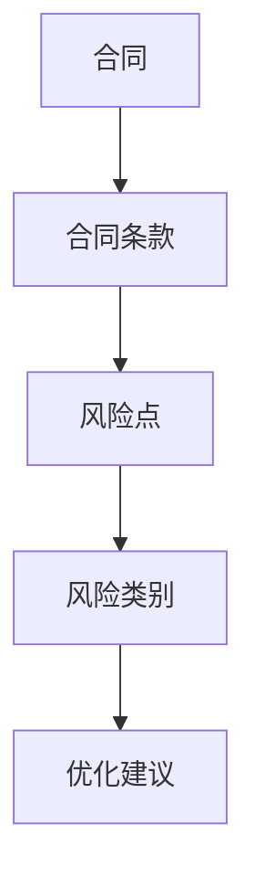
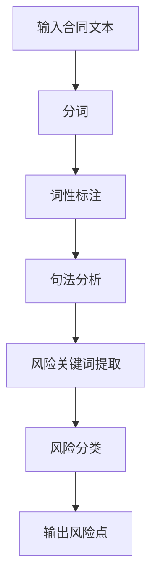
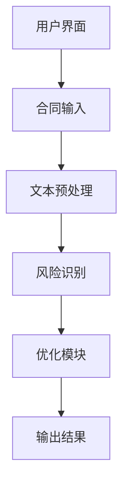

                 


# 构建企业级AI合同管理系统：风险识别与优化

## 关键词：企业级AI合同管理系统、风险识别、优化、机器学习、自然语言处理、系统架构

## 摘要：本文将详细介绍如何构建一个基于人工智能的企业级合同管理系统，重点分析系统中的风险识别与优化策略。通过结合机器学习和自然语言处理技术，系统能够自动识别合同中的潜在风险，并提供优化建议。本文从背景介绍、核心概念、算法原理、系统架构到项目实战，全面阐述了构建该系统的关键步骤和技术细节，为读者提供一份详尽的技术指南。

---

# 第一部分: 企业级AI合同管理系统背景与概述

## 第1章: 问题背景与需求分析

### 1.1 问题背景介绍

#### 1.1.1 合同管理的痛点与挑战

现代企业中，合同管理是一个复杂且关键的任务，涉及法律、财务和业务等多个方面。传统合同管理依赖人工操作，存在以下主要问题：

- **效率低下**：人工处理合同分类、审核和归档耗时长，容易出错。
- **风险遗漏**：手动检查难以覆盖所有潜在风险点，导致合规性问题。
- **数据孤岛**：合同信息分散，难以与其他系统集成，影响数据分析和决策。

#### 1.1.2 传统合同管理的局限性

传统合同管理系统通常依赖规则引擎，难以处理复杂的语义理解和非结构化数据。此外，缺乏智能化的风险识别和优化能力，无法满足现代企业的需求。

#### 1.1.3 AI技术在合同管理中的应用潜力

人工智能技术，特别是机器学习和自然语言处理（NLP），能够显著提升合同管理的效率和准确性。AI可以自动分类合同、识别风险点并提出优化建议，从而降低人为错误并提高决策质量。

### 1.2 问题描述与目标

#### 1.2.1 合同管理的核心需求

- 自动化处理合同分类和归档。
- 实时识别合同中的潜在风险。
- 提供智能化的合同优化建议。
- 集成现有企业系统，确保数据互通。

#### 1.2.2 AI合同管理系统的目标

构建一个基于AI的合同管理系统，能够实现以下目标：

1. 自动分类合同并识别关键条款。
2. 利用NLP技术提取风险点并进行分类。
3. 生成优化建议，降低合同风险。
4. 提供用户友好的界面和高效的处理流程。

#### 1.2.3 系统边界与外延

系统的边界包括合同的输入、处理和输出阶段。外延则涉及与企业其他系统的集成，如ERP、CRM等，确保数据的流动性和可用性。

### 1.3 系统核心要素与概念结构

系统的核心要素包括合同数据、风险识别算法、优化模块和用户界面。通过这些要素的协同工作，系统能够实现智能化的合同管理。

---

## 第2章: 核心概念与联系

### 2.1 核心概念原理

#### 2.1.1 AI在合同管理中的应用原理

AI通过分析合同文本，利用NLP技术提取关键词和句意，结合机器学习模型进行分类和预测。例如，使用支持向量机（SVM）进行合同分类，或使用深度学习模型（如BERT）进行风险识别。

#### 2.1.2 风险识别的关键技术

- **关键词提取**：识别合同中的风险相关词汇。
- **实体识别**：定位合同中的关键实体，如金额、期限等。
- **关系抽取**：分析合同条款之间的关系，识别潜在风险。

#### 2.1.3 系统优化的数学模型

优化模块基于识别的风险点，使用数学模型计算最优解决方案。例如，使用线性规划模型优化合同条款，以降低风险并提高收益。

### 2.2 核心概念对比分析

#### 2.2.1 不同AI技术的优劣势对比

| 技术            | 优势                           | 劣势                           |
|-----------------|--------------------------------|--------------------------------|
| 机器学习        | 高准确性，适用于模式识别       | 需大量标注数据，难以解释       |
| 自然语言处理    | 善于处理文本数据               | 对上下文理解有限               |
| 规则引擎        | 简单易懂，适用于规则明确场景   | 难以处理复杂语义               |

#### 2.2.2 合同管理系统与传统管理系统的对比

| 特性             | 传统系统                          | AI系统                          |
|------------------|-----------------------------------|-----------------------------------|
| 处理效率         | 低效，依赖人工                   | 高效，自动化处理                 |
| 风险识别         | 易漏，依赖经验                   | 准确，基于算法                   |
| 可扩展性         | 有限，难以扩展                   | 强大，支持大规模数据处理         |

#### 2.2.3 风险识别与优化的对比分析

风险识别关注发现潜在问题，而优化则侧重于解决问题。两者相辅相成，共同提升合同的合规性和效益。

### 2.3 实体关系图（ER图）

以下是一个简化的ER图，展示了合同管理系统的实体关系：



---

## 第3章: 算法原理与数学模型

### 3.1 算法原理

#### 3.1.1 机器学习在合同分类中的应用

机器学习模型用于将合同分为不同的类别，如供应商合同、客户合同等。常用算法包括决策树、随机森林和SVM。

#### 3.1.2 基于NLP的风险识别算法

使用NLP技术提取合同文本中的关键词和句意，识别潜在风险点。例如，使用BERT模型进行文本编码，然后通过相似度计算识别风险。

#### 3.1.3

---

### 3.2 算法流程图

以下是风险识别算法的流程图：



### 3.3 数学模型

以下是一个简单的风险分类模型：

$$ P(\text{风险} | \text{关键词}) = \frac{\text{关键词出现的次数}}{\text{总关键词数}} $$

---

## 第4章: 系统分析与架构设计

### 4.1 系统功能设计

系统功能模块包括：

- **合同输入模块**：接收合同文本。
- **文本预处理模块**：清洗和分词。
- **风险识别模块**：提取关键词和风险点。
- **优化模块**：生成优化建议。
- **输出模块**：展示结果。

### 4.2 系统架构图

以下是系统架构图：



### 4.3 接口设计

系统接口设计包括：

- **输入接口**：接收合同文本。
- **输出接口**：返回风险点和优化建议。
- **数据接口**：与企业系统集成。

---

## 第5章: 项目实战

### 5.1 环境安装

安装Python和必要的库，如TensorFlow、Keras、NLTK。

### 5.2 核心代码实现

以下是风险识别模块的核心代码：

```python
import nltk
from sklearn.feature_extraction.text import TfidfVectorizer
from sklearn.svm import SVC

# 分词
tokens = nltk.word_tokenize(text)

# 特征提取
vectorizer = TfidfVectorizer()
X = vectorizer.fit_transform(tokens)

# 模型训练
model = SVC()
model.fit(X, labels)

# 预测
new_X = vectorizer.transform(new_tokens)
predicted = model.predict(new_X)
```

### 5.3 代码解读

代码实现包括文本分词、特征提取和模型训练。使用SVM进行分类，识别合同中的风险点。

### 5.4 实际案例分析

通过一个实际案例，展示系统的运行流程和结果。

### 5.5 项目小结

总结项目的实现过程和成果，分析可能的改进方向。

---

## 第6章: 总结与展望

### 6.1 最佳实践

- 数据预处理是关键。
- 选择合适的算法和模型。
- 系统集成与维护。

### 6.2 小结

本文详细介绍了构建企业级AI合同管理系统的各个方面，从背景到实现，为读者提供了全面的技术指南。

### 6.3 注意事项

- 数据隐私和安全需严格控制。
- 系统需定期更新和优化。
- 非结构化数据处理仍具挑战性。

### 6.4 拓展阅读

推荐相关书籍和论文，供读者深入学习。

---

通过以上结构，读者可以系统地了解构建企业级AI合同管理系统的各个方面，从理论到实践，全面掌握相关技术。

