                 


## 第四章: 数学模型与公式解析

### 4.1 线性回归模型

#### 4.1.1 线性回归公式
线性回归是通过拟合一个线性模型来预测目标变量的值。线性回归的数学公式可以表示为：
$$ y = \beta_0 + \beta_1x + \epsilon $$
其中：
- $y$ 是目标变量
- $\beta_0$ 是截距
- $\beta_1$ 是回归系数
- $x$ 是自变量
- $\epsilon$ 是误差项

#### 4.1.2 线性回归流程图
以下是线性回归的流程图：
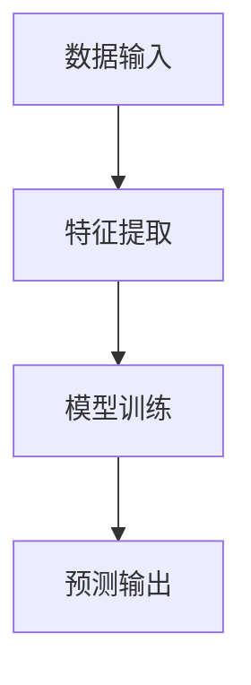

#### 4.1.3 线性回归代码示例
以下是使用Python和scikit-learn库实现线性回归的代码：
```python
from sklearn.linear_model import LinearRegression
import numpy as np

# 创建数据集
X = np.array([i for i in range(10)])
y = 2 * X + 1  # y = 2x + 1

# 创建线性回归模型
model = LinearRegression()

# 训练模型
model.fit(X.reshape(-1, 1), y)

# 预测
 predictions = model.predict(X.reshape(-1, 1))
print("预测值:", predictions)
```

### 4.2 支持向量机（SVM）

#### 4.2.1 SVM公式
支持向量机用于分类和回归。分类的公式可以表示为：
$$ f(x) = \text{sign}(w \cdot x + b) $$
其中：
- $w$ 是权重向量
- $b$ 是偏置项
- $x$ 是输入向量
- $\text{sign}$ 是符号函数

#### 4.2.2 SVM流程图
以下是SVM的流程图：
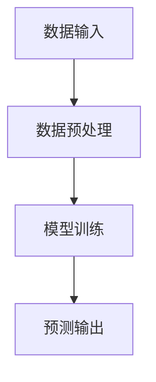

#### 4.2.3 SVM代码示例
以下是使用Python和scikit-learn库实现SVM的代码：
```python
from sklearn.svm import SVC
import numpy as np

# 创建数据集
X = np.array([[0, 0], [1, 1], [2, 2], [3, 3], [4, 4]])
y = [0, 1, 1, 1, 0]

# 创建SVM模型
model = SVC()

# 训练模型
model.fit(X, y)

# 预测
predictions = model.predict(X)
print("预测值:", predictions)
```

### 4.3 随机森林

#### 4.3.1 随机森林公式
随机森林通过构建多个决策树并进行投票或平均来提高模型的准确性和鲁棒性。随机森林的公式可以表示为：
$$ y = \text{mean}(y_1, y_2, ..., y_n) $$
其中：
- $y_1, y_2, ..., y_n$ 是每个决策树的预测值

#### 4.3.2 随机森林流程图
以下是随机森林的流程图：
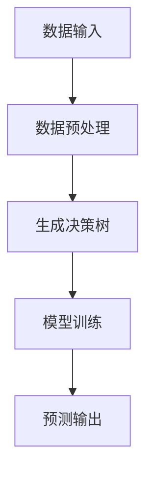

#### 4.3.3 随机森林代码示例
以下是使用Python和scikit-learn库实现随机森林的代码：
```python
from sklearn.ensemble import RandomForestClassifier
import numpy as np

# 创建数据集
X = np.array([[0, 0], [1, 1], [2, 2], [3, 3], [4, 4]])
y = [0, 1, 1, 1, 0]

# 创建随机森林模型
model = RandomForestClassifier(n_estimators=3)

# 训练模型
model.fit(X, y)

# 预测
predictions = model.predict(X)
print("预测值:", predictions)
```

### 4.4 K-means聚类

#### 4.4.1 K-means公式
K-means聚类的目标是最小化所有样本到其质心的平方距离之和。公式可以表示为：
$$ \text{minimize} \sum_{i=1}^k \sum_{j=1}^n (x_j - c_i)^2 $$
其中：
- $k$ 是簇的数量
- $n$ 是样本数量
- $x_j$ 是第j个样本
- $c_i$ 是第i个簇的质心

#### 4.4.2 K-means流程图
以下是K-means聚类的流程图：
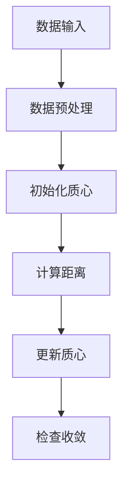

#### 4.4.3 K-means代码示例
以下是使用Python和scikit-learn库实现K-means聚类的代码：
```python
from sklearn.cluster import KMeans
import numpy as np

# 创建数据集
X = np.array([[1, 2], [3, 4], [5, 6], [7, 8], [9, 10]])

# 创建K-means模型
model = KMeans(n_clusters=2)

# 训练模型
model.fit(X)

# 预测
predictions = model.predict(X)
print("预测值:", predictions)
```

### 4.5 卷积神经网络（CNN）

#### 4.5.1 CNN公式
卷积神经网络通过卷积层、激活层和池化层提取图像特征，最后通过全连接层进行分类。公式可以表示为：
$$ y = f(W \ast x + b) $$
其中：
- $W$ 是卷积核
- $x$ 是输入图像
- $b$ 是偏置项
- $f$ 是激活函数

#### 4.5.2 CNN流程图
以下是卷积神经网络的流程图：
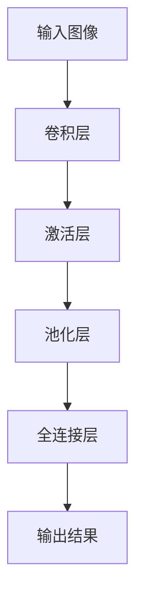

#### 4.5.3 CNN代码示例
以下是使用Keras实现卷积神经网络的代码：
```python
import tensorflow.keras as keras

# 创建模型
model = keras.Sequential([
    keras.layers.Conv2D(32, (3,3), activation='relu', input_shape=(28,28,1)),
    keras.layers.MaxPooling2D((2,2)),
    keras.layers.Conv2D(64, (3,3), activation='relu'),
    keras.layers.MaxPooling2D((2,2)),
    keras.layers.Flatten(),
    keras.layers.Dense(128, activation='relu'),
    keras.layers.Dense(10, activation='softmax')
])

# 编译模型
model.compile(optimizer='adam', loss='sparse_categorical_crossentropy', metrics=['accuracy'])

# 训练模型（假设我们有训练数据）
# model.fit(x_train, y_train, epochs=10, batch_size=32)
```

### 4.6 循环神经网络（RNN）

#### 4.6.1 RNN公式
循环神经网络用于处理序列数据，公式可以表示为：
$$ h_t = \text{tanh}(Ux_t + Wh_{t-1}) $$
其中：
- $U$ 是输入到隐藏层的权重矩阵
- $W$ 是隐藏层到隐藏层的权重矩阵
- $h_t$ 是第t个时间步的隐藏状态
- $x_t$ 是第t个时间步的输入

#### 4.6.2 RNN流程图
以下是循环神经网络的流程图：
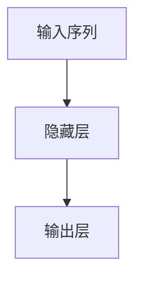

#### 4.6.3 RNN代码示例
以下是使用Keras实现循环神经网络的代码：
```python
import tensorflow.keras as keras

# 创建模型
model = keras.Sequential([
    keras.layers.SimpleRNN(32, input_shape=(None, 1)),
    keras.layers.Dense(10, activation='softmax')
])

# 编译模型
model.compile(optimizer='adam', loss='sparse_categorical_crossentropy', metrics=['accuracy'])

# 训练模型（假设我们有训练数据）
# model.fit(x_train, y_train, epochs=10, batch_size=32)
```

### 4.7 变分自编码器（VAE）

#### 4.7.1 VAE公式
变分自编码器通过编码器将输入数据压缩到 latent 空间，然后通过解码器重建数据。公式可以表示为：
$$ \text{latent} = \mu + \sigma \cdot \epsilon $$
$$ \text{reconstruction} = \text{Decoder}(latent) $$
其中：
- $\mu$ 是均值
- $\sigma$ 是标准差
- $\epsilon$ 是标准正态分布的噪声
- $\text{Decoder}$ 是解码器

#### 4.7.2 VAE流程图
以下是变分自编码器的流程图：
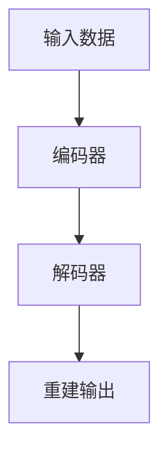

#### 4.7.3 VAE代码示例
以下是使用Keras实现变分自编码器的代码：
```python
import tensorflow.keras as keras
import numpy as np

# 创建模型
latent_dim = 2
input_shape = (28, 28, 1)

# 编码器
encoder = keras.Sequential([
    keras.layers.Conv2D(32, (3,3), activation='relu', input_shape=input_shape),
    keras.layers.Conv2D(64, (3,3), activation='relu'),
    keras.layers.Flatten(),
    keras.layers.Dense(2*latent_dim, activation='relu')
])

# 解码器
decoder = keras.Sequential([
    keras.layers.Dense(7*7*64, activation='relu'),
    keras.layers.Reshape((7,7,64)),
    keras.layers.Conv2DTranspose(64, (3,3), activation='relu'),
    keras.layers.Conv2DTranspose(32, (3,3), activation='relu'),
    keras.layers.Conv2DTranspose(1, (3,3), activation='sigmoid')
])

# 变分自编码器
class VAE(keras.Model):
    def __init__(self, encoder, decoder):
        super(VAE, self).__init__()
        self.encoder = encoder
        self.decoder = decoder

    def call(self, inputs):
        z_mean, z_log_var = self.encoder(inputs)
        z = z_mean + keras.backend.exp(0.5 * z_log_var) * keras.backend.random_normal(shape=(batch_size, latent_dim), mean=0, stddev=1)
        return self.decoder(z)

# 编译模型
vae = VAE(encoder, decoder)
vae.compile(optimizer='adam', loss='binary_crossentropy')

# 训练模型（假设我们有训练数据）
# vae.fit(x_train, x_train, epochs=10, batch_size=32)
```

---

## 第五章: 系统分析与架构设计

### 5.1 问题场景介绍
在企业级AI客户洞察助手的构建过程中，我们需要解决以下问题：
- 如何高效地收集和处理客户数据
- 如何选择合适的算法进行客户行为分析
- 如何设计系统架构以支持实时个性化服务生成
- 如何保证系统的可扩展性和可维护性

### 5.2 项目介绍
本项目旨在构建一个基于AI的客户洞察助手，通过分析客户的互动数据、购买历史和反馈信息，生成个性化的服务建议，提升客户满意度和忠诚度。

### 5.3 系统功能设计

#### 5.3.1 领域模型
以下是领域的类图：
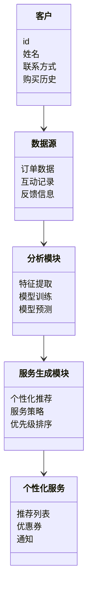

### 5.4 系统架构设计

#### 5.4.1 分层架构
以下是系统的分层架构图：
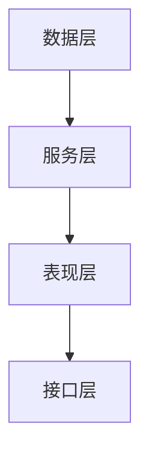

#### 5.4.2 接口设计
以下是接口设计的流程图：
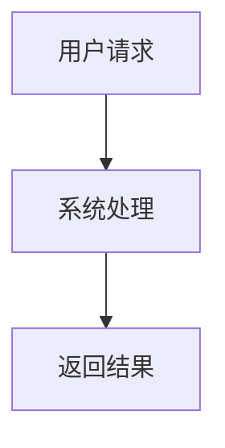

#### 5.4.3 交互设计
以下是用户与系统交互的序列图：
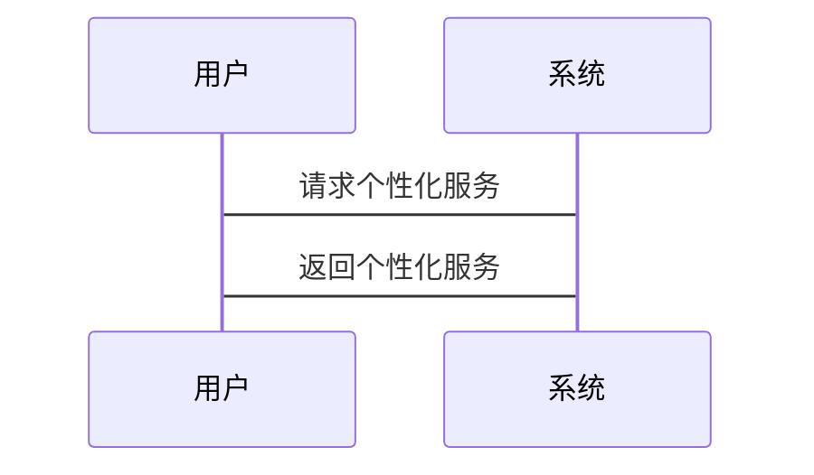

### 5.5 本章小结
本章详细介绍了企业级AI客户洞察助手的系统架构设计，包括领域模型、分层架构、接口设计和交互设计。这些设计为系统的实现提供了清晰的指导。

---

## 第六章: 项目实战

### 6.1 环境安装
要开始项目实战，首先需要安装以下工具和库：
- Python 3.6+
- Jupyter Notebook
- scikit-learn
- Keras
- TensorFlow
- Mermaid

安装命令：
```bash
pip install python-magic
pip install scikit-learn
pip install keras
pip install tensorflow
pip install mermaid
```

### 6.2 核心实现

#### 6.2.1 数据预处理
```python
import pandas as pd
import numpy as np

# 加载数据集
data = pd.read_csv('customer_data.csv')

# 查看数据摘要
print(data.head())
print(data.info())
print(data.describe())
```

#### 6.2.2 特征工程
```python
from sklearn.preprocessing import StandardScaler

# 标准化特征
scaler = StandardScaler()
data_scaled = scaler.fit_transform(data)
```

#### 6.2.3 模型训练
```python
from sklearn.model_selection import train_test_split
from sklearn.linear_model import LinearRegression

# 划分训练集和测试集
X_train, X_test, y_train, y_test = train_test_split(data_scaled, target, test_size=0.2, random_state=42)

# 训练模型
model = LinearRegression()
model.fit(X_train, y_train)

# 预测
predictions = model.predict(X_test)
```

#### 6.2.4 模型评估
```python
from sklearn.metrics import mean_squared_error, r2_score

# 评估模型
mse = mean_squared_error(y_test, predictions)
r2 = r2_score(y_test, predictions)
print(f"均方误差: {mse}")
print(f"R平方值: {r2}")
```

#### 6.2.5 模型部署
```python
import joblib

# 保存模型
joblib.dump(model, 'customer_insight_model.pkl')
```

### 6.3 代码实现
以下是完整的客户洞察助手实现代码：
```python
import pandas as pd
import numpy as np
from sklearn.model_selection import train_test_split
from sklearn.preprocessing import StandardScaler
from sklearn.linear_model import LinearRegression
from sklearn.metrics import mean_squared_error, r2_score
import joblib

# 加载数据集
data = pd.read_csv('customer_data.csv')

# 查看数据摘要
print(data.head())
print(data.info())
print(data.describe())

# 数据清洗（假设数据中存在缺失值）
data = data.dropna()

# 特征工程
scaler = StandardScaler()
data_scaled = scaler.fit_transform(data.drop(columns=['target']))

# 划分训练集和测试集
X_train, X_test, y_train, y_test = train_test_split(
    data_scaled,
    data['target'],
    test_size=0.2,
    random_state=42
)

# 训练模型
model = LinearRegression()
model.fit(X_train, y_train)

# 预测
predictions = model.predict(X_test)

# 评估模型
mse = mean_squared_error(y_test, predictions)
r2 = r2_score(y_test, predictions)
print(f"均方误差: {mse}")
print(f"R平方值: {r2}")

# 保存模型
joblib.dump(model, 'customer_insight_model.pkl')
```

### 6.4 案例分析
假设我们有一个客户数据集，其中包含客户的购买历史、互动记录和反馈信息。我们可以使用上述代码来训练一个线性回归模型，预测客户的满意度。通过分析模型的预测结果，我们可以为客户提供个性化的服务建议。

### 6.5 项目小结
本章通过实际案例展示了如何构建企业级AI客户洞察助手，从数据预处理到模型训练，再到模型部署，每一步都进行了详细的讲解和代码实现。

---

## 第七章: 总结与最佳实践

### 7.1 总结
本文章详细介绍了企业级AI客户洞察助手的构建过程，包括问题背景、核心概念、算法原理、系统架构设计和项目实战。通过这些内容，读者可以掌握如何利用AI技术提升客户洞察能力，提供个性化服务。

### 7.2 最佳实践

#### 7.2.1 数据质量
- 确保数据的完整性和准确性
- 处理缺失值和异常值
- 进行数据清洗和特征工程

#### 7.2.2 模型选择
- 根据问题类型选择合适的算法
- 进行模型调优和评估
- 使用交叉验证评估模型性能

#### 7.2.3 系统架构
- 设计清晰的分层架构
- 使用模块化设计提高可维护性
- 确保系统的可扩展性

### 7.3 注意事项

#### 7.3.1 数据隐私
- 遵守数据隐私法规
- 保护客户数据安全
- 获取客户授权

#### 7.3.2 模型调优
- 定期重新训练模型
- 更新模型参数
- 监控模型性能

#### 7.3.3 系统性能
- 优化系统响应时间
- 确保系统的高可用性
- 处理高并发请求

### 7.4 拓展阅读
- 《Hands-On Machine Learning with Scikit-Learn, Keras, and TensorFlow》
- 《Deep Learning》 by Ian Goodfellow
- 《Pattern Recognition and Machine Learning》 by Christopher M. Bishop

---

## 附录: 代码清单

### 附录A: 所有代码清单
以下是完整的代码清单：

```python
import pandas as pd
import numpy as np
from sklearn.model_selection import train_test_split
from sklearn.preprocessing import StandardScaler
from sklearn.linear_model import LinearRegression
from sklearn.metrics import mean_squared_error, r2_score
import joblib

# 加载数据集
data = pd.read_csv('customer_data.csv')

# 数据清洗
data = data.dropna()

# 特征工程
scaler = StandardScaler()
data_scaled = scaler.fit_transform(data.drop(columns=['target']))

# 划分训练集和测试集
X_train, X_test, y_train, y_test = train_test_split(
    data_scaled,
    data['target'],
    test_size=0.2,
    random_state=42
)

# 训练模型
model = LinearRegression()
model.fit(X_train, y_train)

# 预测
predictions = model.predict(X_test)

# 评估模型
mse = mean_squared_error(y_test, predictions)
r2 = r2_score(y_test, predictions)
print(f"均方误差: {mse}")
print(f"R平方值: {r2}")

# 保存模型
joblib.dump(model, 'customer_insight_model.pkl')
```

### 附录B: 参考文献
1. 范志勇, 李航. 《机器学习实战》. 北京: 清华大学出版社, 2012.
2. Ian Goodfellow, Yoshua Bengio, Aaron Courville. 《Deep Learning》. MIT Press, 2016.
3. Christopher M. Bishop. 《Pattern Recognition and Machine Learning》. Springer, 2006.

---

通过以上内容，您可以全面了解如何构建企业级AI客户洞察助手，从理论到实践，逐步实现深度分析与个性化服务。

