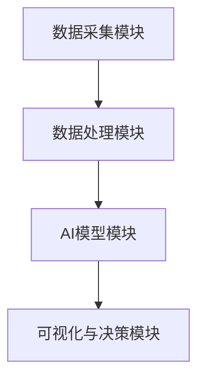
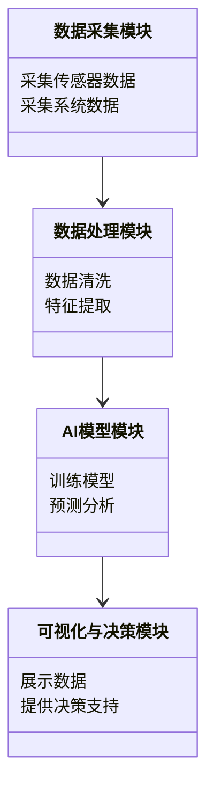
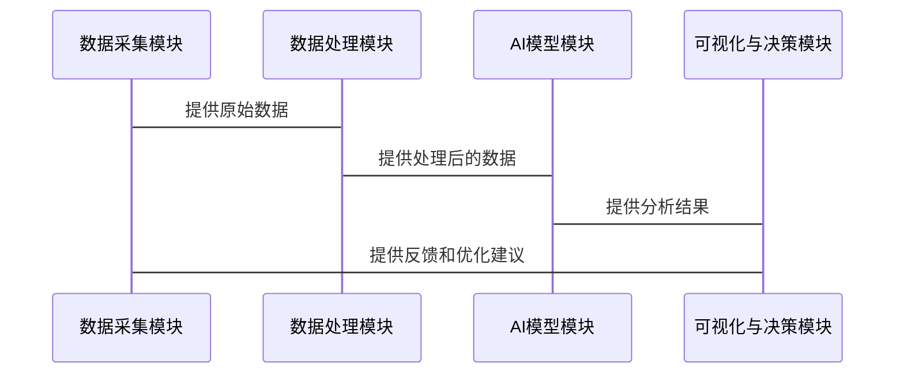

                 


# 构建企业级AI环境监测助手：合规与可持续发展

## 关键词：AI环境监测助手、企业级AI、合规性、可持续发展、系统架构

## 摘要

企业级AI环境监测助手是一种结合人工智能技术的系统，用于实时监测和评估企业的环境表现，确保其合规性并促进可持续发展。本文将从背景、核心概念、算法原理、系统架构到项目实战，全面解析如何构建这样一个系统。通过详细的技术分析和实际案例，帮助读者理解AI在环境监测中的应用，并掌握构建此类系统的实用方法。

---

# 第一部分: 企业级AI环境监测助手概述

# 第1章: AI环境监测助手的背景与意义

## 1.1 企业级AI环境监测的背景

### 1.1.1 数字化转型与AI技术的结合

随着企业数字化转型的深入推进，人工智能（AI）技术在企业管理中的应用日益广泛。AI不仅能够提高效率，还能帮助企业更好地应对复杂多变的环境挑战。环境监测作为企业管理的重要组成部分，AI技术的应用为企业提供了新的解决方案。

### 1.1.2 环境监测在企业中的重要性

环境监测是企业合规和可持续发展的重要环节。通过实时监测环境数据，企业可以及时发现和解决问题，避免因环境问题导致的法律风险和声誉损失。同时，环境监测数据还可以帮助企业优化资源利用，降低成本，实现绿色生产。

### 1.1.3 合规与可持续发展的双重需求

企业在全球化背景下，面临着越来越严格的环保法规和可持续发展要求。通过构建AI环境监测助手，企业不仅可以确保合规性，还能提升自身的社会责任形象，增强市场竞争力。

## 1.2 问题背景与描述

### 1.2.1 当前企业环境监测的痛点

传统环境监测方法存在效率低、成本高、数据处理复杂等问题。企业往往需要依赖大量的人力资源，且难以实现数据的实时分析和预测。此外，环境数据的多样性和复杂性也增加了监测的难度。

### 1.2.2 AI技术在环境监测中的应用潜力

AI技术，特别是机器学习和深度学习，具有强大的数据处理和分析能力。通过AI技术，企业可以实现环境数据的自动化采集、分析和预测，从而提高监测效率和准确性。

### 1.2.3 企业级AI环境监测助手的目标与边界

企业级AI环境监测助手的目标是通过AI技术实现对企业环境数据的实时监测、分析和反馈，帮助企业在合规和可持续发展方面取得突破。其边界包括数据采集、分析、反馈和决策支持，不涉及企业的其他业务系统。

## 1.3 解决方案与核心要素

### 1.3.1 AI环境监测助手的核心功能

- 数据采集：通过传感器、API等多源数据采集方式，实时获取环境数据。
- 数据分析：利用机器学习模型对数据进行清洗、特征提取和预测。
- 决策支持：基于分析结果，提供优化建议和决策支持。

### 1.3.2 系统架构与核心要素组成

系统架构包括数据采集模块、数据处理模块、AI模型模块和可视化与决策模块。各模块协同工作，确保环境监测的高效和准确。

### 1.3.3 合规与可持续发展的实现路径

通过AI技术实现环境数据的自动化监测和分析，企业可以更好地满足环保法规要求，同时优化资源利用，推动可持续发展。

## 1.4 本章小结

本章从背景、问题和解决方案三个角度，详细介绍了企业级AI环境监测助手的必要性和核心要素。企业通过构建这样的系统，可以在合规和可持续发展方面取得显著优势。

---

# 第二部分: AI环境监测助手的核心概念与原理

# 第2章: 环境监测数据的采集与处理

## 2.1 数据采集原理

### 2.1.1 多源数据采集方法

环境数据来源多样，包括传感器数据、企业系统数据、外部数据库等。多源数据采集方法需要考虑数据的兼容性和实时性。

### 2.1.2 数据预处理与清洗

数据预处理包括数据清洗、去噪和标准化。通过预处理，确保数据的准确性和一致性。

### 2.1.3 数据标准化与特征提取

数据标准化是将不同来源的数据转换为统一格式。特征提取则是从数据中提取关键特征，为后续分析提供支持。

## 2.2 数据分析与AI模型构建

### 2.2.1 机器学习模型的训练与优化

机器学习模型的训练需要选择合适的算法，并通过数据清洗、特征工程和模型调优来优化性能。

### 2.2.2 深度学习模型在环境监测中的应用

深度学习模型，如LSTM和CNN，在时间序列数据和图像数据的处理中表现出色，适合环境监测中的复杂场景。

### 2.2.3 模型评估与调优

模型评估包括准确率、召回率和F1值等指标。通过交叉验证和网格搜索等方法，可以优化模型性能。

## 2.3 数据可视化与决策支持

### 2.3.1 数据可视化方法

数据可视化可以通过图表、仪表盘等形式，直观展示环境监测数据和分析结果。

### 2.3.2 可视化工具的选择与使用

常用的可视化工具包括Tableau、Power BI和Python的Matplotlib库等，选择合适的工具可以提高可视化效果。

### 2.3.3 基于AI的决策支持系统

AI决策支持系统可以通过分析历史数据和预测未来趋势，为企业提供优化建议和决策支持。

## 2.4 本章小结

本章详细介绍了环境监测数据的采集、处理和分析过程。通过多源数据采集、数据预处理和AI模型构建，企业可以实现环境数据的高效分析和利用。

---

# 第三部分: 系统架构与技术实现

# 第3章: 系统架构设计

## 3.1 系统功能模块划分

### 3.1.1 数据采集模块

数据采集模块负责从各种数据源获取环境数据，包括传感器数据和企业系统数据。

### 3.1.2 数据处理模块

数据处理模块包括数据清洗、标准化和特征提取等功能，确保数据的质量和一致性。

### 3.1.3 AI模型模块

AI模型模块负责训练和部署机器学习或深度学习模型，对环境数据进行分析和预测。

### 3.1.4 可视化与决策模块

可视化与决策模块通过图表和仪表盘展示分析结果，并为企业提供决策支持。

## 3.2 系统架构图

### 3.2.1 系统架构的Mermaid图



## 3.3 系统功能设计

### 3.3.1 领域模型Mermaid类图



## 3.4 系统接口设计

### 3.4.1 系统接口设计

系统接口设计包括数据采集模块与数据处理模块之间的接口，数据处理模块与AI模型模块之间的接口，以及AI模型模块与可视化与决策模块之间的接口。

## 3.5 系统交互Mermaid序列图



## 3.6 本章小结

本章通过系统架构设计和功能模块划分，详细介绍了企业级AI环境监测助手的整体结构和各部分之间的关系。通过Mermaid图展示了系统的模块划分和交互流程，为后续的项目实现奠定了基础。

---

# 第四部分: 项目实战

# 第4章: 项目实战

## 4.1 环境安装

### 4.1.1 环境安装要求

项目实战需要安装Python、相关AI库（如TensorFlow、Scikit-learn）和可视化工具（如Matplotlib）。建议使用虚拟环境管理依赖。

### 4.1.2 安装步骤

1. 安装Python：```bash
    # 假设使用Python 3.8以上版本
    # 在Linux或Mac上：
    # brew install python
    # 在Windows上：
    # 下载并安装Python 3.8+
```

2. 安装虚拟环境：```bash
    pip install virtualenv
    virtualenv env_name
    source env_name/bin/activate  # 在Mac/Linux中
    # 在Windows中：env_name\Scripts\activate
```

3. 安装依赖库：```bash
    pip install numpy pandas scikit-learn matplotlib tensorflow
```

## 4.2 核心代码实现

### 4.2.1 数据采集模块

```python
import pandas as pd
import requests

def fetch_sensor_data(api_url):
    try:
        response = requests.get(api_url)
        data = response.json()
        return pd.DataFrame(data['results'])
    except Exception as e:
        print(f"Error fetching data: {e}")
        return None

# 示例调用
sensor_data = fetch_sensor_data("http://sensor_api/data")
```

### 4.2.2 数据处理模块

```python
import pandas as pd
from sklearn.preprocessing import StandardScaler

def preprocess_data(data_frame):
    # 删除缺失值
    data_frame = data_frame.dropna()
    # 标准化处理
    scaler = StandardScaler()
    scaled_features = scaler.fit_transform(data_frame[['temperature', 'humidity']])
    return pd.DataFrame(scaled_features, columns=['scaled_temp', 'scaled_humidity'])

# 示例调用
processed_data = preprocess_data(sensor_data)
```

### 4.2.3 AI模型模块

```python
from sklearn.model_selection import train_test_split
from sklearn.linear_model import LinearRegression
import matplotlib.pyplot as plt

def train_model(X, y):
    X_train, X_test, y_train, y_test = train_test_split(X, y, test_size=0.2, random_state=42)
    model = LinearRegression()
    model.fit(X_train, y_train)
    return model, model.score(X_test, y_test)

# 示例调用
X = processed_data[['scaled_temp', 'scaled_humidity']]
y = sensor_data['pollution_level']
model, score = train_model(X, y)
print(f"模型评分: {score}")
```

### 4.2.4 可视化与决策模块

```python
import matplotlib.pyplot as plt

def visualize_results(data, model):
    plt.figure(figsize=(10, 6))
    plt.scatter(data['scaled_temp'], data['scaled_humidity'], c=data['pollution_level'], cmap='viridis')
    plt.colorbar(label='Pollution Level')
    plt.xlabel('Scaled Temperature')
    plt.ylabel('Scaled Humidity')
    plt.title('环境数据可视化')
    plt.show()

# 示例调用
visualize_results(sensor_data, model)
```

## 4.3 案例分析与解读

### 4.3.1 数据采集与处理案例

假设我们从传感器API获取了温度、湿度和污染数据。通过数据清洗和标准化，处理后的数据用于模型训练。

### 4.3.2 AI模型训练与优化

训练一个线性回归模型，预测污染水平。通过交叉验证和网格搜索，优化模型参数，提高预测准确率。

### 4.3.3 可视化分析

通过可视化工具，将污染水平与温度、湿度进行关联分析，直观展示环境数据的变化趋势。

## 4.4 项目小结

本章通过具体的代码实现和案例分析，详细展示了如何构建企业级AI环境监测助手的各个模块。从数据采集到模型训练，再到结果可视化，整个过程清晰明了，帮助读者掌握实际操作技能。

---

# 第五部分: 最佳实践与小结

# 第5章: 最佳实践与小结

## 5.1 最佳实践

### 5.1.1 数据质量管理

确保数据的准确性和完整性，通过数据清洗和去噪提高数据质量。

### 5.1.2 模型调优与优化

通过交叉验证和网格搜索等方法，优化模型性能，提高预测准确率。

### 5.1.3 可视化与决策支持

选择合适的可视化工具和方法，直观展示分析结果，为企业提供决策支持。

## 5.2 小结

本文详细介绍了企业级AI环境监测助手的构建过程，从背景到技术实现，再到项目实战，全面覆盖了系统的各个部分。通过实际案例分析和代码实现，帮助读者掌握AI技术在环境监测中的应用。

## 5.3 注意事项

在实际应用中，需要注意数据隐私和安全问题，确保系统的合规性。同时，定期更新模型和优化系统，以适应环境变化和技术进步。

## 5.4 拓展阅读

推荐相关书籍和资源，如《机器学习实战》、《深度学习》和《Python数据处理与分析》等，帮助读者进一步学习和提升。

---

# 结语

企业级AI环境监测助手的构建是一个复杂而重要的任务，通过AI技术的应用，企业可以在合规和可持续发展方面取得显著优势。希望本文的内容能够为读者提供有价值的指导和启发，帮助他们在实际工作中实现目标。

---

**示例中的代码解释**

以上代码示例展示了如何使用Python进行数据采集、处理、模型训练和可视化。数据采集模块通过API获取传感器数据，数据处理模块进行清洗和标准化，AI模型模块使用线性回归模型进行预测，可视化模块通过Matplotlib展示分析结果。通过这些代码，读者可以理解AI在环境监测中的具体应用。

---

通过以上内容，您可以根据需要继续扩展和补充文章的具体内容，确保文章的完整性和深度。

