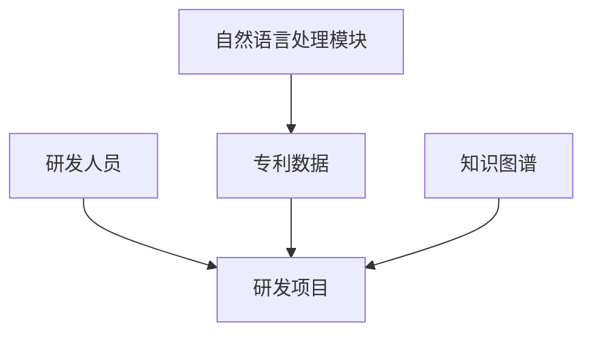
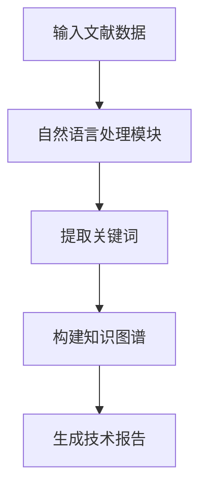
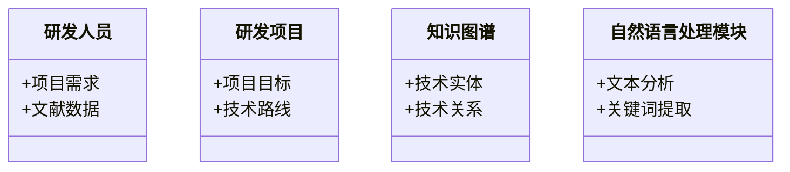
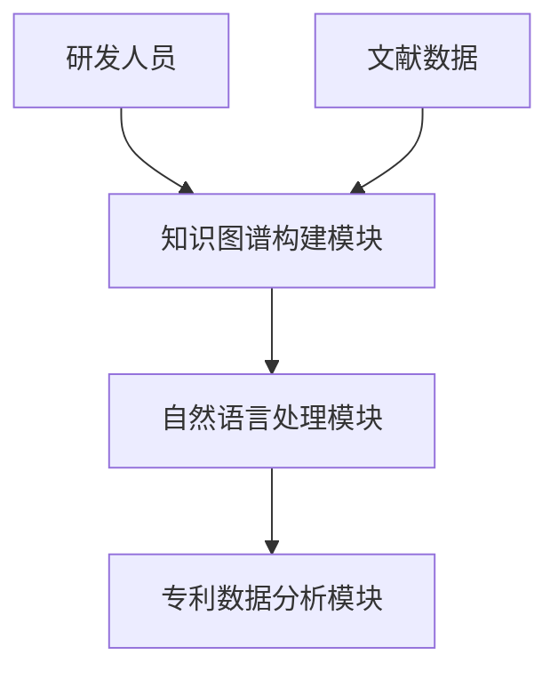
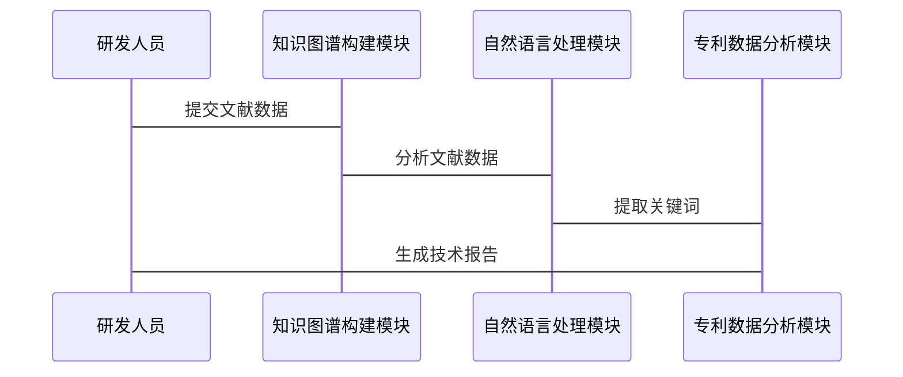

                 


# 构建企业级AI研发助手：加速创新与专利申请流程

## 关键词：企业级AI研发助手，AI加速创新，专利申请流程，知识图谱，自然语言处理，机器学习，系统架构

## 摘要：  
随着企业对技术创新和知识产权保护的需求日益增长，构建企业级AI研发助手成为提升研发效率和专利申请流程的关键。本文将详细探讨企业级AI研发助手的核心概念、算法原理、系统架构、项目实战及最佳实践，为企业提供从理论到实践的全面指导，助力企业在AI时代加速创新与专利申请流程。

---

## 第一部分: 企业级AI研发助手的背景与核心概念

### 第1章: 企业级AI研发助手的背景与问题描述

#### 1.1 企业级AI研发助手的背景

##### 1.1.1 传统企业研发流程的痛点
传统的企业研发流程通常效率低下，资源浪费严重。例如，研发人员需要手动整理大量文献资料，分析技术趋势，撰写专利申请书等，这些过程耗时且容易出错。此外，专利申请流程复杂，从撰写申请到审批周期漫长，且需要专业人员协助，成本高昂。

##### 1.1.2 AI技术对企业研发的潜在价值
AI技术能够通过自动化处理海量数据，优化研发流程。例如，自然语言处理（NLP）技术可以自动提取文献中的关键信息，机器学习模型可以预测技术趋势，帮助研发人员聚焦创新点。AI还可以辅助撰写专利申请书，减少重复劳动，提高效率。

##### 1.1.3 专利申请流程中的效率瓶颈
专利申请流程包括专利检索、撰写、提交和审批等多个环节。传统流程中，专利检索需要人工分析大量文献，撰写申请书需要专业人员指导，审批过程漫长且复杂。AI技术可以通过自动化检索、智能撰写和流程优化，显著缩短专利申请周期。

#### 1.2 问题背景与描述

##### 1.2.1 研发创新中的资源浪费问题
企业在研发过程中常常面临资源浪费问题，主要体现在重复劳动、信息不对称和知识孤岛。例如，不同部门的人员可能重复研究相同的技术，导致时间和资金浪费。此外，信息分散在各部门，难以形成共享知识库，进一步加剧了资源浪费。

##### 1.2.2 专利申请流程的复杂性与低效性
专利申请流程复杂，涉及多个环节和审批部门。传统流程中，专利检索需要手动查阅大量文献，撰写申请书需要专业人员协助，审批过程漫长且容易出错。这种低效性不仅增加了企业的成本，还可能错过技术保护的最佳时机。

##### 1.2.3 企业对AI技术的迫切需求
面对上述问题，企业迫切需要引入AI技术来优化研发流程和专利申请流程。AI技术能够通过自动化处理数据、智能分析和预测，帮助企业提高研发效率，缩短专利申请周期，降低运营成本。

#### 1.3 问题解决与边界

##### 1.3.1 AI研发助手的核心目标
AI研发助手的核心目标是通过自动化和智能化手段，优化企业研发流程和专利申请流程。具体目标包括：提高研发效率、缩短专利申请周期、降低研发成本、增强技术保护能力。

##### 1.3.2 边界与外延
AI研发助手的边界在于其功能范围。它专注于研发和专利申请流程的优化，不涉及企业的其他业务流程。外延方面，AI研发助手可以与其他企业系统（如CRM、ERP）集成，提供更全面的支持。

##### 1.3.3 核心要素与组成结构
AI研发助手的核心要素包括：知识图谱构建模块、自然语言处理模块、机器学习模型、专利数据分析模块和用户界面模块。这些模块协同工作，共同实现研发流程的优化和专利申请的自动化。

---

### 第2章: 企业级AI研发助手的核心概念与联系

#### 2.1 核心概念原理

##### 2.1.1 AI技术在研发中的应用
AI技术在研发中的应用主要体现在知识图谱构建、自然语言处理和机器学习模型的应用。知识图谱用于整理技术数据，自然语言处理用于分析文献，机器学习模型用于预测技术趋势。

##### 2.1.2 知识图谱与专利数据分析
知识图谱通过构建技术关系网络，帮助研发人员快速理解技术领域。专利数据分析模块可以挖掘专利数据中的隐藏信息，识别技术趋势和竞争对手动态。

##### 2.1.3 自然语言处理在研发文档中的应用
自然语言处理技术用于自动提取研发文档中的关键信息，生成摘要和关键词，帮助研发人员快速获取所需信息。

#### 2.2 核心概念属性对比

##### 2.2.1 传统研发流程与AI辅助研发的对比
| 项目 | 传统研发流程 | AI辅助研发 |
|------|----------------|-------------|
| 效率 | 低效，耗时 | 高效，快速 |
| 成本 | 高，需要大量人力资源 | 低，自动化减少成本 |
| 准确性 | 易出错，依赖人工判断 | 高，AI算法辅助决策 |

##### 2.2.2 专利申请效率与AI优化的对比
| 项目 | 传统专利申请 | AI优化的专利申请 |
|------|------------------|------------------|
| 时间 | 长，周期久 | 短，流程优化 |
| 成本 | 高，人工成本 | 低，自动化减少成本 |
| 准确性 | 易出错，依赖人工 | 高，AI辅助减少错误 |

##### 2.2.3 AI研发助手的功能与性能对比
| 项目 | 基本功能 | 高级功能 |
|------|-------------|------------|
| 文档处理 | 自动提取关键词 | 自动生成摘要 |
| 专利检索 | 智能检索 | 竞争对手分析 |
| 申请撰写 | 自动化撰写 | 智能推荐技术点 |

#### 2.3 ER实体关系图
通过Mermaid图展示企业级AI研发助手的实体关系：


---

### 第3章: 企业级AI研发助手的算法原理

#### 3.1 算法原理概述

##### 3.1.1 机器学习模型在研发中的应用
机器学习模型用于预测技术趋势和识别潜在的技术创新点。例如，使用监督学习模型（如随机森林）分析专利数据，预测技术的发展方向。

##### 3.1.2 知识图谱构建算法
知识图谱构建算法包括信息抽取、实体识别和关系抽取。常用算法有RNN和BERT模型，用于从文献中提取实体和关系，构建技术知识图谱。

##### 3.1.3 自然语言处理算法
自然语言处理算法用于文本分析和生成。例如，使用GPT模型生成专利申请摘要，或使用TF-IDF算法提取关键词。

#### 3.2 算法流程图
通过Mermaid图展示算法流程：


#### 3.3 算法实现代码示例

##### 3.3.1 使用Python的NLP库进行文本处理
```python
import nltk
from sklearn.feature_extraction.text import TfidfVectorizer

# 示例文本
text = "This is a sample text for NLP processing."

# 提取关键词
vectorizer = TfidfVectorizer()
tfidf = vectorizer.fit_transform([text])
feature_names = vectorizer.get_feature_names_out()

print(feature_names)
```

##### 3.3.2 使用机器学习模型预测技术趋势
```python
from sklearn.ensemble import RandomForestClassifier
from sklearn.metrics import accuracy_score

# 示例数据
X = [[1, 2], [3, 4], [5, 6]]
y = [0, 1, 0]

# 训练模型
model = RandomForestClassifier()
model.fit(X, y)

# 预测
predicted = model.predict([[2, 3]])
print(accuracy_score(y, predicted))
```

#### 3.4 数学模型与公式
##### 3.4.1 机器学习模型的数学表达
$$ y = f(X) $$
其中，$X$ 是输入特征，$f$ 是机器学习模型。

##### 3.4.2 TF-IDF计算公式
$$ TF-IDF(t, d) = \text{tf}(t, d) \times \text{idf}(t) $$
其中，$\text{tf}$ 是词频，$\text{idf}$ 是逆文档频率。

---

### 第4章: 企业级AI研发助手的系统架构设计

#### 4.1 系统分析与架构设计

##### 4.1.1 系统功能设计（领域模型）


##### 4.1.2 系统架构设计（架构图）


##### 4.1.3 系统接口设计
系统接口主要分为：
- 输入接口：接收研发人员的项目需求和文献数据。
- 输出接口：提供技术报告和专利申请建议。

##### 4.1.4 系统交互设计（交互序列图）


---

## 总结
企业级AI研发助手通过结合AI技术，显著优化了研发流程和专利申请流程。通过本文的详细讲解，读者可以全面了解AI研发助手的核心概念、算法原理和系统架构，并能够实际应用于企业研发中，加速创新与专利申请流程。

---

**下一步：根据上述思考，撰写完整的文章内容，确保每个章节内容详尽，逻辑清晰，技术语言专业，格式符合要求。**

