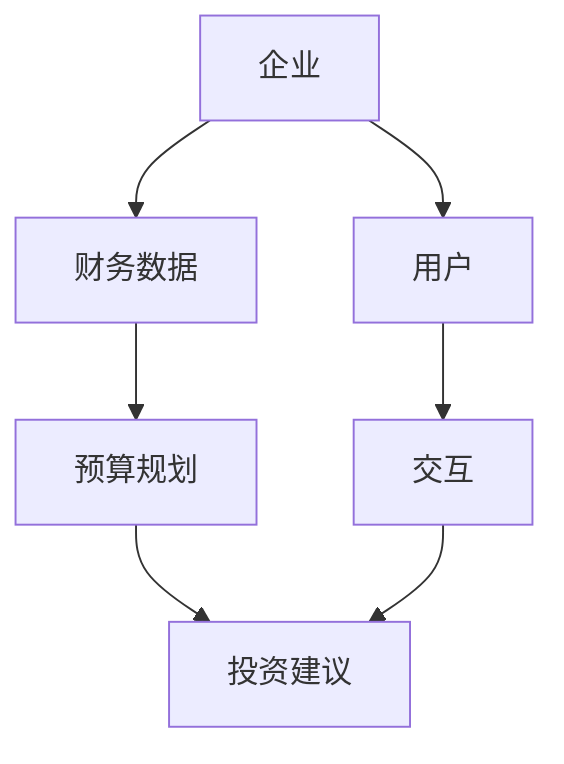
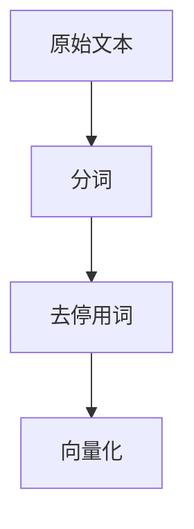
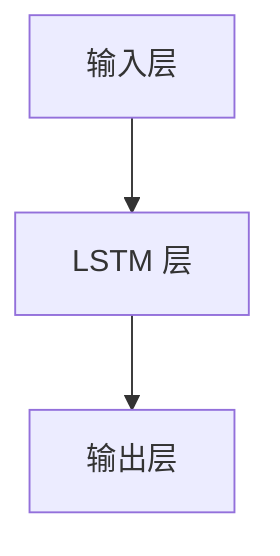
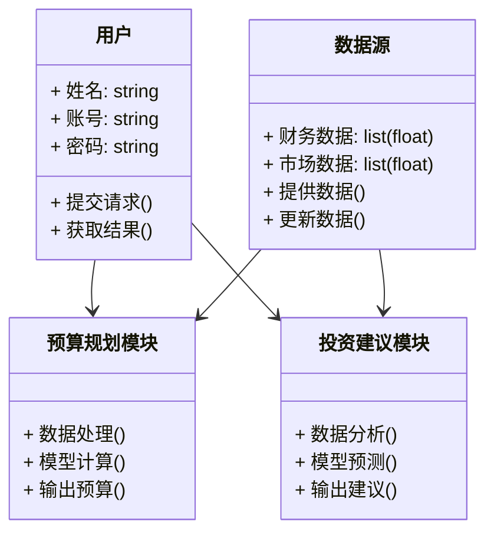
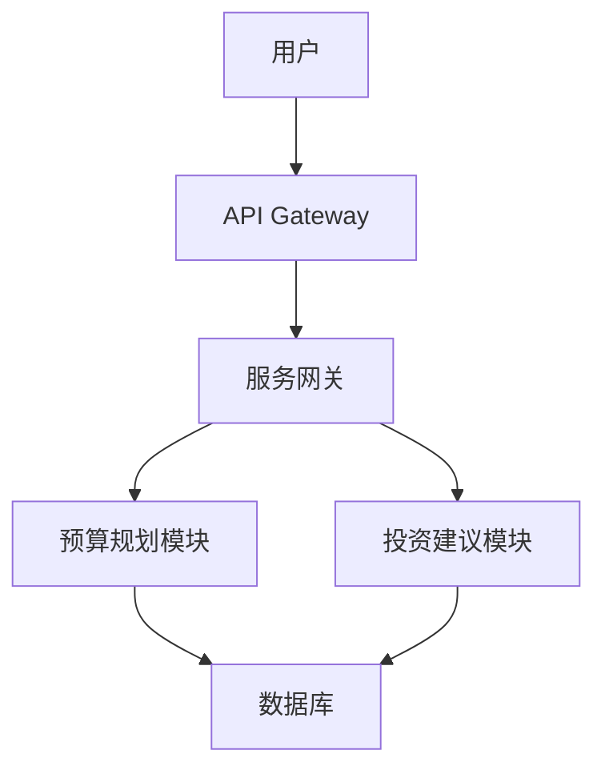
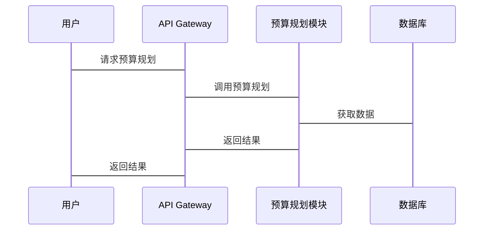

                 


# 构建企业级AI财务顾问：智能预算规划与投资建议

## 关键词：
- 企业级AI财务顾问
- 智能预算规划
- 投资建议
- 机器学习
- 自然语言处理
- 深度学习
- 系统架构

## 摘要：
本文详细探讨了构建企业级AI财务顾问的技术细节，涵盖智能预算规划与投资建议的核心概念、算法原理、系统架构设计及项目实战。通过分析传统财务顾问的局限性，介绍AI技术如何解决企业财务管理中的痛点，详细讲解NLP、机器学习等技术在财务领域的应用，结合实际案例分析系统设计与实现，最后总结最佳实践和未来发展方向。

---

# 第1章: 企业级AI财务顾问的背景与核心概念

## 1.1 问题背景与描述

### 1.1.1 传统财务顾问的局限性
传统财务顾问依赖人工分析，效率低下，难以满足企业海量数据处理的需求。专业人才稀缺，服务成本高昂，且主观判断可能导致决策偏差。

### 1.1.2 企业财务管理的痛点
企业在预算规划和投资决策中面临数据繁多、预测复杂、实时性要求高等挑战。传统方法难以快速响应市场变化，导致决策滞后或失误。

### 1.1.3 AI技术如何解决这些问题
AI技术通过自动化数据处理、智能预测和实时反馈，显著提高财务服务效率和准确性，降低企业运营成本，支持更科学的决策。

## 1.2 核心概念与问题解决

### 1.2.1 智能预算规划的定义
智能预算规划是利用AI技术对企业财务数据进行分析、预测和优化，生成动态预算方案，帮助企业在复杂环境中做出最优资源配置。

### 1.2.2 投资建议的AI实现方式
AI通过分析市场数据、企业财务状况和行业趋势，提供基于数据的投资建议，减少人为情绪影响，提高投资决策的科学性。

### 1.2.3 企业级AI财务顾问的边界与外延
AI财务顾问主要处理数据处理、预测分析和决策支持，边界在于不直接进行实际交易，外延包括多行业适用和个性化服务定制。

## 1.3 核心概念的结构与组成

### 1.3.1 智能预算规划的流程
1. 数据收集与预处理
2. 数据分析与建模
3. 预测与优化
4. 结果输出与反馈

### 1.3.2 投资建议的逻辑框架
1. 数据输入与清洗
2. 市场分析与预测
3. 投资组合优化
4. 建议生成与呈现

### 1.3.3 企业级AI财务顾问的系统架构
- 数据层：包括企业财务数据和市场数据。
- 业务逻辑层：负责数据处理和模型计算。
- 用户界面层：提供交互界面和结果展示。

## 1.4 本章小结
本章介绍了AI财务顾问的背景和核心概念，分析了传统财务服务的痛点，阐述了AI技术在智能预算规划和投资建议中的应用价值。

---

# 第2章: AI在财务领域的核心概念与联系

## 2.1 AI技术在财务中的应用原理

### 2.1.1 自然语言处理（NLP）在财务文本分析中的应用
NLP技术用于分析财务报告、新闻等文本数据，提取关键信息，辅助财务分析。

### 2.1.2 机器学习在财务预测中的应用
机器学习模型用于预测财务指标、市场趋势，帮助做出投资决策。

### 2.1.3 深度学习在复杂财务模型中的应用
深度学习模型处理非线性关系，适用于复杂财务预测和风险评估。

## 2.2 核心概念的属性特征对比

| 技术 | 输入 | 输出 | 应用场景 |
|------|------|------|----------|
| NLP  | 文本数据 | 信息提取、情感分析 | 财务报告分析 |
| ML   | 结构化数据 | 预测结果 | 市场预测 |
| DL   | 多维数据 | 复杂模型 | 风险评估 |

## 2.3 ER实体关系图



## 2.4 本章小结
本章探讨了AI技术在财务领域的核心应用，分析了NLP、机器学习和深度学习的技术特点及其在财务中的应用场景。

---

# 第3章: AI财务顾问的核心算法原理

## 3.1 自然语言处理（NLP）算法

### 3.1.1 文本预处理流程



### 3.1.2 向量空间模型的数学公式
$$ \text{余弦相似度} = \frac{\vec{A} \cdot \vec{B}}{|\vec{A}| |\vec{B}|} $$

## 3.2 机器学习算法

### 3.2.1 线性回归模型
$$ y = \beta_0 + \beta_1x + \epsilon $$

### 3.2.2 支持向量机（SVM）模型
$$ \text{最大化} \sum_{i=1}^{n} \alpha_i y_i (w \cdot x_i + b) $$

## 3.3 深度学习算法

### 3.3.1 LSTM网络结构



## 3.4 本章小结
本章详细讲解了NLP、机器学习和深度学习在财务中的应用，通过数学公式和流程图展示了算法原理。

---

# 第4章: 系统分析与架构设计方案

## 4.1 问题场景介绍

### 4.1.1 系统目标
构建一个智能财务顾问系统，实现预算规划和投资建议功能。

## 4.2 系统功能设计

### 4.2.1 领域模型类图



## 4.3 系统架构设计

### 4.3.1 系统架构图



## 4.4 系统接口设计

### 4.4.1 用户接口
- POST /api/budget
- POST /api/investment

### 4.4.2 数据接口
- GET /data/financial
- POST /data/update

## 4.5 系统交互序列图



## 4.6 本章小结
本章分析了系统的功能需求，设计了类图、架构图和交互序列图，展示了系统的整体结构和交互流程。

---

# 第5章: 项目实战

## 5.1 环境安装

```bash
pip install numpy pandas scikit-learn transformers
```

## 5.2 核心代码实现

### 5.2.1 预算规划模块

```python
import numpy as np
from sklearn.linear_model import LinearRegression

def budget_planning(data):
    model = LinearRegression()
    model.fit(data[['revenue', 'expenses']], data['profit'])
    return model.predict(new_data)
```

### 5.2.2 投资建议模块

```python
from transformers import pipeline

nlp = pipeline("question-answering")
answer = nlp("What is the best investment strategy?", context)
```

## 5.3 案例分析
以某科技公司为例，分析其财务数据，生成预算规划和投资建议。

## 5.4 项目小结
本章通过实际案例展示了系统的实现过程，验证了算法的有效性和系统的可行性。

---

# 第6章: 最佳实践、小结、注意事项和拓展阅读

## 6.1 最佳实践
- 数据质量是关键，确保数据准确性和完整性。
- 模型需要定期更新，适应市场变化。

## 6.2 小结
本文系统地介绍了企业级AI财务顾问的构建过程，从核心概念到系统实现，提供了全面的技术指导。

## 6.3 注意事项
- 注意数据隐私和合规性。
- 系统需要高可用性和安全性。

## 6.4 拓展阅读
- 《机器学习实战》
- 《深度学习入门》
- 《自然语言处理入门》

---

# 结语

企业级AI财务顾问是AI技术在财务领域的典型应用，通过智能预算规划和投资建议，显著提升了财务管理的效率和准确性。未来，随着技术进步，AI财务顾问将更加智能化和个性化，为企业创造更大价值。

