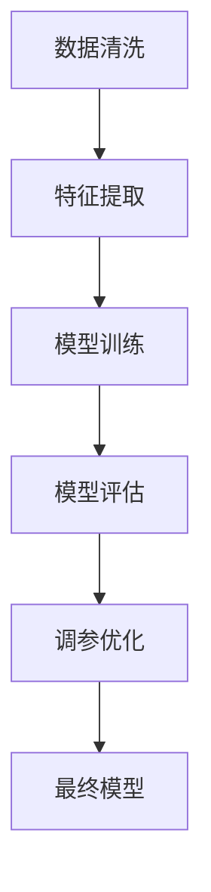
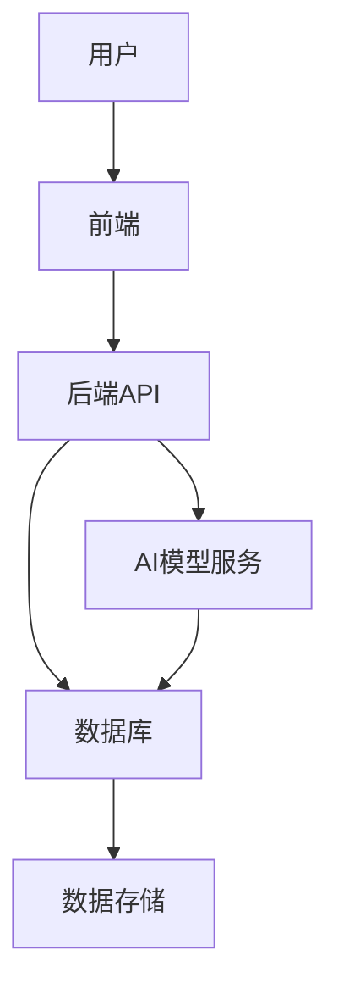
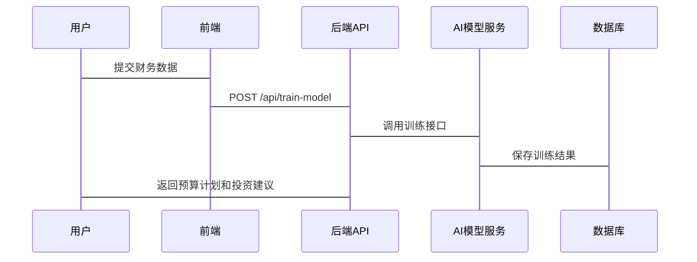

                 


# 构建企业级AI财务顾问：预算规划与投资建议

## 关键词：企业级AI财务顾问、预算规划、投资建议、机器学习、深度学习、自然语言处理

## 摘要：本文将详细探讨如何构建一个基于人工智能的企业级财务顾问系统，重点分析预算规划和投资建议的核心算法与实现细节。文章从问题背景、核心概念、算法原理、系统架构到项目实战，全面阐述构建该系统的各个方面，并提供实际案例分析和代码实现。

---

# 第一部分: 企业级AI财务顾问概述

## 第1章: AI财务顾问的背景与意义

### 1.1 问题背景
- **传统财务顾问的局限性**：传统财务顾问依赖人工分析，效率低、成本高且难以处理海量数据。
- **企业财务管理的痛点**：企业在预算规划和投资决策中面临数据复杂性、不确定性高和决策效率低的问题。
- **AI技术在财务领域的应用前景**：AI技术能够通过数据挖掘、机器学习和自然语言处理等手段，提升财务管理的效率和准确性。

### 1.2 问题描述
- **预算规划的复杂性**：企业需要考虑多方面的因素，如收入预测、支出分配、风险评估等。
- **投资决策的不确定性**：投资决策需要基于市场动态、财务数据和风险评估，具有高度不确定性。
- **数据驱动的财务管理需求**：企业需要通过数据分析来优化预算和投资决策，提高财务透明度和决策能力。

### 1.3 问题解决
- **AI技术如何赋能财务顾问**：通过机器学习模型预测收入和支出，优化预算分配；通过自然语言处理分析财务报告和市场新闻，提供投资建议。
- **数据分析在预算规划中的作用**：利用历史数据和市场趋势，预测未来财务状况，辅助预算制定。
- **智能投资建议的实现路径**：基于财务数据和市场信息，构建预测模型，提供个性化的投资建议。

### 1.4 边界与外延
- **AI财务顾问的适用范围**：适用于企业级的财务规划和投资决策，但不涵盖具体的交易执行和法律合规。
- **与传统财务工具的区别**：AI财务顾问能够处理更复杂的数据和场景，提供更智能化的建议，而传统工具主要依赖人工分析。
- **与其他AI应用的对比**：与销售预测、供应链优化等其他AI应用相比，AI财务顾问更注重财务数据的分析和决策支持。

### 1.5 概念结构与核心要素
- **核心概念组成**：包括预算规划模型、投资预测模型、数据处理模块和用户交互界面。
- **关键技术特征**：机器学习、自然语言处理、时间序列分析、优化算法。
- **系统架构要素**：前端界面、后端API、数据存储、AI模型服务。

## 第2章: AI财务顾问的核心概念与联系

### 2.1 核心概念原理
- **大模型在财务分析中的应用**：利用大模型进行财务文本的理解和生成，辅助预算规划和投资建议。
- **NLP在文本分析中的作用**：通过自然语言处理技术，分析财务报告和市场新闻，提取关键信息。
- **数据挖掘在财务预测中的价值**：通过数据挖掘技术，发现财务数据中的模式和趋势，辅助预测和决策。

### 2.2 核心概念属性对比
| 比较维度 | 传统财务顾问 | AI财务顾问 |
|----------|---------------|------------|
| 数据处理能力 | 依赖人工分析，数据量有限 | 处理海量数据，支持复杂分析 |
| 决策效率 | 低效，耗时长 | 高效，实时响应 |
| 个性化程度 | 有限，基于经验 | 高度个性化，基于数据驱动 |

### 2.3 ER实体关系图
```mermaid
er
    %% ER图展示财务顾问系统的实体关系
    client: 用户
    financial_data: 财务数据
    budget_plan: 预算计划
    investment_advice: 投资建议
    market_data: 市场数据
    AI_model: AI模型
    report: 报告

    client --> financial_data: 提供
    client --> market_data: 提供
    financial_data --> budget_plan: 生成
    financial_data --> investment_advice: 生成
    market_data --> investment_advice: 分析
    budget_plan --> report: 输出
    investment_advice --> report: 输出
    AI_model --> budget_plan: 训练
    AI_model --> investment_advice: 预测
```

## 第3章: AI财务顾问的算法原理

### 3.1 算法原理概述
- **大模型训练流程**：包括数据清洗、特征提取、模型训练、调参优化和评估。
- **数据预处理方法**：数据清洗、标准化、特征选择和数据增强。
- **模型训练与优化**：使用深度学习模型（如LSTM、Transformer）进行训练，采用交叉验证和超参数优化提升性能。

### 3.2 算法流程图


### 3.3 算法实现代码
```python
import numpy as np
import pandas as pd
from sklearn.model_selection import train_test_split
from tensorflow.keras.models import Sequential
from tensorflow.keras.layers import LSTM, Dense, Dropout

# 假设我们有一个包含财务数据的DataFrame df，目标是预测下一个季度的收入
df = pd.read_csv('financial_data.csv')
X = df[['revenue', 'expenses', 'profit_margin']]
y = df['next_quarter_revenue']

# 数据分割
X_train, X_test, y_train, y_test = train_test_split(X, y, test_size=0.2)

# 构建LSTM模型
model = Sequential()
model.add(LSTM(64, input_shape=(1, 3), return_sequences=False))
model.add(Dense(32, activation='relu'))
model.add(Dropout(0.2))
model.add(Dense(1, activation='linear'))

model.compile(loss='mean_squared_error', optimizer='adam', metrics=['mae'])

# 训练模型
model.fit(X_train.reshape(X_train.shape[0], 1, 3), y_train, epochs=50, batch_size=32, validation_split=0.2)
```

### 3.4 数学模型与公式
- **损失函数**：均方误差（Mean Squared Error）
  $$ \text{MSE} = \frac{1}{n}\sum_{i=1}^{n}(y_i - \hat{y}_i)^2 $$
- **优化算法**：Adam优化器
  $$ \text{Adam} = \text{RMSprop} + \text{Momentum} $$

---

# 第4章: 系统分析与架构设计

## 第4章: 系统分析与架构设计

### 4.1 项目介绍
- **项目目标**：构建一个能够提供预算规划和投资建议的企业级AI财务顾问系统。
- **项目范围**：包括数据收集、模型训练、系统开发和部署。
- **项目团队**：数据工程师、AI开发人员、前端开发人员和系统架构师。

### 4.2 功能设计
- **预算规划模块**：
  - 用户输入财务数据（收入、支出、利润等）。
  - 系统生成预算计划，包括各部分的分配建议。
- **投资建议模块**：
  - 用户输入投资目标和风险偏好。
  - 系统基于市场数据和模型预测，提供投资组合建议。
- **数据分析模块**：
  - 提供数据可视化功能，帮助用户理解财务状况。

### 4.3 系统架构设计


### 4.4 接口设计
- **API接口定义**：
  - POST /api/train-model：上传财务数据并训练模型。
  - GET /api/budget-plan：获取预算计划。
  - GET /api/investment-advice：获取投资建议。

### 4.5 交互设计


---

# 第5章: 项目实战

## 5.1 环境安装
- **安装Python**：确保安装了Python 3.8或更高版本。
- **安装依赖**：使用以下命令安装所需的库：
  ```bash
  pip install numpy pandas tensorflow scikit-learn mermaid4jupyter jupyterlab
  ```

## 5.2 核心代码实现
```python
# 示例代码：训练预算规划模型
import pandas as pd
from sklearn.ensemble import RandomForestRegressor
from sklearn.metrics import mean_absolute_error

# 加载数据
data = pd.read_csv('budget_data.csv')

# 特征与目标
X = data[['income', 'expenses', 'profit_margin']]
y = data['budget']

# 数据分割
X_train, X_test, y_train, y_test = train_test_split(X, y, test_size=0.2)

# 初始化模型
model = RandomForestRegressor(n_estimators=100, random_state=42)

# 训练模型
model.fit(X_train, y_train)

# 预测
y_pred = model.predict(X_test)

# 评估
print(mean_absolute_error(y_test, y_pred))
```

## 5.3 案例分析
- **预算规划案例**：
  - 用户输入：某公司过去三年的收入、支出和利润率数据。
  - 系统输出：基于随机森林模型生成的预算计划，包括收入预测、支出分配和利润目标。
- **投资建议案例**：
  - 用户输入：某用户的资产规模、风险偏好和投资期限。
  - 系统输出：基于市场数据和模型预测，生成的投资组合建议，包括资产配置和风险评估。

## 5.4 项目小结
- **实现总结**：通过集成机器学习和自然语言处理技术，构建了一个高效的企业级AI财务顾问系统，能够提供准确的预算规划和投资建议。
- **经验与教训**：数据质量和模型训练时间对系统性能影响较大，需要优化数据预处理和模型调参。

---

# 第6章: 最佳实践与小结

## 6.1 最佳实践
- **数据隐私与安全**：确保财务数据的保密性，采用加密技术和访问控制。
- **模型可解释性**：选择可解释性较强的模型，方便用户理解和信任系统建议。
- **系统可扩展性**：设计模块化的架构，方便未来功能扩展和性能优化。

## 6.2 小结
本文详细介绍了构建企业级AI财务顾问系统的各个方面，从问题背景到系统实现，提供了丰富的理论和实践指导。通过本系统的构建，能够帮助企业提升财务管理的效率和准确性，实现智能化的预算规划和投资决策。

## 6.3 注意事项
- **数据质量**：确保输入数据的准确性和完整性。
- **模型更新**：定期更新模型，以适应市场变化和用户需求。
- **用户反馈**：收集用户反馈，不断优化系统功能和用户体验。

## 6.4 拓展阅读
- 《机器学习实战》
- 《深度学习入门：基于Python和TensorFlow》
- 《自然语言处理入门》

---

通过以上内容，我们构建了一个基于AI的企业级财务顾问系统，详细讲解了系统的构建过程和实现细节，希望对读者有所帮助。

