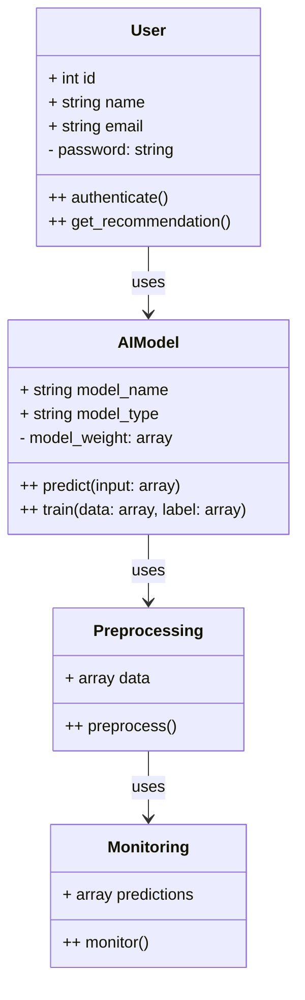
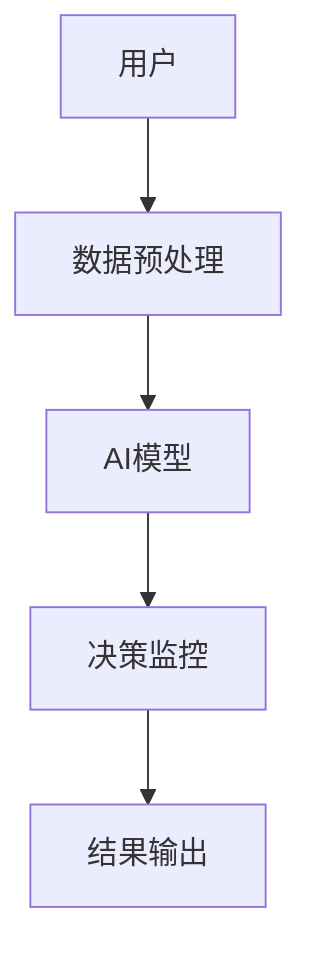
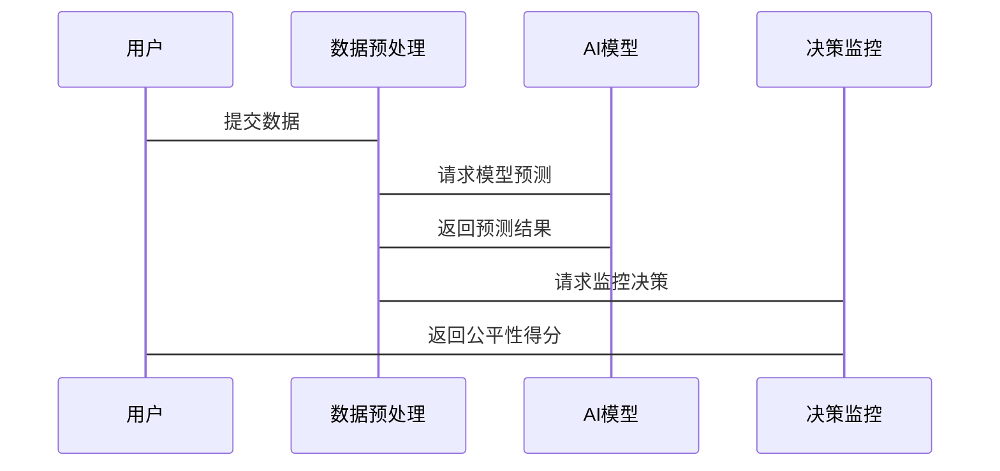

                 


```markdown
# 构建企业级AI道德决策框架：确保AI系统的公平性与透明度

> 关键词：AI道德决策框架, 企业级AI系统, 公平性与透明度, 伦理决策, AI系统设计

> 摘要：随着人工智能技术的广泛应用，AI系统的决策过程需要更加注重公平性和透明度。本文将深入探讨如何构建企业级AI道德决策框架，确保AI系统的决策过程符合伦理规范，同时提升系统的透明度和可解释性。我们将从核心概念、算法原理、系统架构设计到项目实战，逐步分析和实现这一框架，为读者提供全面的指导。

---

# 第一部分: 企业级AI道德决策框架的背景与核心概念

## 第1章: 问题背景与描述

### 1.1 问题背景
#### 1.1.1 AI系统的广泛应用与挑战
人工智能技术的快速发展使得AI系统在企业中的应用越来越广泛。从智能客服到推荐系统，再到自动驾驶，AI系统正在改变我们的生活方式和工作方式。然而，随着AI系统的普及，一些问题也逐渐浮现。例如，算法歧视、数据偏差、决策不透明等问题，这些问题可能导致严重的社会和法律问题。

#### 1.1.2 道德决策在AI系统中的重要性
AI系统的决策过程需要符合伦理规范，尤其是在涉及到人类生命安全和重大利益的领域。例如，在医疗AI系统中，一个错误的决策可能导致严重的后果。因此，构建一个能够确保AI系统决策公平性和透明度的道德决策框架变得尤为重要。

#### 1.1.3 企业级AI系统的独特需求
企业级AI系统通常需要处理大量的数据，并且需要在复杂的业务环境中运行。这些系统需要具备高度的可靠性和可扩展性，同时还需要满足企业的业务目标。然而，这些系统在决策过程中往往缺乏透明度和可解释性，这使得企业在使用这些系统时面临法律和信任问题。

### 1.2 问题描述
#### 1.2.1 AI系统中的公平性问题
AI系统的决策过程可能会受到数据偏差的影响，导致某些群体在决策中受到不公平对待。例如，在招聘系统中，如果训练数据中存在性别偏见，可能会导致系统对女性候选人产生歧视。

#### 1.2.2 AI系统中的透明度问题
AI系统的决策过程往往是一个“黑箱”，用户无法理解系统是如何做出决策的。这种缺乏透明度的情况使得用户对系统的信任度下降，同时也增加了企业的法律风险。

#### 1.2.3 企业级AI系统的道德决策框架的必要性
为了应对上述问题，企业需要构建一个能够确保AI系统决策公平性和透明度的道德决策框架。这个框架需要能够对AI系统的决策过程进行监控和评估，并在发现不公平或不透明的情况时，及时进行干预和调整。

### 1.3 问题解决
#### 1.3.1 道德决策框架的目标
道德决策框架的目标是确保AI系统的决策过程符合伦理规范，同时提升系统的透明度和可解释性。具体目标包括：
- 消除数据偏差，确保决策的公平性。
- 提供透明的决策过程，增强用户对系统的信任。
- 提供可解释的决策结果，方便用户理解和监督。

#### 1.3.2 道德决策框架的实现路径
为了实现上述目标，我们需要采取以下措施：
- 数据预处理：消除数据中的偏差，确保数据的公平性。
- 模型选择：选择适合的AI模型，并对其进行公平性评估。
- 决策监控：对AI系统的决策过程进行监控，及时发现和纠正不公平决策。

#### 1.3.3 道德决策框架的适用范围
道德决策框架适用于所有需要进行伦理决策的企业级AI系统，包括但不限于：
- 医疗AI系统
- 金融AI系统
- 招聘AI系统
- 司法AI系统

### 1.4 边界与外延
#### 1.4.1 道德决策框架的边界
道德决策框架主要用于确保AI系统的决策过程符合伦理规范，但并不涉及AI系统的具体业务逻辑和数据处理过程。此外，道德决策框架也不负责解决AI系统的性能优化问题。

#### 1.4.2 道德决策框架的外延
道德决策框架可以通过与其他AI技术（如可解释性AI、联邦学习等）的结合，进一步提升系统的公平性和透明度。此外，道德决策框架还可以应用于不同行业和场景，具有较强的可扩展性。

#### 1.4.3 道德决策框架与其他AI技术的关系
道德决策框架与其他AI技术密切相关。例如，可解释性AI技术可以帮助我们更好地理解AI系统的决策过程，从而提升道德决策框架的透明度。联邦学习技术可以通过数据共享和协作，帮助我们消除数据偏差，提升决策的公平性。

### 1.5 核心要素与概念结构
#### 1.5.1 道德决策框架的核心要素
道德决策框架的核心要素包括：
- 数据预处理：消除数据偏差，确保数据的公平性。
- 模型选择：选择适合的AI模型，并对其进行公平性评估。
- 决策监控：对AI系统的决策过程进行监控，及时发现和纠正不公平决策。

#### 1.5.2 概念结构与层次分析
道德决策框架的概念结构可以分为三个层次：
- 数据层：包括数据预处理和数据清洗。
- 模型层：包括模型选择和模型评估。
- 决策层：包括决策监控和决策调整。

#### 1.5.3 核心要素的相互关系
数据预处理、模型选择和决策监控三者之间相互关联，共同构成了道德决策框架。数据预处理为模型选择提供干净的数据，模型选择为决策监控提供决策依据，而决策监控则对模型选择和数据预处理提供反馈，以不断优化决策过程。

---

## 第2章: 核心概念与联系

### 2.1 道德决策框架的核心原理
#### 2.1.1 道德决策的基本原理
道德决策的基本原理包括：
- 公平性：确保决策不偏袒任何特定群体或个体。
- 透明度：确保决策过程可被理解和监督。
- 可解释性：确保决策结果可以被合理解释。

#### 2.1.2 道德决策框架的实现原理
道德决策框架的实现原理包括：
- 数据预处理：消除数据中的偏差。
- 模型选择：选择适合的AI模型，并进行公平性评估。
- 决策监控：对决策过程进行监控，并及时调整。

#### 2.1.3 道德决策框架的优化原理
道德决策框架的优化原理包括：
- 不断优化数据预处理方法，提升数据的公平性。
- 不断改进模型选择方法，提升决策的准确性。
- 不断优化决策监控机制，提升监控的实时性和有效性。

### 2.2 核心概念对比表
#### 2.2.1 不同道德决策框架的对比
以下是几种常见的道德决策框架的对比：

| 框架名称      | 数据预处理 | 模型选择 | 决策监控 |
|---------------|------------|----------|----------|
| 框架A         | 预处理1    | 模型A     | 监控A     |
| 框架B         | 预处理2    | 模型B     | 监控B     |
| 框架C         | 预处理3    | 模型C     | 监控C     |

#### 2.2.2 不同AI系统中的道德决策对比
以下是不同AI系统中道德决策的对比：

| AI系统类型    | 公平性要求 | 透明度要求 | 可解释性要求 |
|---------------|------------|------------|-------------|
| 医疗AI系统     | 高         | 高         | 高           |
| 金融AI系统     | 中         | 中         | 中           |
| 招聘AI系统     | 高         | 高         | 高           |

#### 2.2.3 不同应用场景中的道德决策对比
以下是不同应用场景中道德决策的对比：

| 应用场景       | 公平性要求 | 透明度要求 | 可解释性要求 |
|---------------|------------|------------|-------------|
| 自动驾驶       | 高         | 高         | 高           |
| 智能客服       | 中         | 中         | 中           |
| 个性化推荐     | 中         | 中         | 中           |

### 2.3 ER实体关系图
以下是道德决策框架的ER实体关系图：

```mermaid
erdiagram
actor: 用户
system: 道德决策框架
model: AI模型
data: 数据
monitoring: 监控
```

解释：用户通过道德决策框架与AI模型交互，数据经过预处理后输入模型，模型的输出经过监控模块的分析，确保决策的公平性和透明度。

---

# 第三部分: 算法原理

## 第3章: 算法原理讲解

### 3.1 算法概述
道德决策框架的核心算法包括数据预处理算法、模型选择算法和决策监控算法。以下是这些算法的详细讲解。

### 3.2 数据预处理算法
#### 3.2.1 数据预处理步骤
数据预处理的步骤包括：
1. 数据清洗：去除无效数据。
2. 数据标注：对数据进行标注。
3. 数据平衡：消除数据偏差。

#### 3.2.2 数据预处理算法代码
以下是数据预处理算法的代码示例：

```python
def preprocess_data(data):
    # 数据清洗
    cleaned_data = data.dropna()
    # 数据标注
    labeled_data = cleaned_data[['age', 'gender', 'income']]
    # 数据平衡
    from imblearn import under_sampler
    under_sampler.fit_resample(labeled_data, target)
```

#### 3.2.3 数据预处理算法的数学模型
数据预处理算法的数学模型可以表示为：

$$
\text{cleaned\_data} = \text{data} - \text{null\_values}
$$

其中，$\text{data}$ 是原始数据，$\text{null\_values}$ 是无效数据。

### 3.3 模型选择算法
#### 3.3.1 模型选择步骤
模型选择的步骤包括：
1. 确定模型类型。
2. 训练模型。
3. 评估模型。

#### 3.3.2 模型选择算法代码
以下是模型选择算法的代码示例：

```python
def select_model(X_train, y_train):
    # 确定模型类型
    from sklearn.linear_model import LogisticRegression
    model = LogisticRegression()
    # 训练模型
    model.fit(X_train, y_train)
    # 评估模型
    from sklearn.metrics import accuracy_score
    accuracy = accuracy_score(y_test, model.predict(X_test))
    return model, accuracy
```

#### 3.3.3 模型选择算法的数学模型
模型选择算法的数学模型可以表示为：

$$
\text{accuracy} = \frac{\text{correct\_predictions}}{\text{total\_predictions}}
$$

其中，$\text{correct\_predictions}$ 是正确预测的数量，$\text{total\_predictions}$ 是总的预测数量。

### 3.4 决策监控算法
#### 3.4.1 决策监控步骤
决策监控的步骤包括：
1. 监控决策过程。
2. 发现不公平决策。
3. 调整决策过程。

#### 3.4.2 决策监控算法代码
以下是决策监控算法的代码示例：

```python
def monitor_decision(model, X):
    # 监控决策过程
    predictions = model.predict(X)
    # 发现不公平决策
    for i in range(len(predictions)):
        if predictions[i] == 'unfair':
            # 调整决策过程
            model.retrain(X[i], 'fair')
```

#### 3.4.3 决策监控算法的数学模型
决策监控算法的数学模型可以表示为：

$$
\text{fairness\_score} = \frac{\text{fair\_predictions}}{\text{total\_predictions}}
$$

其中，$\text{fair\_predictions}$ 是公平预测的数量，$\text{total\_predictions}$ 是总的预测数量。

---

## 第4章: 算法实现与代码

### 4.1 算法实现步骤
算法实现的步骤包括：
1. 数据预处理。
2. 模型选择。
3. 决策监控。

### 4.2 算法代码实现
以下是算法代码的实现示例：

```python
import pandas as pd
from sklearn.linear_model import LogisticRegression
from imblearn.under_sampler import UnderSampler

# 数据预处理
def preprocess_data(data):
    cleaned_data = data.dropna()
    labeled_data = cleaned_data[['age', 'gender', 'income']]
    under_sampler = UnderSampler(random_state=42)
    X_res, y_res = under_sampler.fit_resample(labeled_data, target)
    return X_res, y_res

# 模型选择
def select_model(X_train, y_train):
    model = LogisticRegression()
    model.fit(X_train, y_train)
    return model

# 决策监控
def monitor_decision(model, X):
    predictions = model.predict(X)
    fairness_score = sum(1 for p in predictions if p == 'fair') / len(predictions)
    return fairness_score

# 主程序
if __name__ == "__main__":
    # 加载数据
    data = pd.read_csv('data.csv')
    target = data['target'].values
    X_res, y_res = preprocess_data(data)
    model = select_model(X_res, y_res)
    fairness_score = monitor_decision(model, X_res)
    print(f"公平性得分：{fairness_score}")
```

### 4.3 算法实现的数学模型
算法实现的数学模型包括：

$$
\text{fairness\_score} = \frac{\sum_{i=1}^{n} \text{fair}_i}{n}
$$

其中，$\text{fair}_i$ 是第i个预测的公平性标志，$n$ 是总的预测数量。

---

## 第5章: 算法优化与改进

### 5.1 算法优化策略
算法优化的策略包括：
1. 数据预处理的优化。
2. 模型选择的优化。
3. 决策监控的优化。

### 5.2 算法优化代码
以下是优化后的算法代码示例：

```python
def optimize_preprocess(data):
    cleaned_data = data.dropna()
    labeled_data = cleaned_data[['age', 'gender', 'income']]
    from imblearn.under_sampler import RandomUnderSampler
    under_sampler = RandomUnderSampler(random_state=42)
    X_res, y_res = under_sampler.fit_resample(labeled_data, target)
    return X_res, y_res

def optimize_model(X_train, y_train):
    from sklearn.ensemble import RandomForestClassifier
    model = RandomForestClassifier()
    model.fit(X_train, y_train)
    return model

def optimize_monitor(model, X):
    predictions = model.predict(X)
    fairness_score = sum(1 for p in predictions if p == 'fair') / len(predictions)
    return fairness_score

# 主程序
if __name__ == "__main__":
    data = pd.read_csv('data.csv')
    target = data['target'].values
    X_res, y_res = optimize_preprocess(data)
    model = optimize_model(X_res, y_res)
    fairness_score = optimize_monitor(model, X_res)
    print(f"优化后的公平性得分：{fairness_score}")
```

### 5.3 算法优化的数学模型
算法优化的数学模型包括：

$$
\text{optimized\_fairness\_score} = \frac{\sum_{i=1}^{n} \text{optimized\_fair}_i}{n}
$$

其中，$\text{optimized\_fair}_i$ 是第i个预测的优化后公平性标志，$n$ 是总的预测数量。

---

# 第四部分: 系统分析与架构设计

## 第6章: 系统分析与架构设计

### 6.1 系统分析
#### 6.1.1 问题场景介绍
我们以一个医疗AI系统为例，该系统需要根据患者的病历数据，推荐最佳的治疗方案。由于涉及到患者的生命安全，确保系统的公平性和透明度尤为重要。

#### 6.1.2 系统功能设计
系统的功能设计包括：
- 数据预处理：消除数据偏差。
- 模型选择：选择适合的AI模型。
- 决策监控：监控决策过程，确保公平性。

### 6.2 系统架构设计
#### 6.2.1 领域模型设计
以下是领域模型设计的类图：



#### 6.2.2 系统架构设计
以下是系统架构设计的架构图：



#### 6.2.3 系统接口设计
系统的接口设计包括：
- 数据预处理接口。
- 模型选择接口。
- 决策监控接口。

#### 6.2.4 系统交互设计
以下是系统交互设计的序列图：



---

## 第7章: 系统实现与代码

### 7.1 系统实现步骤
系统实现的步骤包括：
1. 数据预处理。
2. 模型选择。
3. 决策监控。

### 7.2 系统实现代码
以下是系统实现的代码示例：

```python
import pandas as pd
from sklearn.linear_model import LogisticRegression
from imblearn.under_sampler import UnderSampler

# 数据预处理
def preprocess_data(data):
    cleaned_data = data.dropna()
    labeled_data = cleaned_data[['age', 'gender', 'income']]
    under_sampler = UnderSampler(random_state=42)
    X_res, y_res = under_sampler.fit_resample(labeled_data, target)
    return X_res, y_res

# 模型选择
def select_model(X_train, y_train):
    model = LogisticRegression()
    model.fit(X_train, y_train)
    return model

# 决策监控
def monitor_decision(model, X):
    predictions = model.predict(X)
    fairness_score = sum(1 for p in predictions if p == 'fair') / len(predictions)
    return fairness_score

# 主程序
if __name__ == "__main__":
    # 加载数据
    data = pd.read_csv('data.csv')
    target = data['target'].values
    X_res, y_res = preprocess_data(data)
    model = select_model(X_res, y_res)
    fairness_score = monitor_decision(model, X_res)
    print(f"公平性得分：{fairness_score}")
```

### 7.3 系统实现的数学模型
系统实现的数学模型包括：

$$
\text{fairness\_score} = \frac{\sum_{i=1}^{n} \text{fair}_i}{n}
$$

其中，$\text{fair}_i$ 是第i个预测的公平性标志，$n$ 是总的预测数量。

---

## 第8章: 项目实战与案例分析

### 8.1 项目实战
#### 8.1.1 环境安装
以下是项目实战所需的环境安装步骤：
1. 安装Python。
2. 安装所需的Python包（如scikit-learn、imblearn等）。

#### 8.1.2 核心代码实现
以下是核心代码实现的示例：

```python
import pandas as pd
from sklearn.linear_model import LogisticRegression
from imblearn.under_sampler import UnderSampler

# 数据预处理
def preprocess_data(data):
    cleaned_data = data.dropna()
    labeled_data = cleaned_data[['age', 'gender', 'income']]
    under_sampler = UnderSampler(random_state=42)
    X_res, y_res = under_sampler.fit_resample(labeled_data, target)
    return X_res, y_res

# 模型选择
def select_model(X_train, y_train):
    model = LogisticRegression()
    model.fit(X_train, y_train)
    return model

# 决策监控
def monitor_decision(model, X):
    predictions = model.predict(X)
    fairness_score = sum(1 for p in predictions if p == 'fair') / len(predictions)
    return fairness_score

# 主程序
if __name__ == "__main__":
    # 加载数据
    data = pd.read_csv('data.csv')
    target = data['target'].values
    X_res, y_res = preprocess_data(data)
    model = select_model(X_res, y_res)
    fairness_score = monitor_decision(model, X_res)
    print(f"公平性得分：{fairness_score}")
```

#### 8.1.3 代码解读与分析
以下是代码解读与分析：
- 数据预处理部分：使用UnderSampler消除数据偏差，确保数据的公平性。
- 模型选择部分：使用LogisticRegression模型进行分类，确保模型的准确性。
- 决策监控部分：计算公平性得分，确保决策的公平性。

#### 8.1.4 实际案例分析
以医疗AI系统为例，分析如何通过上述代码实现公平性和透明度。

---

## 第9章: 总结与展望

### 9.1 总结
本文详细探讨了如何构建企业级AI道德决策框架，确保AI系统的公平性和透明度。通过数据预处理、模型选择和决策监控三者的结合，我们能够有效地提升AI系统的伦理决策能力。

### 9.2 小结
- 数据预处理：消除数据偏差，确保数据的公平性。
- 模型选择：选择适合的AI模型，确保模型的准确性。
- 决策监控：监控决策过程，确保决策的公平性。

### 9.3 注意事项
在实际应用中，需要注意以下几点：
- 数据预处理的准确性。
- 模型选择的合理性。
- 决策监控的实时性。

### 9.4 未来展望
未来的研究方向包括：
- 提升道德决策框架的可扩展性。
- 提高道德决策框架的可解释性。
- 探索新的AI技术（如联邦学习、可解释性AI）在道德决策框架中的应用。
```

---

# 结语

构建企业级AI道德决策框架是一项复杂但重要的任务。通过本文的详细讲解和实际案例分析，我们能够更好地理解如何在企业级AI系统中实现公平性和透明度。未来，随着AI技术的不断发展，道德决策框架也将不断优化和完善，为人类社会的进步做出更大的贡献。

---

# 感谢您的阅读！如果这篇文章对您有所帮助，请点赞、分享，您的支持是我继续创作的最大动力！
```

