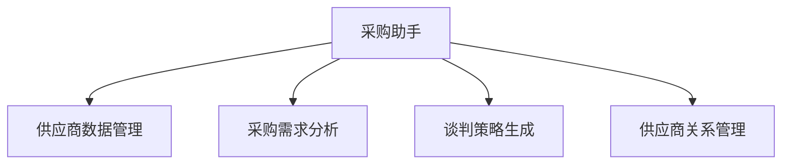

                 

# 构建企业级AI采购助手：优化供应商选择与谈判

## 关键词：企业级AI采购助手、供应商选择、谈判策略、自然语言处理、机器学习、采购成本预测

## 摘要：  
在企业采购管理中，供应商选择与谈判是决定采购效率和成本的关键环节。随着人工智能技术的快速发展，构建企业级AI采购助手已成为优化采购流程、提升供应商管理效率的重要手段。本文将从企业采购管理的现状与挑战出发，深入探讨AI技术在供应商选择与谈判中的应用，结合具体算法与系统架构设计，为企业构建智能化的采购助手提供理论与实践指导。

---

# 第一部分: 企业级AI采购助手的背景与核心概念

## 第1章: 企业级AI采购助手的背景与问题背景

### 1.1 企业采购管理的现状与挑战

#### 1.1.1 传统采购管理模式的局限性  
传统采购管理依赖人工经验，存在以下问题：  
1. **信息不对称**：供应商资质、市场行情难以全面获取与分析。  
2. **效率低下**：供应商筛选、合同审查、谈判准备耗时长，且容易出错。  
3. **决策主观性**：缺乏数据支持，供应商选择与谈判策略依赖个人经验，存在主观偏差。  

#### 1.1.2 企业采购中的关键问题  
1. **供应商资质与能力评估困难**：如何全面评估供应商的生产能力、交货周期、服务质量等。  
2. **采购成本控制**：如何在保证质量的前提下，降低采购成本。  
3. **谈判策略优化**：如何制定科学的谈判策略，最大化采购收益。  

#### 1.1.3 供应商选择与谈判的核心挑战  
1. **供应商数据的复杂性**：供应商资质、历史交易数据、市场反馈等多维度信息难以整合。  
2. **谈判过程的不确定性**：市场波动、供应商策略变化等因素影响谈判结果。  
3. **数据驱动的决策需求**：如何利用数据分析结果辅助决策，提升采购效率。  

### 1.2 AI技术在采购领域的应用前景  

#### 1.2.1 AI技术在采购领域的潜在应用场景  
1. **供应商数据智能分析**：利用NLP技术自动解析供应商文档，提取关键信息。  
2. **采购需求智能匹配**：基于机器学习算法，匹配最优供应商。  
3. **谈判策略生成与优化**：根据市场数据和供应商历史表现，生成最优谈判策略。  

#### 1.2.2 企业级AI采购助手的目标与价值  
目标：  
1. 提供智能化的供应商筛选工具，优化供应商选择过程。  
2. 提供数据驱动的谈判策略支持，提升采购效率与收益。  
3. 实现供应商关系管理的智能化，建立长期合作关系。  

价值：  
1. **提升采购效率**：通过自动化数据处理与分析，缩短采购周期。  
2. **降低采购成本**：通过数据驱动的决策，优化采购价格与成本结构。  
3. **增强供应商管理能力**：通过智能化的供应商评估与关系管理，提升供应链稳定性。  

#### 1.2.3 采购智能化转型的必要性  
1. **市场竞争压力**：企业需要通过高效采购降低成本，提升竞争力。  
2. **数据驱动决策**：AI技术能够帮助企业在复杂市场环境中快速做出决策。  
3. **技术进步的推动**：AI技术的成熟为企业采购管理的智能化转型提供了技术保障。  

### 1.3 本章小结  

#### 1.3.1 采购管理的核心问题总结  
1. 供应商选择的复杂性与不确定性。  
2. 采购成本控制的挑战。  
3. 谈判策略的科学性与可优化空间。  

#### 1.3.2 AI技术在采购领域的应用潜力  
1. NLP技术在供应商文档分析中的应用。  
2. 机器学习算法在供应商评估与预测中的应用。  
3. 数据挖掘技术在采购趋势预测与策略优化中的应用。  

#### 1.3.3 企业级AI采购助手的定位与目标  
1. 作为企业采购管理的智能化工具，辅助供应商选择与谈判。  
2. 提供数据驱动的决策支持，优化采购流程与成本结构。  

---

## 第2章: 供应商选择与谈判的核心概念  

### 2.1 供应商选择的关键要素  

#### 2.1.1 供应商评估的主要维度  
| 维度 | 描述 |  
|------|------|  
| 质量 | 产品/服务质量是否符合要求。 |  
| 成本 | 报价是否具有竞争力。 |  
| 交货周期 | 是否能够按时交货。 |  
| 财务状况 | 供应商的财务健康状况。 |  
| 售后服务 | 售后支持能力。 |  

#### 2.1.2 供应商资质与能力分析  
1. **资质认证**：供应商是否具备相关行业认证。  
2. **生产能力**：供应商的生产规模与技术能力。  
3. **市场口碑**：供应商的市场评价与客户反馈。  

#### 2.1.3 供应商稳定性与风险评估  
1. **稳定性评估**：供应商的历史合作表现。  
2. **风险评估**：供应商的财务风险、市场风险等。  

### 2.2 谈判策略与技巧  

#### 2.2.1 谈判的核心原则与策略  
1. **知己知彼**：全面了解供应商的优势与劣势。  
2. **目标导向**：明确谈判目标，制定分阶段策略。  
3. **灵活应对**：根据谈判进展实时调整策略。  

#### 2.2.2 价格谈判的关键点  
1. **价格分析**：基于市场行情与供应商成本进行价格谈判。  
2. **议价空间**：结合供应商的议价能力确定谈判范围。  
3. **合同条款优化**：通过优化合同条款降低采购成本。  

#### 2.2.3 合同条款优化与风险控制  
1. **条款审查**：利用NLP技术自动审查合同条款，识别潜在风险。  
2. **条款优化**：基于数据分析结果，优化合同条款，降低法律风险。  

### 2.3 供应商关系管理与优化  

#### 2.3.1 供应商分类与分级管理  
1. **供应商分类**：根据供应商的综合表现进行分类。  
2. **分级管理**：对核心供应商与一般供应商采取差异化管理策略。  

#### 2.3.2 长期合作关系的建立  
1. **战略合作**：与核心供应商建立长期合作关系。  
2. **信任机制**：通过透明化的信息共享建立信任关系。  

#### 2.3.3 供应商绩效评估与反馈机制  
1. **绩效评估**：定期对供应商的综合表现进行评估。  
2. **反馈机制**：将评估结果反馈给供应商，促进持续改进。  

### 2.4 本章小结  

#### 2.4.1 供应商选择的核心要素总结  
1. 供应商资质、生产能力、市场口碑等关键维度。  
2. 供应商稳定性与风险评估的重要性。  

#### 2.4.2 谈判策略与技巧的关键点  
1. 知己知彼的原则与灵活应对的策略。  
2. 价格谈判与合同条款优化的核心作用。  

#### 2.4.3 供应商关系管理的优化方向  
1. 供应商分类与分级管理的必要性。  
2. 长期合作关系建立与绩效评估的优化价值。  

---

## 第3章: AI技术在采购领域的核心应用  

### 3.1 自然语言处理（NLP）在采购中的应用  

#### 3.1.1 供应商文档的自动分析  
1. **合同条款审查**：利用NLP技术自动解析合同内容，识别潜在风险。  
2. **供应商资质分析**：自动提取供应商资质信息，进行分类与评估。  

#### 3.1.2 采购需求的自动匹配  
1. **需求解析**：通过NLP技术解析采购需求，生成供应商匹配清单。  
2. **需求优先级排序**：基于需求的重要性与供应商能力，自动排序。  

### 3.2 机器学习在供应商评估中的应用  

#### 3.2.1 基于历史数据的供应商评分模型  
1. **数据收集**：收集供应商的历史交易数据、市场反馈等。  
2. **模型训练**：利用机器学习算法（如决策树、随机森林）训练供应商评分模型。  
3. **评分结果**：生成供应商综合评分，辅助供应商选择决策。  

#### 3.2.2 供应商风险预测与预警  
1. **风险预测模型**：基于供应商的历史数据与市场行情，预测供应商风险。  
2. **预警机制**：当供应商风险超过阈值时，触发预警。  

#### 3.2.3 供应商画像与分类  
1. **画像构建**：基于供应商的多维度数据，构建供应商画像。  
2. **分类模型**：利用聚类算法对供应商进行分类，便于管理和决策。  

### 3.3 数据挖掘与采购决策优化  

#### 3.3.1 采购数据的深度分析  
1. **数据清洗与预处理**：对采购数据进行清洗与标准化处理。  
2. **数据挖掘**：利用数据挖掘技术发现采购数据中的潜在规律。  

#### 3.3.2 采购趋势预测与策略优化  
1. **趋势预测模型**：基于时间序列分析预测采购趋势。  
2. **策略优化**：根据预测结果优化采购策略，降低采购成本。  

#### 3.3.3 数据驱动的谈判策略生成  
1. **谈判数据收集**：收集历史谈判数据，提取关键特征。  
2. **策略生成模型**：利用机器学习算法生成最优谈判策略。  

### 3.4 本章小结  

#### 3.4.1 NLP技术在采购中的核心应用  
1. 供应商文档的自动分析与需求匹配。  

#### 3.4.2 机器学习在供应商评估中的关键作用  
1. 基于历史数据的供应商评分与风险预测。  

#### 3.4.3 数据挖掘对采购决策的优化价值  
1. 数据驱动的谈判策略生成与采购趋势预测。  

---

## 第4章: 企业级AI采购助手的核心算法与数学模型  

### 4.1 基于决策树的供应商评分模型  

#### 4.1.1 决策树算法原理  
1. **决策树构建**：基于供应商的历史数据，构建决策树模型。  
2. **模型训练**：利用训练数据对决策树进行训练。  
3. **模型评估**：通过测试数据评估模型的准确率与召回率。  

#### 4.1.2 供应商评分模型的构建  
1. **特征选择**：选择供应商评分的关键特征（如交货周期、成本、质量等）。  
2. **模型训练**：利用决策树算法训练供应商评分模型。  
3. **评分结果**：生成供应商综合评分，辅助供应商选择决策。  

#### 4.1.3 模型训练与优化  
1. **参数调优**：通过网格搜索优化决策树模型的参数。  
2. **模型评估**：通过混淆矩阵、ROC曲线等指标评估模型性能。  

### 4.2 基于聚类算法的供应商分类  

#### 4.2.1 聚类算法的基本原理  
1. **聚类算法选择**：根据供应商数据的特征选择合适的聚类算法（如K-means）。  
2. **数据预处理**：对供应商数据进行标准化与去噪处理。  
3. **聚类实现**：利用聚类算法对供应商进行分类。  

#### 4.2.2 供应商分类的实现步骤  
1. **数据准备**：收集供应商的多维度数据。  
2. **特征提取**：提取供应商分类的关键特征。  
3. **模型训练**：利用聚类算法对供应商进行分类。  

#### 4.2.3 分类结果的可视化分析  
1. **可视化工具**：使用Matplotlib或Seaborn对聚类结果进行可视化。  
2. **结果分析**：根据分类结果优化供应商管理策略。  

### 4.3 基于线性回归的采购成本预测  

#### 4.3.1 线性回归模型的数学公式  
$$ y = \beta_0 + \beta_1x + \epsilon $$  
其中，$y$是采购成本，$x$是影响采购成本的自变量，$\beta_0$和$\beta_1$是模型参数，$\epsilon$是误差项。  

#### 4.3.2 模型的训练与评估  
1. **数据准备**：收集影响采购成本的相关数据。  
2. **模型训练**：利用线性回归算法训练模型。  
3. **模型评估**：通过均方误差（MSE）和决定系数（R²）评估模型性能。  

#### 4.3.3 成本预测的案例分析  
1. **案例背景**：假设某企业需要预测下季度的采购成本。  
2. **数据收集**：收集影响采购成本的自变量数据（如原材料价格、市场需求等）。  
3. **模型预测**：利用线性回归模型预测下季度的采购成本。  

### 4.4 本章小结  

#### 4.4.1 决策树算法在供应商评分中的应用  
1. 基于历史数据的供应商评分模型构建。  

#### 4.4.2 聚类算法在供应商分类中的价值  
1. 根据供应商特征进行分类，优化供应商管理策略。  

#### 4.4.3 线性回归模型在成本预测中的作用  
1. 数据驱动的采购成本预测，优化采购预算。  

---

## 第5章: 企业级AI采购助手的系统架构与实现  

### 5.1 系统架构设计  

#### 5.1.1 问题场景介绍  
1. **场景描述**：企业需要构建一个智能化的采购助手，辅助供应商选择与谈判。  
2. **系统目标**：实现供应商数据智能分析、采购需求智能匹配、谈判策略生成与优化等功能。  

#### 5.1.2 系统功能设计  
1. **供应商数据管理**：支持供应商信息的录入、存储与查询。  
2. **采购需求分析**：提供采购需求的智能匹配与分析功能。  
3. **谈判策略生成**：基于数据分析结果生成最优谈判策略。  
4. **供应商关系管理**：支持供应商分类与绩效评估功能。  

#### 5.1.3 系统架构图  

---

通过以上章节的详细阐述，我们系统地介绍了企业级AI采购助手的构建过程，从背景分析到算法实现，再到系统架构设计，为企业实现智能化采购提供了全面的指导。

