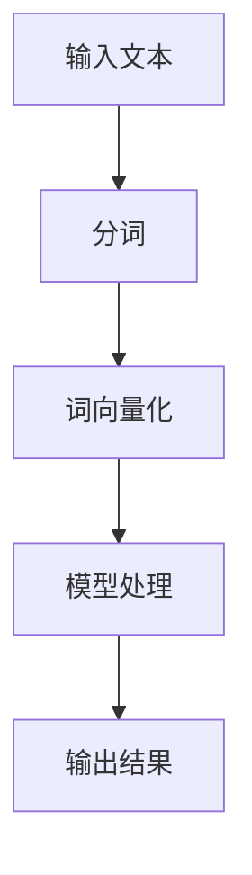
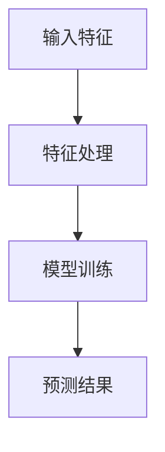
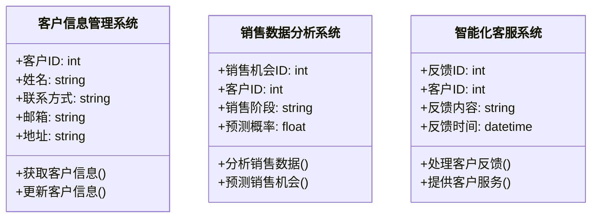
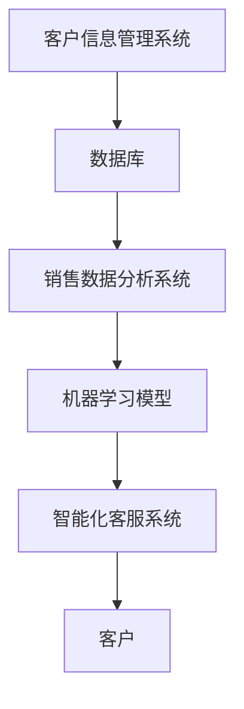
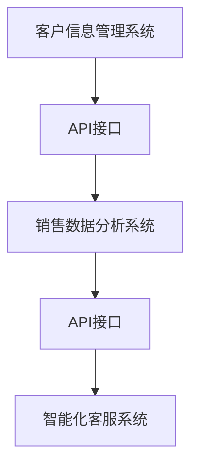

                 


# 构建企业级AI销售助手：提升转化率与客户满意度

> 关键词：企业级AI销售助手, 转化率提升, 客户满意度, 自然语言处理, 机器学习, 销售数据分析

> 摘要：本文详细探讨了构建企业级AI销售助手的各个方面，从背景分析到系统架构设计，再到项目实战，结合了技术原理和实际应用，帮助读者全面理解如何利用AI技术提升销售转化率和客户满意度。

---

# 第一部分: 企业级AI销售助手的背景与核心概念

## 第1章: AI销售助手的背景与问题背景

### 1.1 什么是企业级AI销售助手
企业级AI销售助手是一种基于人工智能技术的销售支持工具，旨在通过自动化和智能化的方式优化销售流程、提高销售效率、提升客户满意度并最终实现销售目标。它能够辅助销售团队在各个销售阶段做出更明智的决策，从而提高整体销售业绩。

#### 1.1.1 AI销售助手的核心定义
AI销售助手通过整合自然语言处理（NLP）、机器学习（ML）、销售数据分析等技术，能够实现以下功能：
- **客户意图识别**：通过分析客户的语言和行为，识别客户的购买意图。
- **销售预测与推荐**：基于历史销售数据和客户信息，预测销售机会并推荐最佳销售策略。
- **智能客服支持**：通过对话系统为客户提供实时支持，解答客户疑问并推动销售进程。
- **销售流程自动化**：自动化处理销售流程中的重复性任务，如记录客户信息、跟踪销售进展等。

#### 1.1.2 企业级AI销售助手的特点
企业级AI销售助手具有以下特点：
- **企业级集成能力**：能够与企业的CRM系统、ERP系统等无缝集成，确保数据的实时同步和共享。
- **智能化**：通过机器学习和深度学习技术，能够不断优化自身的预测和推荐能力。
- **个性化服务**：根据客户的历史行为和偏好，提供个性化的销售策略和客户服务。
- **高可用性**：作为企业级工具，要求具备高可用性和稳定性，能够支持大规模的并发使用。

#### 1.1.3 企业级AI销售助手在销售中的作用
AI销售助手在企业销售中扮演着越来越重要的角色，主要体现在以下几个方面：
- **提高销售效率**：通过自动化处理销售流程中的重复性任务，减少销售人员的工作负担，提高工作效率。
- **提升客户满意度**：通过智能化的客户支持和个性化的服务，提高客户满意度，增强客户忠诚度。
- **增强销售预测能力**：通过分析历史销售数据和市场趋势，帮助销售团队做出更准确的销售预测，制定更科学的销售策略。

### 1.2 问题背景与问题描述
在企业销售过程中，存在着许多痛点和挑战，这些痛点和挑战直接影响了销售转化率和客户满意度。

#### 1.2.1 当前销售流程中的痛点
1. **信息孤岛**：企业的各个部门之间存在信息孤岛，销售团队无法及时获取客户信息和市场数据，导致决策滞后。
2. **客户信息不全**：销售人员在记录客户信息时，往往因为时间不足或缺乏系统支持，导致客户信息不完整，影响后续销售策略的制定。
3. **销售预测不准确**：传统的销售预测方法通常基于经验或简单的统计分析，缺乏数据的深度挖掘和分析，导致预测结果不够准确。
4. **客户体验差**：客户在与销售团队互动时，常常会因为销售人员的知识不足或反应迟钝而感到不满，影响客户体验。

#### 1.2.2 转化率低的原因分析
1. **客户需求未被充分挖掘**：销售人员未能深入理解客户的真实需求，导致推荐的产品或服务无法满足客户期望。
2. **销售策略不够精准**：销售策略通常是基于经验或简单的市场分析制定的，缺乏数据支持和动态调整，难以适应市场变化。
3. **客户信任度低**：客户对销售人员的信任度不足，导致客户在购买过程中犹豫不决，最终放弃交易。

#### 1.2.3 客户满意度低的问题
1. **客户支持不足**：客户在销售过程中遇到问题时，往往得不到及时有效的支持，导致客户体验下降。
2. **销售承诺兑现难**：销售人员在销售过程中可能会做出一些无法兑现的承诺，导致客户失望甚至投诉。
3. **缺乏个性化服务**：客户感受到的销售服务缺乏个性化，无法满足客户的差异化需求，影响客户满意度。

### 1.3 问题解决与边界定义
为了应对上述问题，企业需要构建一个智能化的AI销售助手，通过技术手段优化销售流程，提高销售转化率和客户满意度。

#### 1.3.1 AI销售助手如何解决问题
AI销售助手通过以下方式解决销售过程中的痛点和问题：
1. **整合企业数据**：AI销售助手能够与企业的CRM、ERP等系统无缝集成，整合客户信息、销售数据、市场数据等，消除信息孤岛。
2. **提供智能化支持**：通过自然语言处理和机器学习技术，AI销售助手能够实时分析客户的需求和意图，提供个性化的销售策略和推荐。
3. **自动化销售流程**：AI销售助手能够自动化处理销售流程中的重复性任务，如客户信息记录、销售机会跟踪等，提高销售效率。
4. **提升客户体验**：通过智能化的客服支持和个性化的服务，AI销售助手能够提高客户的满意度和信任度，增强客户忠诚度。

#### 1.3.2 边界与外延
AI销售助手的边界主要集中在销售流程的优化和客户支持方面，其外延则涉及企业级系统的集成和数据安全等方面。

#### 1.3.3 核心要素与组成
企业级AI销售助手的核心要素包括：
- **自然语言处理（NLP）**：用于理解和分析客户的语言和行为。
- **机器学习模型**：用于预测销售机会和推荐销售策略。
- **销售数据分析**：用于分析销售数据和市场趋势，支持销售决策。
- **客户信息管理系统**：用于整合和管理客户信息。
- **智能化客服系统**：用于提供实时的客户支持和服务。

---

## 第2章: 企业级AI销售助手的核心概念与联系

### 2.1 核心概念原理
企业级AI销售助手的核心概念包括自然语言处理（NLP）、机器学习模型和销售数据分析。

#### 2.1.1 自然语言处理（NLP）原理
自然语言处理（NLP）是AI销售助手的核心技术之一，主要用于理解和分析客户的语言和行为。NLP通过将客户的语言转化为结构化的信息，帮助销售团队更好地理解客户需求和意图。

##### 1. 分词
分词是将客户的语言文本分解成有意义的词语或短语。例如，将“我们需要一个高效的CRM系统”分解为“我们”、“需要”、“一个”、“高效的”、“CRM系统”。

##### 2. 词向量化
词向量化是将词语或短语转换为向量表示的过程。常用的词向量化方法包括词袋模型、TF-IDF和词嵌入（如Word2Vec、GloVe）。

##### 3. 模型处理
模型处理是将词向量输入到预训练的NLP模型中，生成语义表示或分类结果。例如，可以使用BERT、GPT等模型进行文本分类、情感分析或实体识别。

##### 4. 输出结果
输出结果是NLP模型处理后的结果，可以是关键词提取、意图识别、情感分析等。

#### 2.1.2 机器学习模型
机器学习模型用于预测销售机会和推荐销售策略。常用的机器学习模型包括逻辑回归、支持向量机（SVM）、随机森林和深度学习模型（如神经网络、LSTM）。

#### 2.1.3 销售数据分析
销售数据分析是通过分析历史销售数据和市场趋势，支持销售决策的过程。常用的数据分析方法包括描述性分析、预测性分析和诊断性分析。

### 2.2 核心概念属性对比
以下是核心概念属性的对比：

| **属性**       | **NLP**         | **机器学习模型** | **销售数据分析** |
|----------------|----------------|-----------------|------------------|
| **输入**       | 文本数据        | 结构化数据       | 销售数据         |
| **输出**       | 关键词提取      | 预测结果         | 数据洞见         |
| **应用场景**   | 客户意图识别    | 销售机会预测     | 市场趋势分析     |
| **技术复杂度** | 中等            | 高              | 中等             |

### 2.3 ER实体关系图
以下是企业级AI销售助手的ER实体关系图：

```mermaid
erd
    客户
    ----
    客户ID, 姓名, 联系方式, 邮箱, 地址

    销售机会
    ----
    机会ID, 客户ID, 销售阶段, 预测概率, 创建时间

    产品信息
    ----
    产品ID, 产品名称, 产品描述, 价格, 库存

    销售记录
    ----
    记录ID, 客户ID, 产品ID, 销售日期, 销售金额

    客户反馈
    ----
    反馈ID, 客户ID, 反馈内容, 反馈时间, 情感评分
```

---

## 第3章: AI销售助手的算法原理与数学模型

### 3.1 算法原理
企业级AI销售助手的核心算法包括自然语言处理算法和机器学习算法。

#### 3.1.1 自然语言处理流程
以下是自然语言处理流程的mermaid图：



#### 3.1.2 机器学习模型
以下是机器学习模型的mermaid图：



### 3.2 数学模型与公式
以下是AI销售助手中常用的数学模型和公式：

#### 3.2.1 余弦相似度
余弦相似度用于计算两个向量之间的相似程度：

$$\cos\theta = \frac{\vec{A} \cdot \vec{B}}{|\vec{A}||\vec{B}|}$$

#### 3.2.2 逻辑回归模型
逻辑回归模型用于分类问题：

$$P(y=1|x) = \frac{e^{w \cdot x + b}}{1 + e^{w \cdot x + b}}$$

### 3.3 算法实现与代码示例
以下是Python代码示例：

```python
import numpy as np
from sklearn.feature_extraction.text import TfidfVectorizer
from sklearn.linear_model import LogisticRegression

# 示例数据
corpus = ["This is a positive sentence", "This is a negative sentence"]

# 分词和词向量化
vectorizer = TfidfVectorizer()
X = vectorizer.fit_transform(corpus)

# 训练逻辑回归模型
model = LogisticRegression()
model.fit(X, [1, 0])

# 预测
new_sentence = "This is a positive sentence"
X_new = vectorizer.transform([new_sentence])
prediction = model.predict(X_new)
print(prediction)
```

---

## 第4章: 系统分析与架构设计方案

### 4.1 问题场景介绍
企业级AI销售助手需要解决以下问题：
1. 客户信息分散，无法实时同步。
2. 销售流程复杂，缺乏自动化支持。
3. 客户体验不佳，满意度低。

### 4.2 系统功能设计
以下是系统功能设计的领域模型类图：



### 4.3 系统架构设计
以下是系统架构设计的mermaid图：



### 4.4 系统接口设计
以下是系统接口设计的mermaid图：



---

## 第5章: 项目实战

### 5.1 环境安装
以下是项目实战所需的环境和工具：
- Python 3.8+
- Jupyter Notebook
- Scikit-learn
- NLTK
- SpaCy
- TensorFlow

### 5.2 系统核心实现源代码
以下是Python代码示例：

```python
import pandas as pd
from sklearn.model_selection import train_test_split
from sklearn.metrics import accuracy_score
from sklearn.ensemble import RandomForestClassifier

# 示例数据
data = pd.DataFrame({
    '客户ID': [1, 2, 3, 4],
    '产品ID': [101, 102, 103, 104],
    '销售金额': [1000, 2000, 1500, 3000]
})

# 数据预处理
X = data[['客户ID', '产品ID']]
y = data['销售金额']

# 划分训练集和测试集
X_train, X_test, y_train, y_test = train_test_split(X, y, test_size=0.2)

# 训练随机森林模型
model = RandomForestClassifier()
model.fit(X_train, y_train)

# 预测
y_pred = model.predict(X_test)
print(accuracy_score(y_test, y_pred))
```

### 5.3 代码应用解读与分析
1. 数据预处理：将客户ID和产品ID作为特征，销售金额作为目标变量。
2. 模型训练：使用随机森林算法训练模型。
3. 模型预测：对测试集进行预测，并计算准确率。

### 5.4 实际案例分析和详细讲解剖析
以下是实际案例分析：

1. **客户信息管理系统**：
   - 通过整合客户信息，实现客户信息的实时同步和管理。
   - 支持客户信息的查询、更新和删除操作。

2. **销售数据分析系统**：
   - 分析历史销售数据，预测未来的销售机会。
   - 提供销售数据分析报告，支持销售决策。

3. **智能化客服系统**：
   - 通过自然语言处理技术，提供智能化的客户支持。
   - 实时响应客户需求，提高客户满意度。

### 5.5 项目小结
通过项目实战，我们可以看到企业级AI销售助手在实际应用中的巨大潜力。它不仅能够提高销售效率，还能够提升客户满意度，为企业创造更大的价值。

---

## 第6章: 最佳实践、小结、注意事项和拓展阅读

### 6.1 最佳实践
1. 在实施AI销售助手之前，确保企业内部的数据系统已经集成。
2. 在选择AI销售助手时，优先考虑能够与现有系统无缝集成的产品。
3. 在使用AI销售助手时，确保数据的安全性和隐私性。

### 6.2 小结
企业级AI销售助手通过整合自然语言处理、机器学习和销售数据分析等技术，能够显著提高销售转化率和客户满意度。通过本文的详细讲解和项目实战，我们能够更好地理解如何构建和应用企业级AI销售助手。

### 6.3 注意事项
1. 在实施AI销售助手时，确保数据的准确性和完整性。
2. 在选择AI销售助手时，充分考虑系统的可扩展性和可维护性。
3. 在使用AI销售助手时，定期更新模型和算法，确保系统的性能和效果。

### 6.4 拓展阅读
1. 《Python机器学习实战》
2. 《自然语言处理实战》
3. 《企业级数据挖掘与分析》

---

通过本文的详细讲解和项目实战，我们希望能够帮助读者更好地理解如何构建和应用企业级AI销售助手，从而在实际工作中提升销售转化率和客户满意度。

