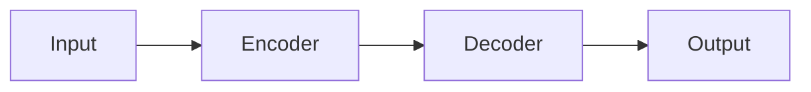
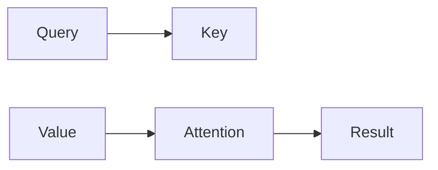

                 


# 构建企业级AI驱动的项目管理助手

> 关键词：企业级项目管理，AI驱动，大模型应用，系统架构，项目管理助手

> 摘要：随着人工智能技术的快速发展，AI驱动的项目管理助手正在成为企业提升效率和竞争力的重要工具。本文将详细探讨如何构建一个基于大模型的企业级项目管理助手，从核心概念、算法原理到系统架构设计，再到项目实战，全面解析其实现过程和应用价值。

---

# 第一部分: 企业级AI驱动的项目管理助手背景与核心概念

# 第1章: 企业级AI驱动的项目管理助手概述

## 1.1 项目管理的数字化转型

### 1.1.1 传统项目管理的痛点
传统项目管理依赖人工协调，效率低、易出错，且难以应对复杂场景。企业需要一种更高效、智能的管理方式。

### 1.1.2 AI技术如何赋能项目管理
AI技术可以通过自动化任务处理、风险预测、资源优化等方式，显著提升项目管理效率和准确性。

### 1.1.3 企业级项目管理助手的目标与价值
目标是通过AI技术构建一个智能助手，帮助企业在项目管理中实现自动化、智能化和高效协同。价值体现在提升效率、降低风险、增强竞争力。

## 1.2 AI驱动的项目管理助手的核心概念

### 1.2.1 什么是AI驱动的项目管理助手
AI驱动的项目管理助手是一个基于大模型的智能系统，能够理解和执行复杂的项目管理任务。

### 1.2.2 核心功能与应用场景
- **任务分配与跟踪**：智能分配任务，实时跟踪进度。
- **风险预测与应对**：基于历史数据预测风险，并提供解决方案。
- **资源优化与协调**：智能分配资源，避免浪费。

### 1.2.3 边界与外延
项目管理助手仅负责任务执行和协调，不涉及具体业务决策。

## 1.3 项目管理助手与企业业务的结合

### 1.3.1 企业项目管理的特点
企业项目管理涉及多部门协作，目标明确，时间紧迫。

### 1.3.2 AI在项目管理中的关键作用
AI通过自动化处理、数据挖掘和智能决策，提升项目管理的效率和精准度。

### 1.3.3 助手与企业业务的协同机制
通过API和数据接口，助手与企业现有的系统无缝集成，实现数据共享和协同工作。

## 1.4 本章小结

---

# 第二部分: AI大模型的核心原理与应用

# 第2章: AI大模型的基本原理

## 2.1 大模型的结构与训练方法

### 2.1.1 Transformer模型的基本结构
Transformers由编码器和解码器组成，采用自注意力机制，能够处理长距离依赖关系。



### 2.1.2 大模型的训练过程
包括数据预处理、模型初始化、正向传播、反向传播和参数更新。

### 2.1.3 模型的可扩展性与适应性
通过参数调整和模型剪枝，模型可以在不同场景下灵活部署。

## 2.2 大模型的核心算法与优化策略

### 2.2.1 注意力机制的实现
注意力机制通过计算输入序列中每个位置的权重，确定哪些部分更重要。



### 2.2.2 模型压缩与轻量化技术
通过知识蒸馏和量化，减少模型大小，提升运行效率。

### 2.2.3 迁移学习与微调策略
利用预训练模型，在特定任务上进行微调，提升任务相关性。

## 2.3 大模型的评估与优化

### 2.3.1 模型评估指标
- 准确率
- 召回率
- F1值

### 2.3.2 性能优化方法
- 参数调整
- 激活函数选择
- 优化算法优化

### 2.3.3 模型的可解释性
通过可视化注意力权重，解释模型的决策过程。

## 2.4 本章小结

---

# 第三部分: 项目管理助手的系统分析与架构设计

# 第3章: 项目管理助手的系统分析

## 3.1 项目管理场景分析

### 3.1.1 项目计划与进度管理
智能制定计划，实时跟踪进度，及时调整。

### 3.1.2 资源分配与协调
根据任务需求，智能分配资源，避免冲突。

### 3.1.3 风险预测与应对
基于历史数据，预测潜在风险，并提供解决方案。

## 3.2 系统功能需求分析

### 3.2.1 功能模块划分
- 任务管理模块
- 风险预测模块
- 资源分配模块

### 3.2.2 用户角色与权限
- 项目经理：权限最高
- 项目成员：基础权限

### 3.2.3 数据流分析
数据从用户输入到系统处理，再到输出结果。

## 3.3 系统架构设计

### 3.3.1 分层架构设计
- 用户层
- 业务逻辑层
- 数据访问层


### 3.3.2 微服务架构实现
各功能模块独立开发，通过API进行通信。

### 3.3.3 数据存储与访问控制
使用关系型数据库，通过权限控制访问。

## 3.4 本章小结

---

# 第四部分: 项目管理助手的算法实现与优化

# 第4章: 项目管理助手的算法实现

## 4.1 基于大模型的自然语言处理

### 4.1.1 文本理解与生成
使用大模型进行文本解析和生成，帮助用户完成任务描述。

### 4.1.2 任务自动化流程
通过自然语言理解，自动提取任务信息并生成执行计划。

### 4.1.3 模型的训练与调优
采用迁移学习，针对项目管理任务进行微调。

## 4.2 项目风险预测的算法实现

### 4.2.1 风险因素提取
从历史数据中提取关键风险因素。

### 4.2.2 基于大模型的风险评估
通过大模型对风险因素进行权重计算，评估风险等级。

### 4.2.3 风险预测的数学模型
建立多元回归模型，预测风险发生概率。

$$ P(risk) = \beta_0 + \beta_1x_1 + \beta_2x_2 + ... + \beta_nx_n $$

## 4.3 项目进度预测的优化策略

### 4.3.1 基于时间序列的预测模型
使用ARIMA模型预测项目进度。

### 4.3.2 模型的优化与调参
通过网格搜索，找到最佳模型参数。

### 4.3.3 进度预测的误差分析
通过均方误差（MSE）评估预测准确性。

$$ MSE = \frac{1}{n}\sum_{i=1}^{n}(y_i - \hat{y}_i)^2 $$

## 4.4 本章小结

---

# 第五部分: 项目实战与系统实现

# 第5章: 项目管理助手的环境搭建与核心代码实现

## 5.1 环境搭建

### 5.1.1 安装Python
安装Python 3.8以上版本。

### 5.1.2 安装依赖库
安装PyTorch、Hugging Face Transformers等库。

## 5.2 核心代码实现

### 5.2.1 任务分配模块

```python
import torch
from transformers import AutoTokenizer, AutoModelForCausalLM

tokenizer = AutoTokenizer.from_pretrained('gpt2')
model = AutoModelForCausalLM.from_pretrained('gpt2')

def generate_plan(task):
    inputs = tokenizer(task, return_tensors='np')
    outputs = model.generate(inputs.input_ids, max_length=100)
    return tokenizer.decode(outputs[0], skip_special_tokens=True)
```

### 5.2.2 风险预测模块

```python
import torch
import torch.nn as nn

class RiskPredictor(nn.Module):
    def __init__(self, input_size, hidden_size, output_size):
        super(RiskPredictor, self).__init__()
        self.fc1 = nn.Linear(input_size, hidden_size)
        self.fc2 = nn.Linear(hidden_size, output_size)
        self.relu = nn.ReLU()

    def forward(self, x):
        out = self.fc1(x)
        out = self.relu(out)
        out = self.fc2(out)
        return out

model = RiskPredictor(5, 10, 1)
criterion = nn.BCELoss()
optimizer = torch.optim.Adam(model.parameters(), lr=0.01)
```

## 5.3 项目实战与案例分析

### 5.3.1 实际案例分析
以一个软件开发项目为例，展示如何使用AI助手进行任务分配和风险预测。

### 5.3.2 代码应用解读
详细解读上述代码的功能和实现逻辑。

## 5.4 本章小结

---

# 第六部分: 最佳实践与总结

# 第6章: 最佳实践与总结

## 6.1 小结
本文详细介绍了如何构建企业级AI驱动的项目管理助手，从核心概念到算法实现，再到系统设计，全面覆盖了构建过程。

## 6.2 注意事项
在实际应用中，需要注意数据隐私和模型的可解释性问题。

## 6.3 拓展阅读
建议深入学习大模型的优化技术以及项目管理领域的最新研究。

## 6.4 本章小结

---

# 结语

构建企业级AI驱动的项目管理助手是一个复杂的系统工程，但其带来的效率提升和竞争优势是显而易见的。通过本文的分析和实践，读者可以掌握构建此类系统的具体方法和注意事项。

--- 

# END

