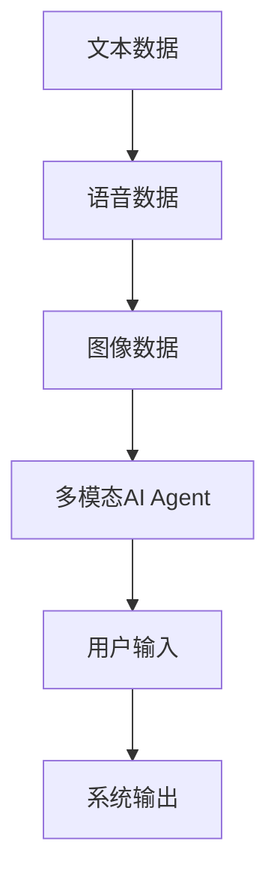
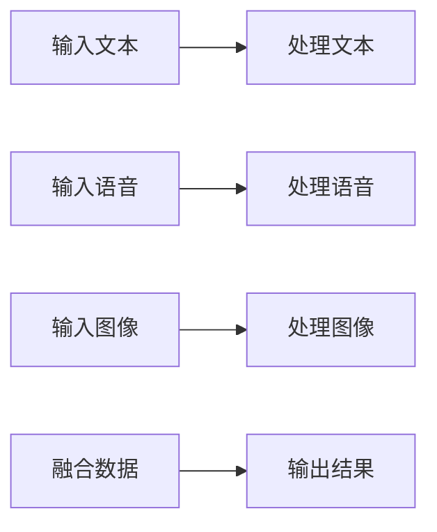
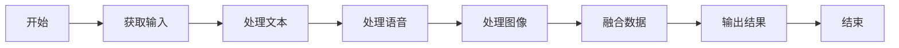
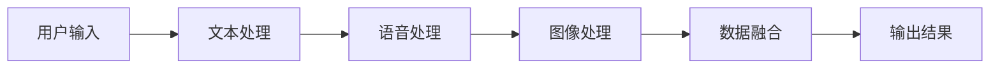
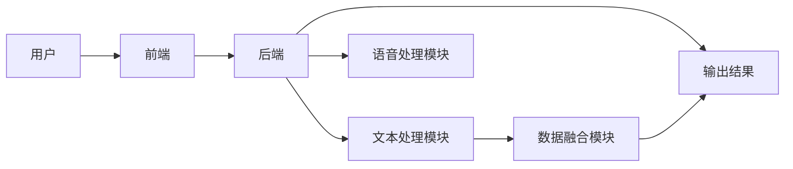
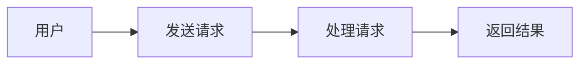

                 

# 构建企业级多模态AI Agent：整合文本、语音与图像

## 关键词：企业级AI Agent，多模态数据，文本语音图像融合，系统架构，机器学习，深度学习

## 摘要：本文将深入探讨如何构建一个企业级的多模态AI Agent，整合文本、语音和图像数据，通过系统的架构设计和算法实现，展示其在实际应用中的潜力和优势。

---

## 第1章: 多模态AI Agent的背景与概念

### 1.1 多模态AI Agent的背景介绍

#### 1.1.1 问题背景与问题描述
在企业级应用中，数据来源多样，包括文本、语音、图像等模态。单一模态的数据难以满足复杂场景的需求，因此需要整合多种模态数据，构建多模态AI Agent。

#### 1.1.2 多模态AI Agent的核心概念与问题解决
多模态AI Agent通过整合多种数据，提升决策能力和用户体验，解决单一模态数据的局限性。

#### 1.1.3 多模态AI Agent的边界与外延
明确多模态AI Agent的应用范围和边界，避免与相关技术混淆。

#### 1.1.4 多模态AI Agent的概念结构与核心要素
包括数据融合、系统架构、交互模块等核心要素。

---

## 第2章: 多模态AI Agent的核心概念与联系

### 2.1 多模态AI Agent的核心原理

#### 2.1.1 多模态数据的融合机制
解释数据融合的过程和方法。

#### 2.1.2 多模态AI Agent的感知与决策过程
描述AI Agent如何感知和决策。

#### 2.1.3 多模态AI Agent的交互方式与反馈机制
介绍交互方式和反馈机制。

### 2.2 多模态AI Agent的核心概念属性对比

#### 2.2.1 多模态数据类型对比
列出文本、语音、图像的数据类型。

#### 2.2.2 多模态AI Agent功能模块对比
对比功能模块的特点。

#### 2.2.3 多模态AI Agent应用场景对比
分析不同应用场景的差异。

### 2.3 多模态AI Agent的实体关系图

---

## 第3章: 多模态AI Agent的算法原理与数学模型

### 3.1 多模态数据融合算法

#### 3.1.1 多模态数据融合的基本原理
解释融合的基本原理。

#### 3.1.2 多模态数据融合的数学模型
公式：$$ y = f(x_1, x_2, ...) $$

#### 3.1.3 多模态数据融合算法流程

#### 3.1.4 Python代码示例
代码实现数据融合的过程。

### 3.2 多模态AI Agent的算法实现

#### 3.2.1 算法实现的数学模型
公式：$$ y = w_1x_1 + w_2x_2 + ... $$

#### 3.2.2 算法实现的流程图

#### 3.2.3 Python代码实现
详细代码实现和解释。

---

## 第4章: 多模态AI Agent的系统架构设计

### 4.1 问题场景介绍

#### 4.1.1 项目背景
描述项目背景和目标。

#### 4.1.2 项目目标
明确项目的具体目标。

### 4.2 系统功能设计

#### 4.2.1 系统功能模块
列出功能模块，如文本处理、语音处理、图像处理等。

#### 4.2.2 系统功能流程

### 4.3 系统架构设计

#### 4.3.1 系统架构图

#### 4.3.2 系统接口设计
定义接口和交互方式。

#### 4.3.3 系统交互流程图

---

## 第5章: 多模态AI Agent的项目实战

### 5.1 环境安装与配置

#### 5.1.1 安装Python
安装Python和必要的库。

#### 5.1.2 安装依赖库
安装如TensorFlow、PyTorch等库。

### 5.2 系统核心实现

#### 5.2.1 文本处理模块实现
代码实现文本处理功能。

#### 5.2.2 语音处理模块实现
代码实现语音处理功能。

#### 5.2.3 图像处理模块实现
代码实现图像处理功能。

### 5.3 代码应用解读与分析

#### 5.3.1 代码实现
详细代码实现和解释。

#### 5.3.2 代码运行结果
展示运行结果和分析。

### 5.4 实际案例分析

#### 5.4.1 案例背景
描述案例背景和目标。

#### 5.4.2 数据准备
准备所需的文本、语音、图像数据。

#### 5.4.3 系统运行与结果分析
运行系统并分析结果。

---

## 第6章: 最佳实践与小结

### 6.1 最佳实践 tips

#### 6.1.1 数据预处理
数据清洗和标准化的建议。

#### 6.1.2 模型优化
优化模型性能的技巧。

#### 6.1.3 系统部署与维护
部署和维护的注意事项。

### 6.2 小结

总结全文，强调多模态AI Agent的重要性和应用前景。

### 6.3 注意事项

提醒读者在实际应用中需要注意的问题。

### 6.4 拓展阅读

推荐相关领域的书籍和资源，供读者深入学习。

---

## 附录: 多模态AI Agent相关技术资料

---

通过以上内容，我们构建了一个完整的企业级多模态AI Agent，整合了文本、语音和图像数据，展示了其在实际应用中的潜力和优势。

