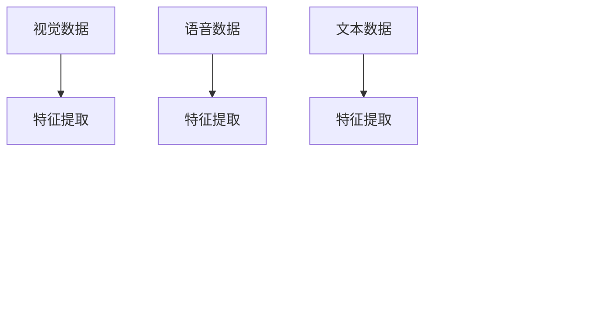
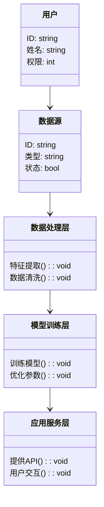
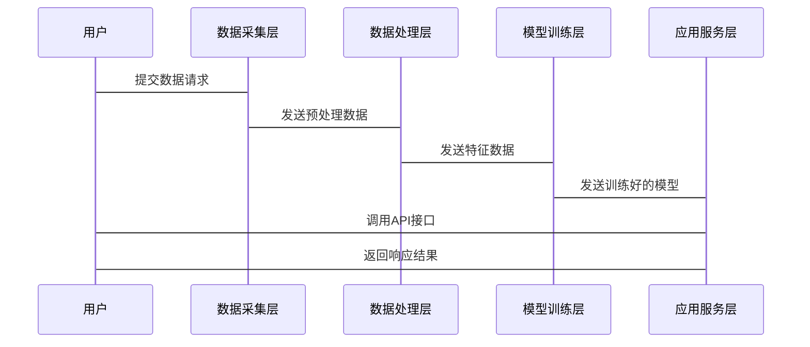

                 


# 《构建企业级多模态AI平台：整合视觉、语音与文本的综合分析系统》

## 关键词：企业级AI平台，多模态数据，视觉、语音、文本融合，AI系统架构，多模态算法，系统集成

## 摘要：本文系统地阐述了构建企业级多模态AI平台的核心理念、技术架构和实现方法。从多模态数据的采集与处理，到跨模态数据的融合与分析，再到基于深度学习的多任务模型设计，详细探讨了整合视觉、语音与文本数据的关键技术。同时，本文深入分析了多模态AI系统的架构设计、接口规范和交互流程，并通过具体案例展示了平台的实现过程和应用场景。文章最后总结了多模态AI平台的最佳实践和未来发展趋势。

---

# 第一章：多模态AI平台的背景与核心概念

## 1.1 问题背景

### 1.1.1 当前企业信息化的挑战
- 数据来源多样化：企业面临视觉（图像/视频）、语音（音频）和文本（文档、对话）等多种数据源。
- 数据孤岛问题：不同数据类型和系统之间缺乏有效整合，导致信息利用率低。
- 传统AI的局限性：单模态分析无法满足复杂场景的需求。

### 1.1.2 多模态数据处理的需求
- 提高信息提取效率：通过整合多模态数据，提升AI系统的理解和决策能力。
- 增强用户体验：多模态交互能够提供更自然的人机交互方式。
- 降低误判风险：结合多种数据源可以减少单一模态分析的偏差。

### 1.1.3 多模态AI平台的必要性
- 企业级应用的复杂性要求：现代企业需要处理复杂的业务场景，单模态分析难以满足需求。
- 行业趋势：多模态技术在医疗、教育、金融等领域的广泛应用。
- 技术进步推动：深度学习和大模型技术的发展为多模态AI提供了技术基础。

## 1.2 核心概念与定义

### 1.2.1 多模态数据
- 定义：多模态数据指多种类型的数据，包括视觉、语音和文本等。
- 特性：
  - 异构性：数据类型和格式多样化。
  - 互补性：不同模态的数据能够相互补充，提供更全面的信息。
  - 高维性：多模态数据通常具有高维特征空间。

### 1.2.2 多模态AI系统
- 定义：一个多模态AI系统是指能够同时处理和分析多种数据类型的智能系统。
- 组成：
  - 数据采集层：负责多模态数据的采集和预处理。
  - 数据处理层：对采集到的数据进行清洗、转换和特征提取。
  - 模型训练层：基于多模态数据训练深度学习模型。
  - 应用服务层：将模型部署为实际应用，提供API接口和用户交互界面。

### 1.2.3 多模态融合
- 定义：将不同模态的数据进行融合，以提高系统的理解和分析能力。
- 方法：
  - 特征级融合：在特征层对不同模态的特征进行融合。
  - 模型级融合：在模型输出层进行融合，通常采用加权或注意力机制。

## 1.3 技术架构与边界

### 1.3.1 技术架构
- 分层架构：
  - 数据层：包括多模态数据的采集和存储。
  - 计算层：负责数据处理、模型训练和推理。
  - 应用层：提供用户交互界面和API服务。

### 1.3.2 边界与外延
- 边界：
  - 仅处理视觉、语音和文本数据。
  - 不涉及物理传感器或其他类型的数据。
- 外延：
  - 支持更多的数据类型，如 gesture（手势）或 chemical（化学数据）。
  - 扩展到更多的应用场景，如自动驾驶、智能城市等。

## 1.4 核心概念对比

| 概念       | 特征                     | 描述                                             |
|------------|--------------------------|-------------------------------------------------|
| 视觉数据   | 图像、视频               | 基于视觉信息的处理，如图像分类、目标检测等。   |
| 语音数据   | 音频、语音               | 基于声音信息的处理，如语音识别、情感分析等。   |
| 文本数据   | 文本、自然语言           | 基于文字信息的处理，如文本分类、机器翻译等。   |
| 多模态融合 | 综合处理多种数据类型     | 将视觉、语音和文本数据进行整合分析，提高系统性能。|

---

# 第二章：多模态数据处理与融合

## 2.1 多模态数据处理

### 2.1.1 视觉数据处理
- 图像预处理：
  - 标准化：归一化到统一的尺寸和格式。
  - 噪声处理：去除图像中的噪声和干扰。
- 视频处理：
  - 分割：将视频分割为帧进行处理。
  - 特征提取：提取视频中的关键帧或运动信息。

### 2.1.2 语音数据处理
- 音频预处理：
  - 声学特征提取：如梅尔频谱倒谱系数（MFCC）。
  - 噪声消除：去除背景噪声，提高语音清晰度。
- 语音识别：
  - 使用CTC或Transformer模型进行语音到文本的转换。

### 2.1.3 文本数据处理
- 分词与词性标注：
  - 使用分词工具（如jieba）对中文文本进行分词。
  - 使用词性标注工具（如NLTK）进行词性分析。
- 停用词处理：
  - 移除常见停用词，如“的”、“了”等，减少特征维度。

## 2.2 多模态数据融合方法

### 2.2.1 基于特征的融合
- 方法：
  - 晚期融合：在模型的高层特征层进行融合。
  - 早期融合：在数据预处理阶段进行融合。
- 示例：
  - 将图像特征和文本特征拼接，输入到一个全连接层中进行分类。

### 2.2.2 基于模型的融合
- 方法：
  - 多任务学习：设计多个任务目标，共享底层特征。
  - 模型级融合：将不同模型的输出进行加权或投票。
- 示例：
  - 使用多任务学习模型，同时进行图像分类和文本分类。

### 2.2.3 基于注意力机制的融合
- 方法：
  - 使用自注意力机制对不同模态的数据进行加权。
  - 通过交叉注意力机制实现模态间的相互影响。
- 示例：
  - 在视觉-文本融合中，使用双向注意力机制，同时关注图像和文本的相关部分。

## 2.3 多模态AI系统的架构

### 2.3.1 数据采集层
- 功能：
  - 接收多模态数据输入，如摄像头、麦克风和文本输入。
  - 数据预处理和存储。

### 2.3.2 数据处理层
- 功能：
  - 数据清洗和转换。
  - 特征提取和表示。
- 工具：
  - OpenCV（视觉数据处理）。
  - Librosa（语音数据处理）。
  - NLTK/spaCy（文本数据处理）。

### 2.3.3 模型训练层
- 功能：
  - 基于多模态数据训练深度学习模型。
  - 使用多任务学习框架，如Muti-Task Learning（MTL）。
- 框架：
  - TensorFlow/PyTorch。
  - Keras。

### 2.3.4 应用服务层
- 功能：
  - 提供API接口，供其他系统调用。
  - 提供用户交互界面，如Web或移动端应用。
- 实现：
  - FastAPI（API框架）。
  - Flask/Django（Web框架）。

## 2.4 多模态融合算法原理

### 2.4.1 多任务学习
- 定义：
  - 通过共享底层特征，同时优化多个任务目标。
  - 示例：在图像分类任务中，同时预测图像标签和文本描述。
- 数学模型：
  - $$L = \lambda_1 L_1 + \lambda_2 L_2 + ... + \lambda_n L_n$$
  - 其中，$L_i$ 是第i个任务的损失函数，$\lambda_i$ 是权重系数。

### 2.4.2 注意力机制
- 定义：
  - 通过自注意力机制对输入数据进行加权。
  - 示例：在视觉-文本融合中，注意力机制可以关注图像和文本的相关部分。
- 数学模型：
  - $$\text{Attention}(q, k, v) = \text{softmax}(\frac{q \cdot k^T}{\sqrt{d}}) \cdot v$$

### 2.4.3 多模态融合流程图


---

# 第三章：系统分析与架构设计

## 3.1 问题场景介绍

### 3.1.1 企业级AI平台的应用场景
- 客户服务：多模态交互客服系统。
- 企业监控：多模态数据监控和分析。
- 内部管理：多模态数据驱动的决策支持。

### 3.1.2 系统功能需求
- 数据采集：支持多种数据源的接入。
- 数据处理：具备强大的数据预处理和特征提取能力。
- 模型训练：支持多任务学习和多模态融合。
- 应用服务：提供API接口和用户交互界面。

## 3.2 系统功能设计

### 3.2.1 领域模型


### 3.2.2 系统架构设计


### 3.2.3 系统接口设计

| 接口名称 | 输入 | 输出 | 描述 |
|----------|------|------|------|
| 数据采集 | 用户输入 | 数据预处理结果 | 数据采集层接口 |
| 模型训练 | 特征数据 | 训练好的模型 | 模型训练层接口 |
| API服务 | 请求参数 | 响应结果 | 应用服务层接口 |

### 3.2.4 系统交互流程



---

# 第四章：项目实战与实现

## 4.1 环境安装

### 4.1.1 安装Python环境
- 安装Python 3.8或更高版本。
- 安装pip工具。

### 4.1.2 安装依赖库
```bash
pip install numpy
pip install pandas
pip install tensorflow
pip install pytorch
pip install opencv-python
pip install librosa
pip install jieba
pip install fastapi
pip install uvicorn
```

## 4.2 核心代码实现

### 4.2.1 数据处理层代码

```python
import numpy as np
import cv2
import librosa
import jieba

def preprocess_image(image_path):
    # 读取图像
    img = cv2.imread(image_path)
    # 转换为RGB格式
    img = cv2.cvtColor(img, cv2.COLOR_BGR2RGB)
    # 调整尺寸
    img = cv2.resize(img, (224, 224))
    # 归一化
    img = img / 255.0
    return img

def preprocess_audio(audio_path):
    # 读取音频
    y, sr = librosa.load(audio_path, sr=16000)
    # 转换为梅尔频谱
    mel = librosa.feature.melspectrogram(y, sr=sr, n_mels=128, fmin=0, fmax=8000)
    mel = librosa.util.sync(mel, sr=sr)
    return mel

def preprocess_text(text):
    # 分词
    words = jieba.lcut(text)
    # 转换为向量（简化）
    vector = np.zeros(len(words), dtype=int)
    return vector
```

### 4.2.2 模型训练层代码

```python
import torch
import torch.nn as nn
import torch.optim as optim

class MultimodalClassifier(nn.Module):
    def __init__(self):
        super(MultimodalClassifier, self).__init__()
        self.visual_feature = nn.Linear(2048, 512)
        self.text_feature = nn.Linear(100, 512)
        self.audio_feature = nn.Linear(128, 512)
        self.fc = nn.Linear(512, 10)
        self.dropout = nn.Dropout(0.5)

    def forward(self, visual, text, audio):
        visual_out = self.visual_feature(visual)
        text_out = self.text_feature(text)
        audio_out = self.audio_feature(audio)
        # 使用注意力机制进行融合
        attention = torch.softmax(torch.cat([visual_out, text_out, audio_out], dim=1), dim=1)
        fused = torch.bmm(attention.unsqueeze(1), torch.cat([visual_out, text_out, audio_out], dim=1).unsqueeze(2)).squeeze(2)
        output = self.fc(self.dropout(fused))
        return output

# 初始化模型
model = MultimodalClassifier()
# 定义损失函数
criterion = nn.CrossEntropyLoss()
# 定义优化器
optimizer = optim.Adam(model.parameters(), lr=0.001)
```

### 4.2.3 应用服务层代码

```python
from fastapi import FastAPI
import uvicorn

app = FastAPI()

@app.post("/api/infer")
async def infer(data: dict):
    # 获取输入数据
    visual_data = data['visual']
    text_data = data['text']
    audio_data = data['audio']
    
    # 数据处理
    visual_feature = preprocess_image(visual_data)
    text_feature = preprocess_text(text_data)
    audio_feature = preprocess_audio(audio_data)
    
    # 模型推理
    output = model.forward(visual_feature, text_feature, audio_feature)
    return {"result": output.tolist()}

if __name__ == "__main__":
    uvicorn.run(app, host="0.0.0.0", port=8000)
```

## 4.3 代码应用解读与分析

### 4.3.1 数据处理层解读
- `preprocess_image`：实现图像数据的预处理，包括读取、转换、调整尺寸和归一化。
- `preprocess_audio`：实现音频数据的预处理，包括读取、梅尔频谱提取和同步。
- `preprocess_text`：实现文本数据的分词和向量化。

### 4.3.2 模型训练层解读
- `MultimodalClassifier`：定义一个多模态分类器，包含视觉、文本和音频特征提取层，以及注意力机制融合层。
- `forward`：实现多模态数据的融合和分类。

### 4.3.3 应用服务层解读
- `FastAPI`：用于构建RESTful API服务。
- `/api/infer`：实现模型推理接口，接收视觉、文本和音频数据，返回分类结果。

## 4.4 实际案例分析

### 4.4.1 案例背景
- 假设我们构建了一个多模态客服系统，能够同时分析客户的图像、语音和文本信息，提供更精准的客户服务。

### 4.4.2 实现步骤
1. 数据采集：收集客户图像、语音和文本数据。
2. 数据处理：对图像、语音和文本进行预处理。
3. 模型训练：训练一个多模态分类器，实现客户意图识别。
4. 应用部署：将模型部署为API服务，提供给其他系统调用。

## 4.5 项目小结

### 4.5.1 核心代码总结
- 数据处理层：实现了图像、语音和文本的预处理。
- 模型训练层：实现了多模态数据的融合与分类。
- 应用服务层：提供了API接口，方便其他系统调用。

### 4.5.2 实践中的注意事项
- 数据质量：确保数据的完整性和一致性。
- 模型调优：通过调整超参数和优化策略提升模型性能。
- 系统性能：优化代码以提高运行效率。

---

# 第五章：总结与展望

## 5.1 最佳实践 Tips

### 5.1.1 数据处理
- 确保数据的多样性和代表性。
- 处理异常数据，减少噪声干扰。

### 5.1.2 模型选择
- 根据具体任务选择合适的模型架构。
- 使用预训练模型提升性能。

### 5.1.3 系统优化
- 优化代码性能，减少计算开销。
- 使用分布式训练提升训练效率。

## 5.2 未来展望

### 5.2.1 技术发展
- 更高效的多模态融合方法。
- 更强大的大模型技术，如视觉-语言模型（VLM）。

### 5.2.2 应用场景
- 智能客服：多模态交互提升用户体验。
- 智慧医疗：多模态数据辅助诊断。
- 智能教育：个性化教学支持。

### 5.2.3 挑战与机遇
- 挑战：数据隐私和安全问题。
- 机遇：多模态技术在更多领域的应用。

---

# 结语

构建企业级多模态AI平台是一个复杂的系统工程，需要整合视觉、语音和文本等多种数据类型，并通过先进的算法和系统架构实现高效的数据处理和分析。本文通过详细阐述多模态AI平台的核心概念、技术架构和实现方法，为读者提供了一个系统性的构建指南。未来，随着技术的不断发展，多模态AI平台将在更多领域发挥重要作用，为企业和社会创造更大的价值。

