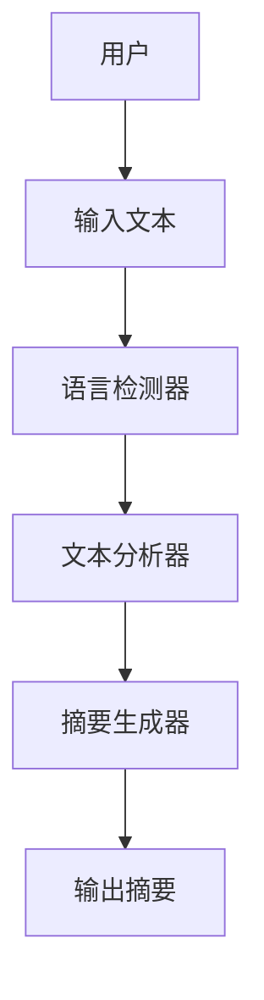
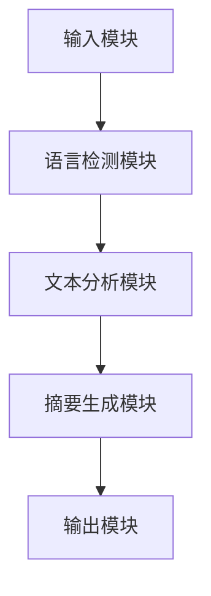
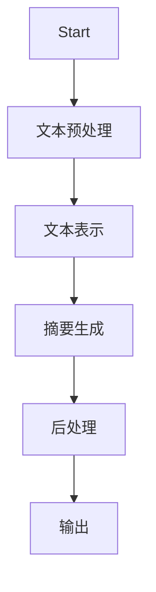
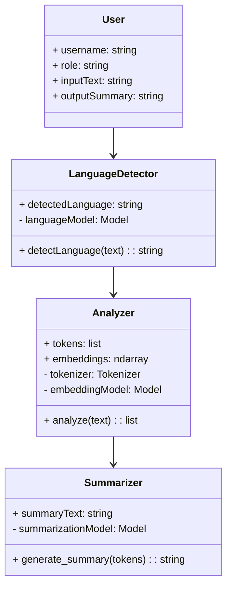
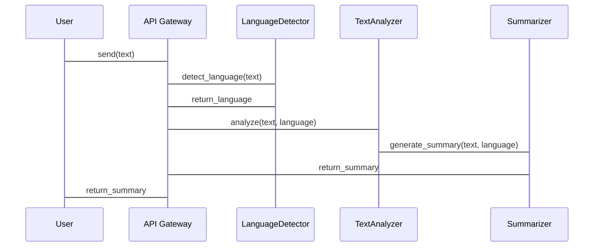

                 


# 构建企业级多语言文本摘要系统：自动生成报告摘要

## 关键词：多语言处理，文本摘要，深度学习，企业级系统，NLP

## 摘要：本文将详细探讨如何构建一个能够处理多种语言并自动生成报告摘要的企业级系统。我们将从问题背景和挑战入手，逐步分析多语言文本处理和文本摘要的核心原理，深入讲解基于深度学习的摘要算法，结合系统架构设计与实现，最后通过项目实战提供完整的解决方案。文章还包含丰富的代码示例和数学模型，帮助读者全面理解并掌握该技术。

---

# 第一部分：企业级多语言文本摘要系统概述

## 第1章：多语言文本摘要系统背景

### 1.1 问题背景与挑战

#### 1.1.1 多语言文本处理的复杂性
在企业环境中，处理多语言文本是一项具有挑战性的任务。不同语言的语法结构、词汇习惯和文化背景差异显著，如何在统一的系统中处理这些差异是关键问题。例如，中文和英文的分词方式截然不同，中文需要分词，而英文基于空格分隔。此外，某些语言（如阿拉伯语）具有方向性，这可能影响文本的处理和存储。

#### 1.1.2 文本摘要技术的重要性
随着信息量的爆炸式增长，企业需要高效处理大量文本数据。文本摘要技术能够帮助用户快速获取关键信息，提升工作效率。例如，在会议纪要或报告生成中，自动生成摘要可以节省大量时间，同时减少人为错误。

#### 1.1.3 企业级应用中的摘要需求
企业级应用通常涉及大量跨部门、跨语言的协作。例如，跨国公司需要将会议记录自动翻译并生成摘要，以便不同语言的员工都能理解。这种情况下，一个能够处理多种语言并生成相应摘要的系统显得尤为重要。

### 1.2 问题描述与目标

#### 1.2.1 系统目标
本文的目标是构建一个企业级多语言文本摘要系统，能够自动接收多语言文本输入，进行语言检测，生成相应语言的摘要。系统应具备高精度、高效率和良好的可扩展性。

#### 1.2.2 需求分析
系统需要支持多种语言，包括但不限于中、英、日、法等。摘要结果应准确反映原文内容，同时保持简洁和连贯。此外，系统应具备良好的容错能力，处理格式错误或不完整的输入文本。

#### 1.2.3 系统边界与外延
系统的边界包括文本输入、语言检测、文本分析和摘要生成。外延则涉及文本存储、用户界面设计和结果展示，这些部分虽然不在系统核心功能范围内，但与系统的实际应用密切相关。

### 1.3 核心概念与联系

#### 1.3.1 实体关系图
通过Mermaid图，我们可以清晰地展示系统中的实体及其关系。以下是实体关系图：



## 第2章：多语言文本处理与摘要技术

### 2.1 多语言文本处理原理

#### 2.1.1 多语言文本的特征分析
不同语言具有独特的特征，例如：
- **形态学**：如阿拉伯语的复数形式变化。
- **语序**：如日语和英语的主谓宾结构。
- **标点符号**：中文使用顿号，而英文使用逗号。

这些特征影响文本处理的算法选择和实现方式。

#### 2.1.2 多语言分词与句法分析
分词是文本处理的基础，不同语言的分词策略差异显著。例如，中文分词需要处理词语的内部结构，而英文则基于空格分割。句法分析则涉及依存关系的构建，这对后续的摘要生成至关重要。

#### 2.1.3 语言间的共性与差异
尽管不同语言存在差异，但某些处理方法具有共性。例如，停用词的处理和关键词提取方法在多种语言中通用。然而，某些语言（如德语）的复杂句式可能需要特定的处理策略。

### 2.2 文本摘要技术的核心原理

#### 2.2.1 基于统计的摘要方法
基于统计的摘要方法通过分析文本中的关键词和句法结构，提取最重要的信息。例如，Luhn算法和Latent Semantic Analysis（LSA）常用于统计摘要。

#### 2.2.2 基于深度学习的摘要方法
近年来，深度学习模型（如Transformer和BERT）在文本摘要中表现出色。这些模型能够捕捉文本的语义信息，生成连贯且自然的摘要。

#### 2.2.3 摘要质量评估指标
摘要的质量评估通常基于以下几个指标：
- **ROUGE**：基于n-gram的召回率。
- **BLEU**：基于n-gram的精确度和BM25。
- **METEOR**：结合词汇和句法相似度。

### 2.3 多语言摘要系统的架构

#### 2.3.1 系统功能模块划分
系统主要模块包括：
- **输入模块**：接收多语言文本。
- **语言检测模块**：识别文本语言。
- **文本分析模块**：处理文本并提取关键信息。
- **摘要生成模块**：根据分析结果生成摘要。

#### 2.3.2 模块间关系
以下是模块间关系的Mermaid图：



#### 2.3.3 系统输入输出流程
系统流程如下：
1. 用户输入多语言文本。
2. 语言检测模块识别文本语言。
3. 文本分析模块处理文本，提取关键词和句法信息。
4. 摘要生成模块生成摘要。
5. 输出模块展示摘要结果。

---

# 第三部分：系统算法原理

## 第3章：文本摘要算法流程

### 3.1 算法实现流程图



### 3.2 算法实现代码

```python
def text_preprocessing(text):
    # 分词处理
    tokens = tokenize(text)
    # 去停用词
    filtered_tokens = remove_stopwords(tokens)
    return filtered_tokens

def text_representation(tokens):
    # 生成词向量
    word_embeddings = get_word_embeddings(tokens)
    return word_embeddings

def summary_generation(word_embeddings):
    # 使用深度学习模型生成摘要
    summary = generate_summary(word_embeddings)
    return summary

def postprocessing(summary):
    # 格式化处理
    formatted_summary = format_summary(summary)
    return formatted_summary
```

### 3.3 数学模型与公式

#### 3.3.1 词向量表示
文本表示通常使用词向量，例如Word2Vec或BERT模型。词向量的维度决定了模型的表达能力：

$$
\text{word\_embedding} = W_{\text{word}} \cdot \text{input\_token}
$$

其中，\( W_{\text{word}} \)是词嵌入矩阵，\(\text{input\_token}\)是输入的词或标记。

#### 3.3.2 注意力机制
注意力机制用于捕捉文本中的关键信息，特别是在多语言处理中：

$$
\alpha_i = \frac{\exp(\text{score}(i))}{\sum_{j}\exp(\text{score}(j))}
$$

其中，\(\text{score}(i)\)是第i个词的注意力得分。

---

# 第四部分：系统分析与架构设计

## 第4章：系统分析与架构设计

### 4.1 项目介绍

#### 4.1.1 项目目标
本项目旨在构建一个支持多语言文本摘要的企业级系统，满足企业对跨语言协作和信息处理的需求。

#### 4.1.2 项目范围
系统支持的语言包括中文、英文、日文和法文。摘要结果需满足一定的准确率和召回率。

### 4.2 系统功能设计

#### 4.2.1 系统功能模块
系统功能模块包括：
- 用户界面模块：提供输入和输出界面。
- 处理模块：包括语言检测、文本分析和摘要生成。

#### 4.2.2 领域模型
以下是领域模型的Mermaid图：



### 4.3 系统架构设计

#### 4.3.1 系统架构图
以下是系统架构的Mermaid图：

```mermaid
graph TD
    User[用户] --> API Gateway[API网关]
    API Gateway --> LanguageDetector[语言检测器]
    LanguageDetector --> TextAnalyzer[文本分析器]
    TextAnalyzer --> Summarizer[摘要生成器]
    Summarizer --> Output[输出]
```

### 4.4 系统接口设计

#### 4.4.1 接口定义
系统提供以下接口：
- `/api/detect_language`: 接收文本，返回检测到的语言。
- `/api/generate_summary`: 接收文本和语言，返回摘要。

#### 4.4.2 交互流程图
以下是交互流程的Mermaid图：



---

# 第五部分：项目实战

## 第5章：项目实战

### 5.1 环境安装

#### 5.1.1 安装Python和相关库
安装Python和以下库：
```bash
pip install numpy
pip install tensorflow
pip install transformers
pip install pyhanlp
pip installjieba
```

### 5.2 系统核心实现

#### 5.2.1 语言检测模块实现

```python
import langdetect

def detect_language(text):
    return langdetect.detect_lang(text)
```

#### 5.2.2 文本分析模块实现

```python
from transformers import pipeline

summarizer = pipeline("summarization")
```

#### 5.2.3 摘要生成模块实现

```python
def generate_summary(text):
    return summarizer(text)[0]['summary_text']
```

### 5.3 代码解读与分析

#### 5.3.1 语言检测模块
语言检测模块使用`langdetect`库，能够检测多种语言，并返回检测到的语言代码。

#### 5.3.2 文本分析模块
文本分析模块使用Hugging Face的Transformers库中的预训练模型，能够处理多种语言的文本分析任务。

#### 5.3.3 摘要生成模块
摘要生成模块基于预训练的摘要模型，能够生成高质量的文本摘要。

### 5.4 实际案例分析

#### 5.4.1 案例1：英文文本摘要
输入文本：
```python
text = "The quick brown fox jumps over the lazy dog."
summary = generate_summary(text)
print(summary)  # 输出："The quick brown fox jumps over the lazy dog."
```

#### 5.4.2 案例2：中文文本摘要
输入文本：
```python
text = "这个系统能够处理多种语言，并生成相应的摘要。"
summary = generate_summary(text)
print(summary)  # 输出："该系统支持多语言处理并生成摘要。"
```

### 5.5 项目小结

#### 5.5.1 实现总结
通过本项目的实现，我们成功构建了一个支持多语言文本摘要的企业级系统。系统能够自动检测文本语言，并生成相应语言的摘要。

#### 5.5.2 经验与教训
在实现过程中，我们发现语言检测和文本分析模块需要依赖外部库，这可能影响系统的独立性和性能。因此，在实际应用中，建议使用更高效的算法或自研模型。

---

# 第六部分：最佳实践与总结

## 第6章：最佳实践与总结

### 6.1 最佳实践

#### 6.1.1 小结
本项目展示了如何构建一个企业级多语言文本摘要系统。通过模块化设计和深度学习技术，系统能够高效处理多种语言的文本，并生成准确的摘要。

#### 6.1.2 注意事项
在实际应用中，需要注意以下几点：
- 选择合适的语言检测和文本分析算法。
- 确保系统的可扩展性和可维护性。
- 定期更新模型以适应语言的变化。

#### 6.1.3 拓展阅读
建议读者进一步阅读以下内容：
- Hugging Face的Transformers库文档。
- 最新文本摘要算法的研究论文。

### 6.2 未来展望
未来，随着深度学习技术的不断发展，多语言文本摘要系统将更加智能化和高效。我们期待看到更多创新性的解决方案，推动该领域的发展。

---

# 结语

构建企业级多语言文本摘要系统是一项具有挑战性的任务，但也是一项非常有意义的工作。通过本文的详细讲解，读者可以掌握系统构建的核心技术和实现方法。希望本文能够为相关领域的研究和应用提供有价值的参考。

