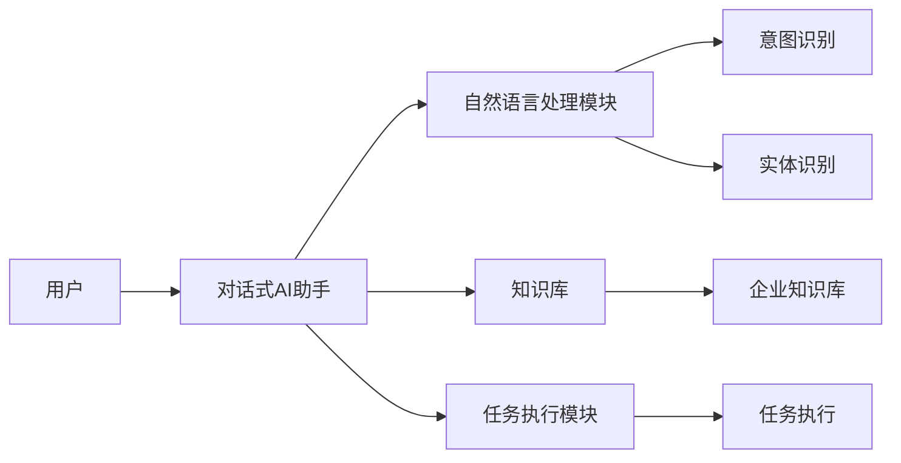
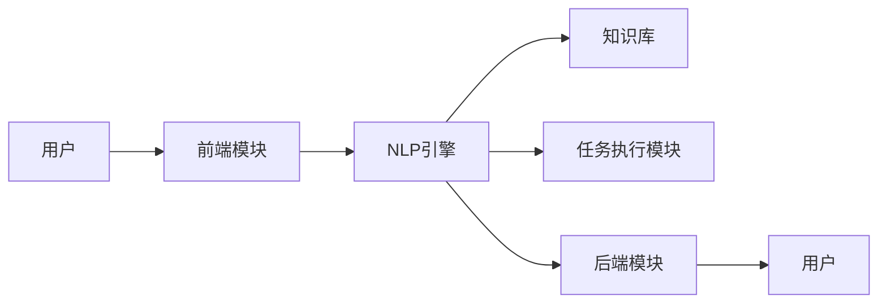

                 


# 构建企业级对话式AI助手：提升员工生产力

> **关键词**：企业级对话式AI助手、员工生产力、自然语言处理、AI算法、系统架构设计、项目实战

> **摘要**：本文详细探讨了构建企业级对话式AI助手的背景、核心概念、算法原理、系统架构设计、项目实战以及最佳实践。通过逐步分析对话式AI助手的定义、功能、技术实现和实际应用，本文旨在帮助读者理解如何通过对话式AI助手提升员工生产力，并为企业在数字化转型中提供有效的技术解决方案。

---

# 第一部分: 企业级对话式AI助手的背景与核心概念

## 第1章: 对话式AI助手的背景与问题背景

### 1.1 问题背景

#### 1.1.1 企业数字化转型的现状与挑战

在数字化转型的浪潮中，企业面临着前所未有的竞争压力。传统的企业协作工具（如邮件、即时通讯工具）虽然在一定程度上提高了工作效率，但仍然存在以下问题：

- **信息分散**：员工需要在多个工具之间切换，难以快速获取所需信息。
- **效率低下**：传统工具无法主动提供解决方案，员工需要手动查找资料或反复询问同事。
- **知识孤岛**：企业知识分散在不同部门或工具中，难以有效共享和利用。

#### 1.1.2 员工生产力提升的痛点与需求

员工是企业最重要的资产，提升员工生产力是企业的核心目标之一。然而，传统协作工具的局限性导致以下痛点：

- **时间浪费**：员工花费大量时间在工具切换和信息查找上。
- **决策延迟**：由于缺乏实时支持，员工在处理复杂任务时容易延误。
- **知识利用率低**：企业知识无法有效传递，导致重复劳动和经验流失。

#### 1.1.3 对话式AI助手的出现与发展趋势

对话式AI助手的出现，为企业解决上述问题提供了新的可能性。通过自然语言处理（NLP）技术，对话式AI助手能够理解用户意图、提供实时支持，并整合企业知识库，从而显著提升员工生产力。随着AI技术的不断进步，对话式AI助手的应用场景正在不断扩大，成为企业数字化转型的重要工具。

### 1.2 问题描述

#### 1.2.1 传统企业协作工具的局限性

传统企业协作工具虽然在一定程度上提高了工作效率，但仍然存在以下问题：

- **功能单一**：传统工具仅限于信息传递，无法提供主动支持。
- **交互复杂**：用户需要学习复杂的操作流程。
- **缺乏智能性**：无法根据上下文提供个性化建议。

#### 1.2.2 员工工作效率的瓶颈分析

员工工作效率的瓶颈主要体现在以下方面：

- **信息获取延迟**：员工需要通过多次询问或查找才能获得所需信息。
- **决策支持不足**：缺乏实时数据分析和决策支持。
- **知识共享不畅**：知识分散在不同工具中，难以有效共享。

#### 1.2.3 对话式AI助手的应用场景与目标

对话式AI助手的应用场景广泛，包括：

- **客户支持**：通过对话式AI助手为客户提供实时支持。
- **内部协作**：帮助员工快速获取内部知识和资源。
- **任务自动化**：通过对话式AI助手自动处理重复性任务。

对话式AI助手的目标是通过提供智能化、个性化的服务，显著提升员工工作效率和客户满意度。

### 1.3 对话式AI助手的核心概念与定义

#### 1.3.1 对话式AI助手的定义与核心要素

对话式AI助手是一种基于自然语言处理技术的智能化工具，能够通过对话形式为用户提供实时支持。其核心要素包括：

- **自然语言处理（NLP）**：理解用户意图并生成自然语言回复。
- **知识库**：存储企业知识和信息，用于回答用户问题。
- **任务执行模块**：根据用户指令执行特定任务。

#### 1.3.2 对话式AI助手与相关技术的对比

| 技术类型       | 核心功能               | 适用场景               | 优缺点分析               |
|----------------|-----------------------|------------------------|--------------------------|
| 聊天机器人     | 提供基础对话功能       | 基础客服、简单咨询     | 易部署，但功能有限       |
| 任务型对话系统 | 处理特定任务           | 业务流程自动化           | 功能单一，扩展性差       |
| 对话式AI助手   | 综合对话与任务处理     | 企业内部协作、生产力提升 | 功能全面，但开发复杂     |

#### 1.3.3 对话式AI助手的实体关系图



---

## 第2章: 对话式AI助手的核心概念与定义

### 2.1 对话式AI助手的核心功能模块

对话式AI助手的核心功能模块包括：

1. **自然语言处理模块**：负责理解和生成自然语言。
2. **知识库**：存储企业知识和信息。
3. **任务执行模块**：根据用户指令执行特定任务。

### 2.2 对话式AI助手的核心算法与技术

对话式AI助手的核心算法包括：

1. **意图识别**：通过NLP技术识别用户的意图。
2. **实体识别**：从对话中提取关键实体信息。
3. **对话生成**：基于上下文生成自然语言回复。

---

## 第3章: 对话式AI助手的算法原理

### 3.1 对话式AI助手的模型训练流程

对话式AI助手的模型训练流程包括以下步骤：

1. **数据预处理**：清洗和标注数据。
2. **模型训练**：使用深度学习模型（如Transformer）进行训练。
3. **模型优化**：通过调整超参数和优化算法提升模型性能。

### 3.2 对话生成算法

#### 3.2.1 基于生成对抗网络的对话生成

生成对抗网络（GAN）是一种常用的对话生成算法。其核心思想是通过两个网络（生成器和判别器）的对抗训练，生成逼真的对话内容。

#### 3.2.2 基于Transformer的对话生成

Transformer模型是一种基于自注意力机制的模型，广泛应用于对话生成任务。其核心思想是通过自注意力机制捕捉对话中的长距离依赖关系。

---

## 第4章: 对话式AI助手的系统架构设计

### 4.1 系统功能设计

对话式AI助手的系统功能设计包括以下模块：

1. **前端模块**：用户与AI助手交互的界面。
2. **后端模块**：处理用户请求并返回结果。
3. **NLP引擎**：负责自然语言理解和生成。
4. **知识库**：存储企业知识和信息。
5. **任务执行模块**：根据用户指令执行特定任务。

### 4.2 系统架构图



---

## 第5章: 对话式AI助手的项目实战

### 5.1 环境安装

对话式AI助手的项目实战需要以下环境：

- **Python 3.6+**
- **TensorFlow或Keras**
- **NLTK或spaCy**
- **Flask或Django**

### 5.2 核心代码实现

#### 5.2.1 意图识别代码

```python
import nltk
from sklearn.feature_extraction.text import TfidfVectorizer
from sklearn.naive_bayes import MultinomialNB

# 数据预处理
corpus = [...]  # 用户输入的文本
labels = [...]  # 对应的意图标签

# 特征提取
vectorizer = TfidfVectorizer()
X = vectorizer.fit_transform(corpus)

# 模型训练
model = MultinomialNB()
model.fit(X, labels)
```

#### 5.2.2 对话生成代码

```python
import tensorflow as tf
from tensorflow.keras.layers import Dense, Dropout, Input
from tensorflow.keras.models import Model

# 模型定义
input_layer = Input(shape=(vocab_size,))
dense_layer = Dense(256, activation='relu')(input_layer)
dropout_layer = Dropout(0.5)(dense_layer)
output_layer = Dense(vocab_size, activation='softmax')(dropout_layer)

model = Model(inputs=input_layer, outputs=output_layer)
model.compile(loss='sparse_categorical_crossentropy', optimizer='adam', metrics=['accuracy'])
```

### 5.3 案例分析

以企业内部协作为例，对话式AI助手可以帮助员工快速获取内部知识和资源。例如，员工可以通过对话式AI助手快速查找公司政策、产品信息等。

---

## 第6章: 对话式AI助手的最佳实践

### 6.1 小结

对话式AI助手通过自然语言处理技术和知识库整合，能够显著提升员工生产力。其核心算法包括意图识别、实体识别和对话生成。

### 6.2 注意事项

在实际应用中，需要注意以下问题：

- **数据隐私**：确保用户数据的安全性和隐私性。
- **模型优化**：不断优化模型性能，提升对话质量。
- **用户体验**：设计友好的用户界面，提升用户体验。

### 6.3 拓展阅读

- 《深度学习入门：基于Python的TensorFlow实战》
- 《自然语言处理入门：基于Python的 spaCy 和 NLTK 实战》

---

# 结语

通过本文的详细讲解，读者可以全面了解对话式AI助手的背景、核心概念、算法原理、系统架构设计、项目实战以及最佳实践。对话式AI助手作为一种新兴的技术工具，正在为企业数字化转型提供强有力的支持。未来，随着AI技术的不断发展，对话式AI助手将在更多领域发挥重要作用。

---

**注**：本文内容是逐步展开思考过程的示例，实际撰写时需根据具体需求调整内容深度和广度。

